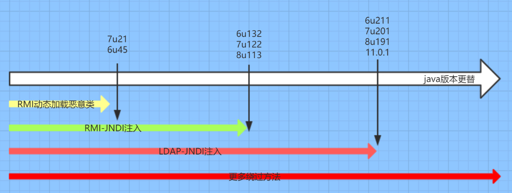

高版本JDK在RMI和LDAP的`trustURLCodebase`都做了限制，从默认允许远程加载ObjectFactory变成了不允许。RMI是在6u132, 7u122, 8u113版本开始做了限制，LDAP是 11.0.1, 8u191, 7u201, 6u211版本开始做了限制。

图片来源：https://fynch3r.github.io/%E6%90%9E%E6%87%82JNDI/

虽然无法再使用远程加载类，但绕过限制的方法也随之出现。目前公开常用的利用方法是。

- 通过Tomcat的`org.apache.naming.factory.BeanFactory` 工厂类去调用 `javax.el.ELProcessor#eval`方法
- 

## 参考

- https://tttang.com/archive/1405/
- https://paper.seebug.org/942/
