来源：https://github.com/SunWeb3Sec/DeFiHackLabs/tree/main/academy/onchain_debug/01_tools

<!-- more -->

### Phalcon 工具

https://phalcon.blocksec.com

下面以案例作为说明

2022-12-29，[jaypeggerz](https://app.jaypeggers.com/)项目被攻击，损失约15.32 Ether。这是一种成功操纵 JAY 代币价格的合约级重入攻击。在Phalcon上查看https://phalcon.blocksec.com/tx/eth/0xd4fafa1261f6e4f9c8543228a67caf9d02811e4ad3058a2714323964a8db61f6

我们可以迅速知道攻击者的获利情况

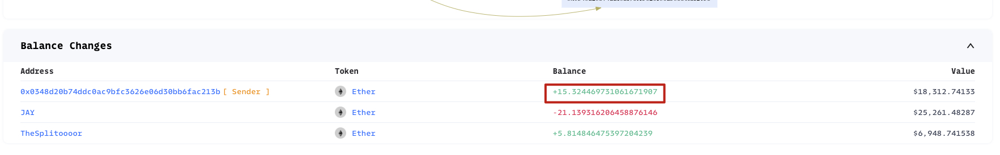

Invocation Flow可以看到函数的调用流程。

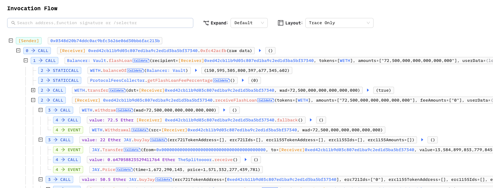

Phalcon 2.0可以在Trace过程中查看执行片段、参数、返回值

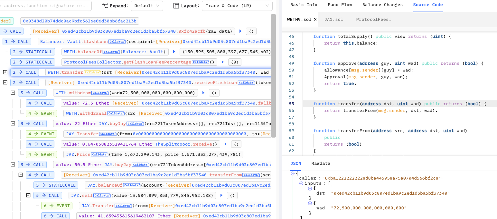

### openchain.xyz

跟Phalcon类似，它整合了很多小工具，https://tx.eth.samczsun.com/ethereum/0xd4fafa1261f6e4f9c8543228a67caf9d02811e4ad3058a2714323964a8db61f6

如点击眼睛可以看到更多信息

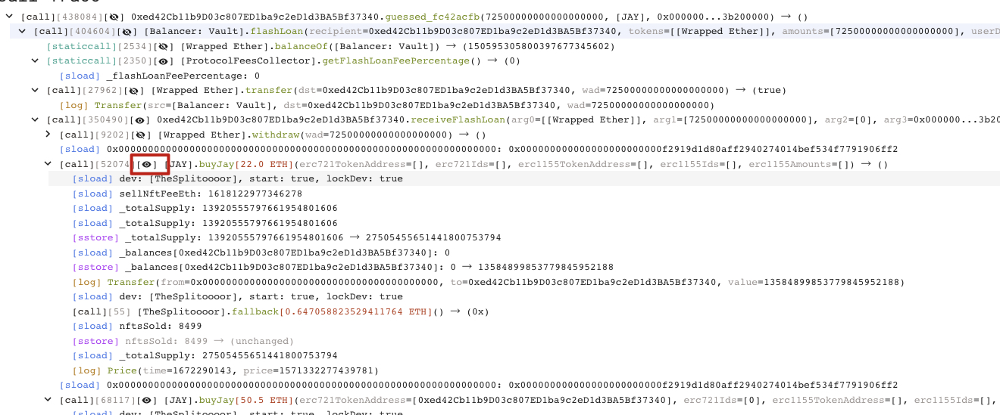

点击最左边的call，可以把原始Input data尝试Decode。

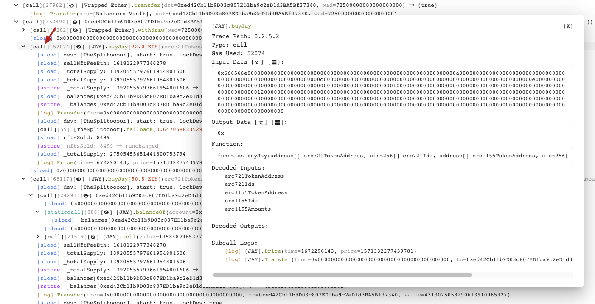

### Tendery

dashboard.tenderly.co

換 Tendery  [TXID](https://dashboard.tenderly.co/tx/mainnet/0xd4fafa1261f6e4f9c8543228a67caf9d02811e4ad3058a2714323964a8db61f6) 

一样可以看到基本信息，但在 Debug 的部分就不是可视化，需要一步一步 Debug 走下去分析，好处是可以边Debug 边看代码，还有 Input data 的转换过程。

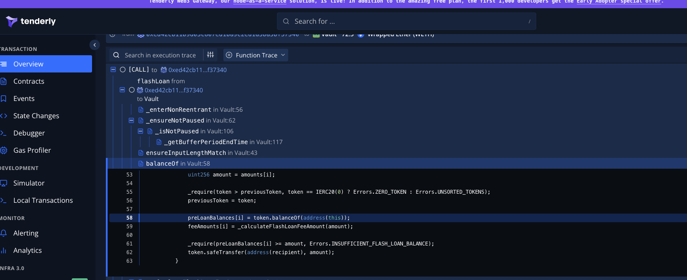

如果想要快速重放攻击! 可以使用Tendery 或 Phalcon，这两个工具另外支持模拟交易重现，在右上角有一按钮 Re-Simulate，然后就可以更改下图中的这些数值进行重放了。

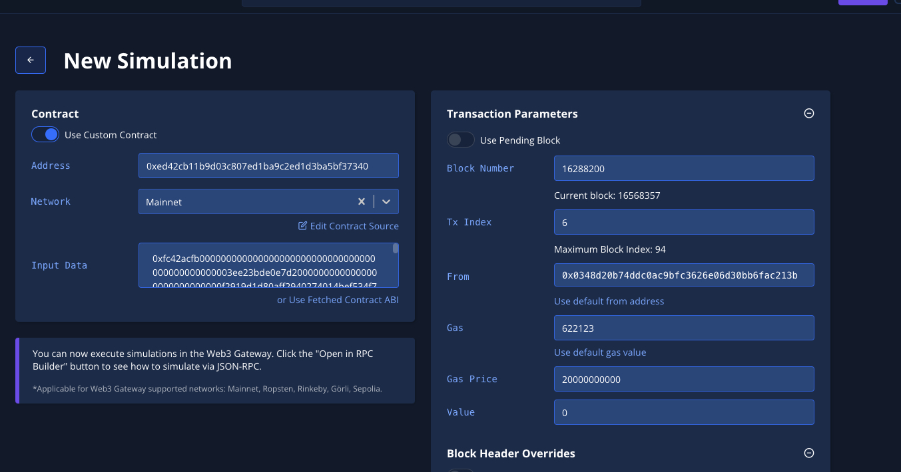

### Ethereum Signature Database

 [sig.eth](https://sig.eth.samczsun.com/) | [etherface](https://www.etherface.io/hash)

在原始 Input data，前面 4bytes 为 Function Signature. 有时候遇到 Etherscan 或分析工具无法解出来时，可以透过Signature Database 来查看看可能是什么 Function。

以下举例假设我们不知道 `0xac9650d8` 是什么 Function，透过 sig.eth 查询，可以看到这个4 bytes signature 为 `multicall(bytes[])`

https://openchain.xyz/signatures

### 其他工具

[ABI to interface](https://gnidan.github.io/abi-to-sol/) | [Get ABI for unverified contracts](https://abi.w1nt3r.xyz/) | [ETH Calldata Decoder](https://apoorvlathey.com/eth-calldata-decoder/) | [ETHCMD - Guess ABI](https://www.ethcmd.com/)

ABI to interface: 在开发 Poc 时需要呼叫其他合约是要有 Interface 接口，我们可以透过这个工具帮你快速生你要的接口。 先去 Etherscan 把 ABI 复制下來，贴过去工具上就可以看到产生出來的 Interface。 [例子](https://etherscan.io/address/0xb3da8d6da3ede239ccbf576ca0eaa74d86f0e9d3#code)

复制ABI到[ABI to interface](https://gnidan.github.io/abi-to-sol/) ，就能看到接口信息

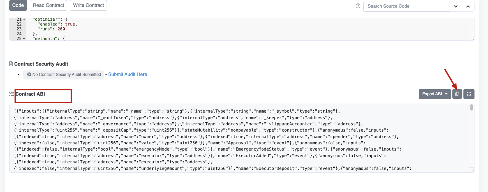

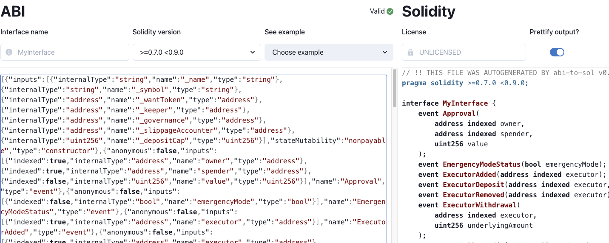

ETH Calldata Decoder: 有事后在沒有 ABI 的情況下想要解看看 Input data 可以试试看 ETH Calldata Decoder，在前面介绍到 Sam 的工具就有支援 Input data decode。

Get ABI for unverified contracts: 如果遇到未开园的合約，可以透过这个工具尝试列举出这个合约中存在的 Function Signature. [例子](https://abi.w1nt3r.xyz/mainnet/0xaE9C73fd0Fd237c1c6f66FE009d24ce969e98704)

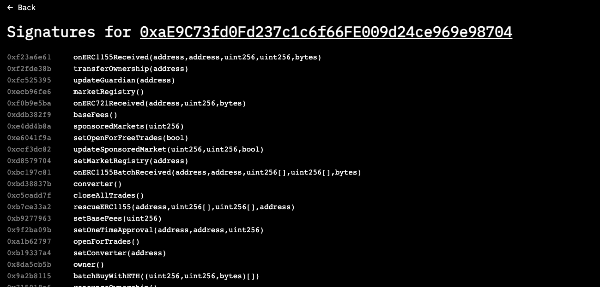

### 反编译工具

[Etherscan-decompile bytecode](https://etherscan.io/address/0xaE9C73fd0Fd237c1c6f66FE009d24ce969e98704#code) | [Dedaub](https://library.dedaub.com/decompile) | [heimdall-rs](https://github.com/Jon-Becker/heimdall-rs)

Etherscan 内建有一个反编译功能，但可读性偏差，可以使用使用 Dedaub，可读性好一点。 拿一个 MEV Bot 被攻击来当[例子](https://twitter.com/1nf0s3cpt/status/1577594615104172033) 可以自己试试解看看 [例子](https://bscscan.com/address/0x64dd59d6c7f09dc05b472ce5cb961b6e10106e1d#code)

首先把未开源合约的 Bytecodes 复制下来贴到 Dedaub 上，点 Decompile 即可。

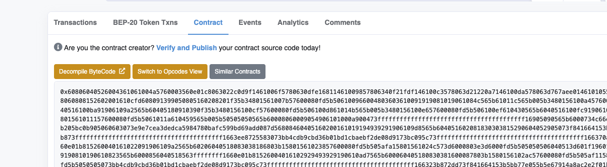

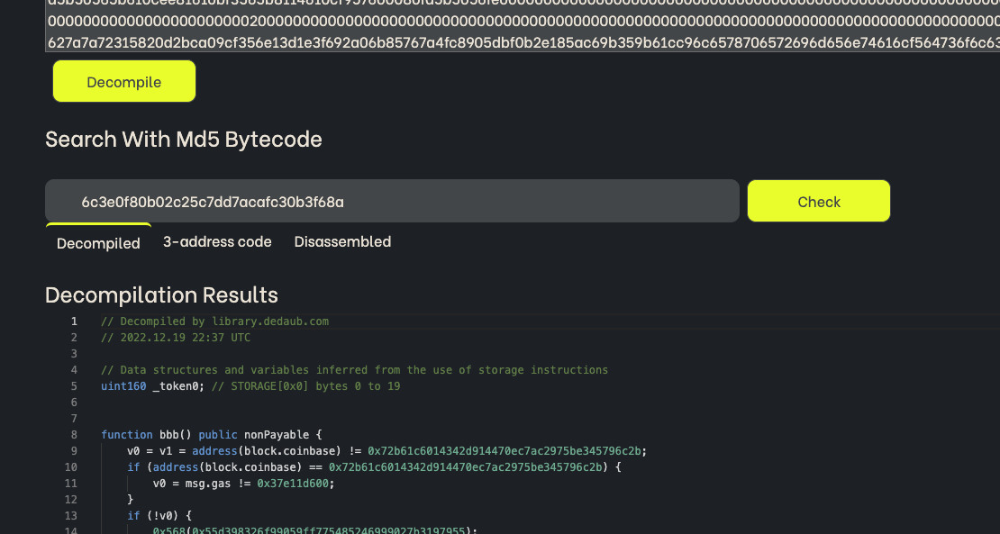
