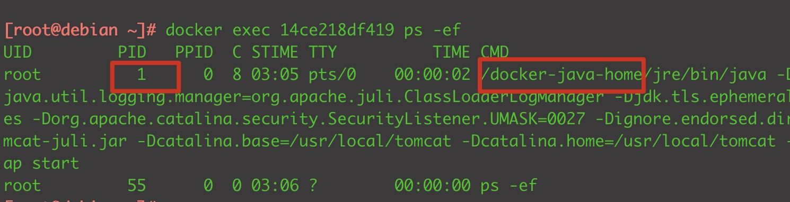
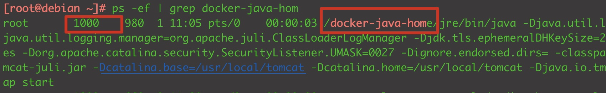

本文主要内容来自极客时间李程远老师的专栏《容器实战高手课》

<!-- more -->


## 1. 认识容器

简单来说，容器就是个小工具，可以把你想跑的程序、库文件、配置文件都一起“打包”。然后可以放到任何一个计算机上运行，做到<font color="red">一次打包，到处运行</font>。

**容器的技术原理：**

如果有人问你 Linux 上的容器是什么，最简单直接的回答就是 Namesapce 和 Cgroups。Namespace 和 Cgroups 可以让程序在一个资源可控的独立（隔离）环境中运行，这个就是容器了。

**工具：**

操作容器的工具有很多，我们一般使用Docker，Docker相当于容器的cli工具。


### 1.1 Namespace

启动一个容器，查看一下PID

 

可以看见容器里面运行了一个java进程，PID是1，



当我们在宿主机上查看该进程的时候，发现PID是1000

Linux 在创建容器的时候，就会建出一个 PID Namespace。这个 PID Namespace，就是指每建立出一个 Namespace，就会单独对进程进行 PID 编号，每个 Namespace 的 PID 编号都从 1 开始。

同时在这个 PID Namespace 中也只能看到 Namespace 中的进程，而且看不到其他 Namespace 里的进程。这里就体现出了 Namespace 的作用：相互隔离。

在宿主机上的 Host PID Namespace，它是其他 Namespace 的父亲 Namespace，可以看到在这台机器上的所有进程，不过进程 PID 编号不是 Container PID Namespace 里的编号了，而是把所有在宿主机运行的进程放在一起，再进行编号。


除了PID Namespace，还有其他的Namespace，比如

```bash
[root@debian ~]# docker exec 14ce218df419 ip addr
1: lo: <LOOPBACK,UP,LOWER_UP> mtu 65536 qdisc noqueue state UNKNOWN group default qlen 1000
    link/loopback 00:00:00:00:00:00 brd 00:00:00:00:00:00
    inet 127.0.0.1/8 scope host lo
       valid_lft forever preferred_lft forever
4: eth0@if5: <BROADCAST,MULTICAST,UP,LOWER_UP> mtu 1500 qdisc noqueue state UP group default
    link/ether 02:42:ac:11:00:02 brd ff:ff:ff:ff:ff:ff link-netnsid 0
    inet 172.17.0.2/16 brd 172.17.255.255 scope global eth0
       valid_lft forever preferred_lft forever
```

这里其实就是在查看 Network Namespace。在 Network Namespace 中都有一套独立的网络接口比如这里的 lo，eth0，还有独立的 TCP/IP 的协议栈配置。


查看容器中的根文件系统（rootfs）。会发现，它和宿主机上的根文件系统也是不一样的。容器自己的根文件系统完全独立于宿主机上的根文件系统。

```bash
[root@debian ~]# docker exec 14ce218df419 ls /
bin
boot
dev
docker-java-home
etc
......
```

容器中的根文件系统，其实就是我们做的镜像。根文件系统是用Mount Namespace实现的，Mount Namespace 保证了每个容器都有自己独立的文件目录结构。


Linux 中所有的 Namespace：cgroup/ipc/network/mount/pid/time/user/uts。

Namespace 尽管类型不同，其实都是为了隔离容器资源：PID Namespace 负责隔离不同容器的进程，Network Namespace 又负责管理网络环境的隔离，Mount Namespace 管理文件系统的隔离。


### 1.2 Cgroups


- 
- Linux 操作系统不外乎是进程管理、内存管理、文件系统、网络协议栈，再加上一些安全管理。

- 容器还有自己的特殊性，Linux 内核原来的特性加上 Namespace 和 Cgroups 会带来的变化。Namespace 和 Cgroups。这两个概念是容器技术的基石

