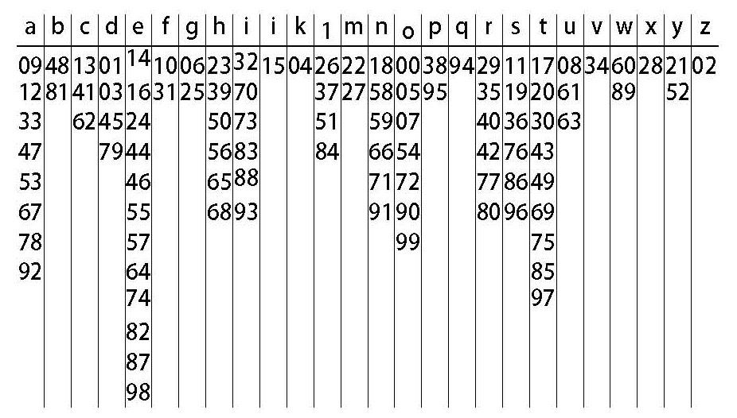
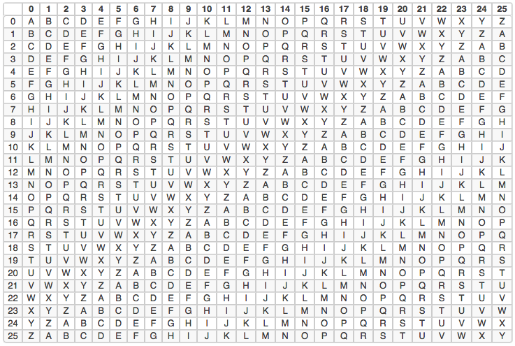
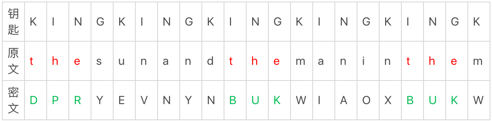

没有密码学就没有现代信息系统。

<!-- more -->

密码学有一道分水岭 —— 在计算机出现之前，叫做古典密码学，之后叫做现代密码学

### 第一代：隐藏法

史上第一个加密法的记载，是古希腊历史学家希罗多德记录的一个加密术的故事。当时，强大的波斯帝国计划入侵希腊。斯巴达曾经的老国王得知后，偷偷把这个消息写在木板上又涂了一层蜡。这片木板成功躲过沿路卫兵的检查，到达斯巴达。收信人刮去表面的那层蜡，就发现了下面的密报。得知波斯人的入侵计划后，希腊开始备战。公元前480年，波斯舰队以为对方毫无准备，结果自己一天之内200多艘战舰被击沉，五年多的准备毁于一旦。

隐藏法就是想方设法藏匿，解密方法就是想方设法翻找，有时候就是个体力活。但自从有了文字后人们就一直在用，直到今天人们藏私房钱时用的还是这个套路。

### 第二代：移位法和替代法

移位法很简单。我举个例子，比如我的车牌号是1874，把每个数字都在数列中往后加1，那么1变2，2变3，1874就变成了2985。替代法也很好理解，就是把文中一部分字母用其他字母代替。

比如 For man is man and master of his fate（人就是人，是自己命运的主人）。那如果，把其中的a都用z代替，o用y代替，e用w代替，i用x代替。就成了一段谁也看不出来的文字：

For man is man and master of his fate.
Fyr mzn xs mzn znd mzstwr yf hxs fztw.

到16世纪概率论的出现，移位法和替代法就可以通过频率分析法被破解了

### 单套密码法的终局

维吉尼亚加密法出现之前，所有加密方法都是单套加密法，就是使用全文内容都使用同一套加密方法，多套加密法就是使用多种加密法加密的内容，单套加密法最大的缺陷就是能够通过频率分析对其进行破解，如果多套的话，同个字母加密后就不会只有一种密文，就无法进行频率分析。在多套加密法还无法流行的时候，有的加密研究者已经知道了单套加密法的弱电，于是想办法对单套加密法进行优化，其中有一种相当有效的的方法称为为**同音替代式密码法(homophonic substitution cipher)。**这种加密方法的特色是，每个字母可有数个替代符号，替代符号的数目多寡与字母本身出现的评率成正比。例如，字母a在英文的出现频率大约占8%，所以编订包含100个符号的密码集时，我们就指定八个符号来替换a。编写密码时，每碰到a，就随机从这八个符号中任选一个来替代。见下图，透视用2位数字来替代某个字母

这样的加密方法并不是无懈可击。这样的密码文仍留下许多细微的线索给精明的密码分析家。每个英文字母都有它的独特性格，这些性格显现在它与其他字母的结构关系上，即使以同音替代法加密，仍旧掩藏不了这些性格。说到英文字母的独特性格，最极端的例子是q。能跟在q之后的字母只有一个：u。尝试解译这类密码文时，我们可以从q着手。q并不常见，因此大概只有一个替代符号，而u的出现频率约占3%，因此可能有三个替代符号。所以，若找到一个固定只有三种符号会跟在它后面的符号，我们大可假设这个符号即是q，而跟在它后面的三种符号都是代替u。其他字母虽然比较难找，但它们跟其他字母的结构关系仍旧会泄漏出它们的真实身份。尽管同音密码法并非无懈可击，它终究比单纯的单套字母密码法安全多了。

使用同音密码法时，每个明文字母可以有多种加密方式，看来似乎跟多套字母密码法很相似。不过它在一个关键处仍异于后者，所以仍旧属于单套字母密码法。在表5所示的同音符号表里，字母a有8个数字可以轮流替代，可是反过来看，这8个数字只能代表a。换句话说，一个明文字母可以交替使用数个替代符号，但是每个替代符号只能固定回溯到一个字母。在多套字母密码法里，一个明文字母同样也有数个替代符号，然而更能令人混淆的是，这些符号可能会代表不同的字母。

### 第三代：维吉尼亚加密法

为了对抗频率分析的破解方法，出现了维吉尼亚加密法，使用这套加密方法之后，字母的频率特征会消失。为了掩盖字母使用中暴露的频率特征，解决办法就是用多套符号代替原来的文字。比如A原来用H表示，那么现在我就可以用J或者K来表示，什么时候使用J，什么使用K，可以自行规定。多套符号加密法并没满足于2-3套，后来典型使用的是26套。这个用了26套字符的方法，就是第三代密码“维吉尼亚加密法”。

它是一个表格，第一行代表原文的字母，每一横行代表原文分别由哪些字母代替，每一竖列代表我们要用第几套字符来替换原文。一共26个字母，一共26套代替法，所以这个表是一个26×26的表。

如果我们要加密“CAT”，秘钥用“KEY”，密文就是用C列的K行代表C，也就是“M”，以此类推，“CAT”用秘钥“KEY”加密后密文就是“MER"

维吉尼亚法相比从前的加密法，破解难度上了一个新的台阶，但它在出现后的200年里，几乎没有人使用，原因很简单，太麻烦了。直到1861年到1865年美国南北战争时期，加解密过程可以通过机械完成，维吉尼亚加密法才被广泛使用。

维吉尼亚加密法真正的优势是，密文中拼写完全一样的字符，对应的原文可能性也是巨量的，比如说，如果密文是10个字母，钥匙也是10个字母，那么原文就有10^10，也就是100亿种可能性。

同样的原文对应上亿种密文，相同的密文也一样对应上亿种原文。这才是维吉尼亚加密法难以破解的关键。

### 秘钥

虽然维吉尼亚加密法有很强的加密能力，但并不代表它牢不可破。

the加密后，变成了两种样子，第一种是DPR，第二和第三种是BUK。第二个和第三个竟然都是”BUK"。为什么会出现相同的密码字符串呢？在KING这个钥匙正好循环到整数倍的时候，如果也正好赶上出现了同样的原文，那巧合就出现了——原文就会被加密成相等的密文。这一点，就是破解维吉尼亚密码最关键的部分。实际破解的时候，你手中只有密文，既不知道钥匙是什么单词，也不知道这个单词的长度，难度会大大增加。从密文中把完全一样的单词挑出来，从中总结规律，分析出钥匙的长度，再对密文分组，用频率分析法逐一分析每一组的秘钥即可。

怎样解决这个问题呢？那就是增加秘钥的长度。1000个字母的文章，钥匙长度从5增加到50的话，每套加密法匀到的字母只有20个了，连26个字母每个出现一次的量都没到，这样的量几乎就不会表现出字母的频率特征。如果再继续增加钥匙长度呢？比如说钥匙文和原文等长，也是1000个字母，那之前破解维吉尼亚加密法的所有方法都会失效了。

秘钥过长又不方便记忆，这时候们往往会使用一首诗或者一篇文章当钥匙。而一首诗、一篇文章是有意义的单词组成的，它们的字母排列一定是符合拼读规律的

### 俚语

俚语，就是我们常说的“方言”，就是使用敌方完全听不懂的地方话进行沟通，实现加密的目的。中国在越战的时候，就使用过莆田、温州、高淳的方言进行加密通讯。二战时期，美国使用的“纳瓦霍语”加密，就是当时最好用的加密法。破解不了并不代表好用，真正好用的密码，是在安全性和效率上找到平衡点。

