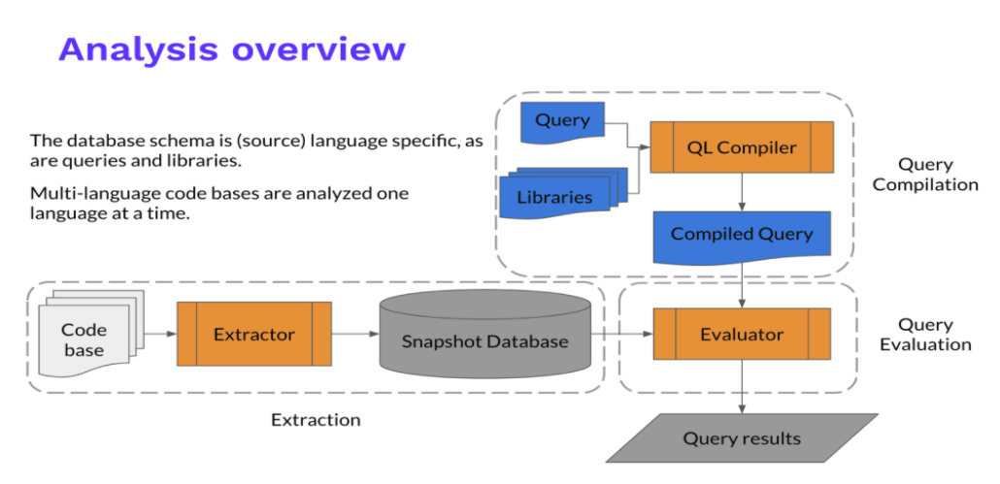
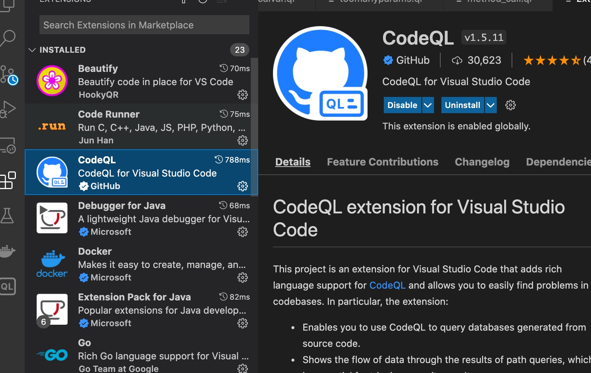
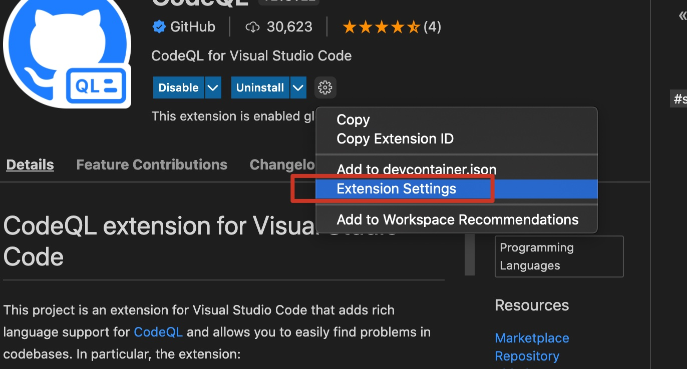
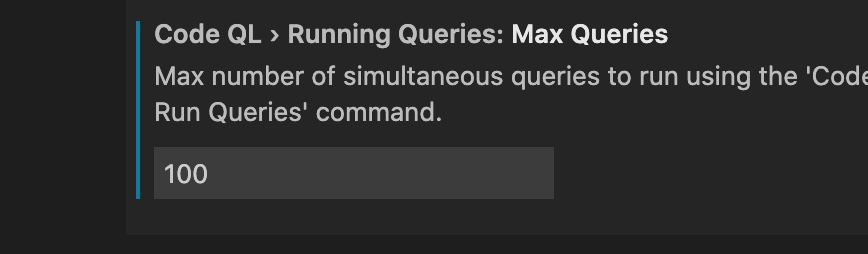
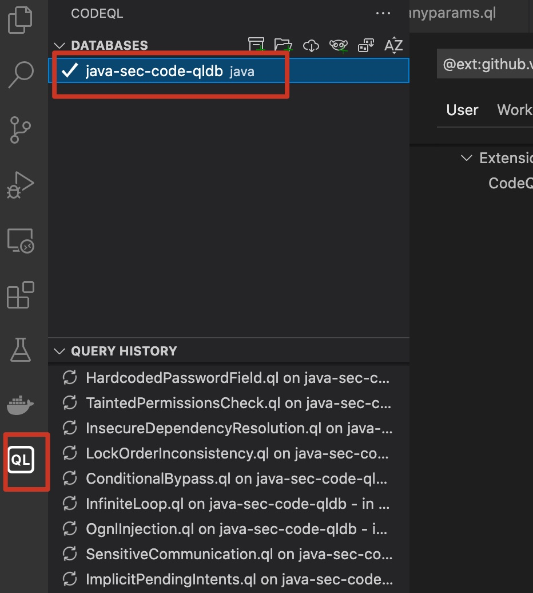
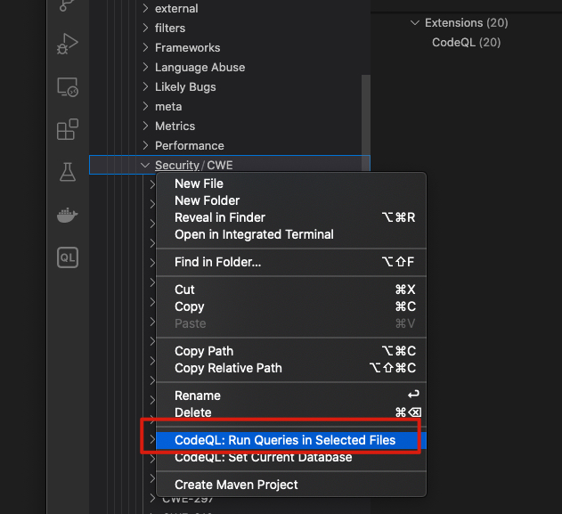

> 知其白，守其黑，为天下式。

CodeQL入门学习

<!-- more -->

## 简介

QL是一种查询语言，支持对C++，C#，Java，JavaScript，Python，go等多种语言进行分析，可用于分析代码，查找代码中控制流等信息。

CodeQL 的整体思路是把源代码转化成一个可查询的数据库，通过 Extractor 模块对源代码工程进行关键信息分析提取，构成一个关系型数据库。CodeQL 的数据库并没有使用现有的数据库技术，而是一套自己实现的文件系统数据库。

对于编译型语言，Extractor 会监控编译过程，编译器每处理一个源代码文件，它都会收集源代码的相关信息，如：语法信息（AST 抽象语法树）、语意信息（名称绑定、类型信息、运算操作等），控制流、数据流等，同时也会复制一份源代码文件。而对于解释性语言，Extractor 则直接分析源代码，得到类似的相关信息。

关键信息提取完成后，所有分析所需的数据都会导入一个文件夹，这个就是 CodeQL database, 其中包括了源代码文件、关系数据、语言相关的 database schema（schema 定义了数据之间的相互关系）。



CodeQL 自己定义实现了一套名为 QL 的查询语言，并提供了相应的支持库和运行环境。


## 安装

分析程序支持主流的操作系统,Windows,Mac,Linux

```
mkdir codeql-home
cd codeql-home
mkdir codeql-cli
cd codeql-cli

#https://github.com/github/codeql-cli-binaries
wget https://github.com/github/codeql-cli-binaries/releases/download/v2.9.3/codeql-linux64.zip
```

解压之后添加到环境变量

然后下载lib

```
#切换到codeql-home
mkdir codeql-lib
cd codeql-lib
git clone https://github.com/github/codeql.git
```

**下载vscode扩展**

 

修改同时扫描的最大查询规则数量

 

 


## 测试用例

以java-sec-code为例

```
[shadowflow@ShadowOS query]$ git clone https://github.com/JoyChou93/java-sec-code.git
[shadowflow@ShadowOS query]$ cd java-sec-code
[shadowflow@ShadowOS java-sec-code]$ mkdir java-sec-code-qldb
[shadowflow@ShadowOS java-sec-code]$ codeql database create java-sec-code-qldb -l java --command="mvn clean install -Dmaven.test.skip=true" --overwrite
```

打开codeql扩展，添加生成的db

 

选择如下目录，使用所有的java漏洞规则进行扫描

> - codeql-lib
>   - java
>     - ql
>       - src
>         - security

 

扫描完成我们可以查看结果，并且选择其他目录里的规则进行扫描。
