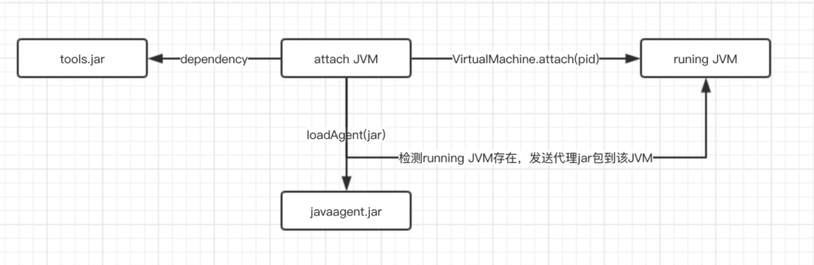

> 春水碧于天，画船听雨眠。

Java Agent学习

<!-- more -->

## 1. 概念

### JVMTI

JVMTI(JVM Tool Interface)是Java虚拟机对外提供的Native编程接口，通过JVMTI，外部进程可以获取到运行时JVM的诸多信息，比如线程、GC等。


### Java Agent

`JDK1.5`开始，`Java`新增了`Instrumentation(Java Agent API)`和`JVMTI(JVM Tool Interface)`功能，允许`JVM`在加载某个class文件之前对其字节码进行修改，同时也支持对已加载的`class(类字节码)`进行重新加载(`Retransform`)。

利用`Java Agent`这一特性衍生出了`APM(Application Performance Management，应用性能管理)`、`RASP(Runtime application self-protection，运行时应用自我保护)`、`IAST(Interactive Application Security Testing，交互式应用程序安全测试)`等相关产品，它们都无一例外的使用了`Instrumentation/JVMTI`的`API`来实现动态修改`Java类字节码`并插入监控或检测代码。

**`Java Agent`有两种运行模式：**

1. 启动`Java程序`时添加`-javaagent(Instrumentation API实现方式)`或`-agentpath/-agentlib(JVMTI的实现方式)`参数，如`java -javaagent:/data/XXX.jar LingXeTest`。
2. `JDK1.6`新增了`attach(附加方式)`方式，可以对运行中的`Java进程`附加`Agent`。

这两种运行方式的最大区别在于第一种方式只能在程序启动时指定`Agent`文件，而`attach`方式可以在`Java程序`运行后根据`进程ID`动态注入`Agent`到`JVM`。


## 2. Java Agent

Java Agent和普通的Java类并没有任何区别，普通的Java程序中规定了`main`方法为程序入口，而Java Agent则将`premain`（Agent模式）和`agentmain`（Attach模式）作为了Agent程序的入口，两者所接受的参数是完全一致的，如下：

```
public static void premain(String args, Instrumentation inst) {}
public static void agentmain(String args, Instrumentation inst) {}
```

Java Agent还限制了我们必须以jar包的形式运行或加载，我们必须将编写好的Agent程序打包成一个jar文件。除此之外，Java Agent还强制要求了所有的jar文件中必须包含`/META-INF/MANIFEST.MF`文件，且该文件中必须定义好`Premain-Class`（Agent模式）或`Agent-Class:`（Agent模式）配置，如：

```
Premain-Class: com.anbai.sec.agent.CrackLicenseAgent
Agent-Class: com.anbai.sec.agent.CrackLicenseAgent
```

如果我们需要修改已经被JVM加载过的类的字节码，那么还需要设置在`MANIFEST.MF`中添加`Can-Retransform-Classes: true`或`Can-Redefine-Classes: true`。


### javaagent参数

Javaagent是java命令的一个参数。参数Javaagent可以用于指定一个Jar包，并且对该java包有两个要求：

1. 这个jar包的MANIFEST.MF文件必须指定Premain-Class 项
2. Premain-Class指定的那个类必须实现premain()方法。

premain方法，从字面上理解，就是运行在main函数之前的方法。当java虚拟机启动的时候，在执行main函数之前，JVM先运行-javaagent所指定jar包内Premain-Class这个类的premain方法。

在命令行输入Java可以看到相应的参数，其中有和java agent相关的。

```java
-agentlib:<libname>[=<选项>]
                  加载本机代理库 <libname>, 例如 -agentlib:hprof
                  另请参阅 -agentlib:jdwp=help 和 -agentlib:hprof=help
    -agentpath:<pathname>[=<选项>]
                  按完整路径名加载本机代理库
    -javaagent:<jarpath>[=<选项>]
                  加载 Java 编程语言代理, 请参阅 java.lang.instrument
```

在上面参数中提到的参阅`java.lang.instrument`,这是rt.jar中定义的一个包，该路径有两个重要的类类。

```
ClassFileTransformer
Instrumentation
```

该包提供了一些工具帮助开发人员在 Java 程序运行时，动态修改系统中的 Class 类型。javaagent的功能更像是一个Class类型的转换器，他可以在运行时接收重新外部请求，对Class类型进行修改。

从本质上将，Java Agent是一个遵守一组严格约定的常规java类。上面说到javaagent命令要求指定类中必须有premain()方法，并且对premain方法的签名也有要求，签名必须满足以下两种格式

```
public static void premain(String agentArgs, Instrumentation inst)
    
public static void premain(String agentArgs)
```

JVM会优先加载带Instrumentation签名的方法，成功加载忽略第二种，如果第一种没有，则加载第二种方法。这个逻辑在sun.instrument.InstrumentationImpl类的loadClassAndStartAgent方法中。


###  Instrumentation定义

位置：`java/lang/instrument/Instrumentation.java`

```
public interface Instrumentation {
    
    //增加一个Class 文件的转换器，转换器用于改变 Class 二进制流的数据，参数 canRetransform 设置是否允许重新转换。
    void addTransformer(ClassFileTransformer transformer, boolean canRetransform);

    //在类加载之前，重新定义 Class 文件，ClassDefinition 表示对一个类新的定义，如果在类加载之后，需要使用 retransformClasses 方法重新定义。addTransformer方法配置之后，后续的类加载都会被Transformer拦截。对于已经加载过的类，可以执行retransformClasses来重新触发这个Transformer的拦截。类加载的字节码被修改后，除非再次被retransform，否则不会恢复。
    void addTransformer(ClassFileTransformer transformer);

    //删除一个类转换器
    boolean removeTransformer(ClassFileTransformer transformer);

    boolean isRetransformClassesSupported();

    //在类加载之后，重新定义 Class。这个很重要，该方法是1.6 之后加入的，事实上，该方法是 update 了一个类。
    void retransformClasses(Class<?>... classes) throws UnmodifiableClassException;

    boolean isRedefineClassesSupported();

    
    void redefineClasses(ClassDefinition... definitions)
        throws  ClassNotFoundException, UnmodifiableClassException;

    boolean isModifiableClass(Class<?> theClass);

    @SuppressWarnings("rawtypes")
    Class[] getAllLoadedClasses();

  
    @SuppressWarnings("rawtypes")
    Class[] getInitiatedClasses(ClassLoader loader);

    //获取一个对象的大小
    long getObjectSize(Object objectToSize);


   
    void appendToBootstrapClassLoaderSearch(JarFile jarfile);

    
    void appendToSystemClassLoaderSearch(JarFile jarfile);

    
    boolean isNativeMethodPrefixSupported();

    
    void setNativeMethodPrefix(ClassFileTransformer transformer, String prefix);
}
```


## 3. JVM启动前静态Instrument

### 3.1 实现一个Demo

**1）创建一个类包含premain方法:**

```java
package com.shadowflow.learn;

import java.lang.instrument.ClassFileTransformer;
import java.lang.instrument.IllegalClassFormatException;
import java.lang.instrument.Instrumentation;
import java.security.ProtectionDomain;

public class PreMainTraceAgent {
    public static void premain(String agentArgs, Instrumentation inst) {
        System.out.println("两个参数的java agent premain");
    }
}

```

上面我们实现的这个类，实现了带有Instrumentation参数的premain方法。调用addTransformer()方法对启动时所有类进行拦截		

**2） 打包agent：**:

```java

    <build>
        <plugins>
            <plugin>
                <groupId>org.apache.maven.plugins</groupId>
                <artifactId>maven-jar-plugin</artifactId>
                <version>3.1.0</version>
                <configuration>
                    <archive>
                        <!--自动添加META-INF/MANIFEST.MF -->
                        <manifest>
                            <addClasspath>true</addClasspath>
                        </manifest>
                        <manifestEntries>
                            <Premain-Class>com.shadowflow.learn.PreMainTraceAgent</Premain-Class>
                            <Agent-Class>com.shadowflow.learn.PreMainTraceAgent</Agent-Class>
                            <Can-Redefine-Classes>true</Can-Redefine-Classes>
                            <Can-Retransform-Classes>true</Can-Retransform-Classes>
                        </manifestEntries>
                    </archive>
                </configuration>
            </plugin>
        </plugins>
    </build>

```

**3）打包：**

```
mvn clean install
```

**4）编写待插桩类：**

新建一个工程,创建两个类

```java
package com.shadowflow.test;

public class TestMain {
    public static void main(String[] args) {
        System.out.println("main start");
        System.out.println("-----"+new Dog().say());
    }
}

```

```java
package com.shadowflow.test;

public class Dog {
    public String say() {
        return "I'am a dog!";
    }
}

```

maven

```
    <build>
        <plugins>
            <plugin>
                <groupId>org.apache.maven.plugins</groupId>
                <artifactId>maven-jar-plugin</artifactId>
                <version>3.2.0</version>
                <configuration>
                    <archive>
                        <manifest>
                            <addClasspath>true</addClasspath>
                            <mainClass>com.shadowflow.test.TestMain</mainClass>
                        </manifest>
                    </archive>
                </configuration>
            </plugin>
        </plugins>
    </build>
```

同样打包

**5）执行：**

```
java -javaagent:./javaagent-demo-1.0-SNAPSHOT.jar -jar test-1.0-SNAPSHOT.jar
```

执行结果

```
两个参数的java agent premain
main start
-----I'am a dog!
```


### 3.2 打印加载的类

一旦你addTransformer之后，需要加载的每一个类都会经过transform方法。

首先添加addTransformer

```java
package com.shadowflow.learn;

import java.lang.instrument.ClassFileTransformer;
import java.lang.instrument.IllegalClassFormatException;
import java.lang.instrument.Instrumentation;
import java.security.ProtectionDomain;

public class PreMainTraceAgent {
    public static void premain(String agentArgs, Instrumentation inst) {
        System.out.println("两个参数的java agent premain");
        inst.addTransformer(new DefineTransformer(), true);

    }

    static class DefineTransformer implements ClassFileTransformer {

        @Override
        public byte[] transform(ClassLoader loader, String className, Class<?> classBeingRedefined, ProtectionDomain protectionDomain, byte[] classfileBuffer) throws IllegalClassFormatException {
            System.out.println("premain load Class:" + className);
            return classfileBuffer;
        }
    }
}

```

执行

```
java -javaagent:javaagent-demo-1.0-SNAPSHOT.jar -jar test-1.0-SNAPSHOT.jar
```

运行结果

```
两个参数的java agent premain
premain load Class:java/lang/invoke/MethodHandleImpl
premain load Class:java/lang/invoke/MethodHandleImpl$1
premain load Class:java/lang/invoke/MethodHandleImpl$2
premain load Class:java/util/function/Function
premain load Class:java/lang/invoke/MethodHandleImpl$3
premain load Class:java/lang/invoke/MethodHandleImpl$4
premain load Class:java/lang/ClassValue
premain load Class:java/lang/ClassValue$Entry
premain load Class:java/lang/ClassValue$Identity
premain load Class:java/lang/ClassValue$Version
premain load Class:java/lang/invoke/MemberName$Factory
premain load Class:java/lang/invoke/MethodHandleStatics
premain load Class:java/lang/invoke/MethodHandleStatics$1
premain load Class:sun/misc/PostVMInitHook
premain load Class:sun/misc/PostVMInitHook$1
premain load Class:sun/usagetracker/UsageTrackerClient
premain load Class:java/util/concurrent/atomic/AtomicBoolean
premain load Class:sun/usagetracker/UsageTrackerClient$1
premain load Class:sun/usagetracker/UsageTrackerClient$4
premain load Class:sun/usagetracker/UsageTrackerClient$3
premain load Class:java/io/FileOutputStream$1
premain load Class:sun/launcher/LauncherHelper
premain load Class:java/util/jar/JarVerifier
premain load Class:java/security/CodeSigner
premain load Class:java/util/jar/JarVerifier$3
premain load Class:java/io/ByteArrayOutputStream
premain load Class:java/util/concurrent/ConcurrentHashMap$ForwardingNode
premain load Class:com/shadowflow/test/TestMain
premain load Class:sun/launcher/LauncherHelper$FXHelper
premain load Class:java/lang/Class$MethodArray
premain load Class:java/lang/Void
main start
premain load Class:com/shadowflow/test/Dog
-----I'am a dog!
premain load Class:java/lang/Shutdown
premain load Class:java/lang/Shutdown$Lock
```


## 4.  JVM启动后动态Instrument

上面介绍的Instrumentation是在 JDK 1.5中提供的，开发者只能在main加载之前添加手脚，在 Java SE 6 的 Instrumentation 当中，提供了一个新的代理操作方法：agentmain，可以在 main 函数开始运行之后再运行。

跟`premain`函数一样， 开发者可以编写一个含有`agentmain`函数的 Java 类：

```
//采用attach机制，被代理的目标程序VM有可能很早之前已经启动，当然其所有类已经被加载完成，这个时候需要借助Instrumentation#retransformClasses(Class<?>... classes)让对应的类可以重新转换，从而激活重新转换的类执行ClassFileTransformer列表中的回调
public static void agentmain (String agentArgs, Instrumentation inst)

public static void agentmain (String agentArgs)
```

在Java6 以后实现启动后加载的新实现是Attach api。Attach API 很简单，只有 2 个主要的类，都在 `com.sun.tools.attach` 包里面：

- `VirtualMachine` 

  字面意义表示一个Java 虚拟机，也就是程序需要监控的目标虚拟机，提供了获取系统信息(比如获取内存dump、线程dump，类信息统计(比如已加载的类以及实例个数等)， loadAgent，Attach 和 Detach （Attach 动作的相反行为，从 JVM 上面解除一个代理）等方法，可以实现的功能可以说非常之强大 。该类允许我们通过给attach方法传入一个jvm的pid(进程id)，远程连接到jvm上 。

- VirtualMachineDescriptor

  则是一个描述虚拟机的容器类，配合 VirtualMachine 类完成各种功能。

attach实现动态注入的原理如下：

通过VirtualMachine类的`attach(pid)`方法，便可以attach到一个运行中的java进程上，之后便可以通过`loadAgent(agentJarPath)`来将agent的jar包注入到对应的进程，然后对应的进程会调用agentmain方法。



既然是两个进程之间通信那肯定的建立起连接，VirtualMachine.attach动作类似TCP创建连接的三次握手，目的就是搭建attach通信的连接。而后面执行的操作，例如vm.loadAgent，其实就是向这个socket写入数据流，接收方target VM会针对不同的传入数据来做不同的处理。

我们来测试一下agentmain的使用：


### 测试用例

**第一步：编写被代理的类：**

我们先写一个死循环的java程序，然后然后让它运行，在运行中进行Attach

每隔3秒打印Nice!

```java
package com.shadowflow.test;

public class MyClass {
    public static void sayNice() {
        System.out.println("Nice!");
    }
    public static void main(String[] args) throws InterruptedException {
        while (true) {
            sayNice();
            Thread.sleep(1000 * 3);
        }
    }
}
```

然后运行


**第二步：编写agent:**

写一个java agent，这次我们不自动生成MANIFEST.MF。在resources目录下新建MANIFEST.MF，添加如下

```
Agent-Class: com.shadowflow.sec.AgentMain
Can-Redefine-Classes: true
Can-Retransform-Classes: true
```

META-INF/MAINFEST.MF 参数：

```
Premain-Class：指定包含 premain 方法的类名。
Agent-Class：指定包含 agentmain 方法的类名。
Boot-Class-Path：指定引导类加载器搜索的路径列表。查找类的特点于平台的机制失败后，引导类加载器会搜索这些路径。
Can-Redefine-Class：是否能重新定义此代理所需的类，默认为 false。
Can-Retransform-Class：是否能重新转换此代理所需的类，默认为 false。
Can-Set-Native-Method-Prefix：是否能设置此代理所需的本机方法前缀，默认值为 false。
```

agent类：

```java
package com.shadowflow.sec;

import java.lang.instrument.ClassFileTransformer;
import java.lang.instrument.IllegalClassFormatException;
import java.lang.instrument.Instrumentation;
import java.lang.instrument.UnmodifiableClassException;
import java.security.ProtectionDomain;


public class AgentMain {
    public static void agentmain(String agentArgs, Instrumentation inst) throws ClassNotFoundException, UnmodifiableClassException {
        inst.addTransformer(new Transformer(), true);
        inst.retransformClasses(Class.forName("com.shadowflow.test.MyClass"));
    }

    public static class Transformer implements ClassFileTransformer {
        @Override
        public byte[] transform(ClassLoader loader, String className,
                                Class<?> classBeingRedefined, ProtectionDomain protectionDomain,
                                byte[] classfileBuffer) throws IllegalClassFormatException {

            // 将常用的类名转换为 JVM 认识的类名
            className = className.replace("/", ".");

            // 如果类名为我们指定的类
            if (className.equals("com.shadowflow.test.MyClass")) {
                // 进一步进行处理，替换掉输出字符串
                System.out.println(className + ".....");
                return ClassHandler.replaceBytes(className, classfileBuffer);
            }
            return classfileBuffer;
        }

    }

}

```

依赖的ClassHandler:

```java
package com.shadowflow.sec;

import java.util.Arrays;

public class ClassHandler {
    public static byte[] replaceBytes(String className, byte[] classBuffer) {

        // 将类字节码转换成byte字符串
        String bufferStr = Arrays.toString(classBuffer);
        System.out.println(className + "类替换前的字节码:" + bufferStr);

        bufferStr = bufferStr.replace("[", "").replace("]", "");

        // 查找需要替换的Java二进制内容
        byte[] findBytes = "Nice!".getBytes();

        // 把搜索的字符串byte转换成byte字符串
        String findStr = Arrays.toString(findBytes).replace("[", "").replace("]", "");

        // 二进制替换后的byte值，注意这个值需要和替换的字符串长度一致，不然会破坏常量池
        byte[] replaceBytes = "Fxxk!".getBytes();

        // 把替换的字符串byte转换成byte字符串
        String replaceStr = Arrays.toString(replaceBytes).replace("[", "").replace("]", "");

        bufferStr = bufferStr.replace(findStr, replaceStr);

        // 切割替换后的byte字符串
        String[] byteArray = bufferStr.split("\\s*,\\s*");

        // 创建新的byte数组，存储替换后的二进制
        byte[] bytes = new byte[byteArray.length];

        // 将byte字符串转换成byte
        for (int i = 0; i < byteArray.length; i++) {
            bytes[i] = Byte.parseByte(byteArray[i]);
        }

        System.out.println(className + "类替换后的字节码:" + Arrays.toString(bytes));

        // 返回修改后的二进制
        return bytes;
    }

}

```

pom文件

```java
<?xml version="1.0" encoding="UTF-8"?>
<project xmlns="http://maven.apache.org/POM/4.0.0"
         xmlns:xsi="http://www.w3.org/2001/XMLSchema-instance"
         xsi:schemaLocation="http://maven.apache.org/POM/4.0.0 http://maven.apache.org/xsd/maven-4.0.0.xsd">
    <modelVersion>4.0.0</modelVersion>
    <build>
        <plugins>
            <plugin>
                <groupId>org.apache.maven.plugins</groupId>
                <artifactId>maven-jar-plugin</artifactId>
                <version>3.1.0</version>
                <configuration>
                    <archive>
                            <manifestFile>src/main/resources/MANIFEST.MF</manifestFile>
                    </archive>
                </configuration>
            </plugin>


        </plugins>
    </build>

    <groupId>com.shadowflow</groupId>
    <artifactId>javaagent-demo</artifactId>
    <version>1.0-SNAPSHOT</version>

    <properties>
        <maven.compiler.source>8</maven.compiler.source>
        <maven.compiler.target>8</maven.compiler.target>
    </properties>
    <dependencies>
        <!-- https://mvnrepository.com/artifact/javassist/javassist -->
        <dependency>
            <groupId>javassist</groupId>
            <artifactId>javassist</artifactId>
            <version>3.12.1.GA</version>
        </dependency>
        <dependency>
            <groupId>com.sun</groupId>
            <artifactId>tools</artifactId>
            <version>1.8</version>
            <scope>system</scope>
            <systemPath>${env.JAVA_HOME}/lib/tools.jar</systemPath>
        </dependency>

    </dependencies>


</project>
```

打包

```
mvn clean install
```


**第三步：编写Attach类：**

```java
package com.shadowflow.sec;

import com.sun.tools.attach.*;

import java.io.IOException;
import java.util.List;

public class AttachTest {
    public static void main(String[] args) throws IOException, AttachNotSupportedException, AgentLoadException,
            AgentInitializationException, InterruptedException {

        // 获取正在运行 JVM 列表
        List<VirtualMachineDescriptor> list = VirtualMachine.list();

        // 遍历列表
        for (VirtualMachineDescriptor descriptor : list) {

            // 根据进程名字获取进程ID, 并使用 loadAgent 注入进程
            if (descriptor.displayName().endsWith("MyClass")) {
                System.out.println(descriptor.displayName());
                VirtualMachine virtualMachine = VirtualMachine.attach(descriptor.id());
                virtualMachine.loadAgent("/Users/shadowflow/code/java/javaagent-demo/target/javaagent-demo-1.0-SNAPSHOT.jar", "arg1");
                virtualMachine.detach();
            }
        }
    }
}

```

运行Attach类，结果如下

```
/Library/Java/JavaVirtualMachines/jdk1.8.0_301.jdk/Contents/Home/bin/java -javaagent:/Applications/IntelliJ IDEA.app/Contents/lib/idea_rt.jar=57991:/Applications/IntelliJ IDEA.app/Contents/bin -Dfile.encoding=UTF-8 -classpath /Library/Java/JavaVirtualMachines/jdk1.8.0_301.jdk/Contents/Home/jre/lib/charsets.jar:/Library/Java/JavaVirtualMachines/jdk1.8.0_301.jdk/Contents/Home/jre/lib/deploy.jar:/Library/Java/JavaVirtualMachines/jdk1.8.0_301.jdk/Contents/Home/jre/lib/ext/cldrdata.jar:/Library/Java/JavaVirtualMachines/jdk1.8.0_301.jdk/Contents/Home/jre/lib/ext/dnsns.jar:/Library/Java/JavaVirtualMachines/jdk1.8.0_301.jdk/Contents/Home/jre/lib/ext/jaccess.jar:/Library/Java/JavaVirtualMachines/jdk1.8.0_301.jdk/Contents/Home/jre/lib/ext/jfxrt.jar:/Library/Java/JavaVirtualMachines/jdk1.8.0_301.jdk/Contents/Home/jre/lib/ext/localedata.jar:/Library/Java/JavaVirtualMachines/jdk1.8.0_301.jdk/Contents/Home/jre/lib/ext/nashorn.jar:/Library/Java/JavaVirtualMachines/jdk1.8.0_301.jdk/Contents/Home/jre/lib/ext/sunec.jar:/Library/Java/JavaVirtualMachines/jdk1.8.0_301.jdk/Contents/Home/jre/lib/ext/sunjce_provider.jar:/Library/Java/JavaVirtualMachines/jdk1.8.0_301.jdk/Contents/Home/jre/lib/ext/sunpkcs11.jar:/Library/Java/JavaVirtualMachines/jdk1.8.0_301.jdk/Contents/Home/jre/lib/ext/zipfs.jar:/Library/Java/JavaVirtualMachines/jdk1.8.0_301.jdk/Contents/Home/jre/lib/javaws.jar:/Library/Java/JavaVirtualMachines/jdk1.8.0_301.jdk/Contents/Home/jre/lib/jce.jar:/Library/Java/JavaVirtualMachines/jdk1.8.0_301.jdk/Contents/Home/jre/lib/jfr.jar:/Library/Java/JavaVirtualMachines/jdk1.8.0_301.jdk/Contents/Home/jre/lib/jfxswt.jar:/Library/Java/JavaVirtualMachines/jdk1.8.0_301.jdk/Contents/Home/jre/lib/jsse.jar:/Library/Java/JavaVirtualMachines/jdk1.8.0_301.jdk/Contents/Home/jre/lib/management-agent.jar:/Library/Java/JavaVirtualMachines/jdk1.8.0_301.jdk/Contents/Home/jre/lib/plugin.jar:/Library/Java/JavaVirtualMachines/jdk1.8.0_301.jdk/Contents/Home/jre/lib/resources.jar:/Library/Java/JavaVirtualMachines/jdk1.8.0_301.jdk/Contents/Home/jre/lib/rt.jar:/Library/Java/JavaVirtualMachines/jdk1.8.0_301.jdk/Contents/Home/lib/ant-javafx.jar:/Library/Java/JavaVirtualMachines/jdk1.8.0_301.jdk/Contents/Home/lib/dt.jar:/Library/Java/JavaVirtualMachines/jdk1.8.0_301.jdk/Contents/Home/lib/javafx-mx.jar:/Library/Java/JavaVirtualMachines/jdk1.8.0_301.jdk/Contents/Home/lib/jconsole.jar:/Library/Java/JavaVirtualMachines/jdk1.8.0_301.jdk/Contents/Home/lib/packager.jar:/Library/Java/JavaVirtualMachines/jdk1.8.0_301.jdk/Contents/Home/lib/sa-jdi.jar:/Library/Java/JavaVirtualMachines/jdk1.8.0_301.jdk/Contents/Home/lib/tools.jar:/Users/shadowflow/code/java/test/target/classes com.shadowflow.test.MyClass
Nice!
Nice!
com.shadowflow.test.MyClass.....
com.shadowflow.test.MyClass类替换前的字节码:[-54, -2, -70, -66, 0, 0, 0, 52, 0, 49, 10, 0, 10, 0, 28, 9, 0, 29, 0, 30, 8, 0, 31, 10, 0, 32, 0, 33, 10, 0, 9, 0, 34, 5, 0, 0, 0, 0, 0, 0, 11, -72, 10, 0, 35, 0, 36, 7, 0, 37, 7, 0, 38, 1, 0, 6, 60, 105, 110, 105, 116, 62, 1, 0, 3, 40, 41, 86, 1, 0, 4, 67, 111, 100, 101, 1, 0, 15, 76, 105, 110, 101, 78, 117, 109, 98, 101, 114, 84, 97, 98, 108, 101, 1, 0, 18, 76, 111, 99, 97, 108, 86, 97, 114, 105, 97, 98, 108, 101, 84, 97, 98, 108, 101, 1, 0, 4, 116, 104, 105, 115, 1, 0, 29, 76, 99, 111, 109, 47, 115, 104, 97, 100, 111, 119, 102, 108, 111, 119, 47, 116, 101, 115, 116, 47, 77, 121, 67, 108, 97, 115, 115, 59, 1, 0, 7, 115, 97, 121, 78, 105, 99, 101, 1, 0, 4, 109, 97, 105, 110, 1, 0, 22, 40, 91, 76, 106, 97, 118, 97, 47, 108, 97, 110, 103, 47, 83, 116, 114, 105, 110, 103, 59, 41, 86, 1, 0, 4, 97, 114, 103, 115, 1, 0, 19, 91, 76, 106, 97, 118, 97, 47, 108, 97, 110, 103, 47, 83, 116, 114, 105, 110, 103, 59, 1, 0, 13, 83, 116, 97, 99, 107, 77, 97, 112, 84, 97, 98, 108, 101, 1, 0, 10, 69, 120, 99, 101, 112, 116, 105, 111, 110, 115, 7, 0, 39, 1, 0, 10, 83, 111, 117, 114, 99, 101, 70, 105, 108, 101, 1, 0, 12, 77, 121, 67, 108, 97, 115, 115, 46, 106, 97, 118, 97, 12, 0, 11, 0, 12, 7, 0, 40, 12, 0, 41, 0, 42, 1, 0, 5, 78, 105, 99, 101, 33, 7, 0, 43, 12, 0, 44, 0, 45, 12, 0, 18, 0, 12, 7, 0, 46, 12, 0, 47, 0, 48, 1, 0, 27, 99, 111, 109, 47, 115, 104, 97, 100, 111, 119, 102, 108, 111, 119, 47, 116, 101, 115, 116, 47, 77, 121, 67, 108, 97, 115, 115, 1, 0, 16, 106, 97, 118, 97, 47, 108, 97, 110, 103, 47, 79, 98, 106, 101, 99, 116, 1, 0, 30, 106, 97, 118, 97, 47, 108, 97, 110, 103, 47, 73, 110, 116, 101, 114, 114, 117, 112, 116, 101, 100, 69, 120, 99, 101, 112, 116, 105, 111, 110, 1, 0, 16, 106, 97, 118, 97, 47, 108, 97, 110, 103, 47, 83, 121, 115, 116, 101, 109, 1, 0, 3, 111, 117, 116, 1, 0, 21, 76, 106, 97, 118, 97, 47, 105, 111, 47, 80, 114, 105, 110, 116, 83, 116, 114, 101, 97, 109, 59, 1, 0, 19, 106, 97, 118, 97, 47, 105, 111, 47, 80, 114, 105, 110, 116, 83, 116, 114, 101, 97, 109, 1, 0, 7, 112, 114, 105, 110, 116, 108, 110, 1, 0, 21, 40, 76, 106, 97, 118, 97, 47, 108, 97, 110, 103, 47, 83, 116, 114, 105, 110, 103, 59, 41, 86, 1, 0, 16, 106, 97, 118, 97, 47, 108, 97, 110, 103, 47, 84, 104, 114, 101, 97, 100, 1, 0, 5, 115, 108, 101, 101, 112, 1, 0, 4, 40, 74, 41, 86, 0, 33, 0, 9, 0, 10, 0, 0, 0, 0, 0, 3, 0, 9, 0, 18, 0, 12, 0, 1, 0, 13, 0, 0, 0, 37, 0, 2, 0, 0, 0, 0, 0, 9, -78, 0, 2, 18, 3, -74, 0, 4, -79, 0, 0, 0, 1, 0, 14, 0, 0, 0, 10, 0, 2, 0, 0, 0, 5, 0, 8, 0, 6, 0, 1, 0, 11, 0, 12, 0, 1, 0, 13, 0, 0, 0, 47, 0, 1, 0, 1, 0, 0, 0, 5, 42, -73, 0, 1, -79, 0, 0, 0, 2, 0, 14, 0, 0, 0, 6, 0, 1, 0, 0, 0, 3, 0, 15, 0, 0, 0, 12, 0, 1, 0, 0, 0, 5, 0, 16, 0, 17, 0, 0, 0, 9, 0, 19, 0, 20, 0, 2, 0, 13, 0, 0, 0, 67, 0, 2, 0, 1, 0, 0, 0, 12, -72, 0, 5, 20, 0, 6, -72, 0, 8, -89, -1, -9, 0, 0, 0, 3, 0, 14, 0, 0, 0, 10, 0, 2, 0, 0, 0, 9, 0, 3, 0, 10, 0, 23, 0, 0, 0, 3, 0, 1, 0, 0, 15, 0, 0, 0, 12, 0, 1, 0, 0, 0, 12, 0, 21, 0, 22, 0, 0, 0, 24, 0, 0, 0, 4, 0, 1, 0, 25, 0, 1, 0, 26, 0, 0, 0, 2, 0, 27]
com.shadowflow.test.MyClass类替换后的字节码:[-54, -2, -70, -66, 0, 0, 0, 52, 0, 49, 10, 0, 10, 0, 28, 9, 0, 29, 0, 30, 8, 0, 31, 10, 0, 32, 0, 33, 10, 0, 9, 0, 34, 5, 0, 0, 0, 0, 0, 0, 11, -72, 10, 0, 35, 0, 36, 7, 0, 37, 7, 0, 38, 1, 0, 6, 60, 105, 110, 105, 116, 62, 1, 0, 3, 40, 41, 86, 1, 0, 4, 67, 111, 100, 101, 1, 0, 15, 76, 105, 110, 101, 78, 117, 109, 98, 101, 114, 84, 97, 98, 108, 101, 1, 0, 18, 76, 111, 99, 97, 108, 86, 97, 114, 105, 97, 98, 108, 101, 84, 97, 98, 108, 101, 1, 0, 4, 116, 104, 105, 115, 1, 0, 29, 76, 99, 111, 109, 47, 115, 104, 97, 100, 111, 119, 102, 108, 111, 119, 47, 116, 101, 115, 116, 47, 77, 121, 67, 108, 97, 115, 115, 59, 1, 0, 7, 115, 97, 121, 78, 105, 99, 101, 1, 0, 4, 109, 97, 105, 110, 1, 0, 22, 40, 91, 76, 106, 97, 118, 97, 47, 108, 97, 110, 103, 47, 83, 116, 114, 105, 110, 103, 59, 41, 86, 1, 0, 4, 97, 114, 103, 115, 1, 0, 19, 91, 76, 106, 97, 118, 97, 47, 108, 97, 110, 103, 47, 83, 116, 114, 105, 110, 103, 59, 1, 0, 13, 83, 116, 97, 99, 107, 77, 97, 112, 84, 97, 98, 108, 101, 1, 0, 10, 69, 120, 99, 101, 112, 116, 105, 111, 110, 115, 7, 0, 39, 1, 0, 10, 83, 111, 117, 114, 99, 101, 70, 105, 108, 101, 1, 0, 12, 77, 121, 67, 108, 97, 115, 115, 46, 106, 97, 118, 97, 12, 0, 11, 0, 12, 7, 0, 40, 12, 0, 41, 0, 42, 1, 0, 5, 70, 120, 120, 107, 33, 7, 0, 43, 12, 0, 44, 0, 45, 12, 0, 18, 0, 12, 7, 0, 46, 12, 0, 47, 0, 48, 1, 0, 27, 99, 111, 109, 47, 115, 104, 97, 100, 111, 119, 102, 108, 111, 119, 47, 116, 101, 115, 116, 47, 77, 121, 67, 108, 97, 115, 115, 1, 0, 16, 106, 97, 118, 97, 47, 108, 97, 110, 103, 47, 79, 98, 106, 101, 99, 116, 1, 0, 30, 106, 97, 118, 97, 47, 108, 97, 110, 103, 47, 73, 110, 116, 101, 114, 114, 117, 112, 116, 101, 100, 69, 120, 99, 101, 112, 116, 105, 111, 110, 1, 0, 16, 106, 97, 118, 97, 47, 108, 97, 110, 103, 47, 83, 121, 115, 116, 101, 109, 1, 0, 3, 111, 117, 116, 1, 0, 21, 76, 106, 97, 118, 97, 47, 105, 111, 47, 80, 114, 105, 110, 116, 83, 116, 114, 101, 97, 109, 59, 1, 0, 19, 106, 97, 118, 97, 47, 105, 111, 47, 80, 114, 105, 110, 116, 83, 116, 114, 101, 97, 109, 1, 0, 7, 112, 114, 105, 110, 116, 108, 110, 1, 0, 21, 40, 76, 106, 97, 118, 97, 47, 108, 97, 110, 103, 47, 83, 116, 114, 105, 110, 103, 59, 41, 86, 1, 0, 16, 106, 97, 118, 97, 47, 108, 97, 110, 103, 47, 84, 104, 114, 101, 97, 100, 1, 0, 5, 115, 108, 101, 101, 112, 1, 0, 4, 40, 74, 41, 86, 0, 33, 0, 9, 0, 10, 0, 0, 0, 0, 0, 3, 0, 9, 0, 18, 0, 12, 0, 1, 0, 13, 0, 0, 0, 37, 0, 2, 0, 0, 0, 0, 0, 9, -78, 0, 2, 18, 3, -74, 0, 4, -79, 0, 0, 0, 1, 0, 14, 0, 0, 0, 10, 0, 2, 0, 0, 0, 5, 0, 8, 0, 6, 0, 1, 0, 11, 0, 12, 0, 1, 0, 13, 0, 0, 0, 47, 0, 1, 0, 1, 0, 0, 0, 5, 42, -73, 0, 1, -79, 0, 0, 0, 2, 0, 14, 0, 0, 0, 6, 0, 1, 0, 0, 0, 3, 0, 15, 0, 0, 0, 12, 0, 1, 0, 0, 0, 5, 0, 16, 0, 17, 0, 0, 0, 9, 0, 19, 0, 20, 0, 2, 0, 13, 0, 0, 0, 67, 0, 2, 0, 1, 0, 0, 0, 12, -72, 0, 5, 20, 0, 6, -72, 0, 8, -89, -1, -9, 0, 0, 0, 3, 0, 14, 0, 0, 0, 10, 0, 2, 0, 0, 0, 9, 0, 3, 0, 10, 0, 23, 0, 0, 0, 3, 0, 1, 0, 0, 15, 0, 0, 0, 12, 0, 1, 0, 0, 0, 12, 0, 21, 0, 22, 0, 0, 0, 24, 0, 0, 0, 4, 0, 1, 0, 25, 0, 1, 0, 26, 0, 0, 0, 2, 0, 27]
Fxxk!
Fxxk!
```

成功替换了字符


## 5. 总结

本文先介绍了Java Agent相关概率，然后分别实验了静态和动态Hook。


## 参考

- https://www.cnblogs.com/rickiyang/p/11368932.html
- https://fynch3r.github.io/Java-Agent%E8%A7%A3%E8%AF%BB/
- https://zhishihezi.net/b/5d644b6f81cbc9e40460fe7eea3c7925
- https://su18.org/post/irP0RsYK1/


