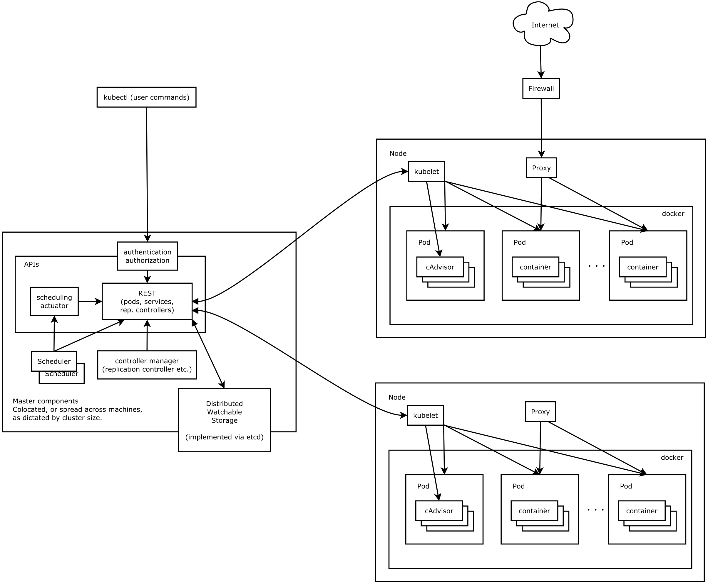

> 天下皆知美之为美，斯恶已；皆知善之为善，斯不善已。

掌握k8s基本概念

<!-- more -->

## 1. 概述

我们都经常使用docker，docker是对容器的封装。它极大的简化了系统的的构建和维护。使得 `Docker` 技术比虚拟机技术更为轻便、快捷。从而让容器技术应用越来越广泛。

当容器变多了的时候，我们需要同一管理容器的平台，Kubernetes应运而生，Kubernetes是使用最为广泛的容器编排平台。

## 2. k8s架构

**Node：**

我们可以把每个宿主机看成一个节点，每个节点又数个pod构成，pod由有一个或多个容器构成。

**Master节点：**

master节点是负责管理其他节点的主节点

**pod:**

一个pod相当于运行的一个应用或者服务

**API Server:**

通过API Server接口可以对集群进行管理

**kubelet:**

每个节点都装有kubelet，它负责管理自己节点的Pod，同时，Master节点也是通过控制其他节点的kubelet来对其他节点的Pod进行管理。

**etcd：**

所有master的持续状态都存在etcd的一个实例中。这可以很好地存储配置数据。

## 3. k8s设计理念

k8s集群都是通过API的方式进行通讯，这也是分布式系统的设计理念。API都是遵循Restful API接口规范。
