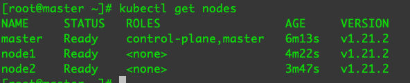
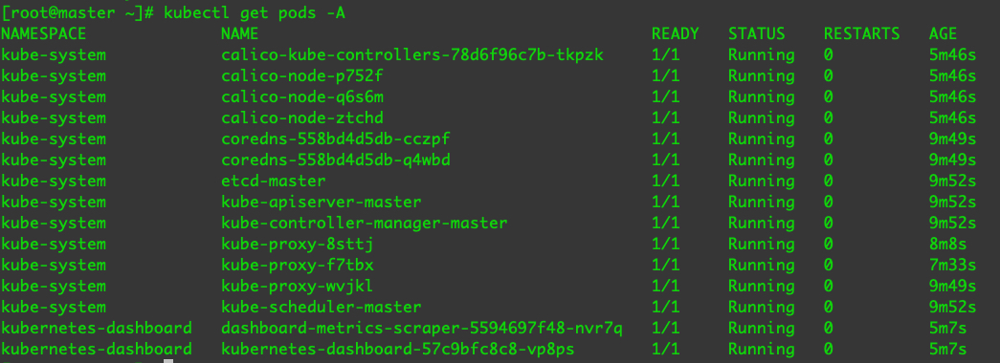

> 不尚贤，使民不争；不贵难得之货，使民不为盗；不见可欲，使民心不乱。是以圣人之治。

k8s环境搭建

<!-- more -->

## 1. 下载CentOS镜像

- 访问：https://mirrors.ustc.edu.cn/
- 点击右侧获取安装镜像，选择centos7 x86_64 Minimal
- vmware安装镜像

按照初始环境搭建安装三个虚拟机

- 环境要求

  - 每台机器 2 GB 或更多的 RAM
  - 2 CPU 核或更多（master节点即可）
  - 集群中的所有机器的网络彼此均能相互连接
  - 节点之中不可以有重复的主机名、MAC 地址或 product_uuid

- 三台虚拟机都修改hostname

  ```
  hostnamectl set-hostname master
  hostnamectl set-hostname node1
  hostnamectl set-hostname node2
  ```


## 2. 配置网络

```
cd /etc/sysconfig/network-scripts
vi ifcfg-ens33
修改BOOTPROTO，IPADDR，GATEWAY，NETMASK，DNS1
```

```bash
TYPE=Ethernet
PROXY_METHOD=none
BROWSER_ONLY=no
BOOTPROTO=static
DEFROUTE=yes
IPV4_FAILURE_FATAL=no
IPV6INIT=yes
IPV6_AUTOCONF=yes
IPV6_DEFROUTE=yes
IPV6_FAILURE_FATAL=no
IPV6_ADDR_GEN_MODE=stable-privacy
NAME=ens33
UUID=25284585-f1d6-48b6-a9c4-63513d265442
DEVICE=ens33
ONBOOT=yes
IPADDR=172.16.42.100
GATEWAY=172.16.42.2
NETMASK=255.255.255.0
DNS1=8.8.8.8
```


systemctl restart network

三个虚拟机都要配置网络设置不同的IP。

三台机器都关闭防火墙

```
systemctl stop firewalld; systemctl disable firewalld
```

配置Hosts方便迁移(vi /etc/hosts):

master:

```
172.16.42.101 node1
172.16.42.102 node2
```

node1:

```
172.16.42.100 master
172.16.42.102 node2
```

node2:

```
172.16.42.100 node1
172.16.42.102 node2
```


## 3. 允许 iptables 检查桥接流量

三个节点都要操作

- 内核参数修改

  br_netfileter模块用于将桥接流量转发至iptables链，br_netfileter内核需要开启转发

  ```
  modprobe br_netfilter
  ```

  查看是否成功，如果没有成功，结果为空

  ```
  lsmod | grep br_netfilter
  ```


- 添加流量桥接转发

  ```
  cat <<EOF | tee /etc/sysctl.d/k8s.conf
  net.bridge.bridge-nf-call-ip6tables = 1
  net.bridge.bridge-nf-call-iptables = 1
  net.ipv4.ip_forward = 1
  EOF
  ```

  ```
  sysctl -p /etc/sysctl.d/k8s.conf
  ```


## 4. 关闭swap交换分区

- 临时关闭

  ```
  swapoff -a
  ```

- 关闭完后查看是否为0

  ```
  free -m
  ```

- 永久关闭

  ```
  vi /etc/fstab
  ```

  注释掉swap行

  

**注：**

- 在云平台中用不到swap分区，因为没有空间就会报警


## 5. 修改docker文件驱动

- 介绍

  - kubelet默认文件驱动为system，docker默认文件驱动为cgroupfs。
  - 当linux的init系统发展到system之后，system 与 cgroups发生了融合（systemd提供了cgroups的使用和管道接口）

- 修改docker的daemon.json

  ```
  mkdir /etc/docker
  ```

  ```
  cat <<EOF | sudo tee /etc/docker/daemon.json
  {
    "exec-opts": ["native.cgroupdriver=systemd"],
    "log-driver": "json-file",
    "log-opts": {
      "max-size": "100m"
    },
    "storage-driver": "overlay2"
  }
  EOF
  ```

   


## 6. 配置终端代理

vi ~/.bash_profile

ip为宿主机vmware网卡IP，端口为宿主机代理端口

```
#终端设置代理

function proxysockes_on(){
	export http_proxy=socks5://172.16.42.1:1086
	export https_proxy=socks5://172.16.42.1:1086
	export all_proxy=socks5://172.16.42.1:1086
	echo '**************开启当前终端socks5代理**************'
}


function proxyhttp_on(){
	export http_proxy=http://172.16.42.1:1087
	export https_proxy=http://172.16.42.1:1087
	export all_proxy=http://172.16.42.1:1087
	echo '*************开启当前终端http代理**************'
}

function proxy_off(){
	#移除代理
	unset http_proxy
	unset https_proxy
	unset all_proxy
	echo '************关闭当前终端代理***********'
}
```

- 起用配置

  ```
  source ~/.bash_profile
  ```

- 开启socks代理

  ```
  proxysockes_on
  ```

- 开启http代理

  ```
  proxyhttp_on
  ```

- 关闭代理

  ```
  proxy_off
  ```


==下面的一系列操作如果无法访问外网下载请开启代理再尝试==


## 7. 配置docker system代理

ip为宿主机vmware网卡IP，端口为宿主机代理端口

```
mkdir -p /etc/systemd/system/docker.service.d

vi /etc/systemd/system/docker.service.d/proxy.conf
```

```
[Service]
Environment="HTTP_PROXY=socks5://172.16.42.1:1086/"
Environment="HTTPS_PROXY=socks5://172.16.42.1:1086/"
Environment="NO_PROXY=localhost,127.0.0.1,.example.com"
```

```
systemctl daemon-reload
systemctl restart docker
```


## 8. 关闭selinux

```
setenforce 0
sed -i 's/^SELINUX=enforcing$/SELINUX=permissive/' /etc/selinux/config
```

重启 reboot


## 9. 安装kubeadm

<u>三台节点虚拟机都要安装</u>

- 写入kubernetes配置

  ```
  cat <<EOF | tee /etc/yum.repos.d/kubernetes.repo
  [kubernetes]
  name=Kubernetes
  baseurl=https://packages.cloud.google.com/yum/repos/kubernetes-el7-\$basearch
  enabled=1
  gpgcheck=1
  repo_gpgcheck=1
  gpgkey=https://packages.cloud.google.com/yum/doc/yum-key.gpg https://packages.cloud.google.com/yum/doc/rpm-package-key.gpg
  exclude=kubelet kubeadm kubectl
  EOF
  ```

- 安装kubelet kubeadm kubectl

  ```
  yum install -y kubelet kubeadm kubectl --disableexcludes=kubernetes
  ```

- 开机启动kubelet

  ```
  systemctl enable --now kubelet
  ```

  


## 10. master节点初始化

```
kubeadm init \
--apiserver-advertise-address 172.16.42.100 \
--pod-network-cidr "10.220.0.0/16"
```

安装完后会有提示执行如下操作

```
mkdir -p $HOME/.kube
sudo cp -i /etc/kubernetes/admin.conf $HOME/.kube/config
sudo chown $(id -u):$(id -g) $HOME/.kube/config
```


安装完成后会有加入节点的命令，也可以通过如下命令查看

```
kubeadm token create --print-join-command
```


## 11. node节点加入

node节点执行join命令

```
kubeadm join 172.16.42.100:6443 --token dyteek.4tugaul382c7sgsb \
	--discovery-token-ca-cert-hash sha256:7e243bc69c1465069c54fd05d7c09c16d7150b09be2598b34f7fae9d60ebc68f
```

master通过kubectl get nodes命令查看加入的节点，这时候还是not ready的状态，需要我们安装网络插件


## 12. master节点安装网络插件calico

- 下载配置文件

  ```
  wget https://docs.projectcalico.org/manifests/calico.yaml
  ```

  

- 修改calico.yaml的CALICO_IPV4POOL_CIDR 的 value 为 10.220.0.0/16（初始化时配置的地址）

  ```
              - name: FELIX_WIREGUARDMTU
                valueFrom:
                  configMapKeyRef:
                    name: calico-config
                    key: veth_mtu
              # The default IPv4 pool to create on startup if none exists. Pod IPs will be
              # chosen from this range. Changing this value after installation will have
              # no effect. This should fall within `--cluster-cidr`.
              - name: CALICO_IPV4POOL_CIDR
                value: "10.220.0.0/16"
              # Disable file logging so `kubectl logs` works.
              - name: CALICO_DISABLE_FILE_LOGGING
                value: "true"
                
  ```

  

- 应用配置

  ```
  kubectl apply -f calico.yaml
  ```


查看节点状态：

```
kubectl get nodes
```

 

查看pod:

```
kubectl get pods -A
```




## 13. master节点安装dashboard插件


```
wget https://raw.githubusercontent.com/kubernetes/dashboard/v2.0.0/aio/deploy/recommended.yaml

```

添加nodePort 和 type

```yaml
---

kind: Service
apiVersion: v1
metadata:
  labels:
    k8s-app: kubernetes-dashboard
  name: kubernetes-dashboard
  namespace: kubernetes-dashboard
spec:
  ports:
    - port: 443
      targetPort: 8443
      nodePort: 30000
  type: NodePort

  selector:
    k8s-app: kubernetes-dashboard

---
```

追加管理配置

```yaml
---
apiVersion: v1
kind: ServiceAccount
metadata:
  name: dashboard-admin
  namespace: kubernetes-dashboard

---
apiVersion: rbac.authorization.k8s.io/v1
kind: ClusterRoleBinding
metadata:
  name: dashboard-admin
subjects:
- kind: ServiceAccount
  name: dashboard-admin
  namespace: kubernetes-dashboard
roleRef:
  apiGroup: rbac.authorization.k8s.io
  kind: ClusterRole
  name: cluster-admin
```

应用插件

```
kubectl apply -f recommended.yaml
```


查看生成的dashboard配置

```
kubectl get pods -A
```

生成token

```
kubectl describe secrets -n kubernetes-dashboard dashboard-admin
```

查看映射端口

```
kubectl get svc -n kubernetes-dashboard
```

查看ip地址：

```
kubectl describe pod kubernetes-dashboard-xxxxx -n kubernetes-dashboard
```

通过ip和端口确定访问的地址：https://172.16.42.102:30000/

填入token访问

访问chrome可能有问题，用火狐。


## 14. 用kubeadm重置集群

如果出错我们可以重置，从新安装

master节点

```
kubeadm reset
rm -rf /etc/cni/net.d
rm -rf $HOME/.kube/config

kubeadm config images pull

kubeadm init \
--apiserver-advertise-address 172.16.42.100 \
--pod-network-cidr "10.220.0.0/16"


mkdir -p $HOME/.kube
sudo cp -i /etc/kubernetes/admin.conf $HOME/.kube/config
sudo chown $(id -u):$(id -g) $HOME/.kube/config


kubectl apply -f calico.yaml

kubectl apply -f recommended.yaml
```

node节点

```
kubeadmin reset
kubeadm join 172.16.42.100:6443 --token sz9mvo.rup78d9uah3x3ab7 \
	--discovery-token-ca-cert-hash sha256:104f60c427854dd128e9
```


## 15. 创建一个pod

vim nginx.yaml

```
apiVersion: v1
kind: Pod
metadata:
  name: nginx-demo
spec:
  containers:
  - name: nginx-deomo
    image: nginx
```

kubectl apply -f nginx.yaml

kubectl get pods

结果：

```
[root@master ~]# kubectl get pods
NAME         READY   STATUS    RESTARTS   AGE
nginx-demo   1/1     Running   0          7s
```

进入Pod:

```
 kubectl exec -it nginx-demo /bin/bash
```


