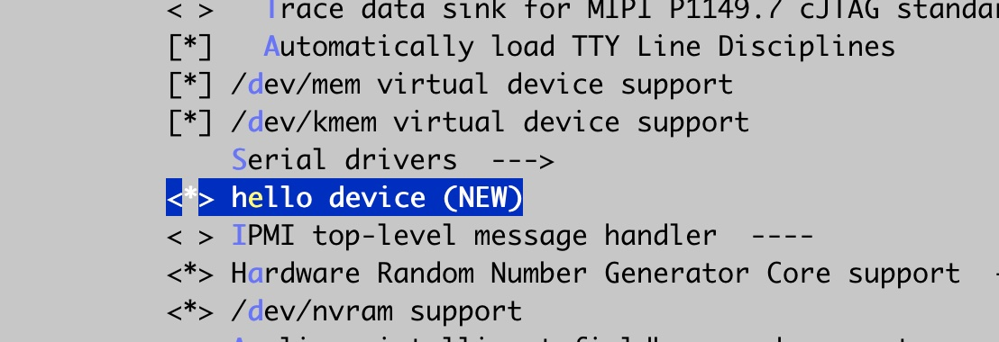
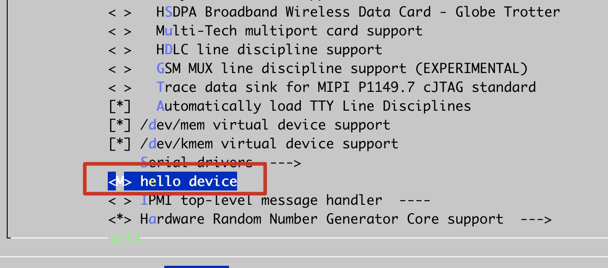

内核源码的根目录下有一个Makefile文件，在各级源代码子目录也有Makefile文件，顶层的Makefile文件通过include各个子目录的Makefile文件，就可以把整个内核源码整合进来。 最后尝试将字符设备驱动代码添加到内核源码树。

<!-- more -->

## 1. 顶层的Makefile文件

顶层的Makefile文件先会包含体系相关的Makefile文件

```
# used for 'make defconfig'
include arch/$(SRCARCH)/Makefile
export KBUILD_DEFCONFIG KBUILD_KCONFIG
```

在顶层Makefile文件中搜索`SRCARCH`，找到定义

```
# Architecture as present in compile.h
UTS_MACHINE 	:= $(ARCH)
SRCARCH 	:= $(ARCH)

# Additional ARCH settings for x86
ifeq ($(ARCH),i386)
        SRCARCH := x86
endif
ifeq ($(ARCH),x86_64)
        SRCARCH := x86
endif
```

在之前我们编译的时候指定过ARCH=x86，x86这个值就会赋给SRCARCH

所以上面的`include arch/$(SRCARCH)/Makefile`就会include，x86的Makefile。


此外，还会找到子目录，将子目录赋给如下的变量，后面会递归每个子目录调用Makefile

```
# Objects we will link into vmlinux / subdirs we need to visit
init-y		:= init/
drivers-y	:= drivers/ sound/ firmware/
net-y		:= net/
libs-y		:= lib/
core-y		:= usr/
virt-y		:= virt/
endif # KBUILD_EXTMOD
```


所以Linux内核编译过程，就是先确定架构，然后递归调用子目录的Makefile，将这些代码编译，链接到一起形成一个镜像文件的过程。


## 2. 查看一个子目录

这里我们进入到drivers子目录。查看tty相关源代码文件

```shell
[root@debian linux-4.9.229]# cd drivers/tty 
[root@debian tty]# ls
amiserial.c       goldfish.c  Makefile          moxa.c   n_hdlc.c         n_tracesink.h  rocket.c      synclink_gt.c  tty_audit.o   tty_ioctl.o  tty_ldsem.o  vt
bfin_jtag_comm.c  hvc         metag_da.c        moxa.h   nozomi.c         n_tty.c        rocket.h      synclinkmp.c   tty_buffer.c  tty_io.o     tty_mutex.c
built-in.o        ipwireless  mips_ejtag_fdc.c  mxser.c  n_r3964.c        n_tty.o        rocket_int.h  sysrq.c        tty_buffer.o  tty_ldisc.c  tty_mutex.o
cyclades.c        isicom.c    modules.builtin   mxser.h  n_tracerouter.c  pty.c          serial        sysrq.o        tty_io.c      tty_ldisc.o  tty_port.c
ehv_bytechan.c    Kconfig     modules.order     n_gsm.c  n_tracesink.c    pty.o          synclink.c    tty_audit.c    tty_ioctl.c   tty_ldsem.c  tty_port.o
```

先查看该目录下的Kconfig文件，这个config文件就是在 make menuconfig的时候看见的选项。

```
[root@debian tty]# code Kconfig
```

还有一个Makefile文件，这个文件就是针对drivers/tty所有源码的Makefile文件，这个文件就决定了哪些文件是需要编译的，编译成什么类型。

打开这个文件

```
[root@debian tty]# code Makefile
```

可以发现这个文件都是obj-打头的变量，obj-y表示编译到内核，obj-m表示编译成驱动的形式。


在Makefile的第一行有一个`CONFIG_TTY`，它就是在Kconfig里的config TTY配置，是y还是m

```
obj-$(CONFIG_TTY)
```

Makefile里的变量都对应于Kconfig里面的配置项。


在Makefile里面还有

```
obj-y				+= vt/
```

指的继续到vt目录调用Makefile


## 3. 可执行文件的链接

每个目录在编译之后还有一个built-in.o文件，这个文件将该目录所有obj-y下的所有`.o`文件给链接起来。

```
[root@debian tty]# ls -l built-in.o                   
-rw-r--r-- 1 root root 530256 8月  24 21:20 built-in.o
```


在顶层Makefile代码找到所有的built-in.o，

```
vmlinux-dirs	:= $(patsubst %/,%,$(filter %/, $(init-y) $(init-m) \
		     $(core-y) $(core-m) $(drivers-y) $(drivers-m) \
		     $(net-y) $(net-m) $(libs-y) $(libs-m) $(virt-y)))

vmlinux-alldirs	:= $(sort $(vmlinux-dirs) $(patsubst %/,%,$(filter %/, \
		     $(init-) $(core-) $(drivers-) $(net-) $(libs-) $(virt-))))

init-y		:= $(patsubst %/, %/built-in.o, $(init-y))
core-y		:= $(patsubst %/, %/built-in.o, $(core-y))
drivers-y	:= $(patsubst %/, %/built-in.o, $(drivers-y))
net-y		:= $(patsubst %/, %/built-in.o, $(net-y))
libs-y1		:= $(patsubst %/, %/lib.a, $(libs-y))
libs-y2		:= $(patsubst %/, %/built-in.o, $(libs-y))
libs-y		:= $(libs-y1) $(libs-y2)
virt-y		:= $(patsubst %/, %/built-in.o, $(virt-y))
```


通过KBUILD_LDS链接起来，这里将vmlinux.lds链接脚本赋给KBUILD_LDS

```
export KBUILD_LDS          := arch/$(SRCARCH)/kernel/vmlinux.lds
```


最后通过链接工具调用链接脚本将所有built-in.o链接起来。


## 4. 将字符设备驱动添加到内核源码树

### 4.1 源码放入到对应的驱动目录

将之前编写的hellodev.c源代码放到内核的源码里面。

由于我们之前的驱动是字符设备驱动，所以先来到内核源码的drivers/char目录，需要放到char目录

```
[root@debian linux]# cd linux-4.9.229/drivers/char
[root@debian char]# ls
agp              efirtc.c           mbcs.h           nvram.c             random.o       toshiba.c
apm-emulation.c  generic_nvram.c    mem.c            nvram.o             raw.c          tpm
applicom.c       hangcheck-timer.c  mem.o            nwbutton.c          rtc.c          ttyprintk.c
applicom.h       hpet.c             misc.c           nwbutton.h          scx200_gpio.c  uv_mmtimer.c
bfin-otp.c       hpet.o             misc.o           nwflash.c           snsc.c         virtio_console.c
bsr.c            hw_random          mmtimer.c        pc8736x_gpio.c      snsc_event.c   xilinx_hwicap
built-in.o       ipmi               modules.builtin  pcmcia              snsc.h         xillybus
ds1302.c         Kconfig            modules.order    powernv-op-panel.c  sonypi.c
ds1620.c         lp.c               mspec.c          ppdev.c             tb0219.c
dsp56k.c         Makefile           mwave            ps3flash.c          tile-srom.c
dtlk.c           mbcs.c             nsc_gpio.c       random.c            tlclk.c
```

将之前的hellodev.c复制到char目录

```
[root@debian char]# cp ~/code/cpp/demo/hellloDev/hellodev.c ./
```


### 4.2 修改Kconfig文件

要将字符设备驱动源代码加到内核源代码中，就需要修改Kconfig文件

```
[root@debian char]# vim Kconfig
```

加入如下代码

```
config HELLO
	tristate "hello device"
    default y
    help
      hello device
```

**config:**

定义了一个`config HELLO`，最后config名称叫 `config_HELLO`

**tristate:**

表示三态，y、m、n对应表示为：编译到内核、编译到驱动、不编译

如果不是tristate而是bool，表示只编译到内核里面或者不编译。

**default：**

表示默认的选择，是y,表示默认编译到内核。

**help：**

使用make menuconfig的时候的帮助信息。


下面我进入menuconfig检查一下配置

```shell
[root@debian char]# cd ../../
[root@debian linux-4.9.229]# make menuconfig
```


```
——>Device Drivers
		——>Character devices
```



并且是*，因为我们配置的default是y。


### 4.3 静态加载编译

配置好后，重写编译一下

```shell
[root@debian linux-4.9.229]# export ARCH=x86
[root@debian linux-4.9.229]# make x86_64_defconfig
#
# configuration written to .config
#
[root@debian linux-4.9.229]# make
scripts/kconfig/conf  --silentoldconfig Kconfig
  CHK     include/config/kernel.release
  CHK     include/generated/uapi/linux/ve
  ......
```

进入字符驱动目录，发现并没有编译hellodev.c

```shell
[root@debian linux-4.9.229]# cd ./drivers/char
[root@debian char]# ls | grep hello
hellodev.c
```

这是因为我们并没有在Makefile里面添加对应的配置，所以编译系统就不会编译

在Makefile中加入如下配置

```shell
[root@debian char]# vim Makefile
```

```
obj-$(CONFIG_HELLO) += hellodev.o
```

加入以后重写编译。

```shell
[root@debian char]# cd ../../
[root@debian linux-4.9.229]# make
```

编译完成后查看

```shell
[root@debian linux-4.9.229]# cd ./drivers/char
[root@debian char]# ls | grep hello
hellodev.c
hellodev.o
```

这样就把我们的驱动编译到了内核里面。这样在启动内核的时候，这个驱动就会加载进来。


### 4.4 配置驱动动态加载

这次再次配置menuconfig，修改为`M`，这样就会编译成ko文件



再次编译

```shell
[root@debian linux-4.9.229]# make
scripts/kconfig/conf  --silentoldconfig Kconfig
  CHK     include/config/kernel.release
......
Kernel: arch/x86/boot/bzImage is ready  (#4)
  Building modules, stage 2.
  MODPOST 19 modules
  CC      drivers/char/hellodev.mod.o
  LD [M]  drivers/char/hellodev.ko
  
[root@debian linux-4.9.229]# cd ./drivers/char
[root@debian char]# ls | grep hello
hellodev.c
hellodev.ko
hellodev.mod.c
hellodev.mod.o
hellodev.o
```

这样我们就完成了驱动的动态加载与静态加载的编译。静态加载随着内核的启动而启动；动态加载内核并不会自动加载需要用insmod加载进内核。


