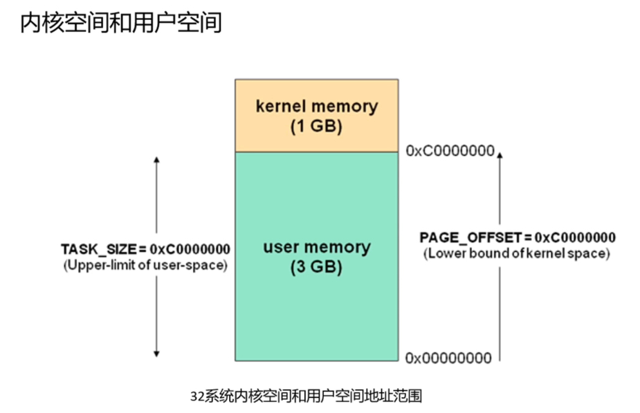
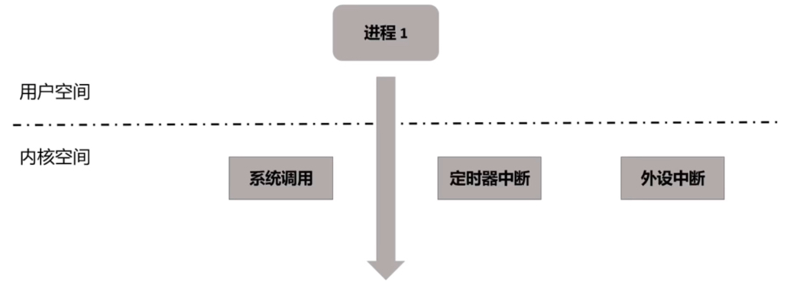

了解Linux内核空间与用户空间的概念，然后编写一个用户空间与内核空间进行数据拷贝的驱动程序。

<!-- more -->


## 1. 地址划分

在32位的系统里面，地址总线刚好是4GB大小，在4GB的线性地址空间里面，内核空间地址位于`3~4`GB之间，用户空间地址位于`0~3`GB之间，地址的划分并不固定，可以通过PAGE_OFFSET配置，PAGE_OFFSET默认等于0xC0000000，那么用户空间默认就是`0~3`GB了。




## 2. 区别

Linux内核空间主要用来做管理，用户空间运行用户的业务逻辑。

**处理模式不同，权限不同**

对于x86体系的cpu，用户空间代码运行在Ring3模式，内核空间代码运行Ring 0模式；

对于arm体系的cpu，用户空间代码运行在usr模式，内核空间代码运行在svc模式；

**安全考量**

整个系统中有各种资源，比如计算资源、内存资源和外设资源，而linux是多用户、多进程系统，所以，这些资源必须在受限的、被管理的状态下使用，要不然就陷入了混乱。空间隔离可以保证即便是单个应用程序出现错误也不会影响到操作系统的稳定性

**解耦**

从软件设计思想来看，解除了核心代码和业务逻辑代码的耦合。内核代码偏重于系统管理；而用户空间代码偏重于业务逻辑代码的实现。两者分工不同，隔离也是解耦。


## 3. 用户程序执行过程

用户空间的程序时可以到内核空间去执行的，比如进行系统调用的时候。比如读取一个文件的时候，调用一个open函数，这些都会触发一个中断，然后陷入到内核空间去执行，执行的时候如果产生了硬件中断，比如定时器中断、外设中断，也会打断进程的执行，执行中断处理程序，中断处理程序完成后，才会用调度程序调度到用户进程上执行。




## 4. 空间之间的数据拷贝


### 4.1 驱动程序

编写一个简单的驱动，让驱动可以进行用户空间与内核空间的数据拷贝。

- ukcopy.c

```c
#include <linux/module.h>
#include <linux/moduleparam.h>
#include <linux/cdev.h>
#include <linux/fs.h>
#include <linux/wait.h>
#include <linux/poll.h>
#include <linux/sched.h>
#include <linux/slab.h>

#define BUFFER_MAX    (64)
#define OK            (0)
#define ERROR         (-1)

struct cdev *gDev;
struct file_operations *gFile;
dev_t  devNum;
unsigned int subDevNum = 1;
int reg_major  =  233;
int reg_minor =   0;
char buffer[BUFFER_MAX];

int hello_open(struct inode *p, struct file *f)
{
    printk(KERN_INFO "hello_open\r\n");
    return 0;
}

ssize_t hello_write(struct file *f, const char __user *u, size_t s, loff_t *l)
{
    printk(KERN_INFO "hello_write\r\n");
    int writelen = 0;
    writelen = BUFFER_MAX>s? s : BUFFER_MAX;
    //将用户空间的u拷贝到内核空间
    if (copy_from_user(buffer, u, writelen)) {
        return -EFAULT;
    }
    return writelen;
}
ssize_t hello_read(struct file *f, char __user *u, size_t s, loff_t *l)
{
    printk(KERN_INFO "hello_read\r\n");
    int readlen;
    readlen = BUFFER_MAX>s ? s : BUFFER_MAX;
    //内核空间拷贝到内核空间
    if (copy_to_user(u, buffer, readlen)) {
        return -EFAULT;
    }
    return readlen;
}
int hello_init(void)
{
    //根据主次设备号生成dev number，这里在上方声明了是232和0
    //用来唯一标识一个设备，主设备号用来标识这类设备，次设备号用来标识这类设备里的不同设备
    devNum = MKDEV(reg_major, reg_minor);
    //将设备号注册到内核里面，别人就不能用这个232,0设备号了。
    //subDevNum上面定义是1，表示从这里开始注册一个设备。
    if(OK == register_chrdev_region(devNum, subDevNum, "helloworld")){
        printk(KERN_INFO "register_chrdev_region ok \n"); 
    }else {
    printk(KERN_INFO "register_chrdev_region error n");
        return ERROR;
    }
    printk(KERN_INFO " hello driver init \n");
    //申请一个结构体，cdev代表一个字符设备
    gDev = kzalloc(sizeof(struct cdev), GFP_KERNEL);
    //申请一个file_operations结构体，file_operations代表对文件如何操作，read, write,open等操作
    gFile = kzalloc(sizeof(struct file_operations), GFP_KERNEL);
    //对gFile这个file_operations结构体指针进行赋值。
    gFile->open = hello_open;
    gFile->read = hello_read;
    gFile->write = hello_write;
    gFile->owner = THIS_MODULE;
    //建立字符设备与file_operations的联系
    cdev_init(gDev, gFile);
    //建立字符设备与设备号的联系
    cdev_add(gDev, devNum, 1);
    return 0;
}

void __exit hello_exit(void)
{
 	printk(KERN_INFO " hello driver exit \n");
    cdev_del(gDev);
    kfree(gFile);
    kfree(gDev);
    unregister_chrdev_region(devNum, subDevNum);
    return;
}

//声明入口函数是hello_init函数
module_init(hello_init);
//声明驱动的删除函数
module_exit(hello_exit);
//版权声明
MODULE_LICENSE("GPL");
```

- Makefile

```makefile
ifneq ($(KERNELRELEASE),)
	obj-m := ukcopy.o

else
	KERN_DIR ?= /usr/src/linux-headers-$(shell uname -r)/
	PWD := $(shell pwd)

default:
	$(MAKE) -C $(KERN_DIR) M=$(PWD) modules

endif

clean:
	rm -rf *.o *~ core .depend .*.cmd *.ko *.mod.c .tmp_versions
```

编译，将驱动加载进去

```
make
insmod ukcopy.ko
```


### 4.2 将用户空间的数据拷贝到内核空间


- write.c

```c
#include <fcntl.h>
#include <stdio.h>
#include <string.h>
#include <sys/select.h>
#include <unistd.h>

#define DATA_NUM    (32)
int main(int argc, char *argv[])
{
    int fd, i;
    int r_len, w_len;
    fd_set fdset;
    char buf[DATA_NUM] = "hello world";
    fd = open("/dev/ukcopy", O_RDWR);
    if(-1 == fd) {
      	perror("open file error\n");
		return -1;
    }	
	else {
		printf("open success\n");
	}
    w_len = write(fd, buf, DATA_NUM);
    if(w_len == -1) {
		perror("write error\n");
		return -1;
	}
	sleep(5);
    printf("write len: %d\n", w_len);
	close(fd);
    return 0;
}

```


根据驱动先创建设备文件

```
[root@debian driver]# mknod /dev/ukcopy c 233 0
```

编译执行

```
[root@debian test]# gcc -o write write.c
[root@debian test]# ./write 
open success
write len: 32
```

如上表示将`hello world`写入到了内核


### 4.3 将内核空间数据拷贝到用户空间

- read.c

```c
#include <fcntl.h>
#include <stdio.h>
#include <string.h>
#include <sys/select.h>


#define DATA_NUM    (32)
int main(int argc, char *argv[])
{
    int fd, i;
    int r_len, w_len;
    fd_set fdset;
    char rbuf[DATA_NUM];
    memset(rbuf,0,DATA_NUM);
    fd = open("/dev/ukcopy", O_RDWR);
    if(-1 == fd) {
      	perror("open file error\n");
		return -1;
    }	
	else {
		printf("open successe\n");
	}
    
	r_len = read(fd, rbuf, DATA_NUM);
	if(r_len == -1) {
		perror("read error\n");
		return -1;
	}
    printf("read len: %d\n", r_len);
    printf("%s\n", rbuf);
	close(fd);
    return 0;
}

```

编译执行

```
[root@debian test]# gcc -o read read.c 
[root@debian test]# ./read 
open successe
read len: 32
hello world
```

成功从内核读取到了想要的数据。


前面说到内核和用户空间是线性地址划分，但是实际拷贝的时候并不是从一个地址到另一个地址，因为这是虚拟地址，实际拷贝的时候需要找到物理地址。如果在同一个物理页，一次就能成功，如果不在同一页，就需要跨页，消耗更多性能，而且如果物理页不在内存上，就会缺页，还需要将磁盘数据读取到内存，所以一个简单的复制操作，也会有很多细节。
