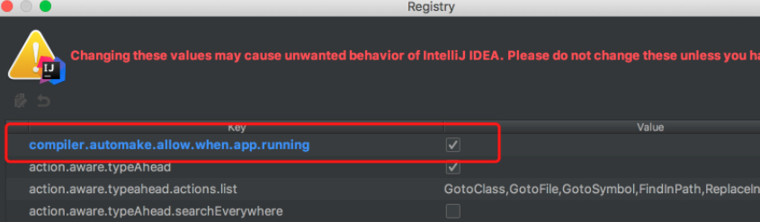

SpringBoot入门案例

<!-- more -->

## 1. 入门案例

创建基本的maven工程

### 1.1 添加SpringBoot的起步依赖

SpringBoot要求，项目要继承SpringBoot的起步依赖spring-boot-starter-parent

```XML
<parent>
    <groupId>org.springframework.boot</groupId>
    <artifactId>spring-boot-starter-parent</artifactId>
    <version>2.0.1.RELEASE</version>
</parent>
```

SpringBoot要集成SpringMVC进行Controller的开发，所以项目要导入web的启动依赖

```XML
<dependencies>
    <dependency>
        <groupId>org.springframework.boot</groupId>
        <artifactId>spring-boot-starter-web</artifactId>
    </dependency>
</dependencies>
```


### 1.2 编写SpringBoot引导类

要通过SpringBoot提供的引导类起步SpringBoot才可以进行访问

```java
package com.shadowflow;

import org.springframework.boot.SpringApplication;
import org.springframework.boot.autoconfigure.SpringBootApplication;

@SpringBootApplication
public class MySpringBootApplication {
    public static void main(String[] args) {
        SpringApplication.run(MySpringBootApplication.class);
    }
}

```

- `@SpringBootApplication`：标注SpringBoot的启动类，该注解具备多种功能（后面详细剖析）
- `SpringApplication.run(MySpringBootApplication.class) `代表运行SpringBoot的启动类，参数为SpringBoot启动类的字节码对象


点击启动，访问8080端口有如下页面

 


### 1.3 编写Controller

```java
package com.shadowflow.controller;

import org.springframework.stereotype.Controller;
import org.springframework.web.bind.annotation.RequestMapping;
import org.springframework.web.bind.annotation.ResponseBody;

@Controller
public class QuickController {

    @RequestMapping("/quick")
    @ResponseBody
    public String quick(){
        return "hello springboot";
    }
}

```

访问http://localhost:8080/quick

  


## 2. SpringBoot的热部署

我们在开发中反复修改类、页面等资源，每次修改后都是需要重新启动才生效，这样每次启动都很麻烦，浪费了大量的时间，我们可以在修改代码后不重启就能生效，在 pom.xml 中添加如下配置就可以实现这样的功能，我们称之为热部署。

```
<!--热部署配置-->
<dependency>
    <groupId>org.springframework.boot</groupId>
    <artifactId>spring-boot-devtools</artifactId>
</dependency>
```

<u>这时候我们修改，如果不重启并不会生效，这是IDEA的问题</u>，需要我们设置

1.打开IDEA的设置做如下修改


2. mac上快捷键：Command + Shift + A，搜索Registry



2021后的版本在设置里面


这样，修改文件就会重新部署，但是比较慢，耗费性能，我自己用就关了。


## 3. 使用idea快速创建SpringBoot项目

创建新的模块


## 4. SpringBoot的配置文件

SpringBoot是基于约定的，所以很多配置都有默认值，但如果想使用自己的配置替换默认配置的话，就可以使用application.properties或者application.yml（application.yaml）进行配置。

SpringBoot默认会从Resources目录下加载application.properties或application.yml（application.yaml）文件

其中，application.properties文件是键值对类型的文件

### 4.1 properties举例

```properties
#服务器端口
server.port=8081
#当前web应用的名称
server.servlet.context-path=/demo
```

### 4.2 yaml

YML文件格式是YAML (YAML Aint Markup Language)编写的文件格式，YAML是一种直观的能够被电脑识别的的数据数据序列化格式，并且容易被人类阅读，容易和脚本语言交互的，可以被支持YAML库的不同的编程语言程序导入，比如： C/C++, Ruby, Python, Java, Perl, C#, PHP等。YML文件是以数据为核心的，比传统的xml方式更加简洁。

YML文件的扩展名可以使用.yml或者.yaml。

### 4.3 yml配置文件的语法

**配置普通数据**

- 语法： key: value

- 示例代码：

  ```yaml
  name: haohao
  ```

- 注意：value之前有一个空格

**配置对象数据**

- 语法： 

  ​	key: 

  ​		key1: value1

  ​		key2: value2

  ​	或者：

  ​	key: {key1: value1,key2: value2}

- 示例代码：

  ```yaml
  person:
    name: haohao
    age: 31
    addr: beijing
  
  #或者
  
  person: {name: haohao,age: 31,addr: beijing}
  ```

- 注意：key1前面的空格个数不限定，在yml语法中，相同缩进代表同一个级别

**配置Map数据 **

同上面的对象写法

**配置数组（List、Set）数据**

- 语法： 

  ​	key: 

  ​		- value1

  ​		- value2

  或者：

  ​	key: [value1,value2]

- 示例代码：

  ```yaml
  city:
    - beijing
    - tianjin
    - shanghai
    - chongqing
    
  #或者
  
  city: [beijing,tianjin,shanghai,chongqing]
  
  #集合中的元素是对象形式
  student:
    - name: zhangsan
      age: 18
      score: 100
    - name: lisi
      age: 28
      score: 88
    - name: wangwu
      age: 38
      score: 90
  ```

  - 注意：value1与之间的 - 之间存在一个空格

### 4.4 SpringBoot配置信息的查询

面提及过，SpringBoot的配置文件，主要的目的就是对配置信息进行修改的，但在配置时的key从哪里去查询呢？我们可以查阅SpringBoot的官方文档

文档URL：https://docs.spring.io/spring-boot/docs/2.0.1.RELEASE/reference/htmlsingle/#common-application-properties

常用的配置摘抄如下：

```properties
# QUARTZ SCHEDULER (QuartzProperties)
spring.quartz.jdbc.initialize-schema=embedded # Database schema initialization mode.
spring.quartz.jdbc.schema=classpath:org/quartz/impl/jdbcjobstore/tables_@@platform@@.sql # Path to the SQL file to use to initialize the database schema.
spring.quartz.job-store-type=memory # Quartz job store type.
spring.quartz.properties.*= # Additional Quartz Scheduler properties.

# ----------------------------------------
# WEB PROPERTIES
# ----------------------------------------

# EMBEDDED SERVER CONFIGURATION (ServerProperties)
server.port=8080 # Server HTTP port.
server.servlet.context-path= # Context path of the application.
server.servlet.path=/ # Path of the main dispatcher servlet.

# HTTP encoding (HttpEncodingProperties)
spring.http.encoding.charset=UTF-8 # Charset of HTTP requests and responses. Added to the "Content-Type" header if not set explicitly.

# JACKSON (JacksonProperties)
spring.jackson.date-format= # Date format string or a fully-qualified date format class name. For instance, `yyyy-MM-dd HH:mm:ss`.

# SPRING MVC (WebMvcProperties)
spring.mvc.servlet.load-on-startup=-1 # Load on startup priority of the dispatcher servlet.
spring.mvc.static-path-pattern=/** # Path pattern used for static resources.
spring.mvc.view.prefix= # Spring MVC view prefix.
spring.mvc.view.suffix= # Spring MVC view suffix.

# DATASOURCE (DataSourceAutoConfiguration & DataSourceProperties)
spring.datasource.driver-class-name= # Fully qualified name of the JDBC driver. Auto-detected based on the URL by default.
spring.datasource.password= # Login password of the database.
spring.datasource.url= # JDBC URL of the database.
spring.datasource.username= # Login username of the database.

# JEST (Elasticsearch HTTP client) (JestProperties)
spring.elasticsearch.jest.password= # Login password.
spring.elasticsearch.jest.proxy.host= # Proxy host the HTTP client should use.
spring.elasticsearch.jest.proxy.port= # Proxy port the HTTP client should use.
spring.elasticsearch.jest.read-timeout=3s # Read timeout.
spring.elasticsearch.jest.username= # Login username.
```

我们可以通过配置application.poperties 或者 application.yml 来修改SpringBoot的默认配置

例如：

application.properties文件

```properties
server.port=8888
server.servlet.context-path=demo
```

application.yml文件

```yaml
server:
  port: 8888
  servlet:
    context-path: /demo
```


### 4.5 配置文件与配置类的属性映射方式

**使用注解@Value映射**

我们可以通过@Value注解将配置文件中的值映射到一个Spring管理的Bean的字段上

例如：

application.properties配置如下：

```properties
person:
  name: zhangsan
  age: 18
```

或者，application.yml配置如下：

```yaml
person:
  name: zhangsan
  age: 18
```

实体Bean代码如下：

```java
@Controller
public class QuickStartController {

    @Value("${person.name}")
    private String name;
    @Value("${person.age}")
    private Integer age;


    @RequestMapping("/quick")
    @ResponseBody
    public String quick(){
        return "springboot 访问成功! name="+name+",age="+age;
    }

}
```

**使用注解@ConfigurationProperties映射**

通过注解@ConfigurationProperties(prefix="配置文件中的key的前缀")可以将配置文件中的配置自动与实体进行映射

application.properties配置如下：

```properties
person:
  name: zhangsan
  age: 18
```

或者，application.yml配置如下：

```yaml
person:
  name: zhangsan
  age: 18
```

实体Bean代码如下：

```java
@Controller
@ConfigurationProperties(prefix = "person")
public class QuickStartController {

    private String name;
    private Integer age;

    @RequestMapping("/quick")
    @ResponseBody
    public String quick(){
        return "springboot 访问成功! name="+name+",age="+age;
    }

    public void setName(String name) {
        this.name = name;
    }

    public void setAge(Integer age) {
        this.age = age;
    }
}
```

注意：使用@ConfigurationProperties方式可以进行配置文件与实体字段的自动映射，但需要字段必须提供set方法才可以，而使用@Value注解修饰的字段不需要提供set方法。


## 5. SpringBoot整合

### 5.1 SpringBoot整合Mybatis

- 添加Mybatis的起步依赖

  ```xml
  <!--mybatis起步依赖-->
  <dependency>
      <groupId>org.mybatis.spring.boot</groupId>
      <artifactId>mybatis-spring-boot-starter</artifactId>
      <version>1.1.1</version>
  </dependency>
  ```

- 添加数据库驱动坐标

  ```xml
  <!-- MySQL连接驱动 -->
  <dependency>
      <groupId>mysql</groupId>
      <artifactId>mysql-connector-java</artifactId>
  </dependency>
  ```

- 添加数据库连接信息

  在application.properties中添加数据量的连接信息

  ```
  #DB Configuration:
  spring.datasource.driverClassName=com.mysql.jdbc.Driver
  spring.datasource.url=jdbc:mysql://127.0.0.1:3306/test?useUnicode=true&characterEncoding=utf8
  spring.datasource.username=root
  spring.datasource.password=root
  ```

- 创建user表

  在test数据库中创建user表

  ```sql
  -- ----------------------------
  -- Table structure for `user`
  -- ----------------------------
  DROP TABLE IF EXISTS `user`;
  CREATE TABLE `user` (
    `id` int(11) NOT NULL AUTO_INCREMENT,
    `username` varchar(50) DEFAULT NULL,
    `password` varchar(50) DEFAULT NULL,
    `name` varchar(50) DEFAULT NULL,
    PRIMARY KEY (`id`)
  ) ENGINE=InnoDB AUTO_INCREMENT=10 DEFAULT CHARSET=utf8;
  
  -- ----------------------------
  -- Records of user
  -- ----------------------------
  INSERT INTO `user` VALUES ('1', 'zhangsan', '123', '张三');
  INSERT INTO `user` VALUES ('2', 'lisi', '123', '李四');
  ```

- 创建实体Bean

  ```java
  public class User {
      // 主键
      private Long id;
      // 用户名
      private String username;
      // 密码
      private String password;
      // 姓名
      private String name;
    
      //此处省略getter和setter方法 .. ..
      
  }
  ```

- 编写Mapper

  ```
  @Mapper
  public interface UserMapper {
  	public List<User> queryUserList();
  }
  ```

  注意：@Mapper标记该类是一个mybatis的mapper接口，可以被spring boot自动扫描到spring上下文中

- 配置Mapper映射文件

  在src\main\resources\mapper路径下加入UserMapper.xml配置文件"

  ```xml
  <?xml version="1.0" encoding="utf-8" ?>
  <!DOCTYPE mapper PUBLIC "-//mybatis.org//DTD Mapper 3.0//EN" "http://mybatis.org/dtd/mybatis-3-mapper.dtd" >
  <mapper namespace="com.itheima.mapper.UserMapper">
      <select id="queryUserList" resultType="user">
          select * from user
      </select>
  </mapper>
  ```

- 在application.properties中添加mybatis的信息

  ```properties
  #spring集成Mybatis环境
  #pojo别名扫描包
  mybatis.type-aliases-package=com.itheima.domain
  #加载Mybatis映射文件
  mybatis.mapper-locations=classpath:mapper/*Mapper.xml
  ```

- 编写测试Controller

  ```java
  @Controller
  public class MapperController {
  
      @Autowired
      private UserMapper userMapper;
  
      @RequestMapping("/queryUser")
      @ResponseBody
      public List<User> queryUser(){
          List<User> users = userMapper.queryUserList();
          return users;
      }
  
  }
  ```

  

### 5.2 SpringBoot整合Junit

- 添加Junit的起步依赖

  ```xml
  <!--测试的起步依赖-->
  <dependency>
      <groupId>org.springframework.boot</groupId>
      <artifactId>spring-boot-starter-test</artifactId>
      <scope>test</scope>
  </dependency>
  ```

- 编写测试类

  ```java
  package com.itheima.test;
  
  import com.itheima.MySpringBootApplication;
  import com.itheima.domain.User;
  import com.itheima.mapper.UserMapper;
  import org.junit.Test;
  import org.junit.runner.RunWith;
  import org.springframework.beans.factory.annotation.Autowired;
  import org.springframework.boot.test.context.SpringBootTest;
  import org.springframework.test.context.junit4.SpringRunner;
  
  import java.util.List;
  
  @RunWith(SpringRunner.class)
  @SpringBootTest(classes = MySpringBootApplication.class)
  public class MapperTest {
  
      @Autowired
      private UserMapper userMapper;
  
      @Test
      public void test() {
          List<User> users = userMapper.queryUserList();
          System.out.println(users);
      }
  
  }
  ```

  其中，SpringRunner继承自SpringJUnit4ClassRunner，使用哪一个Spring提供的测试测试引擎都可以

  ```java
  public final class SpringRunner extends SpringJUnit4ClassRunner 
  ```

  @SpringBootTest的属性指定的是引导类的字节码对象


