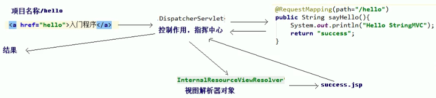

SpringMVC入门案例学习

<!-- more -->

## 1. 需求分析

 

1. 搭建开发的环境
2. 编写入门程序


## 2. 环境搭建

- 创建一个空的项目

- 新建一个模块

  

- 添加源码目录和资源目录

   

- pom文件修改

  ```xml
  <!-- 修改编译版本为1.8，并添加版本锁定 -->
    <properties>
      <project.build.sourceEncoding>UTF-8</project.build.sourceEncoding>
      <maven.compiler.source>1.8</maven.compiler.source>
      <maven.compiler.target>1.8</maven.compiler.target>
    </properties>
  
  ```

  ```xml
  <!-- 添加依赖 -->
  <dependency>
    <groupId>org.springframework</groupId>
    <artifactId>spring-context</artifactId>
    <version>${spring.version}</version>
  </dependency>
  <dependency>
    <groupId>org.springframework</groupId>
    <artifactId>spring-web</artifactId>
    <version>${spring.version}</version>
  </dependency>
  <dependency>
    <groupId>org.springframework</groupId>
    <artifactId>spring-webmvc</artifactId>
    <version>${spring.version}</version>
  </dependency>
  <dependency>
    <groupId>javax.servlet</groupId>
    <artifactId>servlet-api</artifactId>
    <version>2.5</version>
    <scope>provided</scope>
  </dependency>
  <dependency>
    <groupId>javax.servlet.jsp</groupId>
    <artifactId>jsp-api</artifactId>
    <version>2.0</version>
  </dependency>
  ```

- 配前端控制器（servlet），在web.xml中配置

  <u>任何请求都会经过该servlet</u>

  ```xml
    <servlet>
      <servlet-name>dispatcherServlet</servlet-name>
      <servlet-class>org.springframework.web.servlet.DispatcherServlet</servlet-class>
    </servlet>
    <servlet-mapping>
      <servlet-name>dispatcherServlet</servlet-name>
      <url-pattern>/</url-pattern>
    </servlet-mapping>
  ```

   

  

- 配置spring 配置文件，名字我取的是springmvc.xml

  


- 部署

  

​		


## 3. 编写入门程序

### 3.1 修改index.jsp

打开index.jsp如下

```jsp
<html>
<body>
<h2>Hello World!</h2>
</body>
</html>
```

没有编码信息，我们将其删除，使用idea创建会自动加上

 

```jsp
<%@ page contentType="text/html;charset=UTF-8" language="java" %>
<html>
<head>
    <title>Title</title>
</head>
<body>

</body>
</html>
```

做个简单改造

```jsp
<%@ page contentType="text/html;charset=UTF-8" language="java" %>
<html>
<head>
    <title>Title</title>
</head>
<body>
    <h3>入门程序</h3>
    <a href="">入门程序</a>

</body>
</html>

```


### 3.2 编写控制器

```java
package com.shadowflow;

//控制器
public class HelloController {
    public String sayHello(){
        System.out.println("Hello StringMVC");
        return null;
    }
}

```


### 3.3 添加spring的配置

添加名称空间以及扫描的包

```xml
<?xml version="1.0" encoding="UTF-8"?>
<beans xmlns="http://www.springframework.org/schema/beans"
       xmlns:mvc="http://www.springframework.org/schema/mvc"
       xmlns:context="http://www.springframework.org/schema/context"
       xmlns:xsi="http://www.w3.org/2001/XMLSchema-instance"
       xsi:schemaLocation="
        http://www.springframework.org/schema/beans
        http://www.springframework.org/schema/beans/spring-beans.xsd
        http://www.springframework.org/schema/mvc
        http://www.springframework.org/schema/mvc/spring-mvc.xsd
        http://www.springframework.org/schema/context
        http://www.springframework.org/schema/context/spring-context.xsd">

    <!-- 开启注解扫描 -->
    <context:component-scan base-package="com.shadowflow"/>
</beans>
```


### 3.4 添加注解

给HelloController添加`@Controller`注解，表示把这个类交给spring ioc容器，添加`@RequestMapping`注解映射请求路径

```java
package com.shadowflow;

import org.springframework.stereotype.Controller;
import org.springframework.web.bind.annotation.RequestMapping;

//控制器
@Controller
public class HelloController {
    @RequestMapping(path="/hello")
    public String sayHello(){
        System.out.println("Hello StringMVC");
        return null;
    }
}

```


### 3.5 加载springmvc配置文件

```xml
    <init-param>
      <param-name>contextConfigLocation</param-name>
      <param-value>classpath:springmvc.xml</param-value>
    </init-param>
    <load-on-startup>1</load-on-startup>
```

`<init-param>`传入配置文件路径

`<load-on-startup>`一般来说servlet在第一次发请求才创建，配置了这个参数表示启动服务就会创建，然后启动就会创建spring对象

整改文件如下

```xml
<!DOCTYPE web-app PUBLIC
 "-//Sun Microsystems, Inc.//DTD Web Application 2.3//EN"
 "http://java.sun.com/dtd/web-app_2_3.dtd" >

<web-app>
  <display-name>Archetype Created Web Application</display-name>

  <servlet>
    <servlet-name>dispatcherServlet</servlet-name>
    <servlet-class>org.springframework.web.servlet.DispatcherServlet</servlet-class>

    <init-param>
      <param-name>contextConfigLocation</param-name>
      <param-value>classpath:springmvc.xml</param-value>
    </init-param>
    <load-on-startup>1</load-on-startup>

  </servlet>
  <servlet-mapping>
    <servlet-name>dispatcherServlet</servlet-name>
    <url-pattern>/</url-pattern>
  </servlet-mapping>
</web-app>

```


### 3.6 控制器返回

```java
@Controller
public class HelloController {
    @RequestMapping(path="/hello")
    public String sayHello(){
        System.out.println("Hello StringMVC");
        return "success";
    }
}
```

返回值可以任意写，这里我写的success，success表示返回jsp页面名称

所以创建一个success.jsp


除此之外，还要在springmvc配置文件中配置视图解析器。

```xml
    <!-- 视图解析器 -->
    <bean id="InternalResourceViewResolver" class="org.springframework.web.servlet.view.InternalResourceViewResolver">
        <property name="prefix" value="/WEB-INF/pages/" />
        <property name="suffix" value=".jsp" />
    </bean>
```

添加注解支持

```xml

    <!-- 开启SpringMVC框架注解支持 -->
    <mvc:annotation-driven/>
```

完整springmvc配置文件如下

```xml
<?xml version="1.0" encoding="UTF-8"?>
<beans xmlns="http://www.springframework.org/schema/beans"
       xmlns:mvc="http://www.springframework.org/schema/mvc"
       xmlns:context="http://www.springframework.org/schema/context"
       xmlns:xsi="http://www.w3.org/2001/XMLSchema-instance"
       xsi:schemaLocation="
        http://www.springframework.org/schema/beans
        http://www.springframework.org/schema/beans/spring-beans.xsd
        http://www.springframework.org/schema/mvc
        http://www.springframework.org/schema/mvc/spring-mvc.xsd
        http://www.springframework.org/schema/context
        http://www.springframework.org/schema/context/spring-context.xsd">

    <!-- 开启注解扫描 -->
    <context:component-scan base-package="com.shadowflow"/>

    <!-- 视图解析器 -->
    <bean id="InternalResourceViewResolver" class="org.springframework.web.servlet.view.InternalResourceViewResolver">
        <property name="prefix" value="/WEB-INF/pages/" />
        <property name="suffix" value=".jsp" />
    </bean>

    <!-- 开启SpringMVC框架注解支持 -->
    <mvc:annotation-driven/>
</beans>
```


### 3.7 给index.jsp添加相对路径

```jsp
=<%--
  Created by IntelliJ IDEA.
  User: shadowflow
  Date: 2022/3/31
  Time: 11:58 上午
  To change this template use File | Settings | File Templates.
--%>
<%@ page contentType="text/html;charset=UTF-8" language="java" %>
<html>
<head>
    <title>Title</title>
</head>
<body>
    <h3>入门程序</h3>
    <a href="hello">入门程序</a>

</body>
</html>

```


### 3.8 启动程序

启动程序，访问效果

 

 


## 4. 总结

**步骤：**

1. 启动服务器，加载一些配置

   - `<load-on-startup>1</load-on-startup>` ——> `DispatcherServlet`对象创建
   - springmvc.xml
   - HelloController创建成对象

   

2. 发送请求




