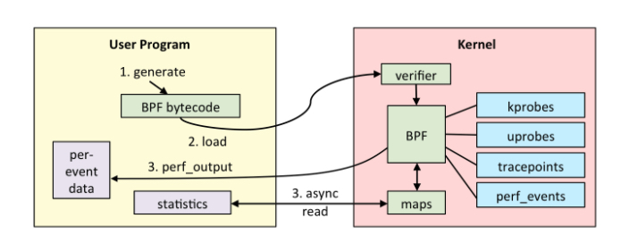

> 人法地，地法天，天法道，道法自然。

Linux一直没有好用的内核态动态追踪工具，直到eBPF的出现。eBPF可以动态追踪linux事件，获取运行信息。通过分析这些信息可以用来确定是否存在攻击行为。

<!-- more -->


## 1. eBPF

BPF（Berkeley Packet Filter）是一种包过滤器，是很早就有的内核特性，最早可以追溯到1992年。由于其优良的特性，所有UNIX系统都将BPF作为网络过滤的首选技术，比如我们熟悉的Tcpdump，其底层就是依赖BPF实现的包过滤。

2014年，Alexei Starovoitov对BPF进行了彻底的改造，并增加了新的功能，改善了性能。经过重新设计，eBPF 演进为一个通用执行引擎，可基于此开发性能分析工具、软件定义网络等诸多场景。eBPF 最早出现在 3.18 内核中，此后原来的 BPF 就被称为经典 BPF，缩写 cBPF（classic BPF），cBPF 现在已经基本废弃。现在，Linux 内核只运行 eBPF。

在eBPF中，开发者可以在用户空间编写eBPF程序，并将其加载到内核空间执行，不用重新编译内核。


### 1.1 eBPF原理

Linux内核是一个事件驱动的系统设计，这意味着所有操作都是基于事件来描述和执行的。打开文件、CPU执行指令、接收网络数据包都是事件。eBPF可以在内核中检查这些事件的信息源，并且编写eBPF程序来处理触发该事件的代码。

开发者可以使用C语言或者Python等其他高级语言编写自己的eBPF程序，然后通过LLVM或者GNU、Clang等编译器，将其编译成eBPF字节码。Linux提供了一个bpf()系统调用，通过bpf()系统调用，将这段编译好的字节码传入内核空间。

 

 

传入内核后，先用Verifier组件进行安全测试，测试之后通过JIT编译为机器码。这样就可以在eBPF指定的附着点上执行操作逻辑了。

eBPF通过MAP数据结构进行数据存储和管理，eBPF将产生的数据通过指定的MAP数据类型进行存储，用户空间的应用程序作为消费者通过bpf()系统调用，从MAP数据结构中读取数据并进行存储和处理。这就是一个完整的eBPF程序的流程。


*由于 eBPF 还在快速发展期，内核中的功能也日趋增强，一般推荐基于Linux 4.4+ (4.9 以上会更好) 内核的来使用 eBPF。部分 Linux Event 和 BPF 版本支持见下图：*

 


## 2. eBPF程序类型   

我们可以简单地将eBPF程序的类型分为两个方面：网络和追踪。

**1. 网络**

相对于系统的性能分析和观测，eBPF 技术在网络技术中的表现，更是让人眼前一亮。eBPF允许开发者监控并操作计算机系统中的网络流量，这也是BPF原始设计时的核心功能点。

BPF 技术与 XDP（eXpress Data Path） 和 TC（Traffic Control） 组合可以实现功能更加强大的网络功能，XDP 只作用与网络包的进入过程，BPF 钩子位于**网络驱动中尽可能早的位置**，**无需进行原始包的复制**就可以实现最佳的数据包处理性能，挂载的 BPF 程序是运行过滤的理想选择，可用于丢弃恶意或非预期的流量、进行 DDOS 攻击保护等场景，在流量越早期阶段处理，就可以节省处理流量的性能；而 TC Ingress 比 XDP 技术处于更高层次的位置，BPF 程序在 L3 层之前运行，可以访问到与数据包相关的大部分元数据，是本地节点处理的理想的地方，可以用于流量监控或者 L3/L4 的端点策略控制，同时配合 TC egress 则可实现对于容器环境下更高维度和级别的网络结构。

XDP 技术架构:

 


**2. 追踪**

eBPF可以通过各种类型的追踪点访问与特定与特定程序相关的内存区域，从正在运行的进程中提取信息并执行跟踪。在安全检测上，我们可以将eBPF程序的追踪点加载到一些关键并且不是很频繁的内核行为上，比如创建一个新的TCP会话、fork新的进程、特权提升等，这样就可以通过对这些行为的追踪进行异常检测。


## 3. eBPF工具

现在已经有很多开源eBPF实现

### 3.1 BCC

[BCC](https://github.com/iovisor/bcc)（BPF Compiler Collection）是高效创建eBPF程序的工具包，BCC把eBPF程序的编译、加载等功能都集成起来，提供友好的接口给用户。它使用了“python+Lua+C++”的混合架构，底层操作封装到C++库中，Lua提供一下辅助功能，使用Python提供用户的接口，Python和C++之间的调用使用ctypes连接。

### 3.2 BPFTrace

BPFTrace是eBPF的高级追踪语言。它允许开发者使用简洁的领域特定语言（DSL）编写eBPF程序，并将它们保存为脚本，开发者可以执行这些脚本，而不必在内核中手动编译和加载。

与直接使用BCC不同的是，使用BPFTrace提供了许多不需要自己实现的内置功能，比如聚合信息和创建直方图。

### 3.3 BPFTrace安装

docker 安装并运行

```
docker run -ti -v /usr/src:/usr/src:ro \
       -v /lib/modules/:/lib/modules:ro \
       -v /sys/kernel/debug/:/sys/kernel/debug:rw \
       --net=host --pid=host --privileged \
       quay.io/iovisor/bpftrace:latest
```


## 4. 使用BPFTrace实现动态追踪

**探针类型**

动态追踪都是探针机制实现的，探针是用于捕获事件数据的检测点，BPFTrace在实现内核行为追踪时使用的探针主要包括动态探针（Kprobe/Kretprobe）和静态探针（Tracepoint）两种。

**动态探针：Kprobe/Kretprobe**

eBPF支持内核探针功能，允许开发者在几乎所有的内核指令中以最小的开销设置动态的标记或中断。当内核运行到某个标记的时候，就会执行附加到这个探测点上的代码，然后恢复正常的流程。对内核行为的追踪探测，可以获取内核中发生任何事件的信息，比如系统中打开的文件、正在执行的二进制文件、系统中发生的TCP连接等。

内核动态探针可以分为两种：Kprobe和Kretprobe。二者的区别在于，根据探针执行周期的不同阶段，来确定插入eBPF程序的位置。Kprobe类型的探针用于跟踪内核函数调用，是一种功能强大的探针类型，让我们可以追踪成千上万的内核函数。由于它们是用来跟踪底层内核的，开发者需要熟悉内核源代码，理解这些探针的参数、返回值的意义。

Kprobe通常在内核函数执行前插入eBPF程序，而Kretprobe在执行完毕返回之后，插入相应的的eBPF程序。比如，tcp_connect()是一个内核函数，当有TCP连接发生时将调用该函数，那么如果对tcp_connect()使用Kprobe探针，则对应的eBPF程序会在tcp_connect()被调用时执行，而如果使用Kretprobe探针，则eBPF程序会在tcp_connect()返回时执行。

尽管Kprobe运行在执行任何内核功能之前插入eBPF程序。但是，它是一种“不稳定”的探针类型，开发者在使用Kprobe时，需要知道想要追踪的函数签名。而Kprobe当前咩有稳定的应用程序二进制接口（ABI），这意味着它们可能在不同的内核版本之间发生变化。内核版本不同，内核函数名、参数、返回值等可能会变化。

使用如下命令可以查看当前版本内核所支持的Kprobe探针列表

```bash
[root@vuln ~]# bpftrace -l 'kprobe:tcp*'
kprobe:tcp_mmap
kprobe:tcp_get_info_chrono_stats
kprobe:tcp_init_sock
kprobe:tcp_splice_data_recv
......
```


**静态探针：Tracepoint**

Tracepoint是在内核代码中所做的一种静态标记，是开发者在内核源代码中散落的一些hook，开发者可以依托这些hook实现相应的追踪代码插入。

开发者在/sys/kernel/debug/tracing/events/目录下，可以查看当前版本的内核支持的所有Tracepoint，在每一个具体Tracepoint目录下，都会有一系列对其进行配置说明的文件，比如可以通过enable中的值设置该Tracepoint探针的开关等。

与Kprobe相比，它们的主要区别在于，Tracepoint是内核开发人员已经在内核代码中提前埋好的，这也是为什么称它们为静态探针的原因。而Kprobe更多的是跟踪内核函数的进入和返回，因此称为动态的探针。但是内核函数会随着内核的发展而出现谋者小时，因此Krobe对内核版本有着相对较强的依赖性，因此相比于Kprobe探针，更喜欢用Tracepoint探针，因为Tracepoint有着更稳定的应用程序编程接口，而且在内核中保持着向前兼容。

Tracepoint的不足之处在于，这些探针需要开发人员将它们添加到内核中，因此，它们可能不会覆盖内核的所有子系统，只能使用当前版本内核所支持的探测点。我们可以通过如下BPFTrace命令列出当前版本内核所支持的Tracepoint探针列表。

```bash
[root@vuln alarmtimer]# bpftrace -l 'tracepoint:*'
tracepoint:vb2:vb2_buf_done
tracepoint:vb2:vb2_buf_queue
tracepoint:vb2:vb2_dqbuf
......
```


**其他探针：**

除了签名介绍的探针外，eBPF还支持对用户态程序通过探针进行追踪。例如用户态的Uprobe/Uretprobe探针，在用户态函数进行hook，实现与Kprobe/Kretprobe类似的功能；再比如USDT（User Static Defined Tracepoint）探针，是用户态的Tracepoint,需要开发者在用户态中自己埋点Tracepoint，实现与内核Tracepoint类似的功能。


### 4.1 使用BPFTrace进行追踪

BPFTrace的一个方便之处在于，其既可以通过一个命令行完成简单动态追踪，又可以按照其规定的语法结构，将其追踪逻辑编辑成可执行脚本。

**1. 命令行**

下面我们尝试一些命令

1）列出支持的探针

```
bpftrace -l 'tracepoint:syscalls:sys_enter_*'
```

bpftrace -l 可以列出支持的所有探针，可以通过引号内的条件对结果进行过滤。

2）打印Hello World

```bash
[root@vuln alarmtimer]# bpftrace -e 'BEGIN { printf("hello world\n"); }'
```

命令中的 -e 'program'表示将要执行这个程序。BEGIN是一个特殊的探针，在程序开始执行时触发探针执行，可以使用它设置变量和打印消息头。BEGIN探针后“{}”内是与该探针关联的动作。

3）追踪文件打开

这个命令可以在文件打开时，追踪并打印出进程名以及对应的文件名。

```bash
[root@vuln alarmtimer]# bpftrace -e 'tracepoint:syscalls:sys_enter_openat { printf("%s %s\n", comm, str(args->filename)); }'
27m
", comm, str(args->filename)); }']Attaching 1 probe...
......
cat /etc/passwd
```

当我们运行上述命令，再另一个终端执行`cat /etc/passwd`的时候我们可以发现上述命令捕获到了此行为。

`tracepoint:syscalls:sys_enter_openat`表示这是一个Tracepoint探针，当进入openat()系统调用时执行该探针，comm是内建变量，代表当前进程的名称，其他类似变量还有pid,tid，分别表示进程标识和线程标识。args是一个指针，指向该tracepoint的参数。


**2 追踪脚本**

除了上诉命令行方式之外，我们还可以将复杂的追踪命令编写成特定的脚本，然后通过bpftrace命令执行这个脚本完成我们要追踪的目标。     

我们通过克隆项目获取[bpftrace github](https://github.com/iovisor/bpftrace)的tools目录下的自带脚本

比如我们使用tcpconnect.bt脚本

```
bpftrace tcpconnect.bt
```

当我们在另一个终端反弹shell的时候，发现捕获到了网络连接

```bash
root@vuln:~/bpftrace/tools# bpftrace tcpconnect.bt
Attaching 2 probes...
Tracing tcp connections. Hit Ctrl-C to end.
TIME     PID      COMM             SADDR                                   SPORT  DADDR                                   DPORT
06:15:03 6029     bash             172.16.42.151                           40746  172.16.42.100                           4444
```


常见的一些网络探针脚本

| **编号** | **脚本**      | **使用探针**                                            | **实现功能**                      |
| -------- | ------------- | ------------------------------------------------------- | --------------------------------- |
| **1**    | tcpaccept.bt  | kretprobe:inet_csk_accept                               | 追踪TCP套接字accept()操作         |
| **2**    | tcpconnect.bt | kprobe:tcp_connect                                      | 追踪所有的TCP连接操作             |
| **3**    | tcpdrop.bt    | kprobe:tcp_drop                                         | 追踪TCP丢包详情                   |
| **4**    | tcplife.bt    | kprobe:tcp_set_state                                    | 追踪TCP连接生命周期详情           |
| **5**    | tcpretrans.bt | kprobe:tcp_retransmit_skb                               | 追踪TCP重传                       |
| **6**    | tcpsynbl.bt   | kprobe:tcp_v4_syn_recv_sock kprobe:tcp_v6_syn_recv_sock | 以柱状图的形式显示TCP SYN backlog |

安全探针脚本

| **编号** | **脚本**   | **使用探针**                                                 | **实现功能**                       |
| -------- | ---------- | ------------------------------------------------------------ | ---------------------------------- |
| **1**    | capable.bt | kprobe:cap_capable                                           | 追踪capabilitiy的使用              |
| **2**    | oomkill.bt | kprobe:oom_kill_process                                      | 追踪OOM killer                     |
| **3**    | setuids.bt | tracepoint:syscalls:sys_enter_setuid tracepoint:syscalls:sys_enter_setfsuid tracepoint:syscalls:sys_enter_setresuid tracepoint:syscalls:sys_exit_setuid tracepoint:syscalls:sys_exit_setfsuid tracepoint:syscalls:sys_exit_setresuid | 跟踪通过setuid系统调用实现特权升级 |

系统探针脚本

| **编号** | **脚本**        | **使用探针**                                                 | **实现功能**                                                 |
| -------- | --------------- | ------------------------------------------------------------ | ------------------------------------------------------------ |
| **1**    | bashreadline.bt | uretprobe:/bin/bash:readline                                 | 打印从所有运行shell输入的bash命令                            |
| **2**    | execsnoop.bt    | tracepoint:syscalls:sys_enter_execve                         | 追踪通过exec()系统调用产生新进程                             |
| **3**    | killsnoop.bt    | tracepoint:syscalls:sys_enter_kill tracepoint:syscalls:sys_exit_kill | 追踪kill()系统调用                                           |
| **4**    | naptime.bt      | tracepoint:syscalls:sys_enter_nanosleep                      | 跟踪应用程序通过nanosleep(2)系统调用休眠                     |
| **5**    | opensnoop.bt    | tracepoint:syscalls:sys_enter_open tracepoint:syscalls:sys_enter_openat tracepoint:syscalls:sys_exit_open tracepoint:syscalls:sys_exit_openat | 追踪全系统范围内的open()系统调用，并打印详细信息             |
| **6**    | pidpersec.bt    | tracepoint:sched:sched_process_fork                          | 追踪新进程产生速率                                           |
| **7**    | statsnoop.bt    | tracepoint:syscalls:sys_enter_statfs tracepoint:syscalls:sys_enter_statx, tracepoint:syscalls:sys_enter_newstat tracepoint:syscalls:sys_enter_newlstat tracepoint:syscalls:sys_exit_statfs tracepoint:syscalls:sys_exit_statx tracepoint:syscalls:sys_exit_newstat tracepoint:syscalls:sys_exit_newlstat | 追踪系统范围内的不同stat()系统调用                           |
| **8**    | swapin.bt       | kprobe:swap_readpage                                         | 按进程计算交换次数，以显示哪个进程受到交换的影响             |
| **9**    | syncsnoop.bt    | tracepoint:syscalls:sys_enter_sync tracepoint:syscalls:sys_enter_syncfs tracepoint:syscalls:sys_enter_fsync tracepoint:syscalls:sys_enter_fdatasync tracepoint:syscalls:sys_enter_sync_file_range tracepoint:syscalls:sys_enter_msync | 追踪sync相关的各种系统调用                                   |
| **10**   | syscount.bt     | tracepoint:raw_syscalls:sys_enter                            | 对系统调用进行追踪计数，并打印前10个系统调用id和前10个生成系统调用的进程名的摘要 |
| **11**   | threadsnoop.bt  | uprobe:/lib/x86_64-linux-gnu/libpthread.so.0:pthread_create  | 追踪新线程                                                   |
| **12**   | xfsdist.bt      | kprobe:xfs_file_read_iter kprobe:xfs_file_write_iter kprobe:xfs_file_open kprobe:xfs_file_fsync kretprobe:xfs_file_read_iter kretprobe:xfs_file_write_iter kretprobe:xfs_file_open kretprobe:xfs_file_fsync | 追踪XFS的读、写、打开和fsync，并将它们的延迟汇总为一个2次方直方图 |


## 5. 参考

- https://cloudnative.to/blog/bpf-intro
- 《云原生安全攻防实践与体系构建》
- http://blog.nsfocus.net/bpftrace-dynamic-tracing-0828/


