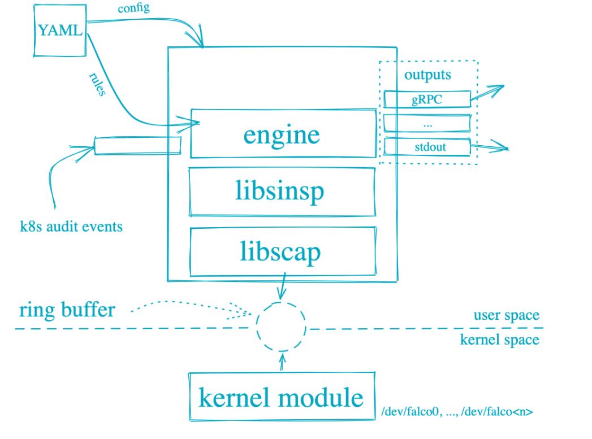
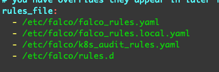

falco介绍、使用方法、规则编写以及自己的使用经验

<!-- more -->


## 介绍

Falco 是一款旨在检测应用中反常活动的行为监视器，由[Sysdig](https://github.com/draios/sysdig)的[系统调用捕获](https://sysdig.com/blog/fascinating-world-linux-system-calls/)基础设施驱动。您仅需为 Falco 撰写[一套规则](https://falco.org/docs/rules)，即可在一处持续监测并监控容器、应用、主机及网络的异常活动。


## Falco 的体系结构

Falco 可以发现和告警系统调用的任何行为。Falco告警触发方式可以是：特殊的系统调用、参数、调用进程的属性

Falco在用户空间和系统空间运行，系统调用由Falco的内核模块读取，然后使用用户空间的库来分析。当配置一个规则后，系统调用事件通过规则引擎过滤。可疑的事件通过Syslog、文件、标准输出等方式输出。




## Falco可检测那些行为

Falco 可以监测调用 [Linux 系统调用](http://man7.org/linux/man-pages/man2/syscalls.2.html)的行为，并根据其不同的调用、参数及调用进程的属性发出警告。例如，Falco 可轻松检测：

- 容器内运行的 Shell
- 服务器进程产生意外类型的子进程
- 敏感文件读取（如 `/etc/shadow`）
- 非设备文件写入至 `/dev`
- 系统的标准二进制文件（如 `ls`）产生出站流量


## 与其他工具对比

我们常常会被问到 Falco 与 [SELinux](https://en.wikipedia.org/wiki/Security-Enhanced_Linux)、[AppArmor](https://wiki.ubuntu.com/AppArmor)、[Auditd](https://linux.die.net/man/8/auditd) 或其他 Linux 安全策略工具有何不同。为此，我们在 [Sysdig 博客](https://sysdig.com/blog)上撰写了[一篇博文](https://sysdig.com/blog/selinux-seccomp-falco-technical-discussion/)，并详细对比了多款工具。


## 如何使用

Falco 应作为守护程序部署。您可将其作为一款 [deb](https://falco.org/docs/getting-started/installation#debian)/[rpm](https://falco.org/docs/getting-started/installation#centos-rhel) 软件包安装在主机或容器宿主上，亦或可以作为[容器](https://falco.org/docs/getting-started/running#docker)部署。当然，您也可以下载[源代码](https://falco.org/docs/getting-started/source)并自己动手编译安装。

您可通过[规则文件](https://falco.org/docs/rules)或[通用配置文件](https://falco.org/docs/configuration)定义 Falco 应监视的行为及事件。我们提供了一份示例规则文件 [`./rules/falco_rules.yaml`](https://github.com/falcosecurity/falco/blob/master/rules/falco_rules.yaml)，您可随意修改规则来适配您的工作环境。

当您撰写规则时，Falco 可读取由 Sysdig 产生的回溯文件。这一特性可让您在调整规则时“录制”有害行为，并无限次数地回放。

部署后，Falco 将利用 Sysdig 内核模块及用户空间函数库来监控规则文件定义中的任意事件。若异常事件发生，Falco 会将通知信息写入您所配置的输出中。


## 安装

**二进制安装**

```
# 下载
curl -L -O https://dl.bintray.com/falcosecurity/bin/x86_64/falco-0.26.2-x86_64.tar.gz

# 安装
tar -xvf falco-0.26.2-x86_64.tar.gz
cp -R falco-0.26.2-x86_64/* /

# 安装kernel headers
yum -y install kernel-devel-$(uname -r)

# 安装driver
## 使用/usr/bin/falco-driver-loader安装driver。机制都是优先尝试本地编译，失败则下载编译好的版本至~/.falco/。
falco-driver-loader module
falco-driver-loader bpf

#运行
falco
```


**helm安装**

```
#配置本地仓库
helm repo add falcosecurity https://falcosecurity.github.io/charts
#更新
helm repo update
#安装
helm install falco falcosecurity/falco
#卸载falco
helm uninstall falco
```


**容器安装**

```
docker run -it \
		--name falco \
    --privileged \
    -v /var/run/docker.sock:/host/var/run/docker.sock \
    -v /dev:/host/dev \
    -v /proc:/host/proc:ro \
    -v /boot:/host/boot:ro \
    -v /lib/modules:/host/lib/modules:ro \
    -v /usr:/host/usr:ro \
    -v /etc:/host/etc:ro \
    -v /etc/falco:/etc/falco \
    falcosecurity/falco:latest
    
    
#运行时指定日志输出位置
docker run --rm -it \
		--name falco \
    --privileged \
    -v /var/run/docker.sock:/host/var/run/docker.sock \
    -v /dev:/host/dev \
    -v /proc:/host/proc:ro \
    -v /boot:/host/boot:ro \
    -v /lib/modules:/host/lib/modules:ro \
    -v /usr:/host/usr:ro \
    -v /etc:/host/etc:ro \
    -v /etc/falco:/etc/falco \
    --log-driver syslog \
    --log-opt syslog-address=udp://172.16.42.17:555 \
    falcosecurity/falco:latest
```


**集群yaml安装**

```
apiVersion: apps/v1
kind: Deployment
metadata:
  name: falco-agent
  labels:
    app: falco-agent
spec:
  selector:
    matchLabels:
      app: falco-agent
  template:
    metadata:
      labels:
        app: falco-agent
    spec:
      restartPolicy: Always
      containers:
        - name: falco
          image: falcosecurity/falco:latest
          imagePullPolicy: IfNotPresent
          securityContext:
            privileged: true
          args: ["/usr/bin/falco", "--cri", "/host/run/containerd/containerd.sock"]
          volumeMounts:
            - mountPath: /host/var/run/docker.sock
              name: docker-socket
            - mountPath: /host/run/containerd/containerd.sock
              name: containerd-socket
            - mountPath: /host/dev
              name: dev-fs
            - mountPath: /host/proc
              name: proc-fs
              readOnly: true
            - mountPath: /host/boot
              name: boot-fs
              readOnly: true
            - mountPath: /host/lib/modules
              name: lib-modules
              readOnly: true
            - mountPath: /host/usr
              name: usr-fs
              readOnly: true
            - mountPath: /host/etc
              name: host-etc
      volumes:
        - name: docker-socket
          hostPath:
            path: /var/run/docker.sock
        - name: containerd-socket
          hostPath:
            path: /run/containerd/containerd.sock
        - name: dev-fs
          hostPath:
            path: /dev
        - name: proc-fs
          hostPath:
            path: /proc
        - name: boot-fs
          hostPath:
            path: /boot
        - name: lib-modules
          hostPath:
            path: /lib/modules
        - name: usr-fs
          hostPath:
            path: /usr
        - name: host-etc
          hostPath:
            path: /etc


```

参考：

https://falco.org/docs/


## 规则介绍

Falco规则文件是由三种基本元素的yaml文件


| 元素   | 描述                                                         |
| ------ | ------------------------------------------------------------ |
| Rules  | 生成告警的条件，一条规则的告警输出伴随着一段描述文字         |
| Macros | 在其他规则甚至是其他宏中使用的条件规则片段，宏提供了一种可以命名通用样式以及扫除冗余规则的方法 |
| Lists  | 列表可以包含规则、宏、其他列表。列表不能像规则或者宏一样作为过滤表达式 |


## 版本

随着时间发展，规则文件不再向后兼容。同样的，Sysdig新的库纳入可能引入规则过滤的新的字段、操作符等。我们给定的一组规则取决于Sysdig库的字段和操作符

从0.14.0开始，Falco的引擎版本和规则版本都支持显式的版本定义

**Falco 引擎版本：**

现在Falco可执行文件和Falco引擎C++对象支持返回版本号，这个初始版本是2，当我们更改规则文件格式或者增加新的操作符的时候就会增加版本号

**Falco规则格式版本号：**

规则文件包含一个Falco版本的顶级对象：`required_engine_version: N`。这个定义的意义是该规则文件适配的最低Falco引擎的版本号。如果不包含这项定义，则不进行版本检查。

如果规则文件的engine_version的版本远高于引擎版本，会加载配置文件并返回错误。


## 规则的键

Falco规则包含如下键。

| Key                      | Required | Description                                                  | Default |
| ------------------------ | -------- | ------------------------------------------------------------ | ------- |
| `rule`                   | yes      | 给规则一个简单统一的名称                                     |         |
| `condition`              | yes      | 对事件进行匹配的过滤表达式                                   |         |
| `desc`                   | yes      | 关于规则的更详细描述                                         |         |
| `output`                 | yes      | 输出的具体说明，遵循Sysdig的输出格式（ [output format syntax](http://www.sysdig.com/wiki/sysdig-user-guide/#output-formatting)） |         |
| `priority`               | yes      | 事件的严重程度（大小写不敏感）: `emergency`, `alert`, `critical`,<br/> `error`, `warning`, `notice`, `informational`, `debug`. |         |
| `exceptions`             | no       | 不告警的一组异常                                             |         |
| `enabled`                | no       | 如果设置为false,不会加载该规则也不匹配任何规则               | `true`  |
| `tags`                   | no       | 一组应用于规则的标签 (more on this [below](https://falco.org/docs/rules/#rule-condition-best-practices)). |         |
| `warn_evttypes`          | no       | 如果设置为false，将抑制没有事件类型的规则的告警              | `true`  |
| `skip-if-unknown-filter` | no       | 如果设置为true，如果一个规则文件包含Falco未知规则的规则，<br/>Falco会静默接受但是不执行。如果设置为false,Falco会输出错误 | `false` |


## 条件 Conditions：

Conditions是规则的关键部分，一个condition是一个Sysdig事件的Boolean断言，任何Sysdig过滤器适用于Falco condition(初开一些明确的排除项)。另外，Falco condition可以包含宏（这个能力是Sysdig不具备的）

如下是一个每当在容器中执行一个bash shell的的condition

```
container.id != host and proc.name = bash
```

`container.id != host`判断是否在一个容器中（如果事件发生在一个普通主机上，Sysdig事件的”container“字段将会等于"host"）

`proc.name = bash`检查进程名字是不是bash。请注意这个condition甚至不包含系统调用的子句。只检查远数据。由此。如果在容器中使用了bash shell，Falco会输出所有使用bash的系统调用。

**使用上诉condition完整规则如下：**

```yaml
- rule: shell_in_container
  desc: notice shell activity within a container
  condition: container.id != host and proc.name = bash
  output: shell in a container (user=%user.name container_id=%container.id container_name=%container.name shell=%proc.name parent=%proc.pname cmdline=%proc.cmdline)
  priority: WARNING
  
```


## 宏 Macros

如上所诉，宏提供了一种方法来定义规则的重复部分。非常简单的例子，如果我们有很多在容器中的规则，我们可以定义一个在容器中的宏。

```
- macro: in_container
  condition: container.id != host
```

使用这种宏定义，我们之前的规则就可以改为`in_container and proc.name = bash`

更多关于宏的规则可以见： [default macros](https://falco.org/docs/rules/default-macros) or the `rules/falco_rules.yaml`


## 列表 Lists

列表可以包含规则、宏、其他列表。列表不能像规则或者宏一样作为过滤表达式

| Key     | Description |
| ------- | ----------- |
| `list`  | list的名称  |
| `items` | list的值    |

如下例子：

```yaml
- list: shell_binaries
  items: [bash, csh, ksh, sh, tcsh, zsh, dash]

- list: userexec_binaries
  items: [sudo, su]

- list: known_binaries
  items: [shell_binaries, userexec_binaries]

- macro: safe_procs
  condition: proc.name in (known_binaries)
```


## 添加列表、规则、宏

如果你使用多个Falco文件，你可能想添加新的规则到已经存在的列表、规则、宏。

**对于list:**

新的文件需要添加一个同名的规则并添加`append: true`字段，当加载lists时候，会将新文件的值加入到原list的末尾。

**对于rules/macros:**

另外的文件里的规则会作为新的condition添加。


注意当添加lists, rules or macros时候的顺序问题，例如，添加一个已经存在的默认规则(e.g. `Terminal shell in container`)

必须确定自己配置的文件(e.g. `/etc/falco/rules.d/custom-rules.yaml`) 在默认文件(`/etc/falco/falco_rules.yaml`)之后加载。可以通过多个-r参数的正确顺序来确保规则文件的顺序。

**示例：**

下面所有的例子，都假定`falco -r /etc/falco/falco_rules.yaml -r /etc/falco/falco_rules.local.yaml`,或者有默认的rules_file入口falco.yaml，有默认的`/etc/falco/falco.yaml`作为第一个， `/etc/falco/falco_rules.local.yaml` 作为第二个。

- <u>添加list:</u>

  - /etc/falco/falco_rules.yaml：

    ```
    - list: my_programs
      items: [ls, cat, pwd]
    
    - rule: my_programs_opened_file
      desc: track whenever a set of programs opens a file
      condition: proc.name in (my_programs) and evt.type=open
      output: a tracked program opened a file (user=%user.name command=%proc.cmdline file=%fd.name)
      priority: INFO
    ```

  - /etc/falco/falco_rules.local.yaml

    ```
    - list: my_programs
      append: true
      items: [cp]
    ```

    

  上诉规则中。`ls`, `cat`, `pwd`, 或者 `cp` 打开一个文件都会触发


- <u>添加Macros:</u>

  - /etc/falco/falco_rules.yaml：

    ```yaml
    - macro: access_file
      condition: evt.type=open
    
    - rule: program_accesses_file
      desc: track whenever a set of programs opens a file
      condition: proc.name in (cat, ls) and (access_file)
      output: a tracked program opened a file (user=%user.name command=%proc.cmdline file=%fd.name)
      priority: INFO
    
    ```

  - /etc/falco/falco_rules.local.yaml:

    ```yaml
    - macro: access_file
      append: true
      condition: or evt.type=openat
    ```

   ls/cat 并且open/opnat都会触发


- <u>添加rules:</u>

  - /etc/falco/falco_rules.yaml：

    ```yaml
    - rule: program_accesses_file
      desc: track whenever a set of programs opens a file
      condition: proc.name in (cat, ls) and evt.type=open
      output: a tracked program opened a file (user=%user.name command=%proc.cmdline file=%fd.name)
      priority: INFO
    ```

  - /etc/falco/falco_rules.local.yaml:

    ```yaml
    - rule: program_accesses_file
      append: true
      condition: and not user.name=root
    ```

  `ls`/`cat` either used `open` on a file, but not if the user was root


**rule/macro添加规则并进行逻辑操作：**

记住当添加rule/macro的时候， rule/macro需要以简单的方式添加。不然容器产生歧义。比如如下例子：

```yaml
- rule: my_rule
  desc: ...
  condition: evt.type=open and proc.name=apache
  output: ...

- rule: my_rule
  append: true
  condition: or proc.name=nginx
```

上面的意思是允许apache打开文件或者允许nginx做任何事？

如上需要通过圆括号确定逻辑运算的范围。或者尽可能避免添加 condition。


## 不使用默认规则

尽管Falco提供很强大的默认规则，有时候在自己的场景中需要禁用默认规则。Falco提供多种方式


- **通过已有的宏：**

  大多数默认规则都提供`consider_*`宏作为规则condition的一部分。这些 `consider_*` 通常设置为 `(never_true)` or `(always_true)` 来决定是否使用规则。现在如果你想使用一个默认关闭的规则(e.g. `Unexpected outbound connection destination`),你只需要在自己的配置文件中重写 `consider_*` 宏就可以了(`consider_all_outbound_conns` in this case) 

  比如:

  ```yaml
  - macro: consider_all_outbound_conns
    condition: (always_true)
  ```

  

  <u>请记住：规则文件的顺序问题，后面定义的相同名字的宏为准。</u>


- **通过Falco参数：**

  Falco提供如下参数限制哪些默认规则执行

  ```
  -D <substring>                Disable any rules with names having the substring <substring>. Can be specified multiple times.
  
  -T <tag>                      Disable any rules with a tag=<tag>. Can be specified multiple times.
                                 Can not be specified with -t.
  
  -t <tag>                      Only run those rules with a tag=<tag>. Can be specified multiple times.
                                 Can not be specified with -T/-D.
                                 
  ```

  These parameters can also be specified as Helm chart value (`extraArgs`) if you are deploying Falco via the official Helm chart.


- **通过自定义规则文件：**

  最后但同样重要的，通过添加 append: true和enabled: false。适用于没有 `consider_*` 宏的情况。

  确保自定义规则文件在默认文件之后加载。

  例如不是用 `/etc/falco/falco_rules.yaml` 文件的 `User mgmt binaries` ，可以在自定义规则文件中写：

  ```yaml
  - rule: User mgmt binaries
    append: true
    enabled: false
  ```

  可能有bug，如果上诉配置不能成功，使用下面的：

  ```yaml
  - rule: User mgmt binaries
    condition: and (never_true)
    append: true
  ```


## 规则优先级

每一个Falco 规则都有一个优先级，用来表示严重程度，如下等级：

- `EMERGENCY`
- `ALERT`
- `CRITICAL`
- `ERROR`
- `WARNING`
- `NOTICE`
- `INFORMATIONAL`
- `DEBUG`

等级划分的指导规则如下：

- 如果与写文件有关，就是`ERROR`
- 如果是读取未授权读取事`WARNING`
- 如果是异常的行为(生成未知的shell,一个不正常的网络连接）`NOTICE`
- 如果是违反好的生产实践习惯（比如特权容器、敏感挂载目录、用root允许交互式命令）`INFO`

一个例外的规则就是"Run shell untrusted"，`DEBUG`.


## 规则标签 tag

0.6.0版本开始，规则有一个设置tag的选项，tag用来将关联的规则进行分类

例如：

```yaml
- rule: File Open by Privileged Container
  desc: Any open by a privileged container. Exceptions are made for known trusted images.
  condition: (open_read or open_write) and container and container.privileged=true and not trusted_containers
  output: File opened for read/write by privileged container (user=%user.name command=%proc.cmdline %container.info file=%fd.name)
  priority: WARNING
  tags: [container, cis]
  
```

这个示例中，"File Open by Privileged Container" 这个规则使用了一个tags "container" and "cis"。如果tags在规则中不存在或者为空，则表示没有tags 。

如下是如何使用tags：

- 使用-T <tag> 参数来禁用含有此tag的的规则，-T可以多次使用。例如，你可以跳过"filesystem"和 "cis" 标签的规则，你可以通过如下参数启动Falco。`falco -t filesystem -t cis ...` 。-T不能拼写为-t。

- 可以使用-t <tag>参数只使用含有此tag的规则，-t可以多次使用。例如，例如只使用含有"filesystem"和 "cis"标签，你可以使用如下参数启动falco`falco -t filesystem -t cis ....`-t不能指定为-T 或者 `-D <pattern>` (disable rules by rule name regex)

  

**当前可用的规则标签**

| Tag             | Description                              |
| --------------- | ---------------------------------------- |
| `filesystem`    | 与读写文件相关                           |
| `software_mgmt` | 与软件/包 管理工具相关例如rpm,dpkg,etc.  |
| `process`       | 与创建新的进程或者改变当前进程的状态相关 |
| `database`      | 数据库相关                               |
| `host`          | 仅适用于容器外                           |
| `shell`         | 与运行shell相关                          |
| `container`     | 仅适用于容器                             |
| `cis`           | 与cis docker基准相关                     |
| `users`         | 用户管理，改变进程身份相关               |
| `network`       | 与网络活动相关                           |

规则可以使用多个标签，已有的规则至少有一个标签。


## 规则条件最佳实践

允许按事件类型对规则进行分组，这提高了性能，Falco更喜欢制定至少一个`evt.type=`运算的规则条件。在条件开始，任何negative运算(i.e. `not` or `!=`)之前。如果一个条件没有任何 `evt.type=` 运算，Falco日志警告类似如下：

```
Rule no_evttype: warning (no-evttype):
proc.name=foo
     did not contain any evt.type restriction, meaning that it will run for all event types.
     This has a significant performance penalty. Consider adding an evt.type restriction if possible.
```

如果在规则条件的后半部分有 `evt.type` 运算，Falco日志警告类似如下：

```
Rule evttype_not_equals: warning (trailing-evttype):
evt.type!=execve
     does not have all evt.type restrictions at the beginning of the condition,
     or uses a negative match (i.e. "not"/"!=") for some evt.type restriction.
     This has a performance penalty, as the rule can not be limited to specific event types.
     Consider moving all evt.type restrictions to the beginning of the rule and/or
     replacing negative matches with positive matches if possible.
```


## 转义特殊字符

在一些情况下，规则可能包含有特殊的字符比如`(`,spaces, etc.例如，你可能需要寻找一个proc.name的(systemd)包括圆括号。

Falco,就像Sysdig,允许使用`"`来转义特殊字符例如：

```yaml
- rule: Any Open Activity by Systemd
  desc: Detects all open events by systemd.
  condition: evt.type=open and proc.name="(systemd)" or proc.name=systemd
  output: "File opened by systemd (user=%user.name command=%proc.cmdline file=%fd.name)"
  priority: WARNING
```

当含有lists时，通过在引号外面添加单引号来确保引号不会被yaml解析，

```yaml
- list: systemd_procs
  items: [systemd, '"(systemd)"']

- rule: Any Open Activity by Systemd
  desc: Detects all open events by systemd.
  condition: evt.type=open and proc.name in (systemd_procs)
  output: "File opened by systemd (user=%user.name command=%proc.cmdline file=%fd.name)"
  priority: WARNING
```


## 忽略系统调用

出于性能原因，当前在Falco处理某些进程之前就会被丢弃，如下是这些的列表。

```
access alarm brk capget clock_getres clock_gettime clock_nanosleep clock_settime close container cpu_hotplug drop epoll_create epoll_create1 epoll_ctl epoll_pwait epoll_wait eventfd eventfd2 exit_group fcntl fcntl64 fdatasync fgetxattr flistxattr fstat fstat64 fstatat64 fstatfs fstatfs64 fsync futex get_robust_list get_thread_area getcpu getcwd getdents getdents64 getegid geteuid getgid getgroups getitimer getpeername getpgid getpgrp getpid getppid getpriority getresgid getresuid getrlimit getrusage getsid getsockname getsockopt gettid gettimeofday getuid getxattr infra io_cancel io_destroy io_getevents io_setup io_submit ioprio_get ioprio_set k8s lgetxattr listxattr llistxattr llseek lseek lstat lstat64 madvise mesos mincore mlock mlockall mmap mmap2 mprotect mq_getsetattr mq_notify mq_timedreceive mq_timedsend mremap msgget msgrcv msgsnd munlock munlockall munmap nanosleep newfstatat newselect notification olduname page_fault pause poll ppoll pread pread64 preadv procinfo pselect6 pwrite pwrite64 pwritev read readv recv recvmmsg remap_file_pages rt_sigaction rt_sigpending rt_sigprocmask rt_sigsuspend rt_sigtimedwait sched_get_priority_max sched_get_priority_min sched_getaffinity sched_getparam sched_getscheduler sched_yield select semctl semget semop send sendfile sendfile64 sendmmsg setitimer setresgid setrlimit settimeofday sgetmask shutdown signaldeliver signalfd signalfd4 sigpending sigprocmask sigreturn splice stat stat64 statfs statfs64 switch sysdigevent tee time timer_create timer_delete timer_getoverrun timer_gettime timer_settime timerfd_create timerfd_gettime timerfd_settime times ugetrlimit umask uname ustat vmsplice wait4 waitid waitpid write writev

```

当启动的时候使用 -i 参数，Falco会打印忽略和存在的事件或系统调用。如果你想Falco处理所有事件，包括上述列表，则可以使用-A参数。


## 默认和本地规则文件

Falco 0.8.0版本开始，falco官方支持本地规则和默认规则文件的概念。这个在之前是使用多个-r参数来解决。在0.8.0,我们正式确定了这个规则，以方便更好的制定自己的规则。你总是可以通过更改 在`falco.yaml`中的`rules_file` 来修改默认规则文件。

 

默认规则文件总是首先被读取。跟着是本地规则文件。

当通过rpm/debian packages安装，两个规则文件，和falco配置文件，都被打上了"config" 标签文件。意味着如果修改了的话升级/卸载都不会修改这些文件。

**默认规则文件：**

默认规则文件安装在 `/etc/falco/falco_rules.yaml`。它包含一组预定义的一组规则，被用于在各种情况下提供良好的覆盖率。目的是不修改此文件，没一个新版本会替换该文件。

**本地规则文件：**

本地规则文件安装在`/etc/falco/falco_rules.local.yaml`,除了一些注释外是空的，这个文件的目的是添加/重写/修改主要的规则文件。它不会被任何新的软件版本替代。


## 默认宏

默认的规则中定义了一些宏，这让书写规则更加容易。这些宏为一些常见场景提供了快捷方式，并且可以用于任何自定义规则。在特殊场景下，用户也可以重写宏，提供的这些默认宏也可以加入本地规则中。

**打开文件并写入：**

```
- macro: open_write
  condition: (evt.type=open or evt.type=openat) and evt.is_open_write=true and fd.typechar='f' and fd.num>=0

```

**打开文件并读：**

```
- macro: open_read
  condition: (evt.type=open or evt.type=openat) and evt.is_open_read=true and fd.typechar='f' and fd.num>=0

```

**所有事件都过滤:**

```
- macro: never_true
  condition: (evt.num=0)
```

**所有事件都不过滤：**

```
- macro: always_true
  condition: (evt.num=>0)
```

**设置进程名：**

```
- macro: proc_name_exists
  condition: (proc.name!="<NA>")
```

**文件系统对象重命名：**

```
- macro: rename
  condition: evt.type in (rename, renameat)
```

**创建目录：**

```
- macro: mkdir
  condition: evt.type = mkdir
```

**文件系统对象删除：**

```
- macro: remove
  condition: evt.type in (rmdir, unlink, unlinkat)
```

**文件系统对象修改：**

```
- macro: modify
  condition: rename or remove
```

**派生新的进程：**

```
- macro: spawned_process
  condition: evt.type = execve and evt.dir=<
```

**一般的二进制文件目录：**

```
- macro: bin_dir
  condition: fd.directory in (/bin, /sbin, /usr/bin, /usr/sbin)
```

**启动了shell:**

```
- macro: shell_procs
  condition: (proc.name in (shell_binaries))
```

**敏感文件：**

```
- macro: sensitive_files
  condition: >
    fd.name startswith /etc and
    (fd.name in (sensitive_file_names)
     or fd.directory in (/etc/sudoers.d, /etc/pam.d))
```

**创建新的进程：**

```
- macro: proc_is_new
  condition: proc.duration <= 5000000000
```

**入站网络连接：**

```
- macro: inbound
  condition: >
    (((evt.type in (accept,listen) and evt.dir=<)) or
     (fd.typechar = 4 or fd.typechar = 6) and
     (fd.ip != "0.0.0.0" and fd.net != "127.0.0.0/8") and (evt.rawres >= 0 or evt.res = EINPROGRESS))
```

**出站网络连接：**

```
- macro: outbound  condition: >    (((evt.type = connect and evt.dir=<)) or     (fd.typechar = 4 or fd.typechar = 6) and     (fd.ip != "0.0.0.0" and fd.net != "127.0.0.0/8") and (evt.rawres >= 0 or evt.res = EINPROGRESS))
```

**出站或者入站网络连接：**

```
- macro: inbound_outbound  condition: >    (((evt.type in (accept,listen,connect) and evt.dir=<)) or     (fd.typechar = 4 or fd.typechar = 6) and     (fd.ip != "0.0.0.0" and fd.net != "127.0.0.0/8") and (evt.rawres >= 0 or evt.res = EINPROGRESS))
```

**在容器中：**

```
- macro: container  condition: container.id != host
```

**交互式进程产生：**

```
- macro: interactive  condition: >    ((proc.aname=sshd and proc.name != sshd) or    proc.name=systemd-logind or proc.name=login)
```


## 重写宏

上面的这些默认宏可以被重写

- **通常的ssh端口：**

  重写这个宏改为环境变量中的ssh端口

  ```
  - macro: ssh_port  condition: fd.sport=22
  ```

- **允许的主机连接：**

  重写此宏以允许特定的主机连接

  ```
  - macro: allowed_ssh_hosts  condition: ssh_port
  ```

- **白名单容器：**

  重写允许的白名单容器

  ```
  - macro: user_trusted_containers  condition: (container.image startswith sysdig/agent)
  ```

- **允许派生shell：**

  ```
  - macro: user_shell_container_exclusions  condition: (never_true)
  ```

- **允许与EC2元数据服务器通信的程序**

  ```
  - macro: ec2_metadata_containers  condition: container
  ```

- **kubernetes API Server**

  设置kubernetes API Server的IP

  ```
  - macro: k8s_api_server  condition: (fd.sip="1.2.3.4" and fd.sport=8080)
  ```

- **允许与Kubernetes API Server通信的容器**

  ```
  - macro: k8s_containers  condition: >    (container.image startswith gcr.io/google_containers/hyperkube-amd64 or    container.image startswith gcr.io/google_containers/kube2sky or    container.image startswith sysdig/agent or    container.image startswith sysdig/falco or    container.image startswith sysdig/sysdig)
  
  ```

- **允许Kubernetes Service NodePorts通信的容器**

  ```
  - macro: nodeport_containers  condition: container
  ```

  


## fd.sip.name

这部分讲解怎样使用fd.sip.name字段，和相关的fd.{clr}ip.name字段，例如。

```yaml
- list: https_miner_domains
  items: [
    "ca.minexmr.com",
    "cn.stratum.slushpool.com",
    "de.minexmr.com",
    "fr.minexmr.com",
    "mine.moneropool.com",
    "mine.xmrpool.net",
    "pool.minexmr.com",
    "sg.minexmr.com",
    "stratum-eth.antpool.com",
    "stratum-ltc.antpool.com",
    "stratum-zec.antpool.com",
    "stratum.antpool.com",
    "xmr.crypto-pool.fr"
  ]

# Add rule based on crypto mining IOCs
- macro: minerpool_https
  condition: (fd.sport="443" and fd.sip.name in (https_miner_domains))
```

这个 fd.sip.name字段和相关的 fd.{clr}ip.name字段，与falco的规则有所不同，


**首先解析域名，然后匹配IP：**

当一个规则包含一个字段`fd.*ip.name`，比较的域名中，在右侧域名保存在falco引擎的内部 (The `foo.com` in `=foo.com or in (foo.com, bar.com)`)。引擎立即查找这些域名的A记录并内部保存这些IP。这种行为可以防止在系统调用时停止执行，来做耗时的DNS查询。

之后，当一个系统调用事件根过滤器匹配的时候，系统调用事件的实际ip（服务端ip是`fd.sip.name`,客户端ip是`fd.cip.name`，等等）会与之前DNS查询的一组进行对比，实际的IP与解析的IP进行比较。基于比较的运算（=/!=/in, perhaps with a preceding not, etc）得到一个true/false的结果。

这里有个例子，如果一个规则包含一个断言， `evt.type=connect and fd.sip.name=yahoo.com`，当规则加载的时候，引擎解析域名`yahoo.com`到一个ip集(say 1.2.3.4, 1.2.3.5, 1.2.3.6)。之后，如果一个网络连接事实产生(say to 1.2.3.5)，引擎会拿着这个ip和之前存储的ip集做比较，发现1.2.3.5属于yahoo.com的ip集，规则片段解析为true。

右边的断言可以是`in`，例如 `fd.sip.name in (yahoo.com, foo.com)`。在这种情况中，会解析并保留两个域名的规则集，之后的系统调用获取的ip会与两组域名的 ip集进行比较。


**Falco引擎如何刷新Domain/IP的映射**

域名的查询实际是在另一进程中，避免主系统调用持续暂停。另外的，实际上这一组ip是以下规则持续更新的，

- 域名十秒刷新一次
- 如果在刷新之后没有改变，域名刷新超时变成两倍直到320秒（约5分钟）


**与fd.*ip.name字段有关的告警**

当编写Falco规则的时候，需要注意与 `fd.*ip.name` 关联的告警。

右边必须是一个可解析的域名：

右边的断言（the `foo.com` part of `fd.sip.name=foo.com`)，在规则加载的时候进行DNS查询，它必须是一个可解析的域名，因此，它不可能使用域名的子字符串进行运算，比如e.g. `fd.sip.name contains company.com`.，因此，falco engine必须返回一个准确结果。


**在输出中使用fd.*ip.name字段**

这个字段 `fd.*ip.name` 在输出中使用，但是只有在事件中的ip与ip集中的ip匹配的时候才有用。例如，接下来的规则会显示有意义的输出， `...IP=%fd.sip.name`，

```
- rule: Connect to Yahoo
  desc: Detect Connects to yahoo.com IPs
  condition: evt.type=connect and fd.sip.name=yahoo.com
  output: Some connect to yahoo (command=%proc.cmdline connection=%fd.name IP=%fd.sip.name)
  priority: INFO
```


```
- rule: Connect to Anything but Yahoo
  desc: Detect Connects to anything other than yahoo.com IPs
  condition: evt.type=connect and fd.sip.name!=yahoo.com
  output: Some connect to something other than yahoo (command=%proc.cmdline connection=%fd.name IP=%fd.sip.name)
  priority: INFO
  
```

如上规则，如果连接1.5.6.7。 IPs 1.2.3.4/1.2.3.5/1.2.3.6。就会生成告警。


**有限的比较运算符**

虽然falco支持各种运算符，但是fd.*ip.name只支持 =/!=/in。


## 例外的规则

Starting in 0.28.0，可添加 `exceptions`到规则里面。

例如

```yaml
- rule: Write below binary dir
  desc: an attempt to write to any file below a set of binary directories
  condition: >
    bin_dir and evt.dir = < and open_write
    and not package_mgmt_procs
    and not exe_running_docker_save
    and not python_running_get_pip
    and not python_running_ms_oms
    and not user_known_write_below_binary_dir_activities
  exceptions:
   - name: proc_writer
     fields: [proc.name, fd.directory]
     comps: [=, =]
     values:
       - [my-custom-yum, /usr/bin]
       - [my-custom-apt, /usr/local/bin]
   - name: cmdline_writer
     fields: [proc.cmdline, fd.directory]
     comps: [startswith, =]
   - name: container_writer
     fields: [container.image.repository, fd.directory]
   - name: proc_filenames
     fields: [proc.name, fd.name]
     comps: [=, in]
     values:
       - [my-custom-dpkg, [/usr/bin, /bin]]
   - name: filenames
     fields: fd.filename
     comps: in

```

这条规则定义了四条的例外。

- proc_writer: uses a combination of proc.name and fd.directory
- cmdline_writer： uses a combination of proc.cmeline and fd.directory
- container_writer: uses a combination of container.image.repository and fd.directory
- proc_filenames: uses a combination of process and list of filenames.
- filenames: uses a list of filenames

这些字符串"proc_writer"/"container_writer"/"proc_filenames"/"filenames" 。


## 自己编写的规则


```
- macro: consider_all_outbound_conns
  condition: (always_true)


- macro: consider_all_inbound_conns
  condition: (always_true)

- rule: open_file
  desc: open file
  condition: >
    open_write or open_read
  output: >
    event create (user=%user.name user_loginuid=%user.loginuid program=%proc.name
    command=%proc.cmdline parent=%proc.pname gparent=%proc.aname[2] ggparent=%proc.aname[3] container_id=%container.id image=%container.image.repository)
  priority: INFO
  tags: [file]

- rule: event_create
  desc: create event
  condition: >
    evt.type = open or evt.type = openat
  output: >
    event create (user=%user.name user_loginuid=%user.loginuid proc_id=%proc.pid program=%proc.name command=%proc.cmdline gproc_id=%proc.ppid parent=%proc.pname gparent=%proc.aname[2] ggparent=%proc.aname[3] container_id=%container.id image=%container.image.repository)
  priority: INFO
  tags: [event]

```


```
- list: sensitive_for_cat
  items: [/etc/shadow, /etc/passwd, /etc/sudoers, /etc/pam.conf, /etc/security/pwquality.conf]


- rule: cat sensitive_file
  desc: cat sensitive file
  condition: open_read and (fd.name in (sensitive_for_cat)) and proc.name="cat"
  output: >
    hacker recon (user=%user.name user_loginuid=%user.loginuid
    command=%proc.cmdline program=%proc.name parent=%proc.pname file=%fd.name gparent=%proc.aname[2] container_id=%container.id image=%container.image.repository)
  priority: WARNING
  tags: [filesystem]


- rule: hacker_recon
  desc: hacker_recon
  condition: >
    proc.name = "fdisk" 
    or (proc.args="/proc/1/cgroup") 
    or (proc.args="/proc/self/mounts") 
    or (proc.args="/var/run/secrets/kubernetes.io/serviceaccount/token")
    or (proc.args contains "Authorization: Bearer")
    or (proc.cmdline contains "kubectl proxy")
  output: >
    hacker recon (user=%user.name user_loginuid=%user.loginuid
    command=%proc.cmdline program=%proc.name args=%proc.args parent=%proc.pname file=%fd.name gparent=%proc.aname[2] container_id=%container.id image=%container.image.repository)
  priority: INFO


- list: shell_binaries
  append: true
  items: [python]

```

