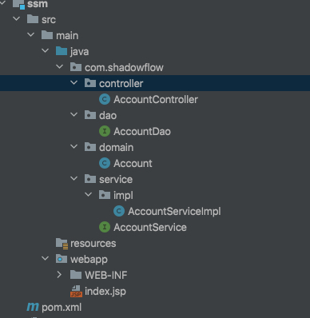

使用Spring来整合SpringMVC和MyBatis，测试项目已传到[github](https://github.com/ShadowFl0w/JavaDemo/tree/main/ssm)

<!-- more -->


## 1. 介绍

使用Spring来整合SpringMVC和MyBatis


我们使用配置文件+注解的方式


## 2. 开发环境

### 2.1 数据库

在远程linux机器上创建mysql的docker环境

```
docker run -itd --name my-mysql -p 3306:3306 -e MYSQL_ROOT_PASSWORD=123456 mysql:8.0.15

docker exec -it my-mysql bash

mysql -uroot -p123456

#开启远程访问
use mysql;
ALTER USER 'root'@'%' IDENTIFIED WITH mysql_native_password BY '123456';
flush privileges;
```


创建数据库

```sql
create database ssm;
use ssm;
create table account(
	id int primary key auto_increment,
    name varchar(20),
    money double 
);
```

连接数据库，在account表中加入几条数据

 


### 2.2 依赖

版本锁定

```xml
	<spring.version>5.0.2.RELEASE</spring.version>
    <slf4j.version>1.6.6</slf4j.version>
    <log4j.version>1.2.12</log4j.version>
    <mysql.version>8.0.15</mysql.version>
    <mybatis.version>3.4.5</mybatis.version>
```

依赖

```xml
	<dependency>
      <groupId>junit</groupId>
      <artifactId>junit</artifactId>
      <version>4.11</version>
      <scope>test</scope>
    </dependency>
    <dependency>
      <groupId>org.aspectj</groupId>
      <artifactId>aspectjweaver</artifactId>
      <version>1.6.8</version>
    </dependency>
    <dependency>
      <groupId>org.springframework</groupId>
      <artifactId>spring-aop</artifactId>
      <version>${spring.version}</version>
    </dependency>
    <dependency>
      <groupId>org.springframework</groupId>
      <artifactId>spring-context</artifactId>
      <version>${spring.version}</version>
    </dependency>
    <dependency>
      <groupId>org.springframework</groupId>
      <artifactId>spring-web</artifactId>
      <version>${spring.version}</version>
    </dependency>
    <dependency>
      <groupId>org.springframework</groupId>
      <artifactId>spring-webmvc</artifactId>
      <version>${spring.version}</version>
    </dependency>
    <dependency>
      <groupId>org.springframework</groupId>
      <artifactId>spring-test</artifactId>
      <version>${spring.version}</version>
    </dependency>
    <dependency>
      <groupId>org.springframework</groupId>
      <artifactId>spring-tx</artifactId>
      <version>${spring.version}</version>
    </dependency>
    <dependency>
      <groupId>org.springframework</groupId>
      <artifactId>spring-jdbc</artifactId>
      <version>${spring.version}</version>
    </dependency>
    <dependency>
      <groupId>mysql</groupId>
      <artifactId>mysql-connector-java</artifactId>
      <version>${mysql.version}</version>
    </dependency>
    <dependency>
      <groupId>javax.servlet</groupId>
      <artifactId>servlet-api</artifactId>
      <version>2.5</version>
      <scope>provided</scope>
    </dependency>
    <dependency>
      <groupId>javax.servlet.jsp</groupId>
      <artifactId>jsp-api</artifactId>
      <version>2.0</version>
      <scope>provided</scope>
    </dependency>
    <dependency>
      <groupId>jstl</groupId>
      <artifactId>jstl</artifactId>
      <version>1.2</version>
    </dependency>
    <!-- log start -->
    <dependency>
      <groupId>log4j</groupId>
      <artifactId>log4j</artifactId>
      <version>${log4j.version}</version>
    </dependency>
    <dependency>
      <groupId>org.slf4j</groupId>
      <artifactId>slf4j-api</artifactId>
      <version>${slf4j.version}</version>
    </dependency>
    <dependency>
      <groupId>org.slf4j</groupId>
      <artifactId>slf4j-log4j12</artifactId>
      <version>${slf4j.version}</version>
    </dependency>
    <!-- log end -->
    <dependency>
      <groupId>org.mybatis</groupId>
      <artifactId>mybatis</artifactId>
      <version>${mybatis.version}</version>
    </dependency>
    <dependency>
      <groupId>org.mybatis</groupId>
      <artifactId>mybatis-spring</artifactId>
      <version>1.3.0</version>
    </dependency>
    <dependency>
      <groupId>c3p0</groupId>
      <artifactId>c3p0</artifactId>
      <version>0.9.1.2</version>
      <type>jar</type>
      <scope>compile</scope>
    </dependency>
```


## 3. 代码结构

代码结构如下

 

### 3.1 java bean

```java
package com.shadowflow.domain;

import java.io.Serializable;

public class Account implements Serializable {
    private Integer id;
    private String name;
    private Double money;

    public Integer getId() {
        return id;
    }

    public void setId(Integer id) {
        this.id = id;
    }

    public String getName() {
        return name;
    }

    public void setName(String name) {
        this.name = name;
    }

    public Double getMoney() {
        return money;
    }

    public void setMoney(Double money) {
        this.money = money;
    }

    @Override
    public String toString() {
        return "Account{" +
                "id=" + id +
                ", name='" + name + '\'' +
                ", money=" + money +
                '}';
    }
}

```


### 3.2 dao层

接口

```java
package com.shadowflow.dao;

import com.shadowflow.domain.Account;

import java.util.List;

public interface AccountDao {
    //查询所有账户
    public List<Account> findAll();
    //保存所有账户信息
    public void saveAccount(Account account);

}

```


### 3.3 业务层

接口

```java
package com.shadowflow.service;

import com.shadowflow.domain.Account;

import java.util.List;

public interface AccountService {
    //查询所有账户
    public List<Account> findAll();
    //保存所有账户信息
    public void saveAccount(Account account);
}

```

实现类

```java
package com.shadowflow.service.impl;

import com.shadowflow.domain.Account;
import com.shadowflow.service.AccountService;

import java.util.List;

public class AccountServiceImpl implements AccountService {
    @Override
    public List<Account> findAll() {
        System.out.println("业务层:查询所有账户...");
        return null;
    }

    @Override
    public void saveAccount(Account account) {
        System.out.println("业务层：保存账户...");

    }
}

```


### 3.4 web层(视图层)

```
package com.shadowflow.controller;

/**
 * 账户web
 */
public class AccountController {
}

```


## 4. Spring框架

### 4.1 Spring配置文件

在resources下生成applicationContext.xml的Spring配置文件


添加自动生成的约束为如下，并且开始注解扫描。

```xml
<?xml version="1.0" encoding="UTF-8"?>
<beans xmlns="http://www.springframework.org/schema/beans"
       xmlns:context="http://www.springframework.org/schema/context"
       xmlns:xsi="http://www.w3.org/2001/XMLSchema-instance"
       xmlns:aop="http://www.springframework.org/schema/aop"
       xmlns:tx="http://www.springframework.org/schema/tx"
       xsi:schemaLocation="
        http://www.springframework.org/schema/beans
        http://www.springframework.org/schema/beans/spring-beans.xsd
        http://www.springframework.org/schema/context
        http://www.springframework.org/schema/context/spring-context.xsd
        http://www.springframework.org/schema/aop
        http://www.springframework.org/schema/aop/spring-context.xsd
        http://www.springframework.org/schema/tx
        http://www.springframework.org/schema/tx/spring-tx.xsd">

    <!-- 开启注解扫描，希望处理service和dao,controller不需要spring框架处理-->
    <context:component-scan base-package="com.shadowflow">
        <!-- 配置controller注解不扫描 -->
        <context:exclude-filter type="annotation" expression="org.springframework.stereotype.Controller"/>
    </context:component-scan>
</beans>
```

给service的实现类添加spring注解

```java
package com.shadowflow.service.impl;

import com.shadowflow.domain.Account;
import com.shadowflow.service.AccountService;
import org.springframework.stereotype.Service;

import java.util.List;

@Service("accountService")
public class AccountServiceImpl implements AccountService {
    @Override
    public List<Account> findAll() {
        System.out.println("业务层:查询所有账户...");
        return null;
    }

    @Override
    public void saveAccount(Account account) {
        System.out.println("业务层：保存账户...");

    }
}

```


### 4.2 测试spring

修改junit的pom配置文件

```
<scope>test</scope>
改为
<scope>compile</scope>
```

test类代码

```java
package com.shadowflow.test;

import com.shadowflow.service.AccountService;
import javafx.application.Application;
import org.junit.Test;
import org.springframework.context.ApplicationContext;
import org.springframework.context.support.ClassPathXmlApplicationContext;

public class TestSpring {
    @Test
    public void run1(){
        //加载配置文件
        ApplicationContext ac = new ClassPathXmlApplicationContext("classpath:applicationContext.xml");
        //获取对象
        AccountService as = (AccountService) ac.getBean("accountService");
        //调用方法
        as.findAll();

    }
}

```

运行提示log4j配置文件

```
log4j:WARN No appenders could be found for logger (org.springframework.core.env.StandardEnvironment).
log4j:WARN Please initialize the log4j system properly.
业务层:查询所有账户...
```

在resources目录下新建log4j.properties

```
# Set root category priority to INFO and its only appender to CONSOLE.
#log4j.rootCategory=INFO, CONSOLE            debug   info   warn error fatal
log4j.rootCategory=info, CONSOLE, LOGFILE

# Set the enterprise logger category to FATAL and its only appender to CONSOLE.
log4j.logger.org.apache.axis.enterprise=FATAL, CONSOLE

# CONSOLE is set to be a ConsoleAppender using a PatternLayout.
log4j.appender.CONSOLE=org.apache.log4j.ConsoleAppender
log4j.appender.CONSOLE.layout=org.apache.log4j.PatternLayout
log4j.appender.CONSOLE.layout.ConversionPattern=%d{ISO8601} %-6r [%15.15t] %-5p %30.30c %x - %m\n

# LOGFILE is set to be a File appender using a PatternLayout.
log4j.appender.LOGFILE=org.apache.log4j.FileAppender
log4j.appender.LOGFILE.File=/tmp/axis.log
log4j.appender.LOGFILE.Append=true
log4j.appender.LOGFILE.layout=org.apache.log4j.PatternLayout
log4j.appender.LOGFILE.layout.ConversionPattern=%d{ISO8601} %-6r [%15.15t] %-5p %30.30c %x - %m\n

```

再次查询无报错


## 5. SpringMVC框架

### 5.1 配置前端控制器

在web.xml配置前端控制器

```xml
<!DOCTYPE web-app PUBLIC
 "-//Sun Microsystems, Inc.//DTD Web Application 2.3//EN"
 "http://java.sun.com/dtd/web-app_2_3.dtd" >

<web-app>
  <display-name>Archetype Created Web Application</display-name>
  <!-- 配置前端控制器-->
  <servlet>
    <servlet-name>dispatcherServlet</servlet-name>
    <servlet-class>org.springframework.web.servlet.DispatcherServlet</servlet-class>
    <!--加载springmvc.xml配置文件-->
    <init-param>
      <param-name>contextConfigLocation</param-name>
      <param-value>classpath:springmvc.xml</param-value>
    </init-param>
    <!--启动服务器创建该servlet-->
    <load-on-startup>1</load-on-startup>
  </servlet>
  <servlet-mapping>
    <servlet-name>dispatcherServlet</servlet-name>
    <url-pattern>/</url-pattern>
  </servlet-mapping>

  <!--解决中文乱码过滤器-->
  <filter>
    <filter-name>characterEncodingFilter</filter-name>
    <filter-class>org.springframework.web.filter.CharacterEncodingFilter</filter-class>
    <init-param>
      <param-name>encoding</param-name>
      <param-value>UTF-8</param-value>
    </init-param>
  </filter>
  <filter-mapping>
    <filter-name>characterEncodingFilter</filter-name>
    <url-pattern>/*</url-pattern>
  </filter-mapping>
</web-app>

```

### 5.2 SpingMVC配置

在resources目录下添加springmvc.xml，补全约束

```xml
<?xml version="1.0" encoding="UTF-8"?>
<beans xmlns="http://www.springframework.org/schema/beans"
       xmlns:mvc="http://www.springframework.org/schema/mvc"
       xmlns:context="http://www.springframework.org/schema/context"
       xmlns:xsi="http://www.w3.org/2001/XMLSchema-instance"
       xsi:schemaLocation="
        http://www.springframework.org/schema/beans
        http://www.springframework.org/schema/beans/spring-beans.xsd
        http://www.springframework.org/schema/mvc
        http://www.springframework.org/schema/mvc/spring-mvc.xsd
        http://www.springframework.org/schema/context
        http://www.springframework.org/schema/context/spring-context.xsd">
</beans>
```

配置springmvc.xml

```xml
<?xml version="1.0" encoding="UTF-8"?>
<beans xmlns="http://www.springframework.org/schema/beans"
       xmlns:mvc="http://www.springframework.org/schema/mvc"
       xmlns:context="http://www.springframework.org/schema/context"
       xmlns:xsi="http://www.w3.org/2001/XMLSchema-instance"
       xsi:schemaLocation="
        http://www.springframework.org/schema/beans
        http://www.springframework.org/schema/beans/spring-beans.xsd
        http://www.springframework.org/schema/mvc
        http://www.springframework.org/schema/mvc/spring-mvc.xsd
        http://www.springframework.org/schema/context
        http://www.springframework.org/schema/context/spring-context.xsd">

    <!-- 开启注解扫描, 只扫描Controller注解-->
    <context:component-scan base-package="com.shadowflow">
        <context:include-filter type="annotation" expression="org.springframework.stereotype.Controller"/>
    </context:component-scan>

    <!--配置视图解析器对象-->
    <bean id="internalResourceViewResolver" class="org.springframework.web.servlet.view.InternalResourceViewResolver">
        <property name="prefix" value="/WEB-INF/pages/"/>
        <property name="suffix" value=".jsp"/>
    </bean>

    <!--过滤静态资源-->
    <mvc:resources mapping="/css/" location="/css/**" />
    <mvc:resources mapping="/images/" location="/images/**" />
    <mvc:resources mapping="/js/" location="/js/**" />

    <!--开启SpringMVC注解的支持-->
    <mvc:annotation-driven/>
</beans>
```

删除index.jsp重新生成（默认的配置不全，没有编码信息等），并添加超链接

```jsp
<%@ page contentType="text/html;charset=UTF-8" language="java" %>
<html>
<head>
    <title>Title</title>
</head>
<body>
    <a href="account/findALL">测试</a>
</body>
</html>
```

在controller包下修改AccountController类的代码，添加`account/findALL`路由，并且返回list页面。

```java
package com.shadowflow.controller;

import org.springframework.stereotype.Controller;
import org.springframework.web.bind.annotation.RequestMapping;

/**
 * 账户web
 */
@Controller
@RequestMapping("/account")
public class AccountController {
    @RequestMapping("findALL")
    public String findALL(){
        System.out.println("表现层：查询所有账户...");
        return "list";
    }
}

```

在webapp/WEB-INF/pages目录下添加list.jsp

```jsp
<%@ page contentType="text/html;charset=UTF-8" language="java" %>
<html>
<head>
    <title>Title</title>
</head>
<body>
  <h3>查询所有的账户</h3>

</body>
</html>
```


### 5.3 测试

添加一个测试springmvc的服务


运行后

 

点击测试

 

后台运行结果

 

说明springmvc正常运行


## 6. Spring整合SpringMVC


### 6.1 配置Spring的监听器

web.xml中添加如下配置，使其加载spring的配置文件

```xml
  <!--配置Spring的监听器，默认只加载WEB-INF目录下的applicationContext.xml配置文件-->
  <listener>
    <listener-class>org.springframework.web.context.ContextLoaderListener</listener-class>
  </listener>
  <!--设置配置文件的路径-->
  <context-param>
    <param-name>contextConfigLocation</param-name>
    <param-value>classpath:applicationContext.xml</param-value>
  </context-param>
```


### 6.2 Spring依赖注入

添加`@Autowired`注解，在controller中自动注入service对象，从而实现没有创建对象在controller里调用service里的`findAll()`方法

```java
package com.shadowflow.controller;

import com.shadowflow.service.AccountService;
import org.springframework.beans.factory.annotation.Autowired;
import org.springframework.stereotype.Controller;
import org.springframework.web.bind.annotation.RequestMapping;

/**
 * 账户web
 */
@Controller
@RequestMapping("/account")
public class AccountController {

    @Autowired
    private AccountService accountService;

    @RequestMapping("findALL")
    public String findALL(){
        System.out.println("表现层：查询所有账户...");
        accountService.findAll();
        return "list";
    }
}

```

### 6.3 部署测试

当我们重写部署点击测试的时候，后台运行结果如下

 

可以发现，这时候成功运行了业务层的代码。


## 7. Spring整合Mybatis

### 7.1 Mybatis环境测试

使用mybatis注解的方式给AccountDao添加sql语句

```java
import com.shadowflow.domain.Account;
import org.apache.ibatis.annotations.Insert;
import org.apache.ibatis.annotations.Select;

import java.util.List;

public interface AccountDao {
    //查询所有账户
    @Select("select * from account")
    public List<Account> findAll();

    //保存所有账户信息
    @Insert("insert into account (name, money) values (#{name},#{money})")
    public void saveAccount(Account account);

}
```

在resources目录下创建SqlMapConfig.xml，给Mybatis添加配置

```xml
<?xml version="1.0" encoding="UTF-8"?>
<!DOCTYPE configuration
        PUBLIC "-//mybatis.org//DTD Config 3.0//EN"
        "http://mybatis.org/dtd/mybatis-3-config.dtd">
<configuration>
    <!--配置环境-->
    <environments default="mysql">
        <environment id="mysql">
            <transactionManager type="JDBC"/>
            <dataSource type="POOLED">
                <property name="driver" value="com.mysql.cj.jdbc.Driver"/>
                <property name="url" value="jdbc:mysql://172.16.42.150:3306/ssm"/>
                <property name="username" value="root"/>
                <property name="password" value="123456"/>
            </dataSource>
        </environment>
    </environments>

    <!--引入映射配置文件-->
    <mappers>
<!--        <mapper class="com.shadowflow.dao.AccountDao"/>-->
        <package name="com.shadowflow.dao"/>
    </mappers>
</configuration>
```

编写测试方法

```java
package com.shadowflow.test;

import com.shadowflow.dao.AccountDao;
import com.shadowflow.domain.Account;
import org.apache.ibatis.io.Resources;
import org.apache.ibatis.session.SqlSession;
import org.apache.ibatis.session.SqlSessionFactory;
import org.apache.ibatis.session.SqlSessionFactoryBuilder;
import org.junit.Test;

import java.io.IOException;
import java.io.InputStream;
import java.util.List;


public class TestMybatis {

    @Test
    public void run1() throws IOException {
        //加载配置文件
        InputStream in = Resources.getResourceAsStream("SqlMapConfig.xml");
        //创建SqlSessionFactory对象
        SqlSessionFactory factory = new SqlSessionFactoryBuilder().build(in);
        //创建SqlSession对象
        SqlSession session = factory.openSession();
        //获取代理对象
        AccountDao dao = session.getMapper(AccountDao.class);
        //查询所有数据
        List<Account> list = dao.findAll();
        for(Account account : list){
            System.out.println(account);
        }
        //关闭资源
        session.close();
        in.close();

    }
}

```

运行结果：

 

表示Mybatis配置完成

顺便测试一下保存方法

```java
package com.shadowflow.test;

import com.shadowflow.dao.AccountDao;
import com.shadowflow.domain.Account;
import org.apache.ibatis.io.Resources;
import org.apache.ibatis.session.SqlSession;
import org.apache.ibatis.session.SqlSessionFactory;
import org.apache.ibatis.session.SqlSessionFactoryBuilder;
import org.junit.Test;

import java.io.IOException;
import java.io.InputStream;
import java.util.List;


public class TestMybatis {
    /**测试查询
     *
     * @throws IOException
     */
    @Test
    public void run1() throws IOException {
        ...
    }

    /**
     * 测试保存
     */
    @Test
    public void run2() throws IOException {
        Account account = new Account();
        account.setName("test2");
        account.setMoney(3000d);
        //加载配置文件
        InputStream in = Resources.getResourceAsStream("SqlMapConfig.xml");
        //创建SqlSessionFactory对象
        SqlSessionFactory factory = new SqlSessionFactoryBuilder().build(in);
        //创建SqlSession对象
        SqlSession session = factory.openSession();
        //获取代理对象
        AccountDao dao = session.getMapper(AccountDao.class);
        //保存
        dao.saveAccount(account);
        //提交事务
        session.commit();

        session.close();
        in.close();
    }
}

```


### 7.8 Mybatis代理对象存入IOC容器

在Spring配置文件中配Mybatis，在applicationContext.xml加入如下Mybatis配置

```xml
    <!--spring整合Mybatis框架-->
    <!--配置连接池-->
    <bean id="dataSource" class="com.mchange.v2.c3p0.ComboPooledDataSource">
        <property name="driverClass" value="com.mysql.cj.jdbc.Driver"/>
        <property name="jdbcUrl" value="jdbc:mysql://172.16.42.150:3306/ssm"/>
        <property name="user" value="root"/>
        <property name="password" value="123456"/>
    </bean>

    <!--配置SqlSessionFactory工厂-->
    <bean id="sqlSessionFactory" class="org.mybatis.spring.SqlSessionFactoryBean">
        <property name="dataSource" ref="dataSource"/>
    </bean>

    <!--配置AccountDao接口所在包-->
    <bean id="mapperScanner" class="org.mybatis.spring.mapper.MapperScannerConfigurer">
        <property name="basePackage" value="com.shadowflow.dao"/>
    </bean>
```


整个文件如下

```xml
<?xml version="1.0" encoding="UTF-8"?>
<beans xmlns="http://www.springframework.org/schema/beans"
       xmlns:context="http://www.springframework.org/schema/context"
       xmlns:xsi="http://www.w3.org/2001/XMLSchema-instance"
       xmlns:aop="http://www.springframework.org/schema/aop"
       xmlns:tx="http://www.springframework.org/schema/tx"
       xsi:schemaLocation="
        http://www.springframework.org/schema/beans
        http://www.springframework.org/schema/beans/spring-beans.xsd
        http://www.springframework.org/schema/context
        http://www.springframework.org/schema/context/spring-context.xsd
        http://www.springframework.org/schema/aop
        http://www.springframework.org/schema/aop/spring-context.xsd
        http://www.springframework.org/schema/tx
        http://www.springframework.org/schema/tx/spring-tx.xsd">

    <!-- 开启注解扫描，希望处理service和dao,controller不需要spring框架处理-->
    <context:component-scan base-package="com.shadowflow">
        <!-- 配置那些注解不扫描 -->
        <context:exclude-filter type="annotation" expression="org.springframework.stereotype.Controller"/>
    </context:component-scan>

    <!--spring整合Mybatis框架-->
    <!--配置连接池-->
    <bean id="dataSource" class="com.mchange.v2.c3p0.ComboPooledDataSource">
        <property name="driverClass" value="com.mysql.cj.jdbc.Driver"/>
        <property name="jdbcUrl" value="jdbc:mysql://172.16.42.150:3306/ssm"/>
        <property name="user" value="root"/>
        <property name="password" value="123456"/>
    </bean>

    <!--配置SqlSessionFactory工厂-->
    <bean id="sqlSessionFactory" class="org.mybatis.spring.SqlSessionFactoryBean">
        <property name="dataSource" ref="dataSource"/>
    </bean>

    <!--配置AccountDao接口所在包-->
    <bean id="mapperScanner" class="org.mybatis.spring.mapper.MapperScannerConfigurer">
        <property name="basePackage" value="com.shadowflow.dao"/>
    </bean>

</beans>
```

有了上面的配置就可以删除SqlMapConfig.xml了

接下来需要给AccountDao添加`@Repository`注解，表示交给Spring容器来管理

```java
package com.shadowflow.dao;

import com.shadowflow.domain.Account;
import org.apache.ibatis.annotations.Insert;
import org.apache.ibatis.annotations.Select;
import org.springframework.stereotype.Repository;

import java.util.List;

@Repository
public interface AccountDao {
    //查询所有账户
    @Select("select * from account")
    public List<Account> findAll();

    //保存所有账户信息
    @Insert("insert into account (name, money) values (#{name},#{money})")
    public void saveAccount(Account account);

}

```

在AccountServiceImpl中注入accountDao

```java
package com.shadowflow.service.impl;

import com.shadowflow.dao.AccountDao;
import com.shadowflow.domain.Account;
import com.shadowflow.service.AccountService;
import org.springframework.beans.factory.annotation.Autowired;
import org.springframework.stereotype.Service;

import java.util.List;

@Service("accountService")
public class AccountServiceImpl implements AccountService {
    @Autowired
    private AccountDao accountDao;

    @Override
    public List<Account> findAll() {
        System.out.println("业务层:查询所有账户...");
        return accountDao.findAll();
    }

    @Override
    public void saveAccount(Account account) {
        System.out.println("业务层：保存账户...");
        accountDao.saveAccount(account);
    }
}

```


## 8. 测试

现在我们改造AccountController，以展示效果，将查询结果存入域对象

```java
package com.shadowflow.controller;

import com.shadowflow.domain.Account;
import com.shadowflow.service.AccountService;
import org.springframework.beans.factory.annotation.Autowired;
import org.springframework.stereotype.Controller;
import org.springframework.ui.Model;
import org.springframework.web.bind.annotation.RequestMapping;

import java.util.List;

/**
 * 账户web
 */
@Controller
@RequestMapping("/account")
public class AccountController {

    @Autowired
    private AccountService accountService;

    @RequestMapping("findALL")
    public String findALL(Model model){
        System.out.println("表现层：查询所有账户...");
        //调用service方法
        List<Account> list = accountService.findAll();
        //存入到域对象
        model.addAttribute("list", list);
        return "list";
    }
}

```

在list.jsp中取出于对象

```
<%@ page contentType="text/html;charset=UTF-8" language="java" isELIgnored="false" %>
<%@ taglib prefix="c" uri="http://java.sun.com/jsp/jstl/core" %>
<html>
<head>
    <title>Title</title>
</head>
<body>

    <h3>查询所有的帐户</h3>

    <c:forEach items="${list}" var="account">
        ${account.name}
    </c:forEach>


</body>
</html>
```

查询结果

 


## 9. 事务管理

ApplicationContext.xml添加声明式事务管理

```xml
<!--配置Spring框架声明式事务管理-->
    <!--配置事务管理器-->
    <bean id="transactionManager" class="org.springframework.jdbc.datasource.DataSourceTransactionManager">
        <property name="dataSource" ref="dataSource" />
    </bean>

    <!--配置事务通知-->
    <tx:advice id="txAdvice" transaction-manager="transactionManager">
        <tx:attributes>
            <tx:method name="find*" read-only="true"/>
            <tx:method name="*" isolation="DEFAULT"/>
        </tx:attributes>
    </tx:advice>

    <!--配置AOP增强-->
    <aop:config>
        <aop:advisor advice-ref="txAdvice" pointcut="execution(* com.shadowflow.service.impl.*ServiceImpl.*(..))"/>
    </aop:config>
```

index.jsp添加一个表单

```jsp
<%@ page contentType="text/html;charset=UTF-8" language="java" %>
<html>
<head>
    <title>Title</title>
</head>
<body>

    <a href="account/findAll">测试查询</a>

    <h3>测试包</h3>

    <form action="account/save" method="post">
        姓名：<input type="text" name="name" /><br/>
        金额：<input type="text" name="money" /><br/>
        <input type="submit" value="保存"/><br/>
    </form>

</body>
</html>

```

AccountController.java添加保存的方法

```java
    @RequestMapping("/save")
    public void save(Account account, HttpServletRequest request, HttpServletResponse response) throws IOException {
        accountService.saveAccount(account);
        response.sendRedirect(request.getContextPath()+"/account/findAll");
        return;
    }
```

 

 

