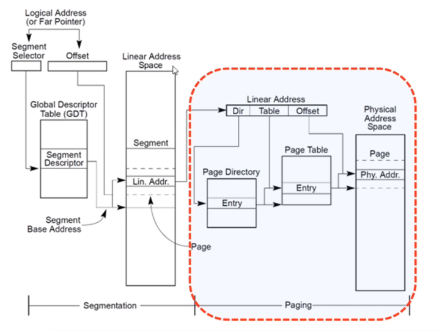
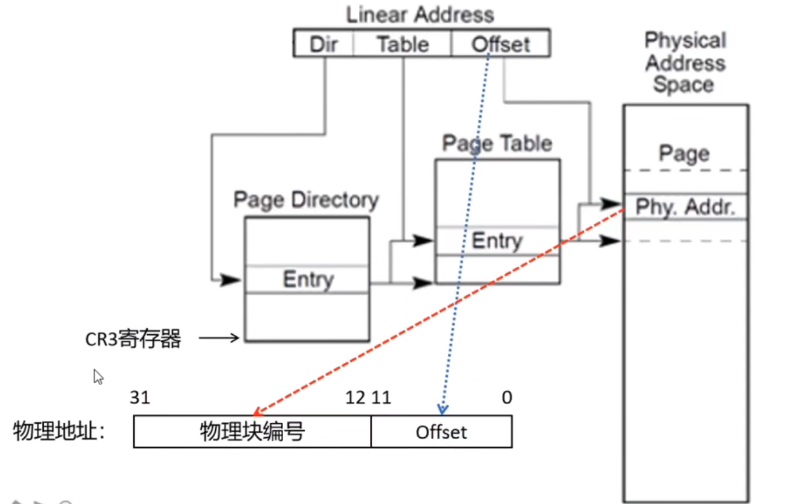

无论是内核空间还是用户空间，他们里面的地址都是虚拟地址。实际CPU在执行的时候会把虚拟地址转换为物理地址。

<!-- more -->

## 1. X86内存结构

- X86内存地址原理图

最上面是一个逻辑地址，中间是一个线性地址，最右边是一个物理地址。对于x86架构来说，它是一个段页式的内存管理机制。代码里面访问的地址都是逻辑地址，CPU在拿到逻辑地址后，会把它转化为线性地址，线性地址再通过页表映射的机制转换为真正的物理地址。**从逻辑地址到线性地址叫做段页式转换，从线性地址到物理地址这个过程叫做页表映射。**页表映射分为当级页表映射、二级页表映射、三级页表映射、四级页表映射。在X86的Linux内核里面，把段基址设成了0，逻辑地址和线性地址是一样的。

## 2. 页表映射

在32位系统里面，线性地址是32个地址位，刚好是4G空间， 这个线性空间其实就是32个比特位。CPU在做页表映射的时候做个区分，最底下的12个比特是Offset，中间的10个比特是页表的便宜（索引），最高的10个是页目录的索引。

**页目录表**

页目录表存的一个一个页表的地址，一个页目录表会保存1024条数据，每条数据刚好是4个字节，所以一个页表刚好是4K，刚好占据一个物理块。

页目录表存储在CR3寄存器中，Linux有很多页目录表，内核共用同一个页目录表，不同的进程有自己的页目录表，所以用户空间的进程进行了隔离。
