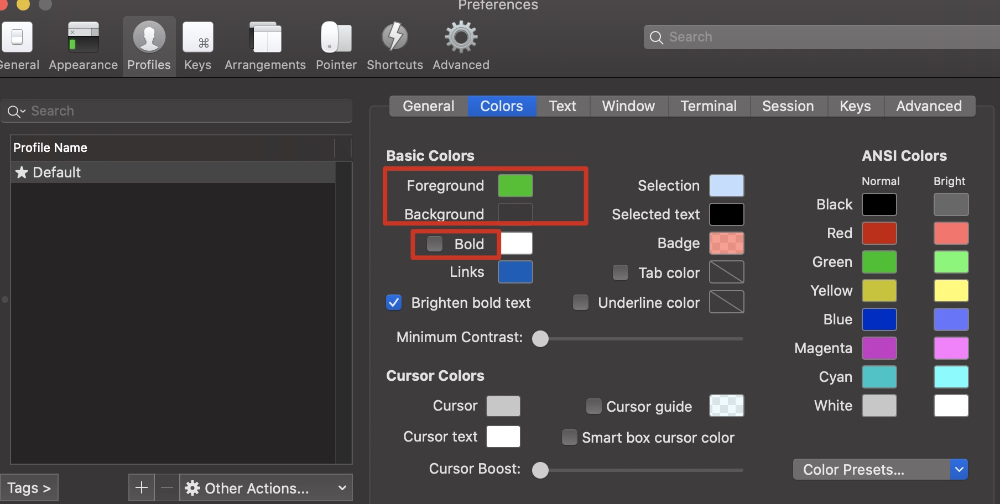
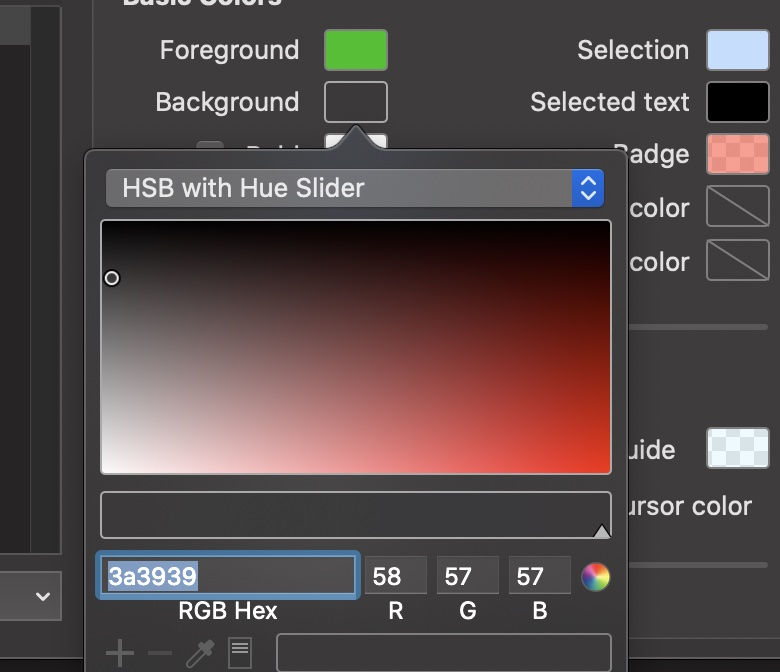
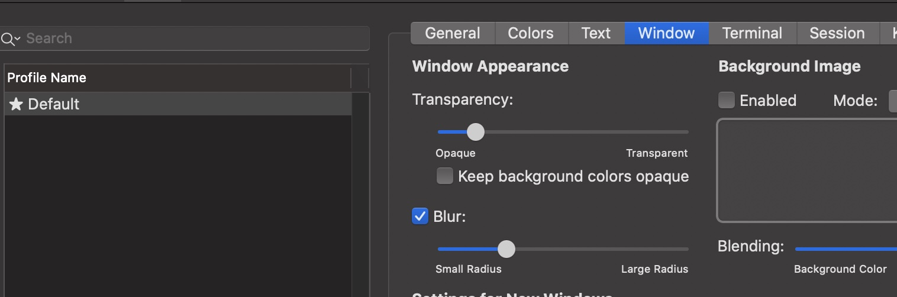

一些个人的配置和环境问题

<!-- more -->

## 终端

### item2

背景和提示颜色

这里字体颜色就是旁边的Green



背景色如下

 

可以设置透明度和毛玻璃效果，但是我<u>感觉不好看没有使用</u>



除此之外，修改windows的新终端的窗口大小，我设置的Columns: 105，Rows:28

Text中字体大小：15

关闭声音：Preferences -> Profiles -> Terminal -> silence bell


### 终端显示

**安装zsh**

```
brew install zsh
chsh -s /bin/zsh
```

**安装oh-my-zsh**

```
git clone https://github.com/robbyrussell/oh-my-zsh.git ~/.oh-my-zsh
```

```
cp ~/.zshrc ~/.zshrc.bak
```

```
cp ~/.oh-my-zsh/templates/zshrc.zsh-template ~/.zshrc
```

<font color="red">推出bash,重新进入zsh</font>

**zsh配置上方显示主机名**

vim ~/.zshrc

```shell
# Uncomment the following line to disable auto-setting terminal title.
DISABLE_AUTO_TITLE="true"

# set title
# uncomment DISABLE_AUTO_TITLE="true"
TERM_TITLE="\e]0;%n@%m\a"
precmd() {
    print -Pn "$TERM_TITLE"
}
# set title to running process
preexec () {
    print -Pn "\e]0;%n@%m [$3]\a"
}
```


**设置Promt**

在.zshrc里配置，这种显示好处就是截图或者复制终端的结果比较容易看

```shell
PROMPT='%{$fg_bold[red]%}[%n@%m %{$fg[red]%}%c]%(!.#.$)%{$reset_color%} '
```

最终效果


### 设置代理

.zshrc设置代理快捷命令

```
#终端设置代理
#polipo proxy on/off

function proxysockes_on(){
	#配置http访问
	export http_proxy=socks5://172.16.42.1:1086
	export https_proxy=socks5://172.16.42.1:1086
	export all_proxy=socks5://172.16.42.1:1086
	echo '**************开启当前终端socks5代理**************'
}


function proxyhttp_on(){
	export http_proxy=http://172.16.42.1:1087
	export https_proxy=http://172.16.42.1:1087
	export all_proxy=http://172.16.42.1:1087
	echo '*************开启当前终端http代理**************'
}

function proxy_off(){
	#移除代理
	unset http_proxy
	unset https_proxy
	unset all_proxy
	echo '************关闭当前终端代理***********'
}
```

proxysockes_on命令开始socks5代理

proxyhttp_on命令开启http代理

proxy_off关闭代理


### zsh插件

自动补全插件

```
git clone https://github.com/zsh-users/zsh-autosuggestions $ZSH_CUSTOM/plugins/zsh-autosuggestions
vim ~/.zshrc
# 加入插件列表
plugins=(git zsh-autosuggestions)
source ~/.zshrc


```


## IDEA

### 最近项目文件

最近碰到一个问题，idea的项目是在外接硬盘中，现在没有插硬盘，打开idea的时候找不到最近项目以至于卡死。

mac下解决方法如下：

JetBrains根目录：

```
/Users/shadowflow/Library/Application Support/JetBrains
```

我使用的是IntelliJIdea2021.2，进入该目录

```
/Users/shadowflow/Library/Application Support/JetBrains/IntelliJIdea2021.2
```

再进入options目录，打开`recentProjects.xml`

删除掉map标签中的entry标签

删除之后就留了一个项目，如下

```xml
<application>
  <component name="RecentProjectsManager">
    <option name="additionalInfo">
      <map>
        <entry key="$USER_HOME$/IntelliJIDEAProjects/HelleWorld">
          <value>
            <RecentProjectMetaInfo frameTitle="HelleWorld – MainActivity.kt" projectWorkspaceId="1xZ3x6KCEsIcFlenjelbyS8p9Nf">
              <option name="binFolder" value="$APPLICATION_HOME_DIR$/bin" />
              <option name="build" value="IU-212.4746.92" />
              <option name="buildTimestamp" value="1627369780208" />
              <frame x="0" y="23" width="1440" height="877" extendedState="6" />
              <option name="productionCode" value="IU" />
              <option name="projectOpenTimestamp" value="1630551739420" />
            </RecentProjectMetaInfo>
          </value>
        </entry>
      </map>
    </option>
    <option name="lastProjectLocation" value="$USER_HOME$/code/java/study" />
  </component>
</application>
```


## java

### 配置

下载

https://www.oracle.com/java/technologies/downloads/#java8

mac下java路径

```
/Library/Java/JavaVirtualMachines
```

环境变量

```
#java
export JAVA_HOME=/Library/Java/JavaVirtualMachines/jdk1.8.0_301.jdk/Contents/Home
export CLASSPATH=$JAVA_HOME/lib/tools.jar:$JAVA_HOME/lib/dt.jar:$JAVA_HOME/lib
export PATH=$JAVA_HOME/bin:$PATH
```

**找不到com.sun tools.jar 和jconsole.jar**

```
<dependency>
    <groupId>com.sun</groupId>
    <artifactId>tools</artifactId>
    <version>1.8</version>
    <scope>system</scope>
    <systemPath>${JAVA_HOME}/lib/tools.jar</systemPath>
</dependency>
<dependency>
    <groupId>com.sun</groupId>
    <artifactId>jconsole</artifactId>
    <version>1.8</version>
    <scope>system</scope>
    <systemPath>${JAVA_HOME}/lib/jconsole.jar</systemPath>
</dependency>
```


### Maven

.zshrc

```
#maven
export MAVEN_HOME=/Library/Java/JavaVirtualMachines/apache-maven-3.8.2
export PATH=$MAVEN_HOME/bin:$PATH
```

修改源/Library/Java/JavaVirtualMachines/apache-maven-3.8.2/conf/settings.xml

```xml
  <mirrors> 
    <mirror>
      <id>alimaven</id>
      <name>aliyun maven</name>
      <url>http://maven.aliyun.com/nexus/content/groups/public/</url>
      <mirrorOf>central</mirrorOf>        
    </mirror>
  </mirrors>
```


## Golang

环境变量

```
#Golang
export GOROOT=/usr/local/go
export GOPATH=$HOME/go
export PATH=$PATH:$GOROOT/bin:$GOPATH/bin
```


## 软件问题

### parallels desktop

卸载parallels desktop后，如何清除多余的“打开方式”项？

执行如下命令

```
/System/Library/Frameworks/CoreServices.framework/Frameworks/LaunchServices.framework/Support/lsregister -kill -r -domain local-domain system -domain user
```


### Mos

https://github.com/Caldis/Mos

mac上的鼠标滚轮方向调整工具


## 系统

### debian:10

#### java

```
#下载jdk-8u251-linux-x64.tar.gz, 搜索jdk install

#解压
sudo tar -C /usr/local -xzf jdk-8u251-linux-x64.tar.gz

# vim /.zshrc
#java
export JAVA_HOME=/usr/local/jdk1.8.0_251
export CLASSPATH=$JAVA_HOME/lib/tools.jar:$JAVA_HOME/lib/dt.jar:$JAVA_HOME/lib
export PATH=$JAVA_HOME/bin:$PATH


```

#### maven

```
#下载，访问https://maven.apache.org/download.cgi
wget https://dlcdn.apache.org/maven/maven-3/3.8.5/binaries/apache-maven-3.8.5-bin.tar.gz

sudo tar -C /usr/local -xzf apache-maven-3.8.5-bin.tar.gz

# vim /.zshrc
#maven
export MAVEN_HOME=/usr/local/apache-maven-3.8.5
export PATH=$MAVEN_HOME/bin:$PATH

修改源/user/local/apache-maven-3.8.5/conf/settings.xml
  <mirrors> 
    <mirror>
      <id>alimaven</id>
      <name>aliyun maven</name>
      <url>http://maven.aliyun.com/nexus/content/groups/public/</url>
      <mirrorOf>central</mirrorOf>        
    </mirror>
  </mirrors>
```

vim

```
set background=dark
```

