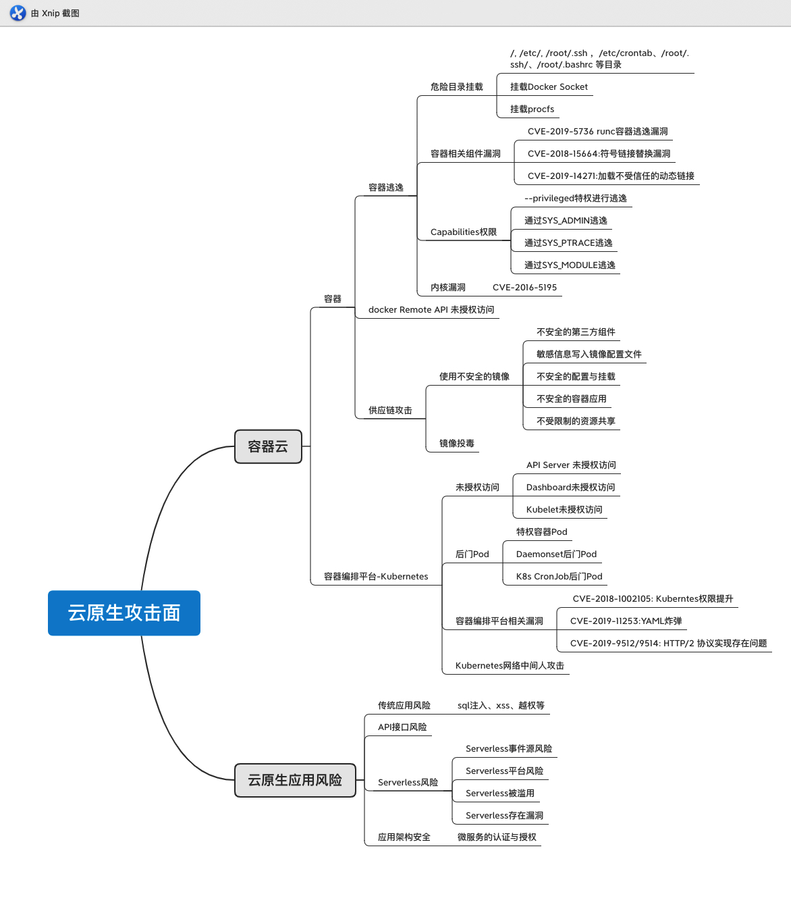

> 一切有为法，如梦幻泡影，如露亦如电，应作如是观。

对云原生的攻击面做个归纳

<!-- more -->

攻击面如下：

容器云部分参考，[容器逃逸](https://shadowfl0w.github.io/%E5%AE%B9%E5%99%A8%E9%80%83%E9%80%B8/)，[容器编排平台-Kubernetes安全](https://shadowfl0w.github.io/%E5%AE%B9%E5%99%A8%E7%BC%96%E6%8E%92%E5%B9%B3%E5%8F%B0-Kubernetes%E5%AE%89%E5%85%A8/)，[Kubernetes-API-Server-认证与授权](https://shadowfl0w.github.io/Kubernetes-API-Server-%E8%AE%A4%E8%AF%81%E4%B8%8E%E6%8E%88%E6%9D%83/)

## 云原生应用风险

### 1. 传统应用风险

跑在容器云环境下得应用也避免不了OWASP top 10应用风险，

### 2. API接口风险

虽然API接口风险也属于传统应用风险，但这个问题在云原生环境下更加突出，因为一个完整的应用被拆分成独立的模块，通过API接口进行交互，由于接口众多，导致管理困难，所有API接口风险是云原生应用的重大风险点

### 3. Serverless风险

Serverless应用属于云原生应用，它需要参照云厂商的模板编写代码。Serverless是由事件触发的，但是事件本身来源并不可控。其他的使用的共有或者私有Serverless平台本身也可能存在安全问题，现在很多公有云厂商提供的Serverless服务被用来做攻击，存在滥用的风险，比如用来做扫描，隐藏c2。还有就是编写的Serverless代码可能存在漏洞导致被利用。

### 4. 云原生应用架构安全

云原生应用一般采用微服务架构，微服务架构使用到的各种框架或者组件也是可能存在漏洞的，微服务下对认证和授权也是一大挑战，还有就是微服务的API管理，以及资产间隔离也是难点。

对云原生应用安全只做了简单的结束，后续有机会再详细介绍各种的攻击手法。

