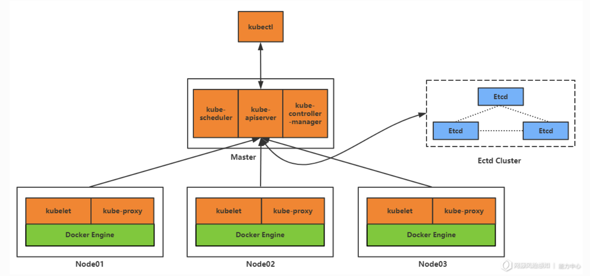
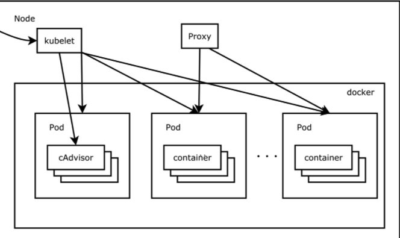
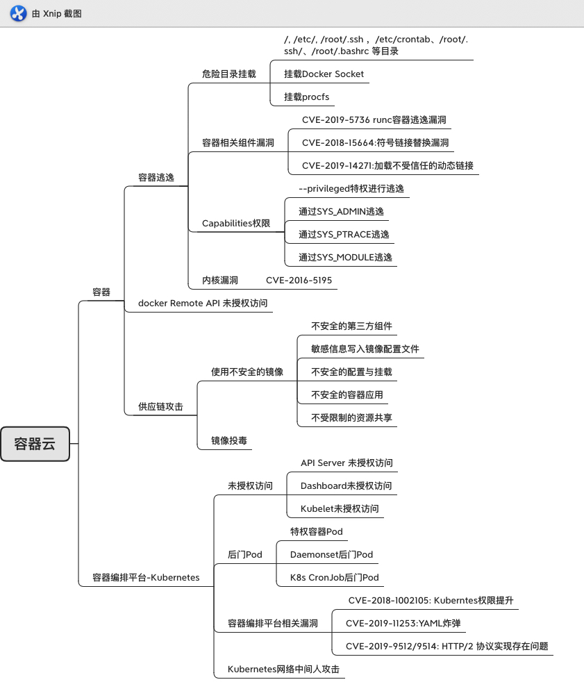

> 上德不德，是以有德；下德不失德，是以无德。

容器云可以看成是云原生应用的基础设施，包括容器和容器编排平台，容器编排平台目前一般使用的都是Kubernetes。本文主要分析容器和Kubernetes的攻击面以及如何防御。

<!-- more -->

## 1. 容器

容器的概念大家都比较了解，我做个简单的介绍。容器使用到两个关键技术Namespaces和Cgroups。Linux Namespaces用于隔离容器的资源，Cgroups则用于限制资源。两者结合就把应用限制在一个容器这个盒子里，互不影响。

## 2. Kubernetes

常见的Kubernetes集群结构图如下，Master节点是集群的控制节点，Node节点则是集群的工作节点。

 

**Master节点：**

master节点是负责管理其他节点的主节点

**Node：**

每个Node节点可以看做一个物理节点。

**pod:**

看第二张图片，每个node上运行着pod，pod相当于跑的一个容器，并且可以修改副本数量，让同一个pod配置文件管理多个容器副本。

**API Server:**

通过API Server接口可以对集群进行管理

**kubelet:**

每个节点都装有kubelet，它负责管理自己节点的Pod，同时，Master节点也是通过控制其他节点的kubelet来对其他节点的Pod进行管理。

**etcd：**

所有master的持续状态都存在etcd的一个实例中。这可以很好地存储配置数据。

## 3. 容器云攻击面

 

### 3.1 容器逃逸

容器安全中一个重要的攻击点就是容器逃逸，容器逃逸就是从容器中进行权限提升获取宿主机的权限。

容器逃逸手法有很多，我们做个简单的介绍。

**危险目录挂载：**

如果我们将宿主机根目录、root目录、/root/.ssh等危险目录挂载进了容器，这是很危险的一件事。比如在启动容器的时候将根目录挂载进容器，那么在容器里面可以使用chroot将宿主机目录当做容器的根目录，然后反弹一个shell获取宿主机的shell，或者写入ssh公钥或者写入定时任务等都可以获取到宿主机的shell。从而逃逸容器。

除了上面说的挂载危险目录，还有两个特殊的目录，Docker Socket和procfs。如果宿主机将Docker Socket的目录/var/run/docker.sock 挂载进行容器，也就是说此容器可以管理其他容器，那么我们就是可以在容器里面创建一个挂载危险目录的容器从而实现逃逸；procfs是一个伪文件系统，存储的是当前内核运行状态的一系列特殊文件，从2.6.19内核版本开始，加入了一个新特性，在/proc/sys/kernel/core_pattern中，如果在该文件中的首个字符是管道符（|），那么该行的剩余内容将被当做脚本进行解析，那么我们就可以在管道符后写入后门程序达到命令执行的效果，如果把宿主机的/proc目录挂载进来，那么我们就可以把这个后门写入到宿主机上，从而实现逃逸。

**容器相关组件漏洞：**

CVE-2019-5736 runC容器逃逸漏洞：

runC是Docker内置的一个基础客户端工具，在存在漏洞版本的docker中，容器内部通过proc虚拟文件系统访问到runc文件并写入恶意代码，怎么触发呢？触发使用到了proc目录下的/proc/PID/exe，它指向进程自身对应的本地文件。比如如果我们使用docker exec -it /bin/sh，如果我们替换掉容器里的/bin/sh为/proc/[runC-PID]/exe，那么就会调用我们刚刚写入恶意代码的runc，导致恶意命令被执行，由于runc是在docker守护进程里具有宿主机的root权限，相当于逃逸了容器。

CVE-2018-15664:符号链接替换漏洞：

CVE-2018-15664是一个条件竞争引起的漏洞，当用户执行docker cp命令的时候Docker守护进程会先检查复制的路径，检查的时候如果有容器内部的符号链接，会先解析符号链接，然后放置，等待检查完后进行复制操作。这其中存在一个间隙，如果我们在执行复制之前，将执行容器内的路径替换成一个符号链接，那么复制的时候，宿主机的docker就会解析的这个符号链接，就会以docker守护进程的权限把容器内的文件复制到宿主机，这个漏洞比较鸡肋。攻击场景局限在非root用户的宿主机权限，并且有docker交互的权限，这时候可以使用这个方法修改/etc/shadow文件实现提权，并且由于需要条件竞争成功率并不高。如果有了这些权限完全可以启动一个特权容器进行逃逸。

CVE-2019-14271:加载不受信任的动态链接：

在存在漏洞版本的Docker中，在执行Docker cp命令后，Docker守护进程会启动一个docker-tar进程来完成这项复制任务。docker-tar会在容器里执行chroot后加载一些动态链接库，如果我们在容器里放置恶意的动态链接库，就会被加载到容器外的docker-tar(root权限)运行。

**Capabilites安全问题:**

Linux内核中的Capabilities特性用于划分特权集，相当于是对权限做了更细致的划分，比如可以通过给ping应用添加CAP_NET_RAW特权集，使其具有使用网络的特权集，而不具备其他特权集。容器也支持Capabilities，我们可以指定各种特权来限制容器的权限。如果给的权限过大那么就可能导致容器逃逸。

- –privileged或者–cap-add=ALL可以获得所有特权集，如果容器通过privileged启动那么可以很轻松的逃逸容器。
- SYS_ADMIN特权也可以逃逸，但是有比较大的限制，需要启动容器的时候开启额外的配置
- SYS_PTRACE特权结合进程注入也可以逃逸容器，根上面一样启动容器的时候开启额外的配置
- SYS_MODULE特权可以通过加载内核模块进行逃逸，这种利用起来比较方便

**linux内核漏洞：**

利用Linux内核漏洞也是可以逃逸的，比如著名的脏牛。

### 3.2 Docker Remote API 未授权

如果开起了Docker Remote API，可远程调用API来操作docker。如果我们通过Docker Remote API创建一个特权容器，相当于我们完全控制了主机。

### 3.3 镜像安全

镜像安全存在两种风险，一是使用的镜像存在漏洞，比如使用了有漏洞的应用组件；二是镜像投毒，使用了恶意的镜像。

### 3.4 Kubernetes相关组件未授权访问

在老版本或者通过配置让Kubernetes的端口直接对外暴露会产生高危安全问题，比如Kubernetes API Server未授权，Dashboard未授权访问，kubelet未授权访问等。

### 3.5 通过Kubernetes部署后门pod实现持久化

比如可以部署一个特权容器的pod；如果部署的是一个Daemonset后门pod，这个Pod会自动在每一个节点上都部署一个后门pod。还可以部署一个CronJobs的pod后门，实现定时执行恶意命令。

### 3.5 Kubernetes相关漏洞

CVE-2018-1002105: Kuberntes权限提升：

此漏洞让能够访问集群的用户获取admin的权限，原理是http请求在升级为websockt的时候，中间代理错误处理不全，导致引起部分错误的请求会直接通过API Serever建立websockt连接，从而控制集群。

CVE-2019-11253:YAML炸弹：

通过恶意的yaml，让API Server消耗大量CPU资源，导致拒绝服务攻击。

CVE-2019-9512/9514: HTTP/2 协议实现存在问题：

HTTP/2的go实现库存在漏洞，导致处理恶意的HTTP/2流量的时候消耗大量资源，从而拒绝服务

### 3.6 Kubernetes网络中间人攻击

Kubernetes集群中也是可以进行中间人攻击的，通过修改dns解析的地址，劫持流量。解决方案是更细粒度的权限控制，禁用pod的CAP_NET_RAW权限，这样就无法发送ARP和DNS报文。

## 4. 容器云运行时安全

容器云运行时安全我们使用的方案是用falco进行内核监控，使用它自带的规则和我们自定义的规则来做监控。它的底层是使用的eBPF技术。

### 4.1 eBPF

eBPF是一种包过滤技术，最开始是用来处理网络包的，像tcpdum就是基于eBPF开发的。它的特点就是可以将用户空间的代码直接放到内核去跑，而不用重新编译内核。比如我们用python或者C写的eBPF程序，编译后交给eBPF，就会将代码挂到程序指定的内核位置运行。

未完待续......

