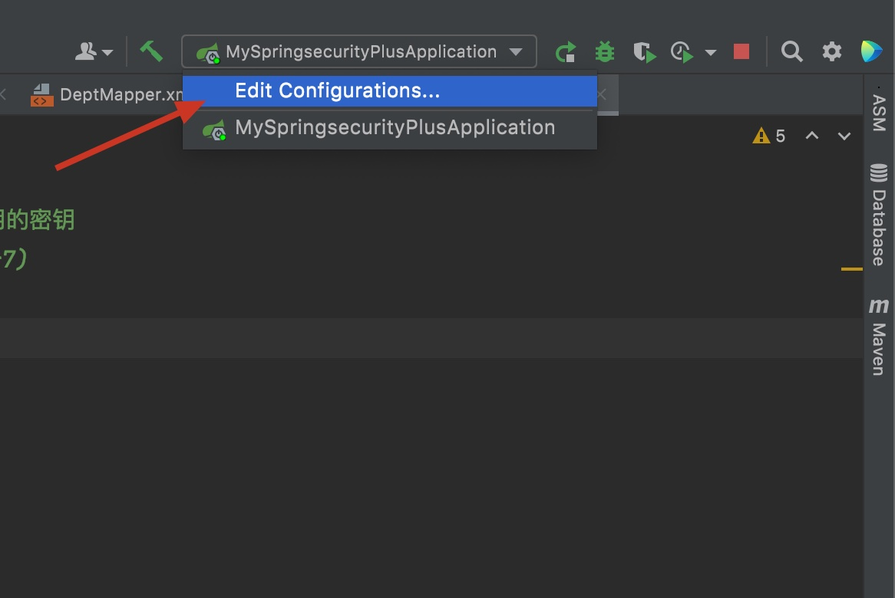
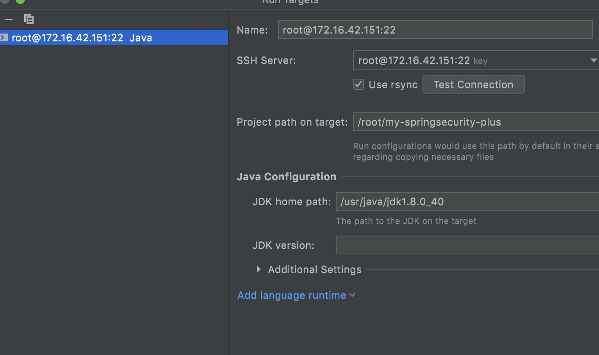
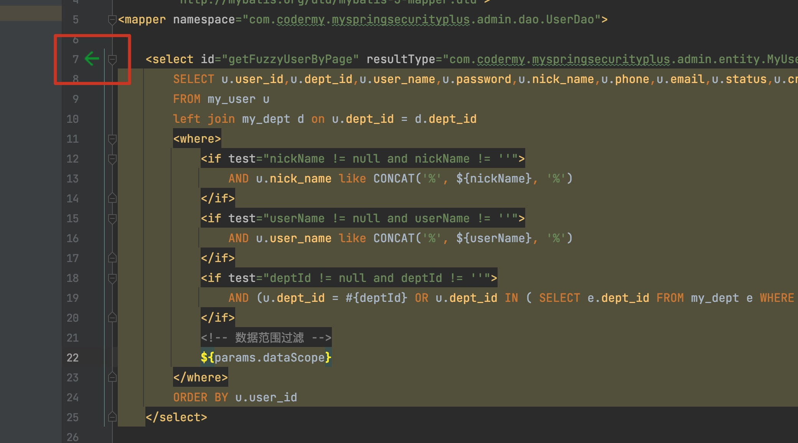

一个SpringBoot+SpringSecurity+Mybatis+Mysql+Druid+Swagger的[项目](https://github.com/witmy/my-springsecurity-plus)，使用手工加CodeQL进行0day挖掘

<!-- more -->

## 1. 环境

### 1.1 配置maven镜像源

`</mirrors>`标签下配置如下

```
 <mirrors>
   <mirror>
      <id>alimaven</id>
      <name>aliyun maven</name>
      <url>http://maven.aliyun.com/nexus/content/groups/public/</url>
      <mirrorOf>central</mirrorOf>        
    </mirror>
  </mirrors>
```

将其复制到idea默认目录

```shell
[shadowflow@ShadowOS lib]$ cp /Library/Java/JavaVirtualMachines/apache-maven-3.8.2/conf/settings.xml ~/.m2/
```


### 1.2 配置数据库

mysql docker容器创建

```shell
docker run -itd --name my-mysql -p 3306:3306 -e MYSQL_ROOT_PASSWORD=123456 mysql:8.0.15

docker exec -it my-mysql bash

mysql -u root -p

#开启远程访问
use mysql;
ALTER USER 'root'@'%' IDENTIFIED WITH mysql_native_password BY '123456';
flush privileges;
```

解决mysql乱码问题

给/etc/mysql/my.cnf添加如下类容

```
[mysql]
default-character-set=utf8mb4

[mysqld]
character-set-server = utf8mb4
collation-server = utf8mb4_unicode_ci
init_connect='SET NAMES utf8mb4'
skip-character-set-client-handshake = true

[client]
default-character-set = utf8mb4
```

结合原内容，如下

```
[mysql]
default-character-set=utf8mb4

[mysqld]
pid-file        = /var/run/mysqld/mysqld.pid
socket          = /var/run/mysqld/mysqld.sock
datadir         = /var/lib/mysql
secure-file-priv= NULL
# Disabling symbolic-links is recommended to prevent assorted security risks
symbolic-links=0
character-set-server = utf8mb4
collation-server = utf8mb4_unicode_ci
init_connect='SET NAMES utf8mb4'
skip-character-set-client-handshake = true

# Custom config should go here
!includedir /etc/mysql/conf.d/

[client]
default-character-set = utf8mb4
```

将其复制到容器

```
[root@vuln ~]# docker cp /etc/mysql/my.cnf my-mysql:/etc/mysql/
```

重启容器

```
docker restart my-mysql
```


将项目的sql文件导入mysql 容器

```
docker cp ./quartz.sql my-mysql:/root/
```

进入容器里的mysql

```shell
#创建数据库
mysql> create database rbac;
Query OK, 1 row affected (0.01 sec)

#进入rbac数据库
mysql> use rbac;
Database changed

#加载mysql脚本
mysql> source /root/rbac.sql
```


### 1.3 修改数据库连接配置文件

打开application.yml，修改mysql密码


### 1.4 安装Free MyBatis Tool

在idea插件市场安装，此插件可以从mybatis的xml文件跳转到对应的类。


### 1.5 配置远程部署

 

 


### 1.6 运行

配置好后就可以直接在远程的linux机器上运行了


## 2. 使用CodeQL分析

使用命令生成codeql database

```
codeql database create rbac-qldb -l java --command="mvn clean install -Dmaven.test.skip=true " --overwrite
```

> 路径不要带中文

找不到com.sun tools.jar 和jconsole.jar给pom配置如下(codeql需要绝对路径)

```
<dependency>
    <groupId>com.sun</groupId>
    <artifactId>tools</artifactId>
    <version>1.8</version>
    <scope>system</scope>
    <systemPath>绝对路径/lib/tools.jar</systemPath>
</dependency>
<dependency>
    <groupId>com.sun</groupId>
    <artifactId>jconsole</artifactId>
    <version>1.8</version>
    <scope>system</scope>
    <systemPath>绝对路径/lib/jconsole.jar</systemPath>
</dependency>
```

使用安全相关脚本进行扫描


## 3. 第三方依赖检查

第三方依赖包漏洞检查攻击可使用`dependency-check`。

```
官方地址：
https://owasp.org/www-project-dependency-check/
Github地址：
https://github.com/jeremylong/DependencyCheck
```

我们手动查看pom.xml发现使用`Fastjson 1.2.56`版本，该版本存在漏洞，但这时候并不能确定存在漏洞，可能尽管使用了带有漏洞版本的组件，但并没有使用存在漏洞的相关函数。


## 4. 配置检查

Spring boot中配置文件都在`src/main/resources`下面，名字通常为`application.yml`或者`application.properties`。配置文件中可能会存在数据库或其他组件的连接信息。


## 5. SQL 注入挖掘

### 5.1 java中sql注入原理

Mybatis的sql语句都是放在resources下的xx.xml文件中，一般文件名和文件夹名都是mapper什么的，表示配置文件通过反射映射到JDBC中执行。

Mybatis拼接sql有下面两种方式：

- `#{}`

  MyBatis 创建一个预编译语句（PreparedStatement）参数，在 JDBC 中，这样的一个参数在 SQL 中会由一个“?”来标识，并被传递到一个新的预处理语句中，

- `${}` 

  只是 string 替换，在动态 SQL 解析阶段将会进行变量替换，直接替换字符串，会导致SQL注入产生。

开发的原则是能使用`#{}`的地方，一定使用`#{}`。但是SQL语句中存在无法使用`#{}`的场景，因为使用`#{}`会在原本的字段加上引号`''`，导致SQL语句报错。不能使用`#{}`的场景我们需要特别注意，此处极易产生SQL注入。

一些不能使用`#{}`的场景：

- 表名/字段名
- order by/group by
- like模糊查询
- in

表名一般不会通过用户传入，即使是用户传入，由于Mybatis的查询机制，并不会产生SQL注入。


### 5.2 手动挖掘

通过原理我们直接在文本搜索`${`并且范围限定在xml文件

- 项目根目录右键搜索，也可以快捷键

 

搜索`${`设定文本为.xml

 

我们可以看见已经搜到好几处存在`${`拼接的语句。进入这条语句所在的xml文件，通过之前安装的mybatis插件可以直接跳转到对应的类。

 

通过追踪调用关系确定在api/user接口存在sql注入。通过布尔盲注判断

`http://172.16.42.151:8088/api/user?page=1&limit=10&nickName=11+AND+2755=2755`

`http://172.16.42.151:8088/api/user?page=1&limit=10&nickName=11+AND+2755=2756`


### 5.4 使用CodeQL挖掘SQL注入

使用CodeQL Java里的规则experimental/Security/CWE/，CWE-089是专门针对MyBatis配置文件的污点分析

扫描结果如下

 

此规则扫描出了14条不安全的sql污点传播路径。

以第一个为例分析一下看是否存在SQL注入，

- source点

 

xml中的sql查询代码

```
    <select id="getFuzzyDept" resultType="com.codermy.myspringsecurityplus.admin.entity.MyDept">
        <include refid="selectDeptVo"/>
        <where>
            <if test="deptName != null and deptName != ''">
                AND d.dept_name like CONCAT('%', #{deptName}, '%')
            </if>
            <if test="status != null and status != ''">
                AND d.status = #{status}
            </if>
            <!-- 数据范围过滤 -->
            ${params.dataScope}
        </where>
        order by d.sort
    </select>
```

显然是`${params.dataScope}`参数进行了不安全的拼接，我们根据api构造poc

`http://172.16.42.151:8088/api/user?page=1&limit=10&params[dataScope]=1`

**尝试报错注入**

对`[]`进行url编码

```
http://172.16.42.151:8088/api/user?page=1&limit=10&params%5BdataScope%5D=and+extractvalue(1,concat(0x7e,(select+database()),0x7e))
```


这里其实已经注入成功了，只是做了错误处理，不返回结果，在控制台可以发现已经返回来数据库。


那只能盲注了

**盲注**

尝试时间盲注成功，但是睡眠时间有点久

```
http://172.16.42.151:8088/api/user?page=1&limit=10&params%5BdataScope%5D=and+sleep(3)
```

也可以尝试布尔盲注和时间盲注都可以。

### 5.5 CodeQL代码解读

MyBatisMapperXmlSqlInjection.ql的代码如下

```
/**
 * @name SQL injection in MyBatis Mapper XML
 * @description Constructing a dynamic SQL statement with input that comes from an
 *              untrusted source could allow an attacker to modify the statement's
 *              meaning or to execute arbitrary SQL commands.
 * @kind path-problem
 * @problem.severity error
 * @precision high
 * @id java/mybatis-xml-sql-injection
 * @tags security
 *       external/cwe/cwe-089
 */

import java
import DataFlow::PathGraph
import MyBatisCommonLib
import MyBatisMapperXmlSqlInjectionLib
import semmle.code.xml.MyBatisMapperXML
import semmle.code.java.dataflow.FlowSources

private class MyBatisMapperXmlSqlInjectionConfiguration extends TaintTracking::Configuration {
  MyBatisMapperXmlSqlInjectionConfiguration() { this = "MyBatis mapper xml sql injection" }

  override predicate isSource(DataFlow::Node source) { source instanceof RemoteFlowSource }

  override predicate isSink(DataFlow::Node sink) {
    sink instanceof MyBatisMapperMethodCallAnArgument
  }

  override predicate isSanitizer(DataFlow::Node node) {
    node.getType() instanceof PrimitiveType or
    node.getType() instanceof BoxedType or
    node.getType() instanceof NumberType
  }

  override predicate isAdditionalTaintStep(DataFlow::Node node1, DataFlow::Node node2) {
    exists(MethodAccess ma |
      ma.getMethod().getDeclaringType() instanceof TypeObject and
      ma.getMethod().getName() = "toString" and
      ma.getQualifier() = node1.asExpr() and
      ma = node2.asExpr()
    )
  }
}

from
  MyBatisMapperXmlSqlInjectionConfiguration cfg, DataFlow::PathNode source, DataFlow::PathNode sink,
  MyBatisMapperXMLElement mmxe, MethodAccess ma, string unsafeExpression
where
  cfg.hasFlowPath(source, sink) and
  ma.getAnArgument() = sink.getNode().asExpr() and
  myBatisMapperXMLElementFromMethod(ma.getMethod(), mmxe) and
  unsafeExpression = getAMybatisXmlSetValue(mmxe) and
  (
    isMybatisXmlOrAnnotationSqlInjection(sink.getNode(), ma, unsafeExpression)
    or
    mmxe instanceof MyBatisMapperForeach and
    isMybatisCollectionTypeSqlInjection(sink.getNode(), ma, unsafeExpression)
  )
select sink.getNode(), source, sink,
  "MyBatis Mapper XML SQL injection might include code from $@ to $@.", source.getNode(),
  "this user input", mmxe, "this SQL operation"

```

- **`@name`**

  简单说明该查询代码，里面可以使用单引号

- **`@description`**

  用来描述代码，做个稍微详细的说明

- **`@kind`**

  说明是告警查询还是路径查询，`@kind path-problem`表示是路径查询

- **`@problem.severity`**

  表示非安全的严重程度，这里`error`是最高等级，其次是`warning`，再其次是`recommendation`

- **`@precision`**

  表示结果的准确性，`high`表示较高可可信度，总共有四个等级`very-high`、`high`、`medium`、`low`

- **`@id`**

  表示这个查询的唯一id，一般格式`语言/简短描述`

- **`@tags`**

  标签

- **`import java`**

  导入java的标准库

- **`import DataFlow::PathGraph`**

  路径图模块的标准库

- **`import MyBatisCommonLib`**

  导入同目录的MyBatisCommonLib.qll

- **`import MyBatisMapperXmlSqlInjectionLib`**

  导入同目录的MyBatisMapperXmlSqlInjectionLib.qll

- **`import semmle.code.xml.MyBatisMapperXML`**

  导入官方的MyBatisMapperXML库

- **`import semmle.code.java.dataflow.FlowSources`**

  该库里面有RemoteFlowSource类可以用来发现可能被用户控制的数据

- **`MyBatisMapperXmlSqlInjectionConfiguration`类**

  声明一个私有的类，该类继承全局污点追踪`TaintTracking::Configuration`, 

  - `MyBatisMapperXmlSqlInjectionConfiguration()`定义类的唯一名称。

  - `isSource`定义source点是所有用户可控数据

  - `isSink`中的`MyBatisMapperMethodCallAnArgument`是导入的库`MyBatisMapperXmlSqlInjectionLib`中的类，该类表示Mybatis xml文件中的sql语句了类，也就是执行了sql查询

  - `isSanitizer`谓词是是对node的数据做了限制
  - `isAdditionalTaintStep` 对节点见的数据流做了限制

- **from**语句引入变量

- **where**语句里面定义条件，getAMybatisXmlSetValue谓词里定义了`${}`编写Mybatis配置文件的问题。

- **select**语句，显示结果包括sink点、source点、sql语句所在的xml文件


## 6. 越权

Java中做角色控制的组件常见的有Apache shiro和Spring Security。它们将软件系统的安全认证相关的功能抽取出来，实现用户身份认证，权限授权、加密、会话管理等功能，组成了一个通用的安全认证框架。访问控制一般在filter/interceptor代码里，此项目未发现问题。

接下来看一下controller里的代码，在UserController的deleteUser方法我们可以发现为做权限检查，其他操作都有checkUserAllowed检查。结合渗透测试，找到删除功能，任意用户都可以通过如下接口删除

```
http://172.16.42.151:8088/api/user?userId=5
```


## 7. XSS

在项目中为发现针对xss的过滤器，猜测可能存在xss漏洞。通过分析resource里面的前端文件知道使用了Thymeleaf模板引擎和Layui框架。Thymeleaf中`th:text`标签进行渲染的时候，默认对特殊字符进行了转义，`th:utext`不会将字符转义。也就是说使用了`th:utext`标签会出现XSS漏洞。此项目没有发现`th:utext`标签,

我们可以找未经过Thymeleaf处理的地方，从而产生xss。比如在角色管理处插入xss。

 

除此之外还有很多地方


## 8. 未授权访问

该项目中使用了SpringSecurity，SpringSecurity会配置一些放行的静态资源，有时错误的配置会将一些关键资源放行，造成未授权访问。一般是为了开发方便调试开放的。

该项目中security/config/SpringSecurityConfig文件

```
 @Override
    public void configure(WebSecurity web) throws Exception {
        //放行静态资源
        web.ignoring()
                .antMatchers(HttpMethod.GET,
                        "/swagger-resources/**",
                        "/PearAdmin/**",
                        "/component/**",
                        "/admin/**",
                        "/**/*.html",
                        "/**/*.css",
                        "/**/*.js",
                        "/swagger-ui.html",
                        "/webjars/**",
                        "/v2/**",
                        "/druid/**",
                        "/actuator/**");
        web.ignoring().antMatchers(HttpMethod.POST,"/druid/**");
    }

```

放行了swagger-ui.html，actuator等危险目录

 


## 9. 验证码绕过

搜索关键字`captcha`等，该项目验证码逻辑在filter/VerifyCodeFilter。 该处的代码只是验证了是否为空，其他的逻辑被注释掉了，所以可以很轻松绕过。


## 10. 异常信息泄漏

通过搜索`e.printStackTrace()`发现没有直接返回异常信息


