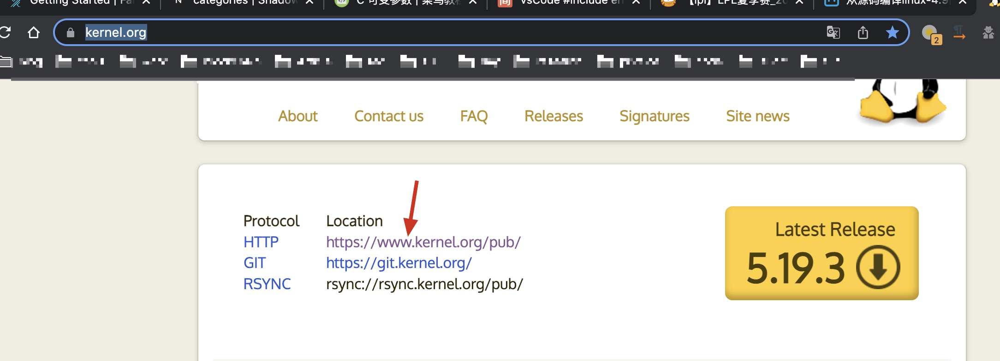
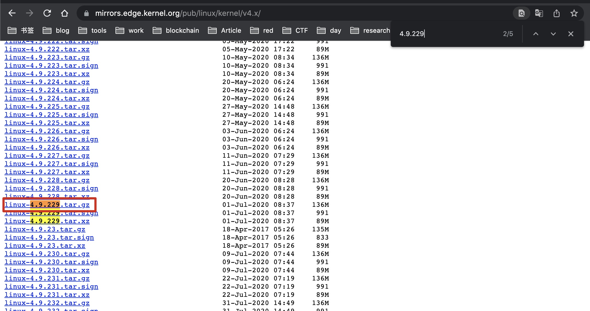
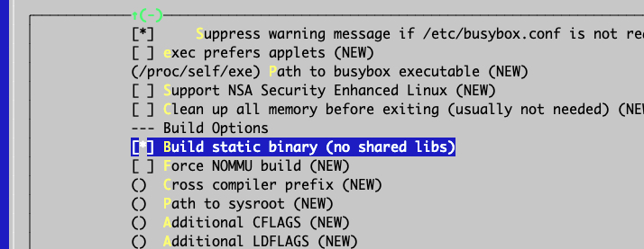

编译Linux源码及文件系统

<!-- more -->


## 1. 下载linux内核源码

访问：https://www.kernel.org/

点击如下



点击linux

 

点击kernel

 

我们下载4.x的版本

 

下载4.9.229版本

 

复制连接地址，使用如下命令下载

```
wget -c https://mirrors.edge.kernel.org/pub/linux/kernel/v4.x/linux-4.9.229.tar.gz
```

-c参数指的是断点续传，取消后可以接着传


## 2. linux内核源码目录介绍

下载完后我们可以进入目录

**arch目录**

arch目录是CPU体系相关的代码，有arm架构、x86架构等等。

```
[root@debian arch]# ls
alpha  arm64     c6x   h8300    Kconfig  metag       mn10300   parisc   score  tile       x86
arc    avr32     cris  hexagon  m32r     microblaze  nios2     powerpc  sh     um         xtensa
arm    blackfin  frv   ia64     m68k     mips        openrisc  s390     sparc  unicore32
```

每个架构下面还有内核相关代码

```
[root@debian arch]# cd x86
[root@debian x86]# ls
boot     events   Kconfig        kvm       Makefile_32.cpu  net       power      tools
configs  ia32     Kconfig.cpu    lguest    Makefile.um      oprofile  purgatory  um
crypto   include  Kconfig.debug  lib       math-emu         pci       ras        video
entry    Kbuild   kernel         Makefile  mm               platform  realmode   xen
```


**Documentation**

内核里的技术文档，关于内核参数、配置、特性等都有

```
[root@debian linux-4.9.229]# cd Documentation
[root@debian Documentation]# ls
00-INDEX                    gpu                          parisc
80211                       hid                          parport-lowlevel.txt
ABI                         highuid.txt                  parport.txt
accounting                  HOWTO                        PCI
acpi                        hwmon                        pcmcia
.......
```


**firmware**

固件相关代码


**init**

init是内核启动相关的代码

```
[root@debian linux-4.9.229]# cd init
[root@debian init]# ls
calibrate.c  do_mounts.h         do_mounts_md.c  initramfs.c  Kconfig  Makefile       version.c
do_mounts.c  do_mounts_initrd.c  do_mounts_rd.c  init_task.c  main.c   noinitramfs.c
```

main.c里面有一个start_kernel函数，这是开始执行C代码的位置，在此之前都是汇编代码。

```c
asmlinkage __visible void __init start_kernel(void)
{
        char *command_line;
        char *after_dashes;

        set_task_stack_end_magic(&init_task);
        smp_setup_processor_id();
        debug_objects_early_init();

        /*
         * Set up the the initia
```


**block**

block是块设备相关代码

```
[root@debian linux-4.9.229]# cd block
[root@debian block]# ls
badblocks.c      blk-ioc.c        blk-mq-tag.c    bsg.c               ioprio.c
bio.c            blk-lib.c        blk-mq-tag.h    bsg-lib.c           Kconfig
bio-integrity.c  blk-map.c        blk-settings.c  cfq-iosched.c       Kconfig.iosched
blk-cgroup.c     blk-merge.c      blk-softirq.c   cmdline-parser.c    Makefile
blk-core.c       blk-mq.c         blk-sysfs.c     compat_ioctl.c      noop-iosched.c
blk-exec.c       blk-mq-cpumap.c  blk-tag.c       deadline-iosched.c  partition-generic.c
blk-flush.c      blk-mq.h         blk-throttle.c  elevator.c          partitions
blk.h            blk-mq-pci.c     blk-timeout.c   genhd.c             scsi_ioctl.c
blk-integrity.c  blk-mq-sysfs.c   bounce.c        ioctl.c             t10-pi.c
```


**drivers**

drivers代码量很大，外设特别多，所以需要更多的驱动支持。

```
[root@debian linux-4.9.229]# cd drivers
[root@debian drivers]# ls
accessibility  cpufreq   gpu         Kconfig    net       pnp         sfi          vhost
acpi           cpuidle   hid         leds       nfc       power       sh           video
amba           crypto    hsi         lguest     ntb       powercap    sn           virt
android        dax       hv          lightnvm   nubus     pps         soc          virtio
ata            dca       hwmon       macintosh  nvdimm    ps3         spi          vlyn
```


**ipc**

ipc是进程通讯相关代码


**security**

安全相关代码

**net**

协议栈相关代码

**sound**

声音相关代码

**fs**

文件系统相关代码

```
[root@debian linux-4.9.229]# cd fs/
[root@debian fs]# ls
9p                  cifs                 exportfs        ioctl.c         nilfs2            read_write.c
adfs                coda                 ext2            iomap.c         nls               reiserfs
affs                compat_binfmt_elf.c  ext4            isofs           no-block.c        romfs
afs                 compat.c             f2fs            jbd2            notify
....
```

**kernel**

kernel是内核核心相关代码，进程管理、进程调度等内核核心代码


**include**

头文件代码

**mm**

内存管理相关代码


## 3. linux内核编译

**1. 指定硬件体系架构**

我这里选择x86

```
[root@debian linux-4.9.229]# export ARCH=x86
```


**2. 配置board config**

此处为x86_64_deconfig

```
[root@debian linux-4.9.229]# make x86_64_defconfig
  HOSTCC  scripts/basic/fixdep
  HOSTCC  scripts/kconfig/conf.o
  SHIPPED scripts/kconfig/zconf.tab.c
  SHIPPED scripts/kconfig/zconf.lex.c
  SHIPPED scripts/kconfig/zconf.hash.c
  HOSTCC  scripts/kconfig/zconf.tab.o
  HOSTLD  scripts/kconfig/conf
#
# configuration written to .config
```


**3. 配置内核**

```
[root@debian linux-4.9.229]# make menuconfig
  HOSTCC  scripts/kconfig/mconf.o
<command-line>: fatal error: curses.h: 没有那个文件或目录
compilation terminated.
make[1]: *** [scripts/Makefile.host:118：scripts/kconfig/mconf.o] 错误 1
make: *** [Makefile:553：menuconfig] 错误 2
```

这里执行会报错，需要安装`apt install libncurses5-dev`

```
[root@debian linux-4.9.229]# apt install libncurses5-dev
```

再次执行，就会弹出配置界面

```
[root@debian linux-4.9.229]# make menuconfig
  HOSTCC  scripts/kconfig/mconf.o
  HOSTCC  scripts/kconfig/zconf.tab.o
  HOSTCC  scripts/kconfig/lxdialog/checklist.o
  HOSTCC  scripts/kconfig/lxdialog/util.o
  HOSTCC  scripts/kconfig/lxdialog/inputbox.o
  HOSTCC  scripts/kconfig/lxdialog/textbox.o
  HOSTCC  scripts/kconfig/lxdialog/yesno.o
  HOSTCC  scripts/kconfig/lxdialog/menubox.o
  HOSTLD  scripts/kconfig/mconf
scripts/kconfig/mconf  Kconfig


*** End of the configuration.
*** Execute 'make' to start the build or try 'make help'
```

需要支持支持ramdisk驱动，如下操作

选择General setup回车

 

确保Initial RAM 有*号，被选中。

 

然后选择Exit，退到上一级目录。

进入Device Drivers, 再进入Block devices。给`RAM block device support`打上*。同时把`Default RAM disk size`调大一点到65536。

```
General setup  --->


    Device Drivers  --->

       [*] Block devices  --->

               <*>   RAM block device support

               (65536) Default RAM disk size (kbytes)
```

M表示编程驱动

*表示把驱动编到内核里面

配置好后选择`Save`,再选择`Exit`退出，


**4. 编译**

执行make进行编译。编译好后在

```
[root@debian linux-4.9.229]# ls -l arch/x86/boot/bzImage
-rw-r--r-- 1 root root 6795248 8月  24 21:24 arch/x86/boot/bzImage
```


## 4. 编译文件系统

### 4.1 下载

访问 busybox.net

这里找到1.30.1进行下载

```
wget -c https://busybox.net/downloads/busybox-1.30.1.tar.bz2
```

解压

```
tar -jxvf busybox-1.30.1.tar.bz2
```


### 4.2 设置静态链接库

```
[root@debian busybox-1.30.1]# make menuconfig
  HOSTCC  scripts/basic/fixdep
  HOSTCC  scripts/basic/split-include
```

进入Settings，设置如下




### 4.3 编译

```
[root@debian busybox-1.30.1]# make && make install
  SPLIT   include/autoconf.h -> include/config/*
  GEN     include/bbconfigopts.h
```

make会编译busybox, make install 会将工具busybox及工具安装到源码下install目录

```
[root@debian busybox-1.30.1]# cd _install/
[root@debian _install]# ls
bin  linuxrc  sbin  usr
```


### 4.4 完善busybox文件系统

```
[root@debian _install]# mkdir -p etc dev mnt
[root@debian _install]# mkdir -p proc sys tmp
[root@debian _install]# mkdir -p etc/init.d
```

配置挂载目录

vim etc/fstab

```
proc        /proc           proc         defaults        0        0
tmpfs       /tmp            tmpfs    　　defaults        0        0
sysfs       /sys            sysfs        defaults        0        0
```


配置busybox启动时候的代码

vim etc/init.d/rcS

```
echo -e "Welcome to tinyLinux"
/bin/mount -a
echo -e "Remounting the root filesystem"
mount  -o  remount,rw  /
mkdir -p /dev/pts
mount -t devpts devpts /dev/pts
echo /sbin/mdev > /proc/sys/kernel/hotplug
mdev -s
```

给予可执行权限

```
[root@debian _install]# chmod 755 etc/init.d/rcS
[root@debian _install]#
```


busybox启动

[root@debian _install]# vim etc/inittab

```
::sysinit:/etc/init.d/rcS
::respawn:-/bin/sh
::askfirst:-/bin/sh
::ctrlaltdel:/bin/umount -a -r
```

赋予可执行权限

```
[root@debian _install]# chmod 755 etc/inittab
[root@debian _install]#
```


```
[root@debian _install]# cd dev
[root@debian dev]# mknod console c 5 1
[root@debian dev]# mknod null c 1 3
[root@debian dev]# mknod tty1 c 4
```


### 4.5 制作根文件系统镜像文件

切换到_install的父级目录

```
[root@debian busybox-1.30.1]# rm -rf rootfs.ext3

[root@debian busybox-1.30.1]# rm -rf fs

[root@debian busybox-1.30.1]# dd if=/dev/zero of=./rootfs.ext3 bs=1M count=32
记录了32+0 的读入
记录了32+0 的写出
33554432 bytes (34 MB, 32 MiB) copied, 0.0537795 s, 624 MB/s


[root@debian busybox-1.30.1]# mkfs.ext3 rootfs.ext3
mke2fs 1.44.5 (15-Dec-2018)
Discarding device blocks: done
Creating filesystem with 32768 1k blocks and 8192 inodes
Filesystem UUID: 85ccc327-919a-4246-ae60-a085a09d6cdb
...


[root@debian busybox-1.30.1]# mkdir fs


[root@debian busybox-1.30.1]# mount -o loop rootfs.ext3 ./fs

[root@debian busybox-1.30.1]# cp -rf ./_install/* ./fs

[root@debian busybox-1.30.1]# umount ./fs

[root@debian busybox-1.30.1]# gzip --best -c rootfs.ext3 > rootfs.img.gz
```


### 4.6 启动内核

通过qemu模拟器启动我们自己编译的内核

```
apt-get install qemu-system-x86
```


启动自己编译的linux

```
qemu-system-x86_64 \
  -kernel ./linux-4.9.229/arch/x86_64/boot/bzImage  \
  -initrd ./busybox-1.30.1/rootfs.img.gz   \
  -append "root=/dev/ram init=/linuxrc console=ttyS0"  \
  -nographic \
  -serial mon:stdio
```


```
Please press Enter to activate this console.
/ # uname -a
Linux (none) 4.9.229 #1 SMP Wed Aug 24 21:23:59 CST 2022 x86_64 GNU/Linux
```


**退出**

exit

control + a 

x